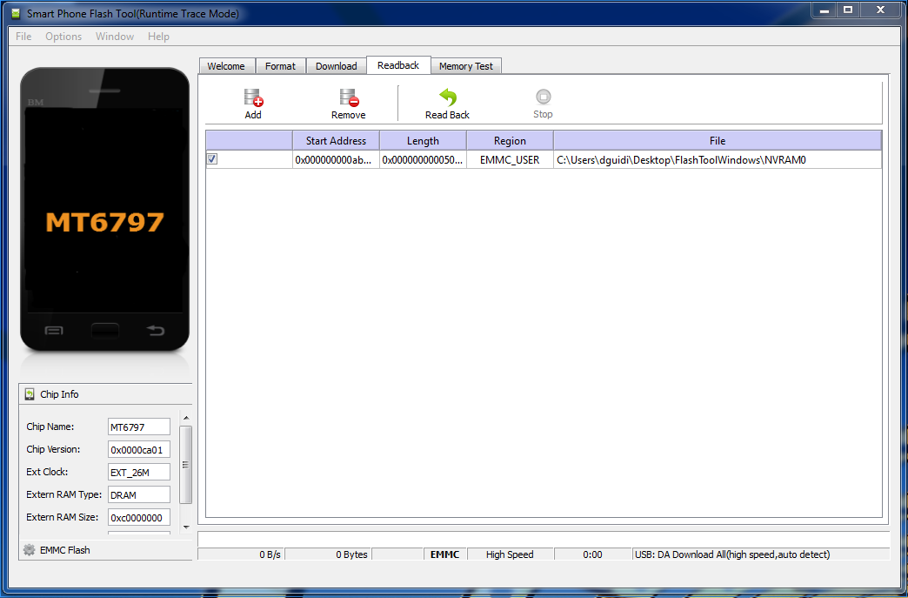

{}
칼리 리눅스는 더 이상 사전 빌드된 이미지나 자체 이미지를 생성하기 위한 빌드 스크립트를 제공하지 않습니다.
이 하드웨어는 더 이상 지원되지 않습니다.
이 페이지는 역사적 가치를 위해 남겨두었습니다.
{}

- - -


[Gemini PDA](https://planetcom.squarespace.com/device/)는 최대 3개의 운영 체제를 나란히 설치할 수 있는 키보드가 달린 멀티 부팅 안드로이드 스마트폰입니다(현재는 안드로이드, Sailfish, 데비안, 칼리 리눅스 중 아무거나 3개 선택 가능).

기본적으로 칼리 리눅스 Gemini PDA 이미지는 다른 칼리 플랫폼에서 흔히 볼 수 있는 [**kali-linux-default** 메타패키지](/docs/general-use/metapackages/)를 **포함하지 않습니다**. 추가 도구를 설치하시려면 [메타패키지 페이지](/docs/general-use/metapackages/)를 참조하세요.

## Gemini PDA용 칼리 - 사용자 지침

운영 체제는 설치되는 것이 아니라 Mediatek에서 제공하는 스마트폰 플래시 도구를 사용하여 플래싱됩니다. 루팅된 안드로이드와 칼리 리눅스로 새 Gemini PDA를 플래싱하려면 네 단계만 필요합니다:

1. Kali-Gem 펌웨어 아카이브를 다운로드하고 추출합니다. 이 아카이브는 Gemini를 다음과 같은 파티션 테이블로 설정하는 데 필요한 모든 것을 포함합니다:
  - 안드로이드(루팅됨), 16GB
  - 칼리 리눅스, 40GB
  - 비어있음
2. SP Flash 도구를 다운로드하고 설치한 후 실행
3. 현재 NVRAM 파티션 백업
4. Kali-Gem 펌웨어 플래싱

### 1. 펌웨어 다운로드 및 추출

칼리 리눅스 Gemini 이미지는 [ARM 이미지](/get-kali/) 페이지에서 다운로드할 수 있습니다. 이 폴더에는 부트로더, 루팅된 안드로이드 파티션 및 칼리 리눅스가 포함된 Gemini PDA를 완전히 다시 플래싱하는 데 필요한 모든 파일이 들어 있습니다.

{}
다른 파티션 레이아웃을 원하시면, [공식 플래싱 가이드](https://support.planetcom.co.uk/index.php/Linux_Flashing_Guide)를 따르세요. Linux 파티션이 최소 6GB 이상인지 확인하세요.<br />
<br />
리눅스 파티션이 생성되면, 이미지 파일 **_linux_root.img_**를 바로 그 파티션에 쓸 수 있습니다. 해당하는 리눅스 커널 이미지 `linux_boot.img`도 플래싱하는 것을 잊지 마세요.
{}

이 가이드의 나머지 단계는 Windows PC로 Gemini x27을 완전히 다시 플래싱하는 방법을 자세히 설명합니다.

### 2. 드라이버 및 플래시 도구 다운로드 및 설치

1. 최신 드라이버는 여기에서 찾을 수 있습니다: [Windows 플래시 도구 드라이버](https://support.planetcom.co.uk/download/FlashToolDrivers.zip)
2. 다운로드한 후 아카이브 압축을 풀어주세요
3. **_FlashToolDrivers_**라는 폴더를 찾을 수 있습니다. 폴더를 열고 설치 파일(**_install.bat_**)을 더블 클릭하세요
4. 설치를 실행하고 변경을 요청할 때 **예**를 선택하세요
5. 이제 드라이버가 설치되었으므로, 최신 Windows 플래시 도구를 다운로드할 수 있습니다: [Windows 플래시 도구](https://support.planetcom.co.uk/download/FlashToolWindows.zip)
6. Windows FlashTool 디렉토리가 포함된 다운로드한 zip 파일의 압축을 풀어주세요
7. 다음으로, **_FlashToolWindows_** 폴더에서 'flash_tool.exe'를 실행하세요

### 3. 현재 NVRAM 파티션 백업

다른 펌웨어로 장치를 플래싱하기 전에 현재 NVRAM 파티션을 백업하는 것이 좋습니다. 이 파티션은 IMEI 번호를 포함한 Gemini의 중요한 정보를 저장합니다. 이 파티션이 손실되거나 손상되면, Gemini에서 통화를 할 수 없게 됩니다.

NVRAM 파티션 백업을 생성하려면, 먼저 **선택** 버튼을 눌러 **Scatter-loading 파일**을 선택하고 다운로드하여 추출한 펌웨어 폴더 내의 **_Gemini_x27_A20GB_L36GB_Multi_Boot.txt_**를 선택하세요. 이제 다음과 유사한 파티션 테이블이 보일 것입니다:


다음으로 **Readback** 탭으로 이동하여 **추가** 버튼을 클릭하세요. 다음 스크린샷과 같이 테이블에 행이 나타날 것입니다:



NVRAM 파티션을 백업하려면, **Read Back** 버튼을 클릭하고, Gemini를 PC에 연결한 다음, **Esc** 버튼을 1-2초 정도 눌러 Gemini의 전원을 켜세요. 플래시 도구가 기기를 감지하고 파티션을 백업할 것입니다.

### 4. 칼리 리눅스 펌웨어 플래싱

- **다운로드** 탭을 클릭하세요
- 다음 스크린샷처럼 **선택** 버튼을 눌러 **Scatter-loading 파일**을 선택하고, 다운로드하여 추출한 펌웨어 폴더 내의 **_Gemini_x27_A20GB_L36GB_Multi_Boot.txt_**를 선택하세요. 다른 설정이 다음과 일치하는지 확인하세요:
    - **Download-Agent**는 **_FlashToolWindows_** 또는 **_FlashToolLinux_** 폴더에 위치한 파일 **_MTK_AllInOne_DA.bin_**로 설정되어야 합니다
    - **Scatter-loading 파일**은 Kali-Gem 빌드를 위해 맞춤 제작된 펌웨어의 특정 스캐터 파일로 설정되어야 하며, 이 파일은 펌웨어 폴더에 있습니다
- 드롭다운 메뉴에서 **Firmware Upgrade** 옵션을 선택하세요. 이렇게 하면 테이블의 모든 파티션이 자동으로 선택됩니다
- 화면이 다음과 같이 보여야 합니다:


플래싱 프로세스를 시작하려면, 큰 **Download** 버튼을 클릭하고, Gemini를 PC에 연결한 다음, **Esc** 버튼을 1-2초 정도 눌러 Gemini의 전원을 켜세요.

부팅되면, 플래시 도구가 기기를 감지하고 선택한 펌웨어로 플래싱을 시작할 것입니다. 다음 스크린샷은 성공적으로 완료된 플래싱 프로세스를 보여줍니다:


### 5. 부팅 노트

멀티 부팅 메커니즘은 다음과 같이 작동합니다. Gemini가 꺼진 상태에서 시작하여, 기기가 진동할 때까지 **Esc**(전원) 키를 눌러 기기를 시작하세요. 진동을 느끼면, 다음 키 조합을 눌러 부팅 모드를 선택할 수 있습니다:

- 부팅 1(안드로이드): 키나 버튼을 누르지 않을 때의 기본 부팅 옵션
- 복구 모드: Esc(전원)를 누름. 항상 복구 모드로 부팅됩니다
- 부팅 2(칼리 리눅스): 기기 오른쪽에 있는 은색 버튼을 누름
- 부팅 3(N/A): Esc(전원) 키와 기기 오른쪽에 있는 은색 버튼을 동시에 누름. 화면이 켜질 때까지 키/버튼을 계속 누르고 있으세요

### 6. 처음 로그인하기

기기의 [기본 자격 증명](/docs/introduction/default-credentials/)은 다음과 같습니다:

{}
**`root`** / **`toor`**
**`kali`** / **`kali`**
{}

처음 로그인한 후, 다음 단계를 권장합니다:

- 터미널을 열고, 비밀번호를 변경한 다음, `sudo dpkg-reconfigure locales`를 실행하여 지역에 맞게 설정을 조정하세요
- LXQT 지역 설정: **애플리케이션** -> **환경 설정** -> **LXQT 설정** -> **로케일**
- 기본 애플리케이션: **애플리케이션** -> **환경 설정** -> **LXQT 설정** -> **세션 설정**
- "덮개를 닫을 때 모니터 끄기" 설정: **애플리케이션** -> **환경 설정** -> **LXQT 설정** -> **전원 관리**
- Wi-Fi 설정: **애플리케이션** -> **일반 애플리케이션** -> **인터넷** -> **Conman UI 설정**


- 마우스를 설정하려면 명령줄에서 `bluetoothctl`을 실행하세요
- 이 이미지에는 기본적으로 [**kali-tools-top10** 메타패키지](/docs/general-use/metapackages/)가 사전 설치되어 있습니다. 추가 도구를 설치하려면 [메타패키지 페이지](/docs/general-use/metapackages/)를 참조하거나 다음을 실행하세요:

```console
kali@kali:~$ sudo apt update
kali@kali:~$
kali@kali:~$ sudo apt install -y kali-linux-default
```

### 7. 안드로이드 루팅 프로세스 완료

루팅 프로세스를 완료하려면 사전 설치된 **Magisk Manager**를 실행하세요.

### 8. 칼리 리눅스 루트 파티션 백업하기

rootfs 파티션 백업을 생성하려면, 플래시 도구에서 **Readback** 탭을 클릭한 다음 **추가** 버튼을 클릭하세요. 다음 스크린샷과 같이 테이블에 행이 나타날 것입니다:


파일 이름을 더블 클릭하고 결과 이미지 파일의 이름과 위치를 입력하세요. 다음 화면에서 시작 주소와 길이를 다음 값으로 변경하세요:

- 시작 주소: `0xc9000000`
- 길이: `0x8e2700000`

다음 스크린샷과 같이 보여야 합니다:


**확인**을 클릭한 다음 **Readback**을 클릭하세요. Gemini를 연결하고 **OK**를 눌러 전원을 켜세요.

### 9. 이것으로 끝입니다

[칼리 포럼](https://forums.kali.org/)에 가입하여 계속 연락해 주세요.

- - -

### 정보:

- 칼리: [kali.org](https://github.com/Re4son/kali-gemini-multistrap-config/wiki/www.kali.org)
- 제미니: [geminiplanet.com](https://geminiplanet.com/)
- Planet Computers: [planetcom.co.uk](https://planetcom.co.uk/)
- Planet Computers 개발자 포럼: [developer.planetcom.co.uk/forumdisplay.php?fid=1](https://developer.planetcom.co.uk/forumdisplay.php?fid=1)
- Gemian: [gemian.thinkglobally.org](https://gemian.thinkglobally.org/)
- Gemian 위키: [github.com/gemian/gemini-keyboard-apps/wiki](https://github.com/gemian/gemini-keyboard-apps/wiki)
- OESF 포럼: [oesf.org/forum/](https://www.oesf.org/forum/index.php?showforum=192)
- IRC 로그: [logs.nslu2-linux.org/livelogs/gemini-pda/](http://logs.nslu2-linux.org/livelogs/gemini-pda/)
- Halium: [halium.org](https://halium.org/)

### 가이드:

- [리눅스 플래싱 가이드](https://support.planetcom.co.uk/index.php/Linux_Flashing_Guide)
- [안드로이드 플래싱 가이드](https://support.planetcom.co.uk/index.php/Android_Flashing_Guide)

### 다운로드:

- [Windows 플래시 도구 드라이버](https://support.planetcom.co.uk/download/FlashToolDrivers.zip)
- [Windows용 SP-플래싱 도구](https://forum.hovatek.com/thread-13970.html)
