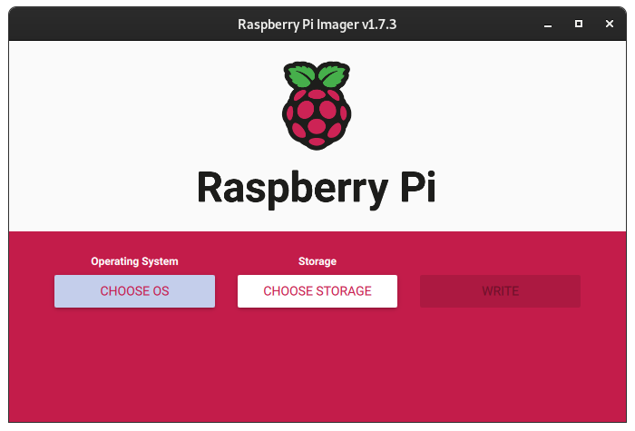
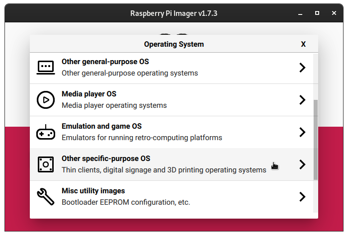
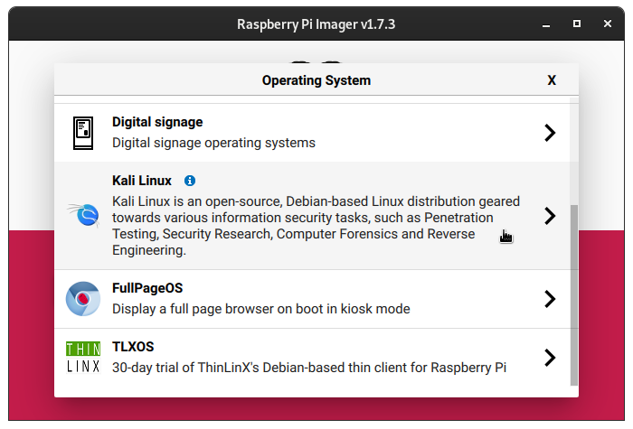
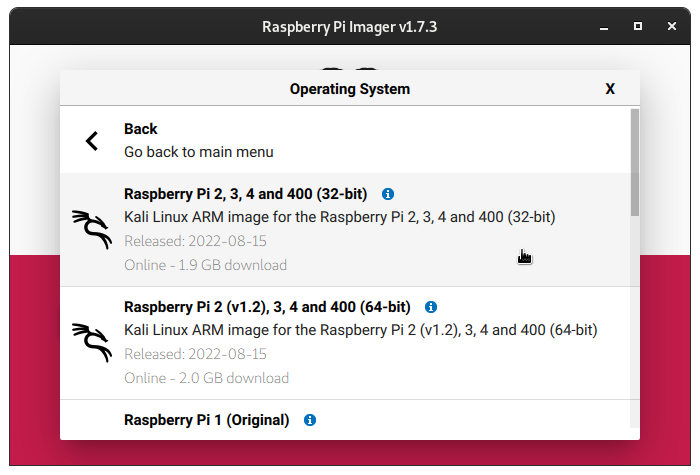
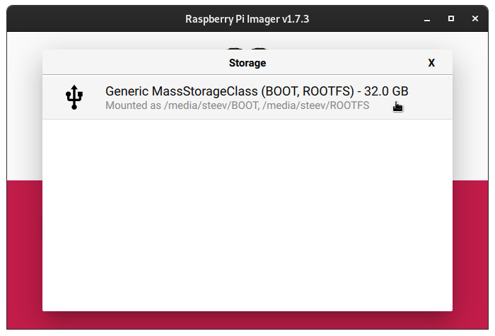
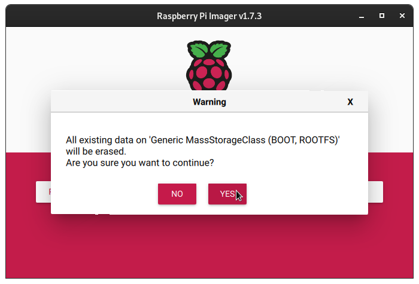

Kali 라즈베리 파이 이미지를 마이크로SD 카드나 USB 장치에 쓰는 또 다른 방법은 Windows, macOS, Linux에서 사용 가능한 [라즈베리 파이 이미저 소프트웨어](https://raspberrypi.com/software/)를 활용하는 것입니다.

{}
현재 라즈베리 파이 커스터마이징을 위한 "고급" 메뉴 옵션은 **지원하지 않습니다**. 와이파이 네트워크 설정은 해당 [라즈베리 파이 문서](/docs/arm/)를 참고해주세요.
{}

소프트웨어를 다운로드하고 설치한 후 실행하면 아래와 같은 화면이 나타납니다:

- - -

여기서 `운영체제 선택` 버튼을 클릭하고 아래로 스크롤해서 `기타 특수 목적 OS`를 선택합니다:

- - -

그리고 이 목록에서 `칼리 리눅스`를 선택합니다:

- - -

원하는 Kali 라즈베리 파이 이미지를 선택하면 애플리케이션 메인 화면으로 돌아갑니다:

- - -

이제 `저장소 선택`을 클릭하면 소프트웨어가 컴퓨터에 연결된 이동식 장치만 선택할 수 있게 해줍니다:

- - -

완료되면 간단히 `쓰기` 버튼을 클릭하세요:

- - -

`쓰기` 버튼을 클릭하면 소프트웨어가 이미지 다운로드를 시작한 다음, 선택한 이동식 저장 장치에 이미지를 씁니다. SHA256 체크섬을 확인하고 쓰기 후에도 일치하는지 확인합니다. 완료되었다는 메시지가 나타나면 저장 장치를 라즈베리 파이에 연결하고 부팅할 수 있습니다.

이제 [Kali에 로그인](/docs/introduction/default-credentials/)할 수 있습니다.
