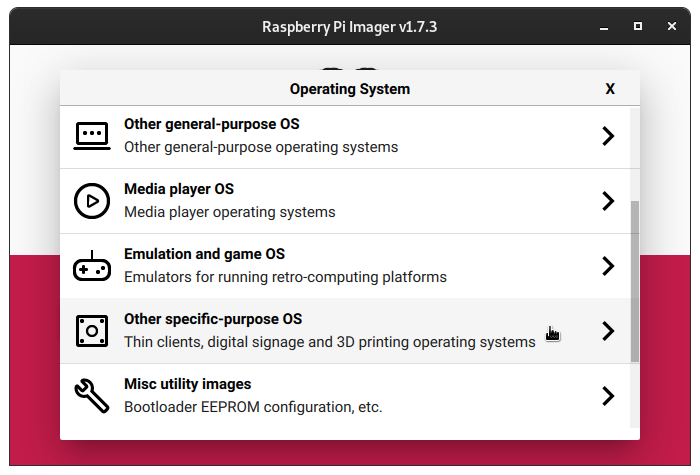
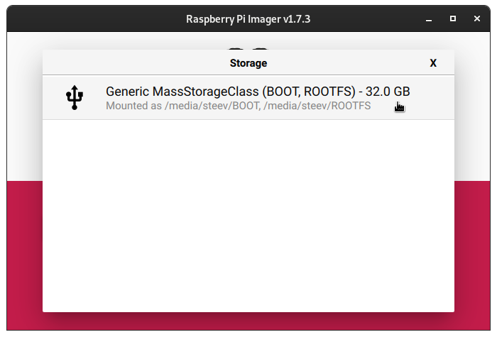

An additional option for writing Kali Raspberry Pi images to either microsd card or USB device, is to use the [RaspberryPi Imager software](https://raspberrypi.com/software/) which is available for Windows, macOS, or Linux.

{}
At this time we do __NOT__ support the "Advanced" menu for setting options for customizing your RaspberryPi.  Please consult the [documentation](/docs/arm) for your specific Raspberry Pi device for setting up the WiFi network.
{}

Once you have downloaded the software and installed it, simply run the software and you should be presented with the following screen

From here we will click the button that says `Choose OS`

From the Choose OS list, we want to choose `Other specific-purpose OS`

And then from this list choose `Kali Linux`

From here you choose whichever Kali Raspberry Pi image you want to write, and it will take you back to the main screen of the app.

Now click on `Choose Storage` and the software should only let you choose from removable devices on your machine

Once that is done, simply click the `Write` button

Once you have clicked the `Write` button, the software will start downloading the image, then write it to the removable storage device that you have chosen.  It will verify the SHA256SUMs, and then verify that they also match after writing.  Once it tells you that it is complete, you can plug the storage device into your RaspberryPi and boot up the Raspberry Pi.

You should be able to [log in to Kali](/docs/introduction/default-credentials/).