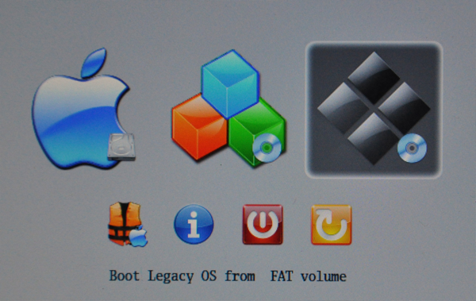
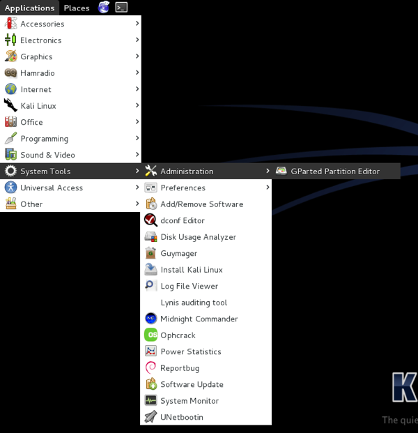
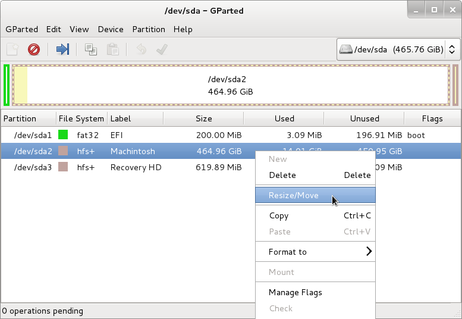
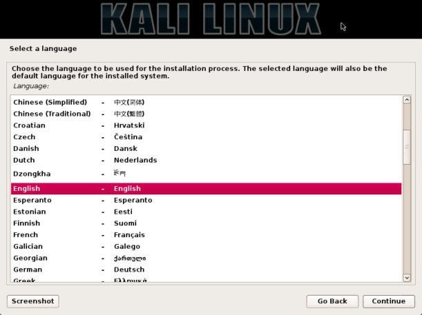
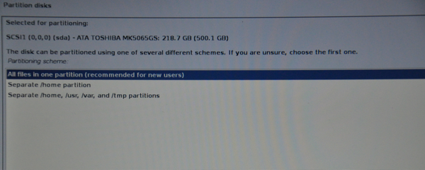

{}
IMPORTANT! Some newer Macs do not run Linux well, or at all. Please look into if your Mac can use Linux before attempting.
{}

## Kali Linux Installation Requirements

Since the release of [Kali Linux 1.0.8](https://www.kali.org/news/kali-1-0-8-released-uefi-boot-support/), Kali Linux supports EFI out of the box. This added feature simplifies the process of getting Kali installed and running on various Apple MacBook Air, Pro, and Retina models.

{}
The make/model/year of the device will determine how successful your experience will be, with newer devices having a better chance of working. Pre-installing rEFInd may also increase the odds of success on older devices.
{}

This guide will show you to dual-boot OSX with Kali Linux using [rEFInd](http://www.rodsbooks.com/refind/), with the option of encrypting the Kali Linux partition. If you wish to replace OSX completely, please refer to our [Single Boot Kali on Mac Hardware](/docs/base-images/kali-linux-hard-disk-install-on-mac/) guide.

By using using the 3rd party software rEFInd (a fork of [rEFIt](http://refit.sourceforge.net/)) we are able to open up the boot menu used in Apple's OSX OS, which is perfect for dual booting. It also has the advantage of helping older devices boot from USB that would not be able to otherwise. Once Kali Linux has been installed, rEFInd can be customized to be hidden or removed completely.

#### Installation Prerequisites

* A minimum of 20 GB disk space for the Kali Linux install.
* A minimum of 1 GB RAM. 2 GB or more recommended.
* Devices **older** than '**late 2012**', may require a blank DVD. **USB booting may not work without rEFInd** pre-installed.
* For devices **newer** than '**late 2012**', you'll need a blank DVD **or** a USB drive.
* OSX 10.7 or higher

#### Preparing for the Installation

1. [Download Kali linux](/docs/introduction/download-official-kali-linux-images/).
2. Burn the Kali Linux ISO image to a DVD or [copy the image to USB drive](/docs/usb/kali-linux-live-usb-install/).
3. Backup any important information on the device to external media.

## Preparing OSX (Installing rEFInd)

1. At the time of this writing, the latest version of [rEFInd](http://sourceforge.net/projects/refind/) is 0.8.3.
Boot into OSX and download a local copy.

```
osx:~ mbp$ curl -s -L http://sourceforge.net/projects/refind/files/0.8.3/refind-bin-0.8.3.zip -o refind.zip
```

2. After downloading rEFInd, extract the contents of the zip file and run the install shell script with sudo.

```
osx:~ mbp$ unzip -q refind.zip
osx:~ mbp$ cd refind-bin-*/
osx:refind-bin-0.8.3 mbp$ sudo bash install.sh

WARNING: Improper use of the sudo command could lead to data loss
or the deletion of important system files. Please double-check your
typing when using sudo. Type "man sudo" for more information.

To proceed, enter your password, or type Ctrl-C to abort.

Password:
Installing rEFInd on OS X....
Installing rEFInd to the partition mounted at //
Copied rEFInd binary files

Copying sample configuration file as refind.conf; edit this file to configure
rEFInd.

WARNING: If you have an Advanced Format disk, *DO NOT* attempt to check the
bless status with 'bless --info', since this is known to cause disk corruption
on some systems!!

Installation has completed successfully.

osx:refind-bin-0.8.3 mbp$
```

### Kali Linux Partitioning Procedure

1. Before we can install Kali Linux, there needs to be room on the hard disk. By booting into a live Kali session, we can resize the partition to our desired size. To do so, power on the device and immediately press and hold the **Option** key until you see the rEFInd boot menu.


2. When the boot menu appears, insert your chosen installation medium. If everything works as expected, you will see **two** volumes:

* EFI - EFI\BOOT\syslinux.efi from 61 MiB FAT volume
* Windows - Legacy OS from FAT volume

Although Kali Linux is based on [Debian](https://www.debian.org/), Apple/rEFInd detects it as Windows.
**Select the Windows volume to continue**.

* If you are using a DVD, you may need to refresh the menu by pressing **ESC** once the disk if fully spinning.
* If you still only see **one volume** (EFI), then the installation medium **is not supported** for your Apple device. If you haven't already done so, you may wish to install **rEFInd** and try again.
* If you select the EFI volume, the booting will hang at this point and you will **not** be able to continue.



3. You should be greeted with the Kali Boot screen. Select **Live** and you should be booted into the Kali Linux default desktop.


4. We can use [GParted](http://gparted.org/) to shrink the existing OSX partition (HFS+), allowing us to install Kali in the free space. You can find GParted in the Kali menu by navigating to: Applications -> System Tools -> GParted Partition Editor



5. Once GParted has opened, select your OSX partition. Depending on your system, it will usually be the second, larger partition. In our example, there are three partitions: the EFI upgrade partition (/dev/sda1), OSX (/dev/sda2), and System Recovery (/dev/sda3). Resize your OSX partition and leave enough space (20 GB minimum) for the Kali installation.



## Kali Linux Installation Procedure

1. To start the Kali Linux installation, repeat steps 1 and 2 above to boot to the Kali Linux boot screen. Once you can see the the boot screen, choose 'Live', 'Graphical Install' or '(Text-Mode) Install' to begin the setup. In this guide, we chose 'Graphical Install'.


2. Select your preferred language and then your country location. You’ll also be prompted to configure your keyboard with the appropriate keymap.



3. The installer will copy the image to your hard disk, probe your network interfaces, and then prompt you to enter a hostname then domain name for your system. In the example below, we’ve entered 'kali' as our hostname.

* If the setup detected multiple NICs, it may prompt you which one to use for installation.
* If the chosen NIC is 802.11 based, it will ask for wireless network information to collect, before prompting for a hostname.
* If there isn't a DHCP service running on the network, it will ask you to manually enter the network information after probing for network interfaces.
* If Kali Linux doesn't detect your NIC, you either need to include the drivers for it when prompted, or generate a [custom Kali Linux ISO](/docs/development/live-build-a-custom-kali-iso/) with them pre-included.


4. Enter a robust password for the root account.


5. Next, set your time zone.


6. The installer will now probe your disks and offer you five choices. In our example, we’re using the spare partition that we made during live mode, so we select 'Guided - use the largest continuous free space'.

* Experienced users can use the 'Manual' option for more granular configuration options. This option will also allow you to set up encrypted LVM, so Kali Linux would be fully encrypted. The screen afterwards will prompt you for the password. You will have to enter the same password every time you start up Kali Linux.

{}
Kali will automatically securely wipe the hard disk before asking for the password. This may take 'a while' (hours) depending on size and speed of the drive. If you wish to risk it, you can skip it.
{}


7. The next stage is to select the partition structure you want to use. We will go ahead and use the default option and have everything on one partition. Afterwards it will display an overview. If you agree to what it suggests, press the continue button.



8. Next, you’ll have one last chance to review your disk configuration before the installer makes irreversible changes. After you click Continue, the installer will go to work and you’ll have an almost finished installation.


9. This screen configures the use of our Internet network mirrors. Kali can use our online central repository to distribute applications to keep packages up-to-date and allow for additional programs to be installed more easily. Should you need to enter any appropriate proxy information, the next screen will allow you to enter the required details.

{}
If you select 'NO' in this screen, you will NOT be able to install packages from Kali repositories until you [alter your sources](/docs/general-use/kali-linux-sources-list-repositories).
{}


10. Next, install GRUB bootloader.


11. Finally, click 'Continue' to finish installing Kali Linux. It is highly recommend that you restart your machine at this stage.
Once complete, repeat the first 2 steps again to boot into 'Live mode' once more.


12. If the [gdisk](http://www.rodsbooks.com/gdisk/) package isn't included in your Kali Linux ISO, you will first need to install it.
If you enabled the network repository during the setup, this can easily be done:

```
apt update
apt install -y gdisk
```

13. We are now going to convert the Master Boot Record (MBR) to a hybrid, which will allow for Apple's EFI to detect and boot using GRUB.
Once complete, power off the device and remove any installation media when prompted.

```
root@kali:~# gdisk /dev/sda
GPT fdisk (gdisk) version 0.8.5

Partition table scan:
MBR: protective
BSD: not present
APM: not present
GPT: present

Found valid GPT with protective MBR; using GPT.

Command (? for help): p
Disk /dev/sda: 976773168 sectors, 465.8 GiB
Logical sector size: 512 bytes
Disk identifier (GUID): 1B3DB3D4-ECFD-47A1-9435-F2FF318C2F55
Partition table holds up to 128 entries
First usable sector is 34, last usable sector is 976773134
Partitions will be aligned on 8-sector boundaries
Total free space is 245 sectors (122.5 KiB)

Number Start (sector) End (sector) Size Code Name
1 40 409639 200.0 MiB EF00 EFI System Partition
2 409640 548413439 261.3 GiB AF00 Macintosh
3 975503592 976773127 619.9 MiB AB00 Recovery HD
4 548413440 548415487 1024.0 KiB EF02
5 548415488 958138367 195.4 GiB 0700
6 958138368 975503359 8.3 GiB 8200

Command (? for help): r

Recovery/transformation command (? for help): h

WARNING! Hybrid MBRs are flaky and dangerous! If you decide not to use one,
just hit the Enter key at the below prompt and your MBR partition table will
be untouched.

Type from one to three GPT partition numbers, separated by spaces, to be
added to the hybrid MBR, in sequence: 5
Place EFI GPT (0xEE) partition first in MBR (good for GRUB)? (Y/N): y

Creating entry for GPT partition #5 (MBR partition #2)
Enter an MBR hex code (default 07): 83
Set the bootable flag? (Y/N): y

Unused partition space(s) found. Use one to protect more partitions? (Y/N): n

Recovery/transformation command (? for help): w

Final checks complete. About to write GPT data. THIS WILL OVERWRITE EXISTING
PARTITIONS!!

Do you want to proceed? (Y/N): y
OK; writing new GUID partition table (GPT) to /dev/sda.
The operation has completed successfully.
root@kali:~#
```

14. At this stage, we are able to use both Kali Linux and OSX and select which one we want to use at start up.


## rEFInd Configuration

If you wish, you can alter rEFInd in various ways now, including:

* The default OS selection (by default it is OSX)
* Timeout value (by default it is 20 seconds)
* Direct boot into the default OS (Note, by pressing **Options** during boot, you will have a one time boot menu)
* Remove rEFInd, enabling the use of the traditional Apple menu (booting to OSX and Kali Linux will still work)

If you wish to make any of these alterations, boot into OSX, and alter the following file:

```
osx:~ mbp$ sudo nano /EFI/refind/refind.conf
```

* The timeout value controls how long you have to select an OS from the boot menu. By setting it to '-1', it will boot directly into the default OS.


* The 'default_selection' value sets the default selection on startup. OSX will be at position '1' and Kali will be at '2'. In this example, we will use OSX as the default.


* If we combine the two alterations and save our changes, the next time we reboot, it will appear that nothing has changed from before installing Kali Linux. However, if we hold down the 'Options' key for the Apple boot menu, we will see the following:

  * EFI Boot - OSX
  * Windows - Kali Linux
  * Recovery HD - OSX's Recovery Partition


{}
Using Apple's boot menu, the value names cannot be altered. If you wish to customize these values, you will need to use rEFInd.
{}
