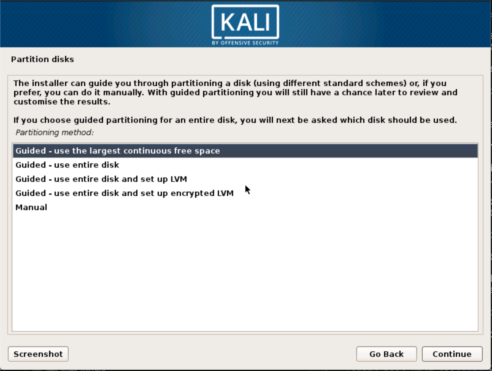
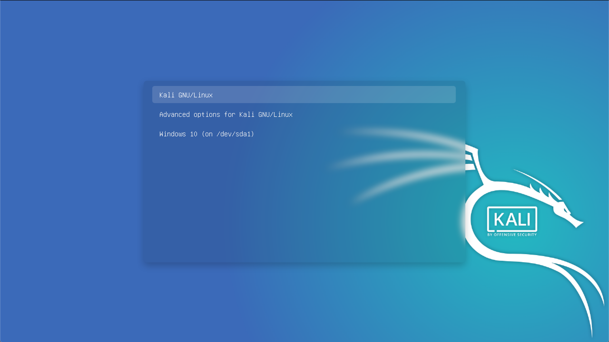

Installing Kali alongside a Windows installation can be quite useful. However, you need to exercise caution during the setup process. First, make sure that you've backed up any important data on your Windows installation. Since you'll be modifying your hard drive, you'll want to store this backup on external media. Once you've completed the backup, we recommend you peruse [Kali Linux Hard Disk Install](/docs/base-images/kali-linux-hard-disk-install/), which explains the normal procedure for a basic Kali install.

In our example, we will be installing Kali Linux alongside an installation of Windows 7, which is currently taking up 100% of the disk space in our computer. We will start by resizing our current Windows partition to occupy less space and then proceed to install Kali Linux in the newly-created empty partition.

[Download Kali Linux](/docs/introduction/download-official-kali-linux-images/) and either burn the ISO to DVD, or[ prepare a USB stick with Kali Linux Live](/docs/usb/kali-linux-live-usb-install/) as the installation medium. If you do not have a DVD or USB port on your computer, check out the [Kali Linux Network Install](/docs/base-images/kali-linux-network-pxe-install/). Ensure you have:

* Minimum of 20 GB free disk space on Windows
* CD-DVD / USB boot support

### Preparing for the Installation

1. [Download Kali Linux](/docs/introduction/download-official-kali-linux-images/).
2. Burn The Kali Linux ISO to DVD or [copy Kali Linux Live to USB](/docs/usb/kali-linux-live-usb-install/).
3. Ensure that your computer is set to boot from CD / USB in your BIOS.

{}
This installation has the potential to go wrong very easily as it involves editing existing partitions. Be aware of what partitions you are modifying and where you are installing Kali to. Having a backup of your Windows system available is a good idea in the event something goes wrong.
{}

###  Dual Boot Installation Procedure

1. To start your installation, boot with your chosen installation medium. You should be greeted with the Kali Boot screen. Select _Live_, and you should be booted into the Kali Linux default desktop.

2. Now launch the **[gparted](https://packages.debian.org/testing/gparted)** program. We'll use **gparted** to shrink the existing Windows partition to give us enough room to install Kali Linux.

3. Select your Windows partition. Depending on your system, it will usually be the second, larger partition. In our example, there are three partitions; the first is Window's boot partition, then Windows is actually installed in `/dev/sda2`, and the final is the System Recovery partition. Resize your Windows partition and leave enough space (20 GB minimum) for the Kali installation. If you are moving past into any non-white in the partition then you are editing a section that is in use. Only remove from the area of the partition that is not in use. It is alright to leave the third partition, and only shrink the actual install.

4. Once you have resized your Windows partition, ensure you "Apply All Operations" on the hard disk. Exit **gparted** and reboot.

### Kali Linux Installation Procedure

1. The installation procedure from this point onwards is similar to a [Kali Linux Hard Disk install](/docs/base-images/kali-linux-hard-disk-install/), until the point of the partitioning, where you need to select "Guided - use the largest continuous free space" that you created earlier with **gparted**.

2. Once the installation is done, reboot. You should be greeted with a GRUB boot menu, which will allow you to boot either into Kali or Windows.

## Post Installation

Now that you've completed installing Kali Linux, it's time to customize your system. The Kali General Use section of our site has more information and you can also find tips on how to get the most out of Kali in our [User Forums](https://forums.kali.org/).
