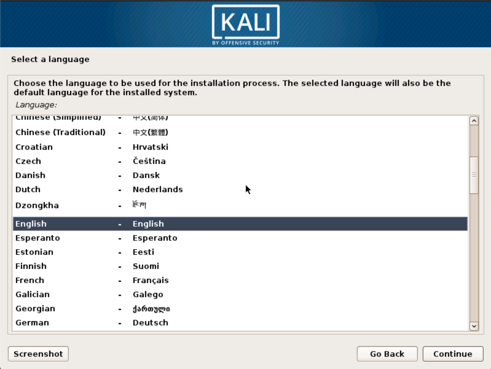
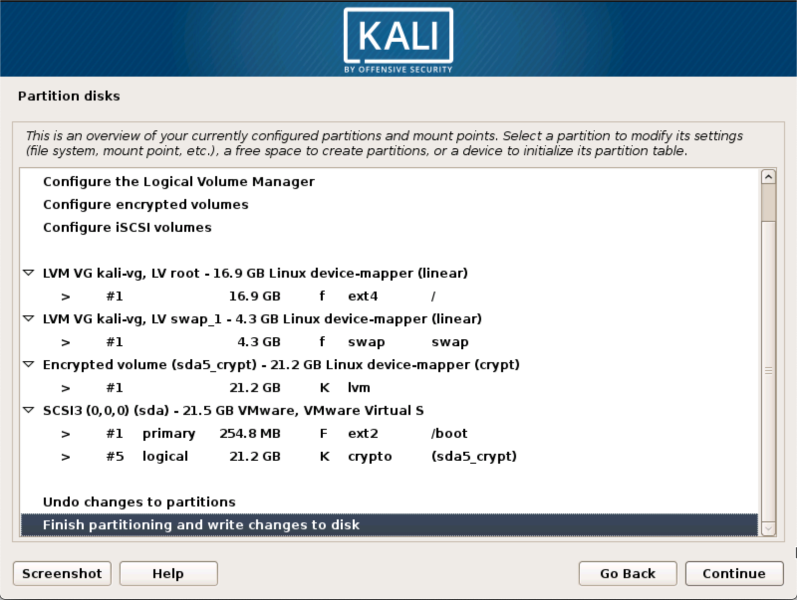
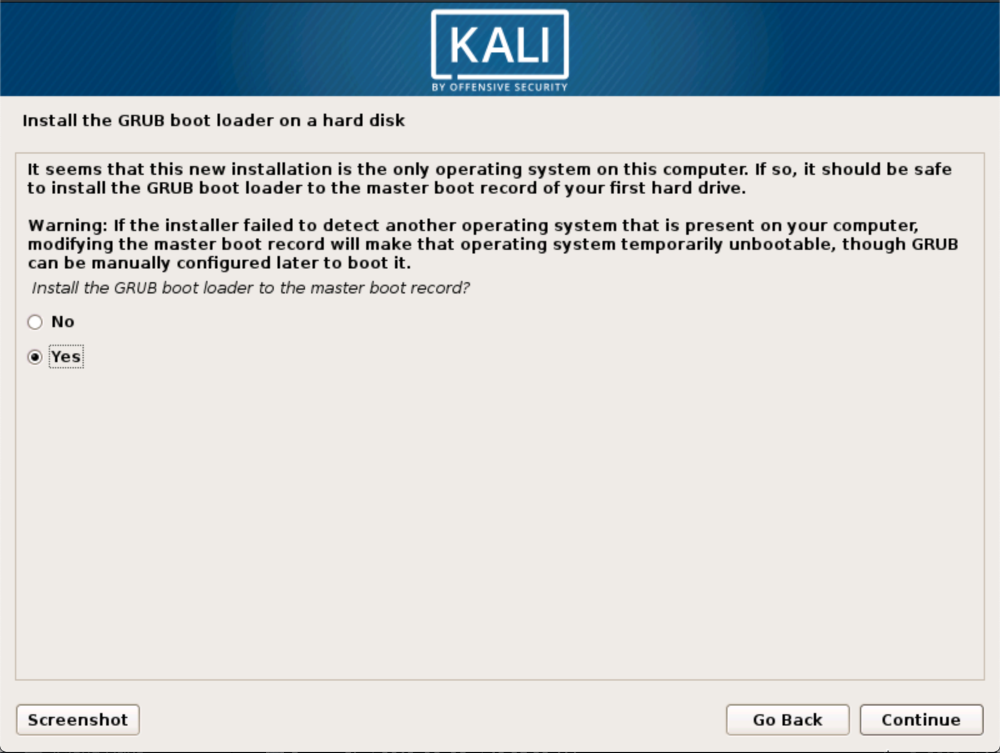

At times, we have sensitive data we would prefer to encrypt using full disk encryption. With the Kali Installer, you can initiate an LVM encrypted install on either Hard Disk or USB drives. The installation procedure is very similar to a "normal Kali Linux Install", with the exception of choosing an Encrypted LVM partition during the installation process.

## Kali Linux Encrypted Installation Requirements

Installing Kali Linux on your computer is an easy process. First, you'll need compatible computer hardware. The hardware requirements are minimal as listed below, though better hardware will naturally provide better performance. The i386 images have a default [PAE](http://en.wikipedia.org/wiki/Physical_Address_Extension) kernel, so you can run them on systems with over 4GB of RAM. [Download Kali Linux](/docs/introduction/download-official-kali-linux-images/) and either burn the ISO to DVD, or[ prepare a USB stick with Kali Linux Live](/docs/usb/kali-linux-live-usb-install/) as the installation medium.

#### Installation Prerequisites

* A minimum of 20 GB disk space for the Kali Linux install.
* RAM for i386 and amd64 architectures, minimum: 1GB, recommended: 2GB or more.
* CD-DVD Drive / USB boot support

### Preparing for the Installation

1. [Download Kali linux](/docs/introduction/download-official-kali-linux-images/).
2. Burn The Kali linux ISO to DVD or [Image Kali Linux Live to USB](/docs/usb/kali-linux-live-usb-install/).
3. Ensure that your computer is set to boot from CD / USB in your BIOS.

### Kali Linux Installation Procedure

1. To start your installation, boot with your chosen installation medium. You should be greeted with the Kali Linux boot menu. Choose a _Graphical_ or a _Text-Mode_ install. In this example, we chose a GUI install.

2. Select your preferred language and then your country location. You'll also be prompted to configure your keyboard with the appropriate keymap.

3. The installer will copy the image to your hard disk, probe your network interfaces, and then prompt you to enter a hostname for your system. In the example below, we've entered "kali" as the hostname.

4. Create the user account.

5. Next, set your time zone.

 6. The installer will now probe your disks and offer you four choices. For an Encrypted LVM install, choose the "**Guided - use entire disk and set up encrypted LVM**" option as shown below.

7. Choose the destination drive to install Kali. In this case, we chose a standard hard drive destination.

8. Confirm your partitioning scheme and continue the installation.

9. Next, you will be asked for an encryption password. You will need to remember this password and use it each time to boot the encrypted instance of Kali Linux.

10. Configure network mirrors. Kali uses a central repository to distribute applications. You'll need to enter any appropriate proxy information as needed.
{}
**NOTE!** If you select "NO" in this screen, you will **NOT** be able to install packages from the Kali repositories.
{}

11. Select which metapackages you want installed.

12. Next, install GRUB.

13. Finally, click _Continue_ to reboot into your new Kali installation. If you used a USB device as a destination drive, make sure you enable booting from USB devices in your BIOS. You will be asked for the encryption password you set earlier on every boot.

## Post Installation

Now that you've completed installing Kali Linux, it's time to customize your system. The Kali General Use section of our site has more information and you can also find tips on how to get the most out of Kali in our [User Forums](https://forums.kali.org/).
