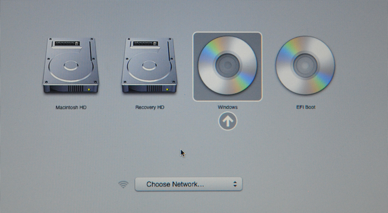
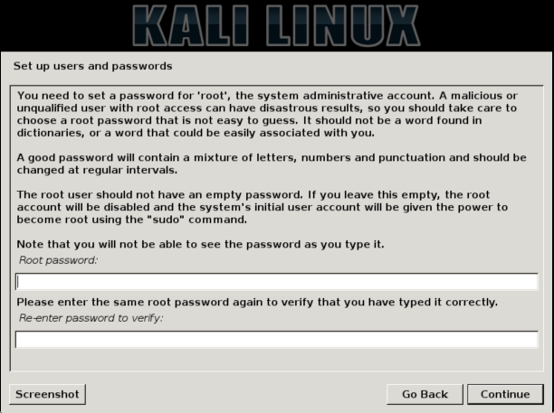
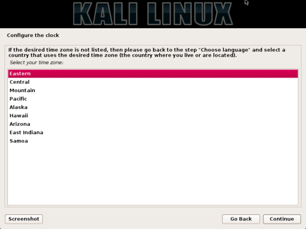
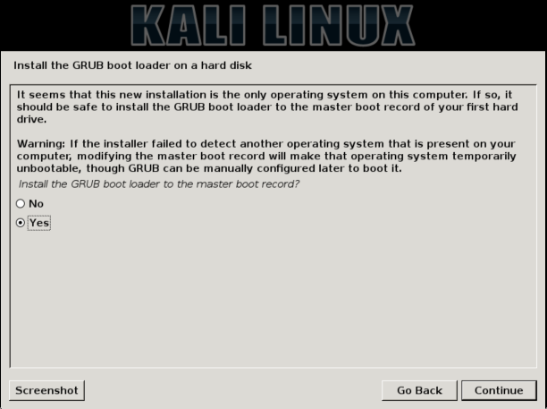

{}
IMPORTANT! Some newer Macs do not run Linux well, or at all. Please look into if your Mac can use Linux before attempting.
{}


## Kali Linux Installation Requirements

Since the release of [Kali Linux 1.0.8](https://www.kali.org/news/kali-1-0-8-released-uefi-boot-support/), Kali Linux supports EFI out of the box. This added feature simplifies the process of getting Kali installed and running on various Apple MacBook Air, Pro, and Retina models.

{}
The make/model/year of the device will determine how successful your experience will be, with newer devices having a better chance of working. Pre-installing rEFInd may also increase the odds of success on older devices.
{}

This guide will show you to **replace** OSX with Kali Linux, with the option of encrypting the partition. However, if you wish to keep macOS/OSX, you will want to refer to our [dual-boot](/docs/base-images/kali-linux-dual-boot-kali-on-mac-hardware/) guide instead.

#### Installation Prerequisites

* A minimum of 20 GB disk space for the Kali Linux install.
* A minimum of 1 GB RAM. 2 GB or more recommended.
* For devices **older** than **late 2012**, you will need a blank DVD.
    * **USB booting may not work without rEFInd** installed.

* For devices **newer** than **late 2012**, you'll need a blank DVD **or** a USB drive.
* OSX 10.7 or higher.

#### Preparing for the Installation

1. [Download Kali Linux](/docs/introduction/download-official-kali-linux-images/).
2. Burn the Kali Linux ISO image to a DVD or [copy the image to USB drive](/docs/usb/kali-linux-live-usb-install/).
3. Backup any important information on the device to an external media.

### Kali Linux Installation Procedure

1. To start your installation, power on the device and immediately press and hold the **Option** key until you see the boot menu.


2. Now insert your chosen installation media. If everything was successful, you will see **two** volumes (EFI & Windows). Even though Kali Linux is [based on Debian](/docs/policy/kali-linux-relationship-with-debian/), Apple detects it as Windows.

Select the **Windows** volume to continue.

* If you only see **one volume** (EFI), then the installation media **is not supported** for this device. You may wish to install **rEFInd** and try again.
* If you select the EFI volume, the booting will hang at this point and you will **not** be able to continue.



3. You should be greeted with the Kali boot screen. You are free to choose 'Live', 'Graphical Install', or '(Text-Mode) Install' to install. In this example, we picked 'Graphical install'.


4. Select your preferred language and then your country location. You'll also be prompted to configure your keyboard with the appropriate keymap.


5. The installer will copy the image to your hard disk, probe your network interfaces, and then prompt you to enter a hostname and domain name for your system. In the example below, we've entered 'kali' as our hostname.

* If the setup detects multiple NICs, it may prompt you which one to use for the install.
* If the chosen NIC is 802.11 based, you will be asked for your wireless network information before being prompted for a hostname.
* If there isn't a DHCP service running on the network, it will ask you to manually enter the network information after probing for network interfaces.
* If Kali Linux doesn't detect your NIC, you either need to include the drivers for it when prompted, or generate a [custom Kali Linux ISO](/docs/development/live-build-a-custom-kali-iso/) with them pre-included.


6. Enter a robust password for the root account.



7. Next, set your time zone.



8. The installer will now probe your disks and offer you five choices. In our example, we're using the entire disk on our computer and not configuring LVM (logical volume manager), so we selected 'Guided - use the entire disk'.

* Experienced users can use the 'Manual' option for more granular configuration options. This option will also allow you to set up encrypted LVM, so Kali Linux would be fully encrypted. The screen afterwards will prompt you for the password. You will have to enter the same password every time you start up Kali Linux.

{}
Kali will automatically securely wipe the hard disk before asking for the LVM password. This may take 'a while' (hours) depending on the size and speed of the drive. If you wish to risk it, you can skip it.
{}


9. The installer will ask you to confirm which disk to erase. Double check then confirm the selection.


10. The next stage is to select the partition structure you want to use. We will go ahead and use the default option and have everything on one partition. Afterwards, the installer will display an overview. If you agree with what it suggests, press the continue button.


11. Next, you'll have one last chance to review your disk configuration before the installer makes irreversible changes. After you click **Continue**, the installer will go to work and you'll have an almost finished installation.


12. This screen configures the use of our Internet network mirrors. Kali can use our online central repository to distribute applications to keep packages up-to-date and allow for additional programs to be installed more easily. Should you need to enter any appropriate proxy information, the next screen will allow you to enter details.

{}
If you select 'NO' in this screen, you will NOT be able to install packages from Kali repositories until you [alter your sources](/docs/general-use/kali-linux-sources-list-repositories/).
{}


13. Next, install the GRUB bootloader.



14. Finally, click **Continue** to finish installing Kali Linux. It is highly recommend that you restart your machine at this stage.

Once the install has finished, repeat the first few steps again to boot into 'Live mode' once more.


15. If the **[gdisk](http://www.rodsbooks.com/gdisk/)** package isn't included your Kali Linux ISO, you need to install it.

If you enabled the network repository during the setup, this can easily be done as follows:

```
apt update
apt install -y gdisk
```

16. We are now going to convert the MBR to a hybrid, which will allow for Apple's EFI to detect and boot to GRUB.

```
root@kali:~# gdisk /dev/sda
zsh: correct 'gdisk' to 'fdisk' [nyae]? n
GPT fdisk (gdisk) version 0.8.5

Partition table scan:
  MBR: protective
  BSD: not present
  APM: not present
  GPT: present

Found valid GPT with protective MBR; using GPT.


Command (? for help): p
Disk /dev/sda: 976773168 sectors, 465.8 GiB
Logical sector size: 512 bytes
Disk identifier (GUID): B6A4398E-3590-4BB7-AA57-D64EF74860D0
Partition table holds up to 128 entries
First usable sector is 34, last usable sector is 976773134
Partitions will be aligned on 2048-sector boundaries
Total free space is 4077 sectors (2.0 MiB)

Number  Start (sector)    End (sector)  Size       Code  Name
   1      2048      4095   1024.0 KiB  EF02
   2      4096       943585279   449.9 GiB   0700
   3       943585280       976771071   15.8 GiB    8200

Command (? for help): r

Recovery/transformation command (? for help): h

WARNING! Hybrid MBRs are flaky and dangerous! If you decide not to use one,
just hit the Enter key at the below prompt and your MBR partition table will
be untouched.

Type from one to three GPT partition numbers, separated by spaces, to be
added to the hybrid MBR, in sequence: 2
Place EFI GPT (0xEE) partition first in MBR (good for GRUB)? (Y/N): y

Creating entry for GPT partition #2 (MBR partition #2)
Enter an MBR hex code (default 07): 83
Set the bootable flag? (Y/N): y

Unused partition space(s) found. Use one to protect more partitions? (Y/N): n

Recovery/transformation command (? for help): w

Final checks complete. About to write GPT data. THIS WILL OVERWRITE EXISTING
PARTITIONS!!

Do you want to proceed? (Y/N): y
OK; writing new GUID partition table (GPT) to /dev/sda.
Warning: The kernel is still using the old partition table.
The new table will be used at the next reboot.
The operation has completed successfully.
root@kali:~#
```

17. After that is complete, all that is left is to reboot, take out the installation media, and enjoy Kali.
