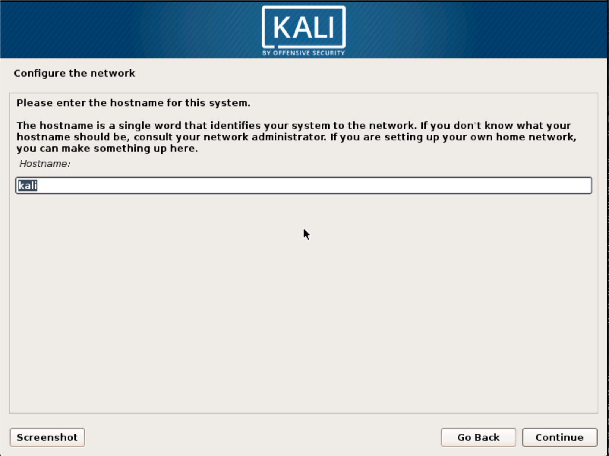
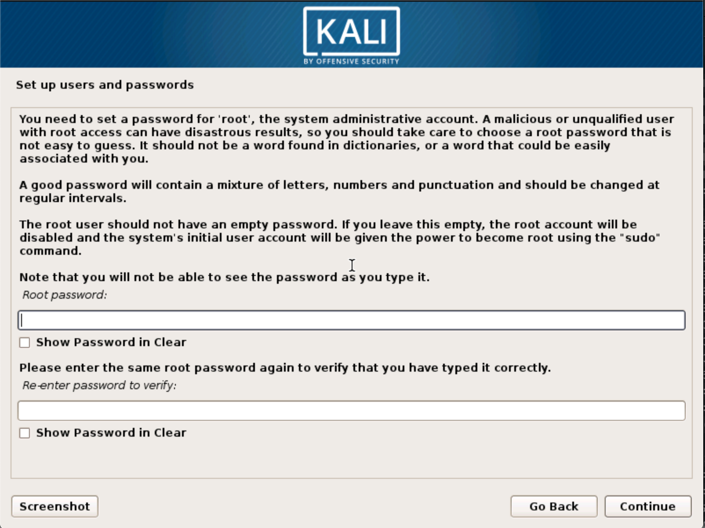
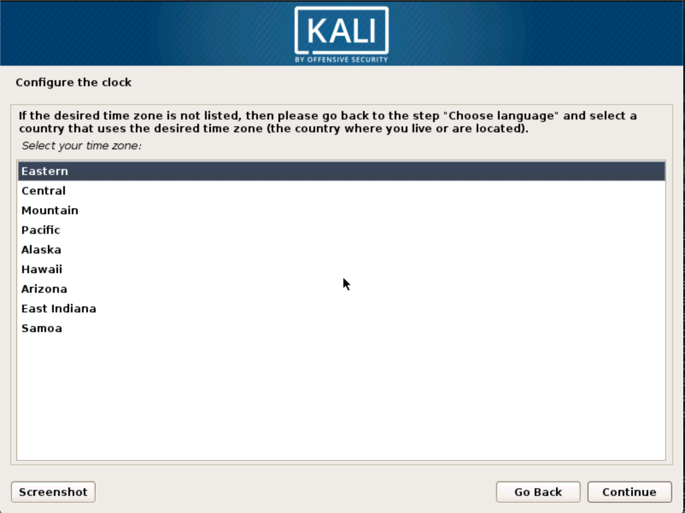
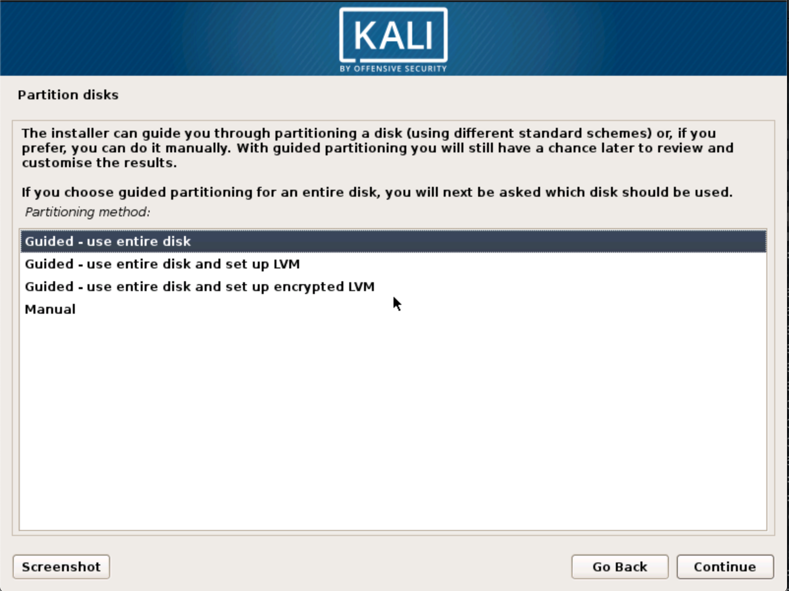
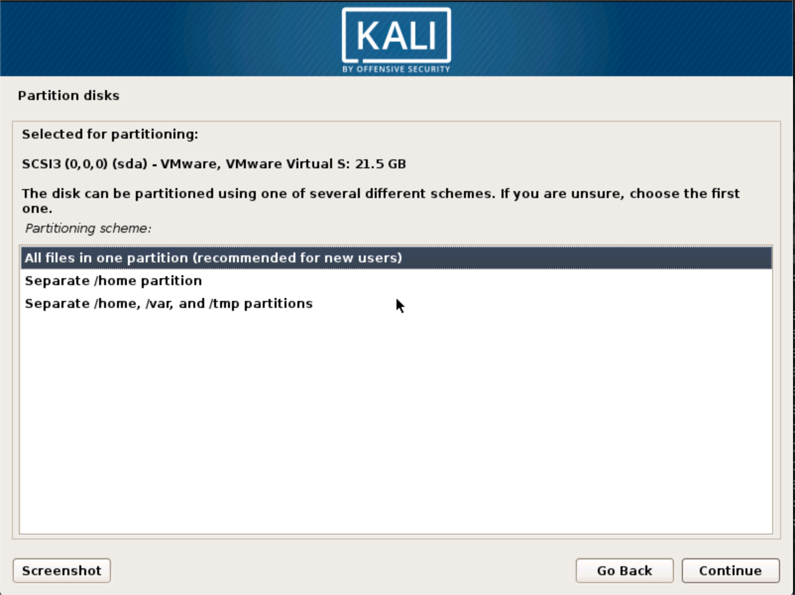
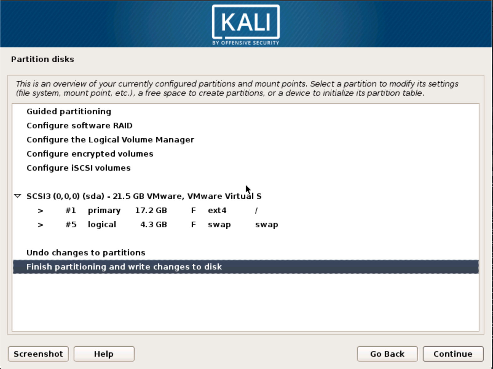
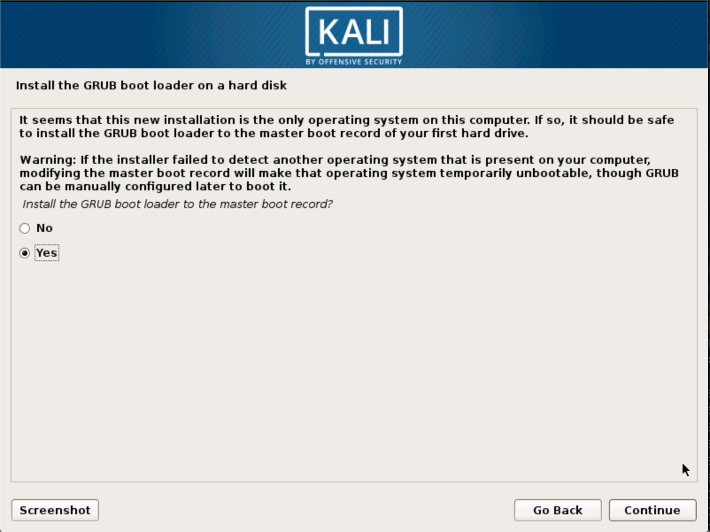
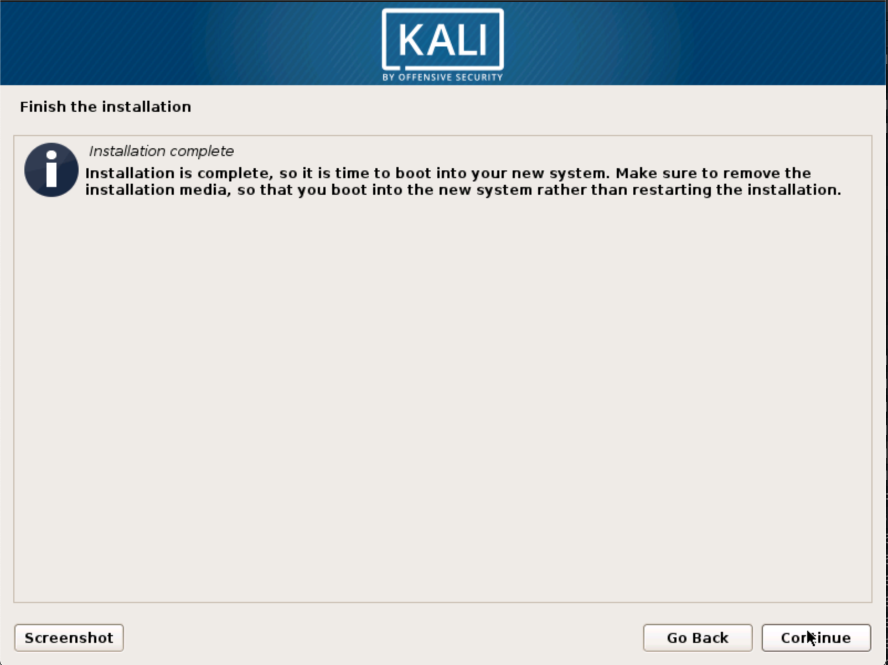

Installing Kali Linux on your computer is an easy process. First, you'll need compatible computer hardware. Kali is supported on i386, amd64, and ARM (both armel and armhf) platforms. The hardware requirements are minimal as listed below, although better hardware will naturally provide better performance. The i386 images have a default [PAE](http://en.wikipedia.org/wiki/Physical_Address_Extension) kernel, so you can run them on systems with over 4GB of RAM. [Download Kali Linux](/docs/introduction/download-official-kali-linux-images/) and either burn the ISO to DVD, or[ prepare a USB stick with Kali Linux Live](/docs/usb/kali-linux-live-usb-install/) as the installation medium. If you do not have a DVD drive or USB port on your computer, check out the [Kali Linux Network Install](/docs/base-images/kali-linux-network-pxe-install/).

#### Installation Prerequisites

* A minimum of 20 GB disk space for the Kali Linux install.
* RAM for i386 and amd64 architectures, minimum: 1GB, recommended: 2GB or more.
* CD-DVD Drive / USB boot support

### Preparing for the Installation

1. [Download Kali linux](/docs/introduction/download-official-kali-linux-images/).
2. Burn The Kali Linux ISO to DVD or [Image Kali Linux Live to USB](/docs/usb/kali-linux-live-usb-install/).
3. Ensure that your computer is set to boot from CD / USB in your BIOS.

### Kali Linux Installation Procedure

1. To start your installation, boot with your chosen installation medium. You should be greeted with the Kali Boot screen. Choose either _Graphical_ or _Text-Mode_ install. In this example, we chose a GUI install.

2. Select your preferred language and then your country location. You'll also be prompted to configure your keyboard with the appropriate keymap.

3. Specify your geographic location.

4. The installer will copy the image to your hard disk, probe your network interfaces, and then prompt you to enter a hostname for your system. In the example below, we've entered "kali" as our hostname.

5. You may optionally provide a default domain name for this system to use.

6. Next, provide a password for the root user for the system.

7. Next, set your time zone.

8. The installer will now probe your disks and offer you four choices. In our example, we're using the entire disk on our computer and not configuring LVM (logical volume manager). Experienced users can use the "Manual" partitioning method for more granular configuration options.

9. Select the disk to be partitioned.

10. Depending on your needs, you can choose to keep all your files in a single partition — the default — or to have separate partitions for one or more of the top-level directories. If you're not sure which you want, you want "All files in one partition".

11. Next, you'll have one last chance to review your disk configuration before the installer makes irreversible changes. After you click _Continue_, the installer will go to work and you'll have an almost finished installation.

12. Configure network mirrors. Kali uses a central repository to distribute applications. You'll need to enter any appropriate proxy information as needed.

{}
**NOTE!** If you select "NO" in this screen, you will **NOT** be able to install packages from Kali repositories.
{}
13. Next, install GRUB.

14. Finally, click Continue to reboot into your new Kali installation.

## Post Installation

Now that you've completed installing Kali Linux, it's time to customize your system. The Kali General Use section of our site has more information and you can also find tips on how to get the most out of Kali in our [User Forums](https://forums.kali.org/).
