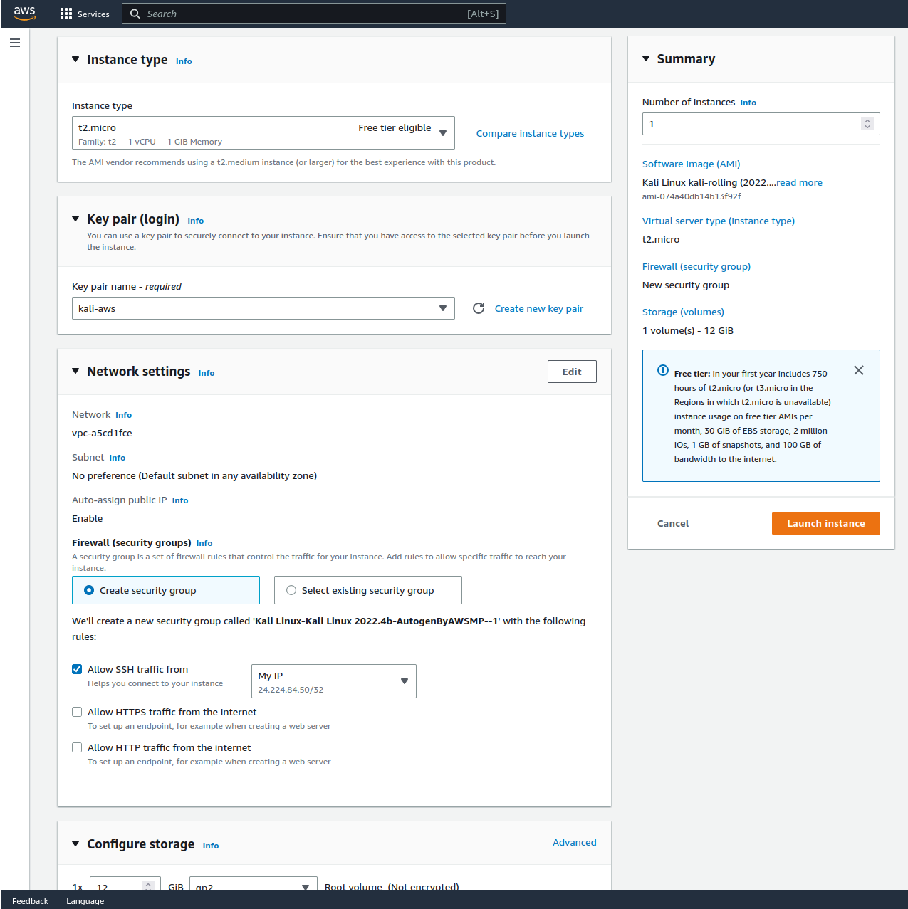

{}
2023년 2월 기준으로 다음은 AWS Kali 인스턴스를 설정하는 방법입니다. AWS 인터페이스는 지속적으로 업데이트되므로 미래에는 100% 정확하지 않을 수 있어요. 이런 경우가 발생하면 [GitLab에 이슈를 제출](https://gitlab.com/kalilinux/documentation/kali-docs/-/issues)하고 [Amazon의 튜토리얼](https://aws.amazon.com/ec2/getting-started/)을 참고해 주세요.
{}

{}
칼리 리눅스 AWS AMI 이미지는 사용자가 불필요한 제약 없이 Kali의 모든 기능과 도구를 쉽게 사용할 수 있도록 구성되어 있어요. 이는 클라우드 인스턴스를 공유하는 사용자의 경우, EC2 시리얼 콘솔에 대한 IAM 접근 권한이 있는 사용자는 루트 쉘에 제한 없이 접근할 수 있다는 의미죠. 이 동작을 제한하려면 다음 파일을 수정하면 됩니다.
{}

{}
이 문서에 있는 사진들은 모두 영어판 기준이기 때문에 한국어판과는 조금 다를 수 있어요.
{}

```console
kali@kali:~$ cat /etc/systemd/system/serial-getty@.service.d/autologin.conf
[Service]
ExecStart=
ExecStart=-/sbin/agetty --autologin root -o '-p -f -- \\u' --keep-baud 115200,38400,9600 --noclear %I $TERM
kali@kali:~$
kali@kali:~$ cat /etc/systemd/system/serial-getty@.service.d/autologin.conf
[Service]
ExecStart=
ExecStart=-/sbin/agetty -o '-p -- \\u' --keep-baud 115200,38400,9600  --noclear %I $TERM
kali@kali:~$
```

## AWS 인스턴스 생성하기

가장 먼저 [AWS 계정](https://portal.aws.amazon.com/billing/signup)을 생성합니다. 다음 화면이 보일 때만 인스턴스 설정을 진행할 수 있어요.


여기서 좌측 상단의 "서비스"를 클릭하고, "컴퓨팅"에 마우스를 올린 다음 아래와 같이 "EC2"를 클릭해주세요:


이런 화면이 나타날 거에요. 이 화면에서 왼쪽에 있는 "AMI 카탈로그"를 찾아주세요:


여기서 "AWS Marketplace AMIs"를 클릭해주세요:


검색 창에 "kali"를 입력해주세요:


다음과 같은 결과가 나타나요:


공식 칼리 리눅스 이미지에서 "선택"을 클릭해주세요. 그러면 다음 화면이 나타납니다:


여기서 "사용량"에 나와 있는 내용을 확인해요:


`kali` 계정으로 SSH 접속한다고 하네요! 이걸 기억해두면 좋겠습니다. 이제 "계속"을 선택해주세요:


아래로 스크롤하면 모든 옵션이 표시됩니다. 우리 목적에 맞게 필요한 옵션을 이미 선택했습니다:



인스턴스에 접근할 수 있도록 "새 키 페어 생성"을 선택했습니다:


더 아래로 스크롤하면 더 많은 옵션이 있어요. 역시 필요한 옵션을 이미 선택했네요:


기본적으로 선택된 스토리지는 마그네틱 스토리지를 사용하지 않아요. 이는 비용이 발생할 수 있어요. 추가 비용을 방지하기 위해 "표준"으로 변경하였어요.

모든 설정이 끝나면 "인스턴스 시작"을 선택하고 다음 화면이 나타나요:


여기서 "인스턴스에 연결"을 선택하면 "인스턴스" 탭으로 이동합니다. 여기서 인스턴스 정보를 볼 수 있어요.


마우스 오른쪽 버튼을 클릭하면 "연결" 옵션이 보입니다:


이를 선택하면 다음 화면이 나타나요:


## AWS 인스턴스에 연결하기

공식 칼리 리눅스 이미지를 구성한 후 `kali` 사용자로 인스턴스에 연결할 수 있습니다. 연결 후 필요한 경우 `sudo passwd kali` 명령으로 비밀번호를 변경할 수 있습니다.

연결에 사용되는 명령 예시:

```console
kali@kali:~$ ssh -i "keys.pem" kali@ip
```

## 연결 후 작업

### 메타패키지

연결 후 이미지가 꽤 기본적인 것만 갖춰져 있다는 것을 알 수 있습니다. 이는 사용자 정의와 이미지 크기 축소를 위한 것입니다. 기본 Kali 도구 세트를 얻으려면 [Kali의 메타패키지](/docs/general-use/metapackages/)를 활용할 수 있습니다. 또는 필요에 따라 특정 도구를 설치할 수도 있습니다. 다음 명령은 `kali-linux-headless` 메타패키지를 사용해 빠르고 편리한 설정을 제공합니다:

```console
kali@kali:~$ sudo apt update && sudo apt install -y kali-linux-headless
```

### 그래픽 사용자 인터페이스(GUI)

GUI를 사용하고 싶다면 SSH 포워딩을 통해 가능합니다. 두 가지 옵션이 있는데, 하나는 `ssh -X`를 사용해 X11을 포워딩하고 GUI 애플리케이션을 한 번에 하나씩 사용하는 방법이고, 다른 하나는 RDP를 사용하고 SSH를 통해 트래픽을 포워딩하는 방법입니다. RDP를 설정하려면 WSL용 [Xfce와 RDP](/docs/general-use/xfce-with-rdp/) 스크립트를 실행합니다. 그런 다음 `ssh -N -L 3390:127.0.0.1:3390` 명령으로 터널링하고 원격 데스크톱 클라이언트로 `127.0.0.1:3390`에 연결할 수 있습니다.

### NVIDIA 드라이버

또 다른 일반적인 용도는 크래킹에 GPU를 사용하는 것입니다. AWS 인스턴스에서도 이 작업을 수행할 수 있지만, 모든 것이 [최신 상태](/docs/general-use/updating-kali/)이고 적절한 Linux 헤더가 설치된 후에 NVIDIA 패키지를 설치해야 합니다:

```console
kali@kali:~$ sudo apt update
kali@kali:~$
kali@kali:~$ sudo apt full-upgrade -y
kali@kali:~$
kali@kali:~$ sudo apt install -y linux-headers-5.7.0-kali3-cloud-amd64
kali@kali:~$
kali@kali:~$ sudo reboot -f
```

세션에 다시 연결:

```console
kali@kali:~$ sudo apt install -y nvidia-driver nvidia-cuda-toolkit
kali@kali:~$
kali@kali:~$ sudo reboot -f
```

다시 연결해주세요.

[NVIDIA 드라이버에 대한 자세한 정보는 여기를 확인하세요](/docs/general-use/install-nvidia-drivers-on-kali-linux/).
