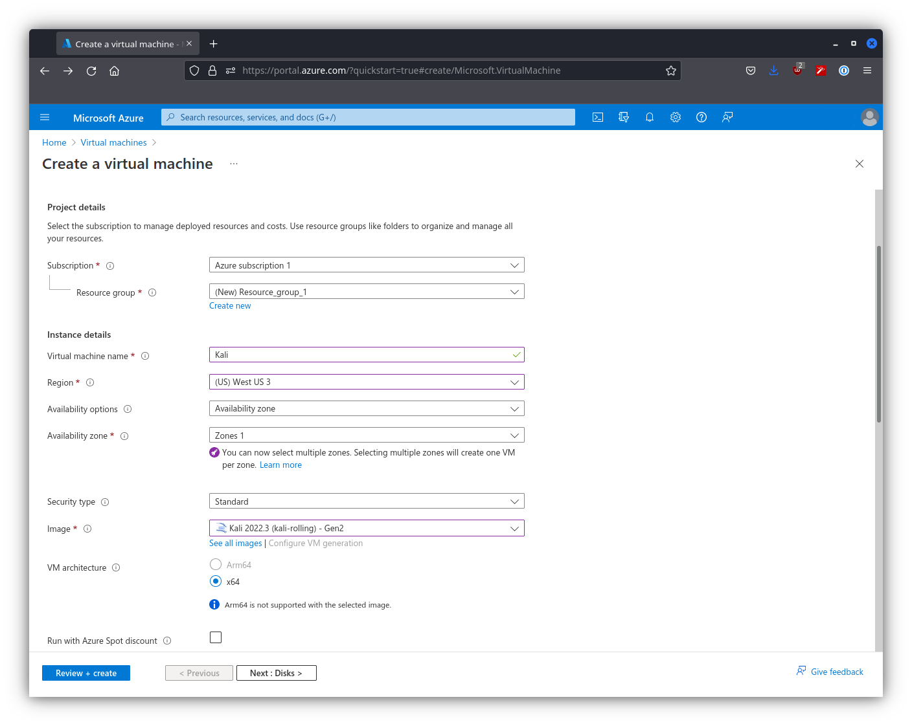
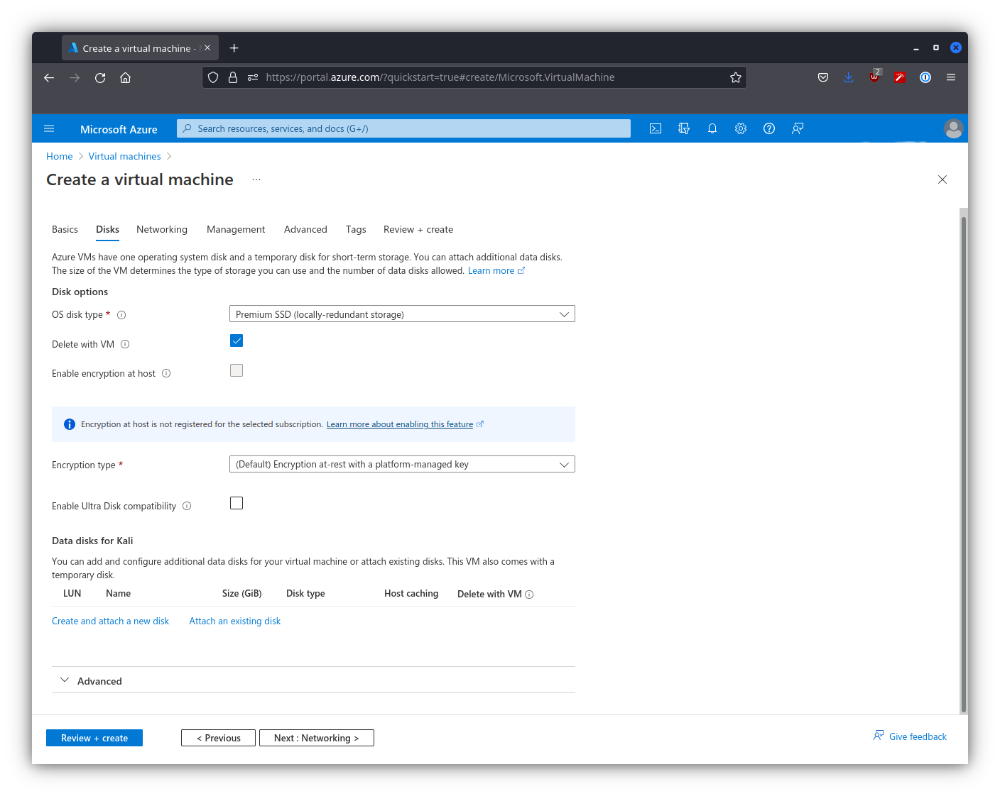
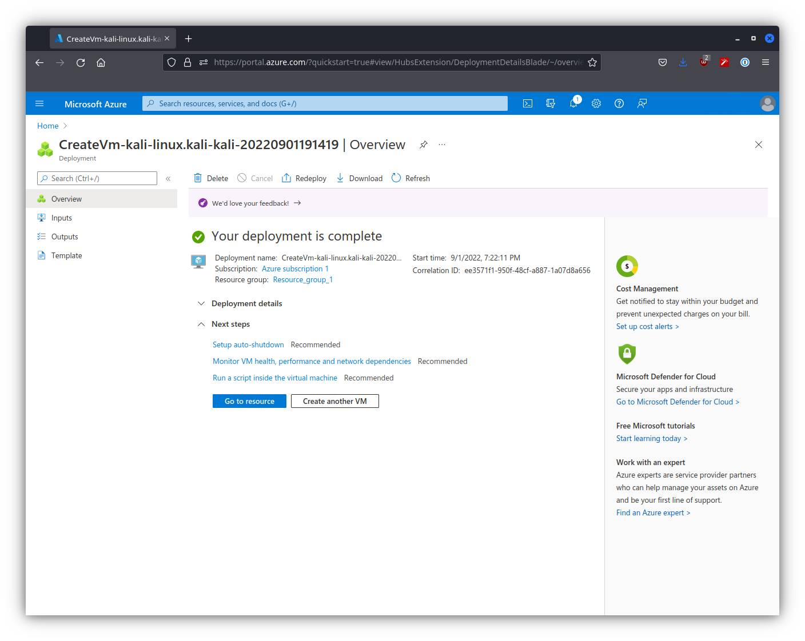
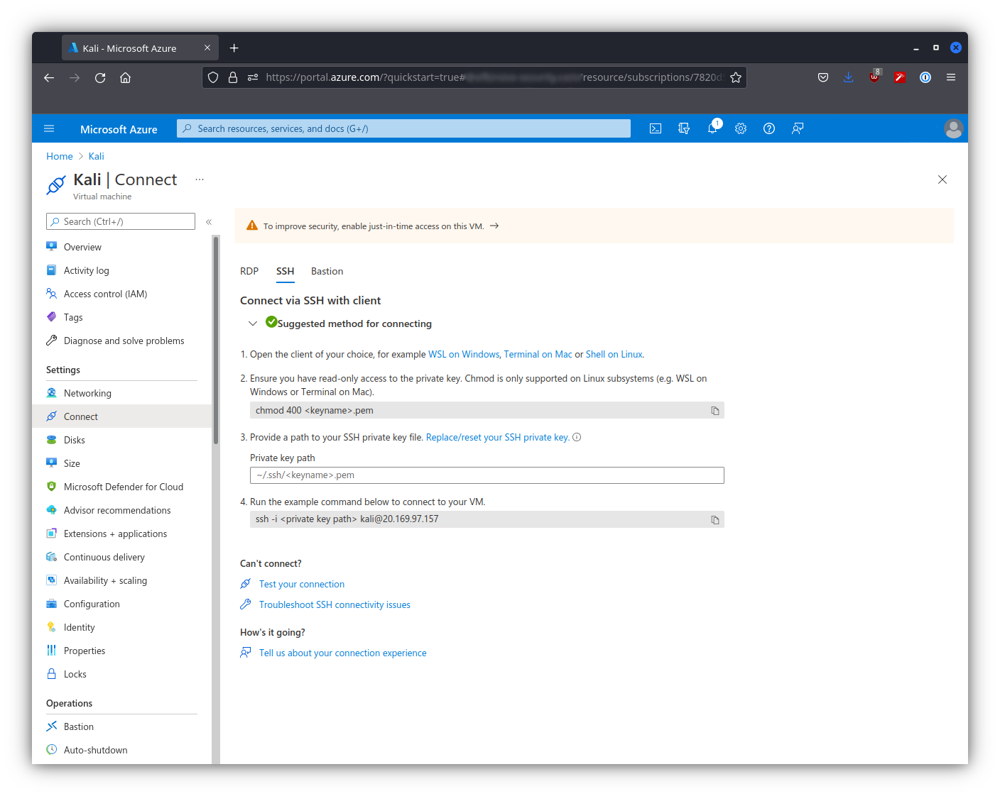

2022.3 릴리스부터 Kali가 Azure에 돌아왔습니다. 이 복귀와 함께 Azure에서 Kali를 어떻게 사용하는지 알아보겠습니다.

가장 먼저 [Azure 계정](https://portal.azure.com/#home)을 생성해야 합니다. 다음 화면이 보일 때만 Kali VM 설정을 진행할 수 있습니다.

이 페이지에서 "가상 머신"을 클릭합니다. 그러면 다음 화면이 나타납니다.

이제 시작할 수 있습니다.

## Kali VM 생성하기

"만들기"를 선택한 다음 드롭다운 옵션에서 "Azure 가상 머신"을 선택합니다. 그러면 다음 화면이 나타납니다.

이 화면에 필요한 모든 정보가 이미 입력되어 있습니다. 처음에는 화면이 이렇게 보이지 않을 것입니다. 추가 작업이 필요한 몇 가지 필드가 있는데, "리소스 그룹"과 "이미지"입니다. "리소스 그룹"의 경우, 기존 그룹이 없다면 새 그룹을 생성해야 하며, 기존 그룹이 있으면 원하는 그룹을 선택할 수 있습니다. "이미지"의 경우 "모든 이미지 보기"를 선택합니다. 여기서 "Kali"를 검색합니다.

그런 다음 드롭다운 "선택"을 클릭하고 유일한 옵션을 선택합니다. 여기서 아래로 스크롤하여 VM 생성 화면의 "기본" 섹션에서 나머지 정보를 입력합니다.

이 영역에서 몇 가지 필드를 변경했습니다. "사용자 이름"과 "키 페어 이름"에 더 친숙한 사용자 지정 값을 입력했습니다. 이제 "디스크"로 넘어갑니다.

보시다시피 현재 Kali에 연결된 디스크가 없으므로 디스크를 추가해야 합니다. 기존 디스크가 없기 때문에 "새 디스크 생성 및 연결"을 선택합니다. 클릭하면 다음 화면이 나타납니다.

이 설정은 기본값을 유지하고 계속 진행합니다. 각 섹션을 확인하고 변경하고 싶은 부분이 없는지 확인하지만, 이 가이드에서는 변경할 사항이 없으므로 "검토 + 생성"으로 바로 이동합니다.

정보가 올바른지 확인한 후 "생성"을 누르면 새 페이지로 이동합니다.

배포가 완료될 때까지 기다린 다음 "리소스로 이동"을 선택합니다.

여기서 VM을 보고 상호 작용할 수 있습니다. 우리는 "연결"을 선택한 다음 "SSH"를 선택할 것입니다.

이렇게 하면 인스턴스에 연결하는 방법을 알려주는 새 페이지가 열립니다. SSH 키의 모드를 변경해야 하며, 그 후 새로 생성된 Kali 인스턴스에 연결할 수 있습니다.
