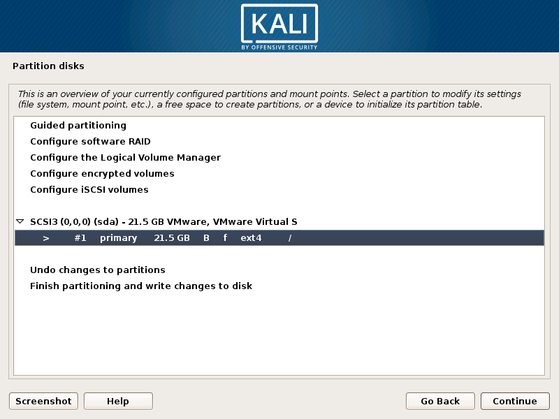
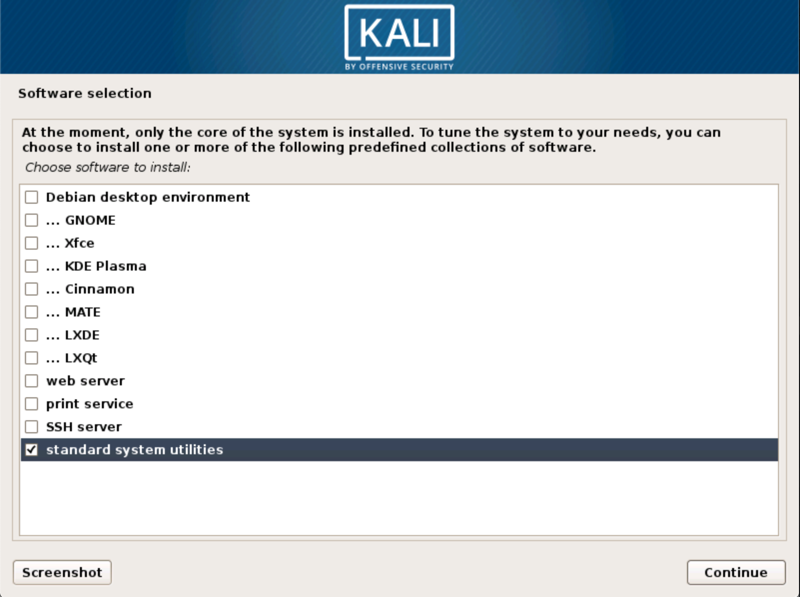
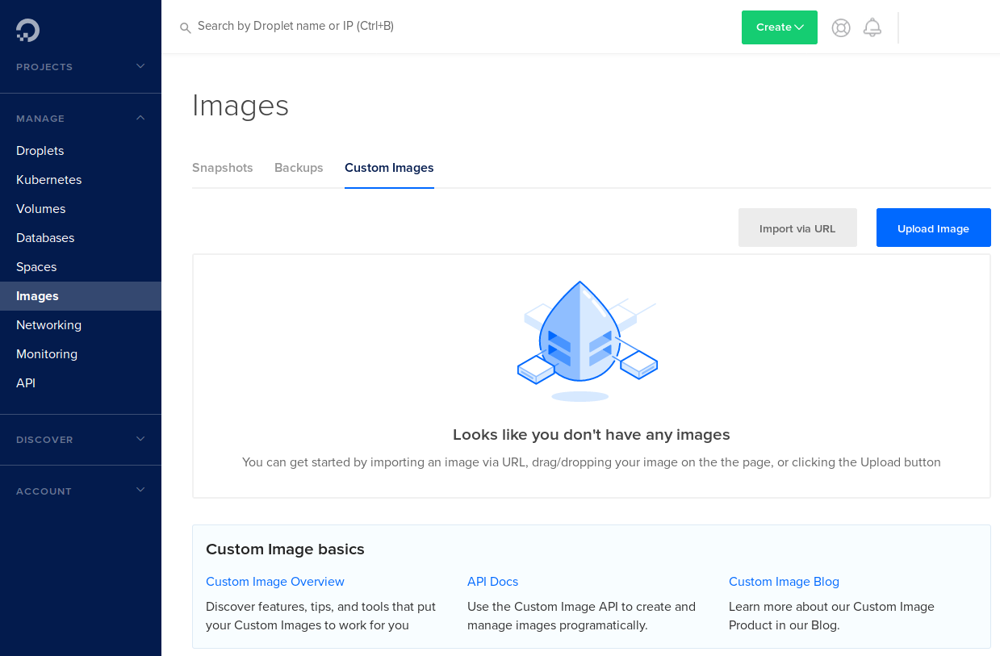
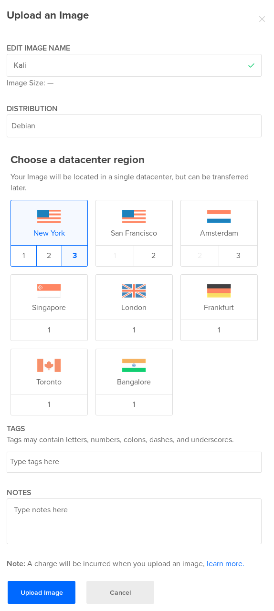
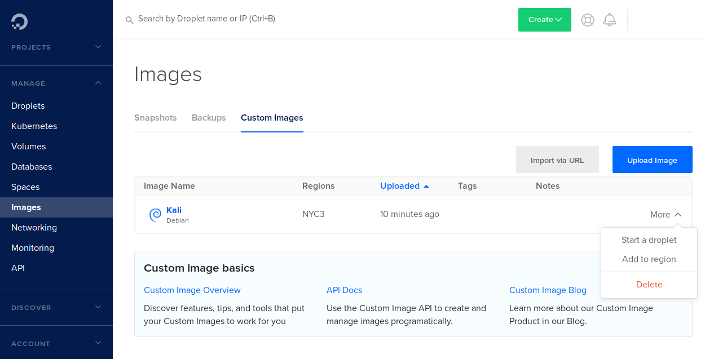
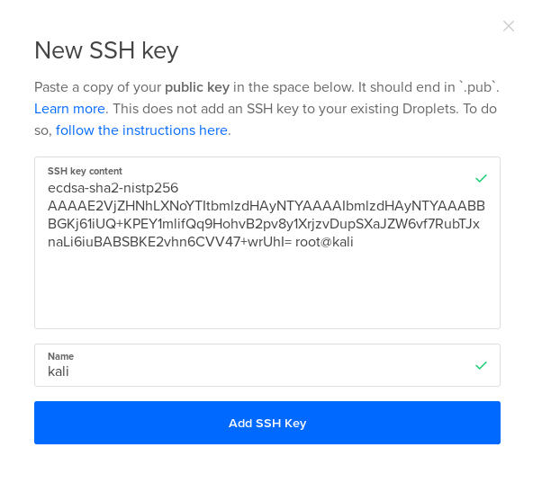
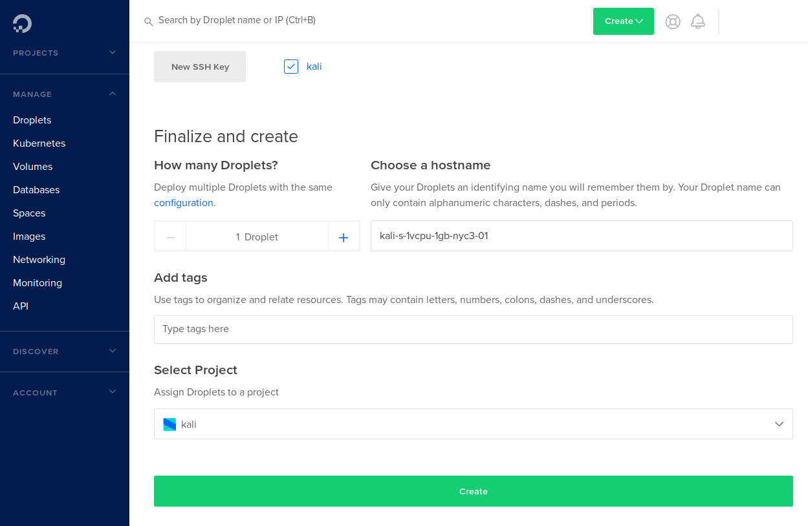

{}
이 문서에 있는 사진들은 모두 영어판 기준이기 때문에 한국어판과는 조금 다를 수 있어요.
{}

[DigitalOcean](https://www.digitalocean.com/)은 AWS, Microsoft Azure, Google Cloud Platform 등과 유사한 클라우드 제공업체입니다. 이들은 "드롭릿"이라 불리는 인스턴스를 제공하며, Debian, Ubuntu, FreeBSD 등 다양한 Linux 배포판을 사용할 수 있습니다. AWS와 마찬가지로 DigitalOcean은 전 세계에 데이터센터를 두고 있으며 각 국가에 여러 데이터센터가 있는 경우도 있습니다.

하지만 한 가지 특별한 기능이 경쟁사와 차별화됩니다. 얼마 전 DigitalOcean는 [커스텀 이미지](https://blog.digitalocean.com/custom-images/) 지원을 추가했는데, 이를 통해 사용자가 가상 머신 디스크를 가져와 드롭릿으로 사용할 수 있습니다. 이는 우리가 자체 Kali Linux 버전을 DigitalOcean 클라우드에서 사용할 수 있어 완벽하죠.

[공식 Kali Linux 가상 이미지](https://http.krfoss.org/)를 로드하는 것도 가능하지만, 그리 효율적이지 않을 것입니다. 대신 가볍고 최소한의 Kali 설치본을 구축하겠습니다.

## 네트부트 ISO 얻기

칼리 리눅스 공식 다운로드 페이지의 ISO 파일에는 기본적으로 데스크톱 환경이 포함되어 있습니다. 이 이미지로도 가상 머신을 구축할 수는 있지만, 나중에 설명드릴 이유로 DigitalOcean에 업로드해야 하는 데이터 양을 최소화하고 싶습니다. 또한 헤드리스 시스템에서 GUI를 실행하는 것은 불필요한 리소스 낭비이기도 합니다. 물론 데스크톱 환경을 제거하거나 비활성화할 수도 있겠지만, 처음부터 [Netboot ISO](https://mirror.krfoss.org/kali/dists/kali-rolling/main/installer-amd64/current/images/netboot/)를 사용하여 가상 머신을 설치하는 것이 더 효율적입니다. 텍스트 기반 설치에 익숙하시다면 해당 디렉토리에 있는 mini.iso를 다운로드하시면 됩니다. 그래픽 환경에서 설치하길 원하신다면 [gtk](https://mirror.krfoss.org/kali/dists/kali-rolling/main/installer-amd64/current/images/netboot/gtk/) 디렉토리로 이동하여 그곳의 mini.iso를 다운로드하세요. 이 파일을 사용하면 그래픽 기반 설치 프로그램이 실행됩니다.

## 가상 머신 생성하기

mini.iso를 사용해 이제 가상 머신을 구축할 수 있습니다. OS를 최신 Debian 64비트로 설정하고 20GB 하드 디스크를 할당하여 새 가상 머신을 생성하세요. 필요하다면 [Kali Training 웹사이트](https://web.archive.org/web/20210922173942/https://web.archive.org/web/20210914172345/https://kali.training/topic/booting-kali-in-live-mode/)에 자세한 설정 방법이 설명되어 있습니다. 가상 디스크를 동적으로 할당된 단일 파일로 저장하는 것이 중요합니다. CPU와 RAM 양과 같은 나머지 설정은 중요하지 않습니다. DigitalOcean에는 디스크 파일만 업로드되기 때문입니다.

디스크 크기는 중요합니다. 커스텀 이미지의 경우 디스크 크기에 따라 요금이 청구되기 때문입니다. 또한 생성할 수 있는 인스턴스 선택에도 영향을 미칩니다. 예를 들어 40GB 하드 디스크를 만들면 최대 하드 디스크 크기가 25GB인 월 $5 수준의 인스턴스를 생성할 수 없게 됩니다. 이 경우 50GB 디스크가 있는 인스턴스를 위해 월 $10 옵션을 사용해야 합니다. 하지만 걱정하지 마세요. 디스크가 20GB이더라도 선택한 드롭릿 계획에 따라 확장됩니다.

설치 중에 수동 파티셔닝을 선택하고 아래와 같이 설정하세요. 모든 파일을 하나의 파티션에 저장하고 스왑 파일은 없습니다.



설치 중에 소프트웨어 기본 설정을 묻는 메시지가 표시됩니다. 간단하게 하고 디스크 공간 사용을 제한하기 위해 기본 시스템만 설치하도록 아래와 같이 "standard system utilities"만 선택하겠습니다.



## 시스템 업데이트하기

설치가 완료되고 재부팅한 후, 콘솔에 로그인하여 [시스템을 업데이트](/docs/general-use/updating-kali/)합니다:

```console
kali@kali:~$ sudo apt update
kali@kali:~$ sudo apt full-upgrade -y
```

`sudo apt update` 중에 미러를 통해 진행되는 것이 보이지 않는다면, 설치 중에 네트워크 미러 추가를 잊었을 수 있습니다. [이 Kali 문서 페이지](/docs/general-use/kali-linux-sources-list-repositories/)의 지침에 따라 문제를 해결하고 두 명령을 다시 실행하세요.

### 필수 패키지 설치하기

DigitalOcean이 시스템을 구성할 수 있도록 ***cloud-init*** 패키지를 설치해야 합니다:

```console
kali@kali:~$ sudo apt install -y cloud-init
kali@kali:~$ sudo sh -c "echo 'datasource_list: [ ConfigDrive, DigitalOcean, NoCloud, None ]' > /etc/cloud/cloud.cfg.d/99_digitalocean.cfg"
kali@kali:~$ sudo systemctl enable cloud-init --now
```

### SSH 준비하기

DigitalOcean에서 시스템에 연결하려면 SSH를 사용해야 하므로, ***openssh-server*** 패키지도 설치(및 활성화)해야 합니다:

```console
kali@kali:~$ sudo apt install -y openssh-server
kali@kali:~$ sudo systemctl enable ssh.service --now
```

표준 드롭릿을 생성할 때는 SSH 키 사용 여부를 선택할 수 있습니다. 하지만 커스텀 이미지를 사용할 때는 이 옵션이 없으며 SSH 키 사용이 필수입니다. 이 때문에 DigitalOcean은 루트 비밀번호를 제거해야 합니다:

```console
kali@kali:~$ passwd -d root
```

또한 ***/root/.ssh*** 폴더를 생성해야 합니다:

```console
kali@kali:~$ mkdir -p /root/.ssh/
```

### 정리하기

가상 머신을 마무리하기 전에 몇 가지 명령을 실행하여 정리합니다:

```console
kali@kali:~$ apt autoremove
kali@kali:~$ apt autoclean
kali@kali:~$ rm -rf /var/log/*
kali@kali:~$ history -c
```

이제 가상 머신이 준비되었으므로 'poweroff'를 실행하여 시스템을 종료합니다:

```console
kali@kali:~$ poweroff
```

## 업로드하기

가상 머신 폴더에서 ***.vmdk*** 파일을 찾은 다음, DigitalOcean에 업로드하기 위해 bzip2, gzip 또는 zip을 사용하여 압축합니다:

```console
$ bzip2 kali.vmdk
```

DigitalOcean 계정에 로그인합니다. 왼쪽의 "관리" 섹션에서 "이미지"를 클릭한 다음 "커스텀 이미지" 탭을 선택합니다.



여기서 압축된 디스크 이미지를 업로드합니다. 이름을 Kali로 지정하고, Debian으로 표시하고, 업로드할 지역과 데이터센터를 선택합니다. 한 위치에 업로드하면 해당 위치에서만 드롭릿을 시작할 수 있다는 것이 커스텀 이미지의 현재 제한사항입니다. 또한 이 단계에서 기억해야 할 다른 점은 업로드된 이미지가 디스크 공간을 소비하며 DigitalOcean은 디스크 사용량에 따라 요금을 청구한다는 것입니다.



## 드롭릿 시작하기

완료되면 "업로드됨" 열에 얼마나 오래 전에 업로드되었는지 표시됩니다. 이제 이미지의 "더 보기" 옵션을 클릭하고 "드롭릿 시작"을 선택합니다.



드롭릿 설정 페이지로 이동하여 드롭릿 계획, SSH 키 및 시작할 프로젝트를 선택할 수 있습니다. 커스텀 이미지이기 때문에 SSH 키를 사용해야 합니다. 기존 키를 선택하거나 "새 SSH 키"를 클릭하여 새 키를 업로드할 수 있습니다. 클릭하면 다음 화면이 열리고 공개 키를 붙여넣고 이름을 지정할 수 있습니다:



완료되면 아래와 같이 "생성"을 클릭하세요. 그러면 모든 드롭릿이 나열된 대시보드(관리 > 드롭릿)로 돌아갑니다. SSH 키를 사용하기 때문에 DigitalOcean은 드롭릿 자격 증명이 포함된 이메일을 보내지 않습니다.



몇 초 내에, 그리고 IP가 표시된 후, 드롭릿이 준비됩니다. 연결하기 위해 생성한 개인 SSH 키(예시에서는 MY_KEY라고 함)를 사용해야 합니다:

```console
$ ssh -i MY_KEY kali@192.168.1.1
The authenticity of host '192.168.1.1 (192.168.1.1)' can't be established.
ECDSA key fingerprint is SHA256:d83fcd43d25e2a7edd291666160b47360cc85870ded.
Are you sure you want to continue connecting (yes/no)? yes
Warning: Permanently added 'IP' (ECDSA) to the list of known hosts.
Linux kali-s-1vcpu-1gb-nyc3-01 4.19.0-kali5-amd64 #1 SMP Debian 4.19.37-2kali1 (2019-05-15) x86_64
The programs included with the Kali GNU/Linux system are free software;
the exact distribution terms for each program are described in the
individual files in /usr/share/doc/*/copyright.
Kali GNU/Linux comes with ABSOLUTELY NO WARRANTY, to the extent
permitted by applicable law.
```

이제 필요에 따라 배포하고 맞춤 설정할 수 있는 깔끔하고 최소한의 Kali Linux 설치가 완료되었습니다:

```console
kali@kali-s-1vcpu-1gb-nyc3-01:~$ lsb_release -a
No LSB modules are available.
Distributor ID: Kali
Description: Kali GNU/Linux Rolling
Release: 2019.2
Codename: n/a

kali@kali-s-1vcpu-1gb-nyc3-01:~$
kali@kali-s-1vcpu-1gb-nyc3-01:~$ uname -a
Linux kali-s-1vcpu-1gb-nyc3-01 4.19.0-kali5-amd64 #1 SMP Debian 4.19.37-2kali1 (2019-05-15) x86_64 GNU/Linux

kali@kali-s-1vcpu-1gb-nyc3-01:~$
kali@kali-s-1vcpu-1gb-nyc3-01:~$ free -h
total used free shared buff/cache available
Mem: 987Mi 51Mi 527Mi 1.0Mi 407Mi 790Mi
Swap: 0B 0B 0B
kali@kali-s-1vcpu-1gb-nyc3-01:~$
```
