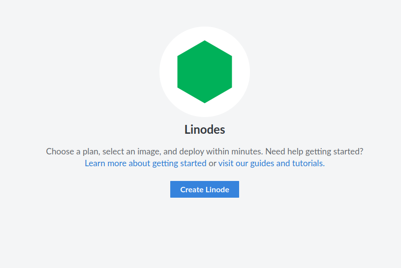
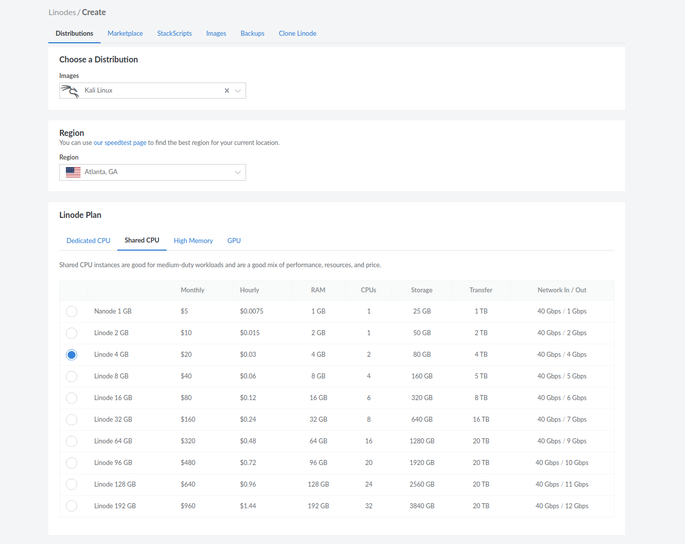
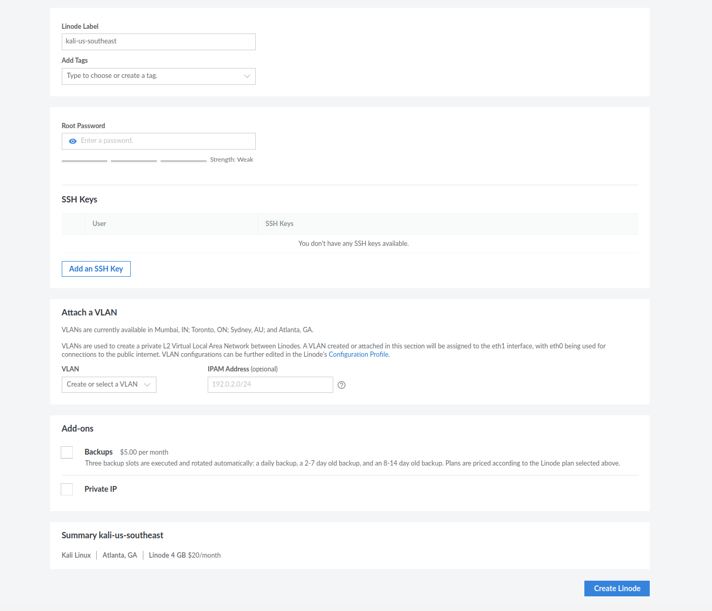
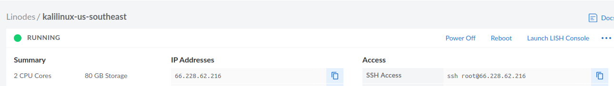
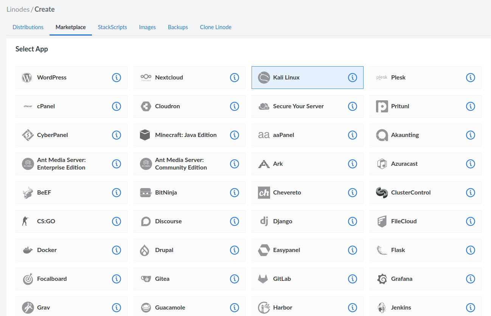
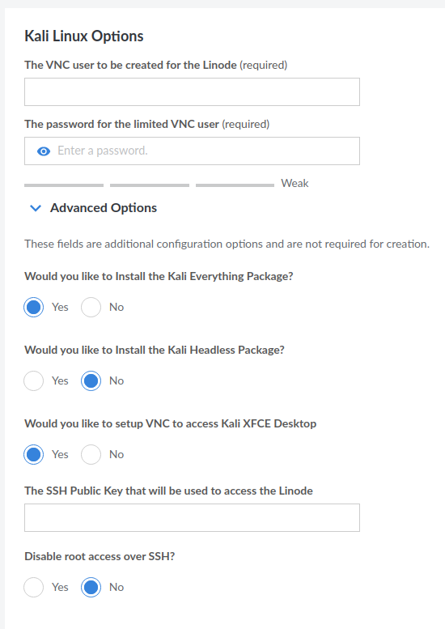
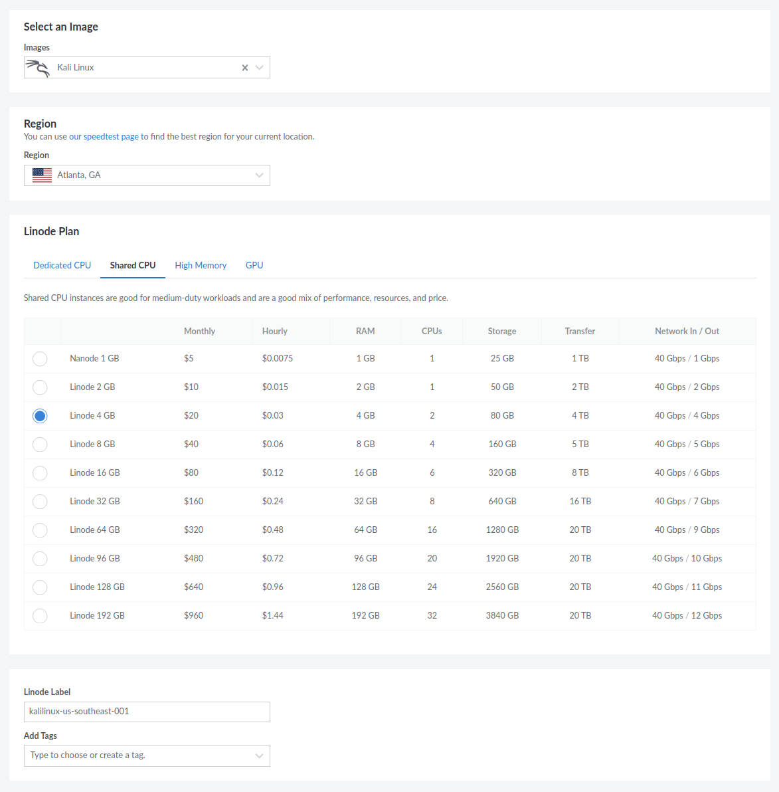
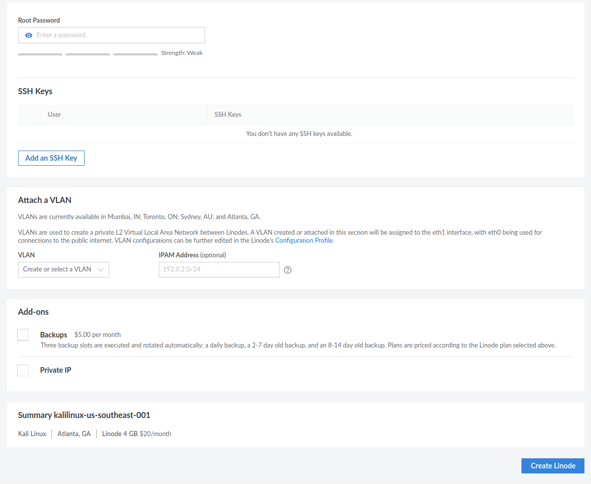

{}
이 문서에 있는 사진들은 모두 영어판 기준이기 때문에 한국어판과는 조금 다를 수 있어요.
{}

시작하기 전에 Linode가 직접 제작한 멋진 영상을 소개해 드립니다! [이 비디오](https://www.youtube.com/watch?v=Oox2hF4SZLU)에서는 칼리 리눅스가 무엇인지, 그리고 Linode에서 어떻게 설치하고 사용하는지 설명합니다. Linode에 감사드립니다!

칼리 리눅스 Linode 인스턴스를 배포하는 데는 두 가지 옵션이 있습니다. 두 방법을 간단히 설명한 다음, 각각의 설정 방법을 자세히 알려드리겠습니다.

- [배포판으로서의 Kali](#배포판으로서의-Kali)
- [마켓플레이스를 통한 Kali](#마켓플레이스를-통한-Kali)

두 옵션 모두 생성 자체는 무료이며, 인스턴스 실행에 대한 표준 비용만 지불하면 됩니다. 이제 이 시스템들을 설정해 봅시다!



## 배포판으로서의 Kali

Linode 인스턴스를 생성하고 배포판으로 Kali를 선택하면, [kali-linux-core](/docs/general-use/metapackages/)만 설치된 [기본 Kali](/docs/installation/barebone-kali/) 시스템이 생성됩니다. 특정 도구만 사용할 계획이라면 유용할 수 있으며, 시스템을 더 세밀하게 제어할 수 있습니다. 또한 운영 비용을 줄이는 데도 도움이 됩니다!

### 배포판으로서의 Kali 구성

먼저 "이미지" 드롭다운에서 칼리 리눅스를 선택합니다:


여기서부터는 개인 선호도에 따라 사용자 정의합니다. 다음은 예시 구성입니다:



매우 중요한 필드는 "루트 비밀번호"입니다. 여기서 설정한 내용이 SSH에서 사용할 비밀번호가 됩니다(공개 키를 선택하지 않는 한). 준비가 되면 "Linode 생성"을 다시 선택하고 프로비저닝이 완료될 때까지 기다립니다.



완료되면 SSH 접근 명령을 사용하여 인스턴스에 연결할 수 있습니다:



- - -

### Linode에서 Kali 기본 도구 설치

나중에 생각이 바뀌어 칼리 리눅스 데스크톱 버전에서 일반적으로 볼 수 있는 전통적인 도구 세트를 원한다면, [메타패키지](/docs/general-use/metapackages/)를 통해 언제든지 설치할 수 있습니다. 다음 명령을 실행하기만 하면 됩니다:

```console
kali@kali:~$ sudo apt update && sudo apt install kali-linux-default -y
[...]
kali@kali:~$
```

## 마켓플레이스를 통한 Kali

다른 옵션은 Linode 마켓플레이스에서 ["이 앱 배포하기"](https://www.linode.com/marketplace/apps/kali-linux/kali-linux/)를 실행하는 것입니다. 이렇게 하면 Linode 인스턴스가 생성되고, 구성 중에 선택한 옵션에 따라 특정 [메타패키지](/docs/general-use/metapackages/)가 설치된 칼리 리눅스 인스턴스가 설치됩니다. Linode 스크립트가 실행되고 모든 것을 설치하는 데 시간이 걸릴 수 있다는 점에 유의하세요. 미리 필요한 것을 정확히 알 수 없거나 익숙한 칼리 리눅스 환경을 원한다면 좋은 옵션입니다.

### 마켓플레이스를 통한 Kali 구성

"Linode 생성"을 선택할 때 웹페이지 상단에서 "마켓플레이스"를 선택합니다. 여기서 칼리 리눅스가 (작성 당시) 세 번째 옵션으로 표시됩니다:



칼리 리눅스를 선택한 후 아래로 스크롤하면 Kali에 특화된 구성 옵션이 있습니다:



앞서 언급했듯이, 이 옵션들은 어떤 [메타패키지](/docs/general-use/metapackages/)를 설치할지 결정하고 VNC 접근을 자동으로 설정합니다. 너무 많은 리소스를 차지하지 않도록 필요에 맞게 구성해야 합니다:



여기서부터는 표준 Linode 구성 설정이 있습니다:



마지막으로 "Linode 생성"을 선택하고 프로비저닝이 완료될 때까지 기다립니다.
앞서 말했듯이 Linode 스크립트가 실행될 시간을 충분히 주세요. 스크립트 실행이 완료되면 SSH 접근 명령을 사용하여 인스턴스에 연결할 수 있습니다.
