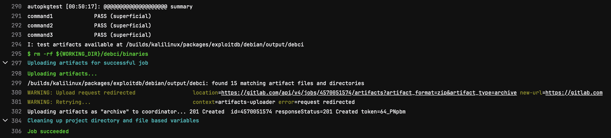
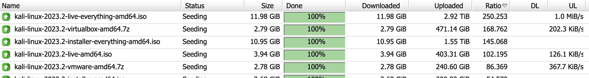
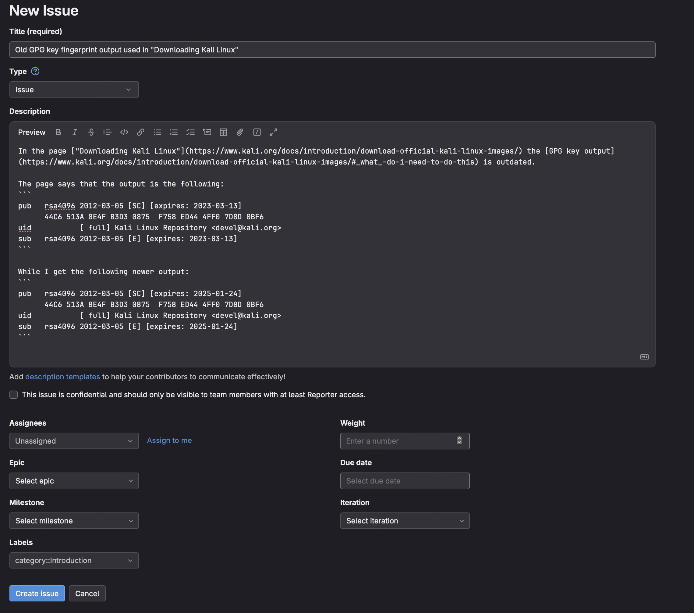
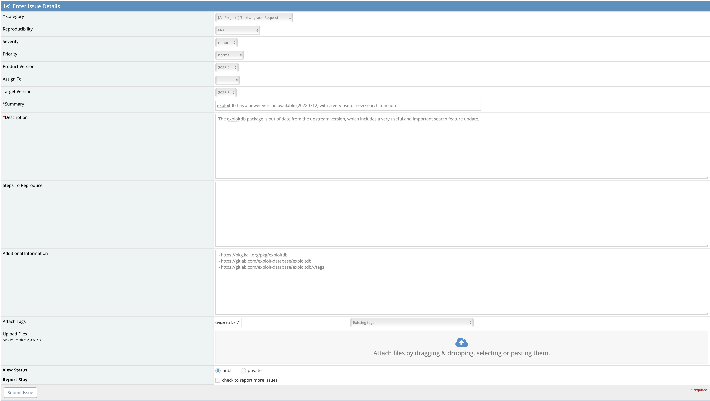

Kali Linux is a large project made up of many different parts. One of the most popular questions that the Kali team receives is "How can I help?" To help answer that question, this page will contain all possible ways that community members can contribute.

## Kali Documentation

All Kali documentation is written in **[markdown](https://en.wikipedia.org/wiki/Markdown) and is open source**. Our aim is to provide accurate, understandable, documentation about the Kali platform and the tools it contains. We encourage [merge requests](https://docs.gitlab.com/ee/user/project/merge_requests/creating_merge_requests.html) and [issues](https://docs.gitlab.com/ee/user/project/issues/create_issues.html) to be created that help us to improve upon our documentation.

### [Kali OS Docs](/docs/)

The *[kali-docs](https://gitlab.com/kalilinux/documentation/kali-docs)* is a great way for people to support Kali, as it can be done with limited knowledge of some of the more intricate parts of Linux. From grammar or command improvements to brand new pages, there is plenty of work available to be done here.

- [All currently opened issues](https://gitlab.com/kalilinux/documentation/kali-docs/-/issues)
- [All currently opened merge requests](https://gitlab.com/kalilinux/documentation/kali-docs/-/merge_requests)

### [Kali Tools](/tools/)

Another area of documentation that we maintain is *[kali-tools](https://gitlab.com/kalilinux/documentation/kali-tools/)*. This is the embodiment of all of the tools in Kali and how to use them. This is an important aspect of our documentation as it helps our users learn the fundamentals of a new tool they may be trying. While contributions here can be as minor as grammar adjustments, Kali Tools can greatly benefit from intimate knowledge of these tools and real world use cases.

- [All currently opened issues](https://gitlab.com/kalilinux/documentation/kali-tools/-/issues)
- [All currently opened merge requests](https://gitlab.com/kalilinux/documentation/kali-tools/-/merge_requests)

# Technical Knowledge Applied

## Kali Packages

Packaging is the core of Kali. Packages are what helps tools to be so easy to install, and insures they are up-to-date with no bugs. [Debian packaging](https://wiki.debian.org/Packaging) is a complicated thing that takes a while to learn, but if you are willing to do so can help quite a bit to know. Another important skill to have when packaging is knowledge of the programming language a tool is made in. Most tools are written in **Python, C/C++, Perl, Ruby, Go or Rust.**

### Upstream Package Updates

When there is a **[new update from upstream](https://pkg.kali.org/derivative/kali-roll/#newer_version)** (in most cases, this is the tool creator) it is important we get that update verified and out as soon as we can. To do this we must first package up the new update, test the resulting `.deb` file to ensure it works as expected and includes anything new, then sign it and release it. For most people, this process is not something they would be able to do without first learning [Debian packaging](https://wiki.debian.org/Packaging). If you were to discover that a tool is outdated, and don't know packaging, you could **instead create a [bug report](https://gitlab.com/groups/kalilinux/packages/-/issues/)** about the outdated tool.

- **[Packages with newer upstream version](https://pkg.kali.org/derivative/kali-roll/#newer_version)**

### Packaging New Tools

With the number of tools out there that users want to see in Kali, there is no way we can get them all on our own. A perk of us being on GitLab is that we can easily accept packages submitted by users, to learn more check out our [Public Packaging page](/docs/development/intro-to-packaging-example/). If you would like to help but don't know of a package that should be done, we [have a list that can be chosen from](https://bugs.kali.org/search.php?project_id=1&category_id=Queued%20Tool%20Addition&sticky=on&sort=id&dir=ASC&per_page=9999&hide_status=80&match_type=0). A great example of a user-contributed package is [kali-desktop-i3](https://www.kali.org/tools/kali-meta/#kali-desktop-i3) which is help maintained by [Arszilla](https://gitlab.com/Arszilla).

- [All currently requested tools](https://bugs.kali.org/search.php?project_id=1&category_id=Queued%20Tool%20Addition&sticky=on&sort=id&dir=ASC&per_page=9999&hide_status=80&match_type=0)

### Autopkgtests (debci)

When dealing with packages we may encounter updates that may break functionality. Something that helps to catch these problems are [autopkgtests](/docs/development/contributing-runtime-tests/#a-bit-of-autopkgtest-background). These tests are defined by the packager, and can range from a simple help output test to a full package functionality test. While extremely helpful, they also take time to develop and in most cases require intimate knowledge of the tool being tested. For more information on the actual process of creating them, please refer to the [following page](/docs/development/contributing-runtime-tests/). It would be very helpful to have contributions to this effort of creating more advanced autopkgtests for all of the tools in Kali.

Example of three passed tests:

## Putting Hardware To Work

### Hosting Kali Mirrors

Mirrors are what helps get Kali to users all around the world. Mirrors host our files for things like installation isos or tool packages. The more mirrors we have in different parts of the world, the better the experience is for users. If the closest mirror is a few countries away, it will likely take a lot longer to perform an update than if there is a mirror in the same country as the update is being done. If you are in a position where you can **help to host a Kali mirror**, please refer to our **[Mirror Policy Page](/docs/community/setting-up-a-kali-linux-mirror/)** to learn more.

### Porting Kali To A New Platform

We are proud of the fact that you can find Kali on almost every type of system you can think of. From x64 computers to mobile phones to ARM single board computers, you can find Kali on a lot of different devices. However, we know that there are some devices out there that we currently don't support. If you have one of those devices, and want to see Kali on it, you can help contribute to Kali by helping us to develop Kali on that device. Depending on the platform, you may want to submit the request in a specific GitLab project. If the device is ARM-based, you should submit it to the [ARM](https://gitlab.com/kalilinux/build-scripts/kali-arm) build scripts project. The same is true for [cloud](https://gitlab.com/kalilinux/build-scripts/kali-cloud), [VM](https://gitlab.com/kalilinux/build-scripts/kali-vm), or [NetHunter](https://gitlab.com/kalilinux/nethunter/build-scripts).

### Seeding Kali Torrents

Users can get Kali a variety of ways. We have pre-built VM images, iso files to install it yourself, containers, and cloud instances. When users want to download a new Kali iso, they can do so either through our website using HTTP(S) or through torrent files. To help speed things up, we really appreciate it when people seed our torrents. What this means is that you **leave the .torrent file saved and a connection kept**, and you help to share the file to other users who are downloading through torrents. This helps to speed the process up for everyone. If you have the bandwidth to share, please consider seeding our torrents.

Example of torrent seeding:

# Community interactions

## Kali Community

The Kali community is spread out through many different platforms and apps, however there are five official platforms we are on. The first is on GitLab, the second on Discord, the third IRC, the fourth our very own forums, and finally is our bug tracker. Helping in any of these communities is very much appreciated.

### GitLab

[GitLab](https://gitlab.com/kalilinux) is where all of our packages, docs pages, tool pages, build scripts, and more live. Everything is open source and contributions are encouraged. If something is inefficient, there is a typo somewhere, or you want to see a new feature added to Kali this is the place to go. If you know exactly what you want to change, please create a [merge request](https://gitlab.com/groups/kalilinux/-/merge_requests) doing so. If you don't know, you can create an [issue](https://gitlab.com/groups/kalilinux/-/issues) describing the issue or feature that you want changed.

Example of a report about an outdated page:

### Discord

Discord is a real time chat app that encourages live discussion. The [Kali Linux & Friends Discord](https://discord.kali.org/) server is one of the main places for people to chat with others regarding Kali and share ideas or interesting information. While not a support server, it is common to see others willing to help people who want to learn and grow. If you want to help others out, share things related to Kali, or just talk with people that have similar interests, check out our server.

### IRC

A lot like Discord, we have an [IRC server](/docs/community/kali-linux-irc-channel/) for users to ask questions and help each other out. Since the launch of our Discord server, most people prefer to communicate over there, however there can still be found someone who may know an answer to your question on the IRC server.

### Forums

The [Kali Forums](https://forums.kali.org/) are a place where people can request support, share tools, give feedback, and much more. Anyone is able to go to our forums and help point others in the right direction or maybe even share a fix to an issue they've encountered themselves. The forums are a great place to help out as they are permanent. As long as the website is up, the information on it will always be able to be found. This is different to Discord, where information can be lost pretty easily.

### Bug Tracker

The [Bug Tracker](https://bugs.kali.org/) is a great place to help out Kali, whether reporting a bug or helping to fix one. When reporting a bug, we ask that you follow our [documentation](/docs/community/submitting-issues-kali-bug-tracker/) on how to. When helping others with their bug reports, we ask that you use information you know is trust worthy. Helping out on a bug tracker ticket can be as simple as just being able to reproduce the problem or as complex as submitting a merge request to fix the issue yourself. Everything is appreciated.

Example of a tool upgrade request:

## Kali Social Platforms

Following us on social media and engaging with our content is a very easy way to help out! At the bottom of this page in the footer you can find all of our links to various platforms and social media. We currently are on:

- [Facebook](https://www.facebook.com/kalilinux)
- [Instagram](https://www.instagram.com/kalilinux/)
- [Mastodon](https://infosec.exchange/@kalilinux)
- [Twitter](https://twitter.com/kalilinux)

Something else that is helpful is leaving reviews or ratings on some of the platforms that we are on that you may use. These include the following marketplaces:

- [Amazon AWS](https://aws.amazon.com/marketplace/pp/prodview-fznsw3f7mq7to)
- [Docker Hub](https://hub.docker.com/r/kalilinux/kali-rolling)
- [Microsoft Azure](https://azuremarketplace.microsoft.com/en-us/marketplace/apps/kali-linux.kali?tab=Reviews)
- [Microsoft Store (WSL)](https://apps.microsoft.com/store/detail/kali-linux/9PKR34TNCV07?hl=en-us&gl=us)

_Please only do so if you use the platform that you are reviewing_.
These reviews help us and other users, so it is a good way to help out the community!
