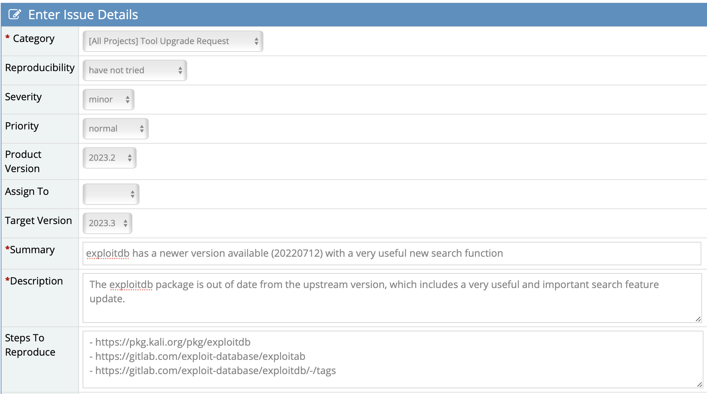

칼리 리눅스는 다양한 부분으로 구성된 대규모 프로젝트입니다. 칼리 팀이 가장 자주 받는 질문 중 하나는 "어떻게 도울 수 있나요?"입니다. 이 질문에 답하기 위해, 이 페이지에서는 커뮤니티 구성원이 기여할 수 있는 모든 방법을 안내합니다.
{}
ROKFOSS 프로젝트에서는 칼리리눅스의 문서 한글화 같은 것들을 기여할 수 있지만 칼리 리눅스 버그를 제보하는 곳이 아님을 알아주세요. 칼리리눅스 버그 제보는 아래에 적힌 방법대로 해야 합니다.
{}

# 커뮤니티 참여

## 칼리 커뮤니티

칼리 커뮤니티는 다양한 플랫폼과 앱에 분산되어 있지만, 우리가 공식적으로 사용하는 다섯 개의 플랫폼이 있습니다. 첫 번째는 GitLab, 두 번째는 Discord, 세 번째는 IRC, 네 번째는 자체 포럼, 마지막으로 버그 트래커입니다. 이러한 커뮤니티에서의 도움은 모두 매우 감사하게 생각합니다.

### GitLab

[GitLab](https://gitlab.com/kalilinux)은 우리의 패키지, 문서 페이지, 도구 페이지, 빌드 스크립트 등이 모두 있는 곳입니다. 모든 것이 오픈 소스이며 기여를 장려합니다. 비효율적인 부분이 있거나, 오타가 있거나, 또는 칼리에 새로운 기능을 추가하고 싶다면 이곳이 바로 그 장소입니다. 변경하고 싶은 것이 명확하다면 [병합 요청](https://gitlab.com/groups/kalilinux/-/merge_requests)을 생성해 주세요. 확실하지 않다면 변경하고 싶은 문제나 기능에 대해 설명하는 [이슈](https://gitlab.com/groups/kalilinux/-/issues)를 생성할 수 있습니다.

오래된 페이지에 관한 보고 예시:

### Discord

Discord는 실시간 토론을 장려하는 채팅 앱입니다. [칼리 리눅스 & 프렌즈 Discord](https://discord.kali.org/) 서버는 사람들이 칼리에 관해 대화하고 아이디어나 흥미로운 정보를 공유하는 주요 장소 중 하나입니다. 지원 서버는 아니지만, 배우고 성장하고자 하는 사람들을 돕고자 하는 다른 사용자들을 흔히 볼 수 있습니다. 다른 사람들을 돕거나, 칼리와 관련된 내용을 공유하거나, 또는 비슷한 관심사를 가진 사람들과 이야기하고 싶다면 우리 서버를 확인해 보세요.

### IRC

Discord와 유사하게, 우리는 사용자들이 질문하고 서로 도울 수 있는 [IRC 서버](/docs/community/kali-linux-irc-channel/)도 운영하고 있습니다. Discord 서버 출시 이후, 대부분의 사람들은 그곳에서 소통하는 것을 선호하지만, IRC 서버에서도 여전히 질문에 답변해 줄 수 있는 누군가를 찾을 수 있습니다.

### 포럼

[칼리 포럼](https://forums.kali.org/)은 사람들이 지원을 요청하고, 도구를 공유하고, 피드백을 제공하는 등의 활동을 할 수 있는 공간입니다. 누구나 포럼에 가서 다른 사람들을 올바른 방향으로 안내하거나 자신이 겪었던 문제에 대한 해결책을 공유할 수 있습니다. 포럼은 영구적이기 때문에 도움을 주기에 좋은 장소입니다. 웹사이트가 운영되는 한, 그 안의 정보는 항상 찾을 수 있습니다. 이는 정보가 쉽게 사라질 수 있는 Discord와는 다릅니다.

### 버그 트래커

[버그 트래커](https://bugs.kali.org/)는 버그를 보고하거나 해결을 돕는 등 칼리를 도울 수 있는 좋은 장소입니다. 버그를 보고할 때는 [문서](/docs/community/submitting-issues-kali-bug-tracker/)에 따라 진행해 주시기 바랍니다. 다른 사람들의 버그 보고서를 돕는 경우에는 신뢰할 수 있는 정보를 사용해 주세요. 버그 트래커 티켓에서 도움을 주는 것은 단순히 문제를 재현하는 것에서부터 직접 문제를 해결하는 병합 요청을 제출하는 것까지 다양합니다. 모든 도움에 감사드립니다.

도구 업그레이드 요청 예시:

# 칼리 문서

모든 칼리 문서는 **[마크다운](https://ko.wikipedia.org/wiki/%EB%A7%88%ED%81%AC%EB%8B%A4%EC%9A%B4)으로 작성되었으며 오픈 소스**입니다. 우리의 목표는 칼리 플랫폼과 포함된 도구들에 대해 정확하고 이해하기 쉬운 문서를 제공하는 것입니다. 우리는 문서를 개선하는 데 도움이 되는 [병합 요청](https://docs.gitlab.com/ee/user/project/merge_requests/creating_merge_requests.html)과 [이슈](https://docs.gitlab.com/ee/user/project/issues/create_issues.html)를 장려합니다.

### [칼리 리눅스 문서](/docs/)

*[kali-docs](https://gitlab.com/kalilinux/documentation/kali-docs)*는 리눅스의 더 복잡한 부분에 대한 지식이 제한적인 상태에서도 칼리를 지원할 수 있는 좋은 방법입니다. 문법이나 명령어 개선부터 완전히 새로운 페이지까지, 여기에는 수행할 수 있는 많은 작업이 있습니다.

- [현재 열려있는 모든 이슈](https://gitlab.com/kalilinux/documentation/kali-docs/-/issues)
- [현재 열려있는 모든 병합 요청](https://gitlab.com/kalilinux/documentation/kali-docs/-/merge_requests)

만약 한글화 작업에 기여하고자 한다면 [ROKFOSS kali-docs](https://github.com/KRFOSS/kali-docs)에서 기여하실 수 있습니다. 

### [칼리 도구](/tools/)

우리가 유지 관리하는 또 다른 문서 영역은 *[kali-tools](https://gitlab.com/kalilinux/documentation/kali-tools/)*입니다. 이것은 칼리에 있는 모든 도구와 그 사용 방법에 관한 정보를 담고 있습니다. 이는 사용자들이 새로운 도구의 기본 사항을 배울 수 있도록 돕는 우리 문서의 중요한 측면입니다. 여기서의 기여는 문법 수정처럼 사소한 것일 수도 있지만, 칼리 도구는 이러한 도구에 대한 깊은 지식과 실제 사용 사례로부터 큰 도움을 받을 수 있습니다.

- [현재 열려있는 모든 이슈](https://gitlab.com/kalilinux/documentation/kali-tools/-/issues)
- [현재 열려있는 모든 병합 요청](https://gitlab.com/kalilinux/documentation/kali-tools/-/merge_requests)

# 기술적 지식 활용

## 칼리 패키지

패키징은 칼리의 핵심입니다. 패키지는 도구를 쉽게 설치할 수 있게 하고, 버그 없이 최신 상태를 유지하도록 합니다. [데비안 패키징](/docs/development/intro-to-packaging-example/)은 시간이 많이 소요되지만 보람 있는 과정입니다. 이 방법을 배우면 기술을 연마할 많은 기회가 있습니다. 패키징에서 또 다른 중요한 기술은 도구가 작성된 프로그래밍 언어에 대한 지식입니다. 대부분의 도구는 **Python, C/C++, Perl, Ruby, Go 또는 Rust**로 작성됩니다.

### 업스트림 패키지 업데이트

**[업스트림에서 새로운 업데이트](https://pkg.kali.org/derivative/kali-roll/#newer_version)**가 있을 때(대부분의 경우 도구 제작자로부터), 해당 업데이트를 검증하고 가능한 빨리 출시하는 것이 중요합니다. 이를 위해 우선 새 업데이트를 패키징하고, 결과로 나온 `.deb` 파일이 예상대로 작동하며 새로운 기능을 포함하는지 테스트한 다음, 서명하고 출시해야 합니다. 대부분의 사람들에게 이 과정은 먼저 [데비안 패키징](/docs/development/intro-to-packaging-example/)을 배우지 않고는 할 수 없는 일입니다. 도구가 오래되었다는 것을 발견했지만 패키징을 모른다면, **대신 오래된 도구에 대한 [버그 보고서](https://gitlab.com/groups/kalilinux/packages/-/issues/)를 생성**할 수 있습니다.

- **[최신 업스트림 버전이 있는 패키지](https://pkg.kali.org/derivative/kali-roll/#newer_version)**

### 새 도구 패키징

사용자들이 칼리에서 보고 싶어하는 많은 도구가 있기 때문에, 우리 혼자서 그 모든 것을 처리할 수 없습니다. 우리가 GitLab을 사용하는 장점 중 하나는 사용자가 제출한 패키지를 쉽게 수락할 수 있다는 것입니다. 자세한 내용은 [공개 패키징 페이지](/docs/development/intro-to-packaging-example/)를 확인하세요. 도움을 주고 싶지만 어떤 패키지를 해야 할지 모르겠다면, [선택할 수 있는 목록](https://bugs.kali.org/search.php?project_id=1&category_id=Queued%20Tool%20Addition&sticky=on&sort=id&dir=ASC&per_page=9999&hide_status=80&match_type=0)이 있습니다. 사용자 기여 패키지의 좋은 예는 커뮤니티 멤버인 [Arszilla](https://gitlab.com/Arszilla)가 유지 관리하는 [kali-desktop-i3](https://www.kali.org/tools/kali-meta/#kali-desktop-i3)입니다.

- [현재 요청된 모든 도구](https://bugs.kali.org/search.php?project_id=1&category_id=Queued%20Tool%20Addition&sticky=on&sort=id&dir=ASC&per_page=9999&hide_status=80&match_type=0)

### 자동 패키지 테스트 (debci)

패키지를 다룰 때 기능을 손상시킬 수 있는 업데이트를 만날 수 있습니다. 이러한 문제를 포착하는 데 도움이 되는 것은 [자동 패키지 테스트](/docs/development/contributing-runtime-tests/#a-bit-of-autopkgtest-background)입니다. 이러한 테스트는 패키저가 정의하며, 간단한 도움말 출력 테스트부터 전체 패키지 기능 테스트까지 다양합니다. 매우 유용하지만, 개발하는 데 시간이 걸리고 대부분의 경우 테스트 중인 도구에 대한 깊은 지식이 필요합니다. 실제 생성 과정에 대한 자세한 정보는 [다음 페이지](/docs/development/contributing-runtime-tests/)를 참조하세요. 칼리의 모든 도구에 대해 더 고급 자동 패키지 테스트를 만드는 이 노력에 기여하는 것은 매우 유용할 것입니다.

세 가지 통과된 테스트 예시:

# 하드웨어 활용하기

### QA 테스팅에 기여하기

칼리 팀은 가끔 특정 장치나 패키지 테스트에 도움을 요청합니다. 이러한 요청은 일반적으로 [칼리 리눅스 & 프렌즈 디스코드](https://discord.kali.org/) 또는 [칼리 포럼](https://forums.kali.org/)을 통해 이루어집니다. 이러한 요청에 주목하고 도움을 줄 수 있는 장치가 있을 수 있습니다.

### 칼리 미러 호스팅

미러는 전 세계 사용자에게 칼리를 제공하는 데 도움이 됩니다. 미러는 설치 ISO나 도구 패키지와 같은 파일을 호스팅합니다. 전 세계 다른 지역에 많은 미러가 있을수록 사용자 경험이 더 좋아집니다. 가장 가까운 미러가 몇 개 국가 떨어져 있다면, 같은 국가 내에 미러가 있는 경우보다 업데이트하는 데 더 오래 걸릴 가능성이 높습니다. **칼리 미러 호스팅을 도울 수 있는 위치에 있다면**, 자세한 내용을 알아보기 위해 **[미러 구축 페이지](/docs/community/setting-up-a-kali-linux-mirror/)**를 읽어주세요.

### 칼리를 새로운 플랫폼에 포팅하기

우리는 칼리가 생각할 수 있는 거의 모든 유형의 시스템에서 찾을 수 있다는 사실을 자랑스럽게 생각합니다. x64 컴퓨터부터 모바일 폰, ARM 단일 보드 컴퓨터까지, 칼리는 다양한 장치에서 찾을 수 있습니다. 그러나 현재 지원하지 않는 장치도 있다는 것을 알고 있습니다. 그러한 장치가 있고 칼리를 그 장치에서 보고 싶다면, 해당 장치에서 칼리를 개발하는 데 도움을 주어 칼리에 기여할 수 있습니다. 플랫폼에 따라 특정 GitLab 프로젝트에 요청을 제출해야 할 수 있습니다. 장치가 ARM 기반이라면 [ARM](https://gitlab.com/kalilinux/build-scripts/kali-arm) 빌드 스크립트 프로젝트에 제출해야 합니다. [클라우드](https://gitlab.com/kalilinux/build-scripts/kali-cloud), [VM](https://gitlab.com/kalilinux/build-scripts/kali-vm), 또는 [넷헌터](https://gitlab.com/kalilinux/nethunter/build-scripts)에도 마찬가지입니다.

### 칼리 토렌트 시딩

사용자는 다양한 방법으로 칼리를 얻을 수 있습니다. 우리는 사전 구축된 VM 이미지, 직접 설치할 수 있는 ISO 파일, 컨테이너 및 클라우드 인스턴스를 제공합니다. 사용자가 새로운 칼리 ISO를 다운로드하려면 HTTP(S)를 통해 우리 웹사이트에서 또는 토렌트 파일을 통해 다운로드할 수 있습니다. 속도를 높이기 위해, 사람들이 우리의 토렌트를 시딩할 때 정말 감사하게 생각합니다. 이것은 **.torrent 파일을 저장하고 연결을 유지함**으로써 토렌트를 통해 다운로드하는 다른 사용자에게 파일 공유를 돕는 것을 의미합니다. 이는 모두에게 처리 과정을 가속화하는 데 도움이 됩니다. 공유할 대역폭이 있다면 우리 토렌트 시딩을 고려해 주세요.

토렌트 시딩 예시:

# 칼리 소셜 플랫폼

소셜 미디어에서 우리를 팔로우하고 콘텐츠에 참여하는 것은 도움을 주는 매우 쉬운 방법입니다! 이 페이지 하단의 푸터에서 다양한 플랫폼 및 소셜 미디어에 대한 모든 링크를 찾을 수 있습니다. 현재 우리는 다음과 같은 플랫폼에 있습니다:

- [페이스북](https://www.facebook.com/kalilinux)
- [인스타그램](https://www.instagram.com/kalilinux/)
- [Mastodon](https://infosec.exchange/@kalilinux)
- [X(구 트위터)](https://twitter.com/kalilinux)

또한 도움이 되는 것은 사용할 수 있는 플랫폼에서 리뷰나 평점을 남기는 것입니다. 이러한 마켓플레이스는 다음과 같습니다:

- [Amazon AWS](https://aws.amazon.com/marketplace/pp/prodview-fznsw3f7mq7to)
- [Docker Hub](https://hub.docker.com/r/kalilinux/kali-rolling)
- [Microsoft Azure](https://azuremarketplace.microsoft.com/en-us/marketplace/apps/kali-linux.kali?tab=Reviews)
- [Microsoft Store (WSL)](https://apps.microsoft.com/store/detail/kali-linux/9PKR34TNCV07?hl=en-us&gl=us)

_리뷰하는 플랫폼을 실제로 사용하는 경우에만 작성하세요_.
이러한 리뷰는 우리와 다른 사용자들을 돕기 때문에, 커뮤니티를 돕는 좋은 방법입니다!
