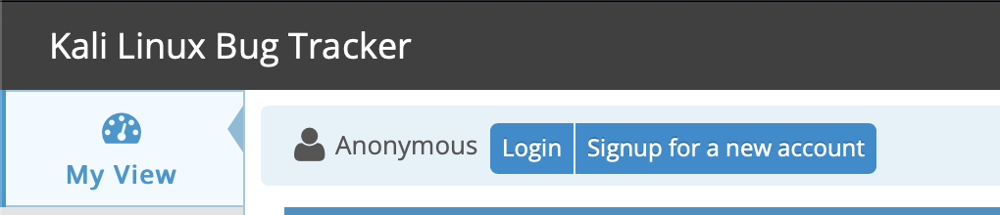
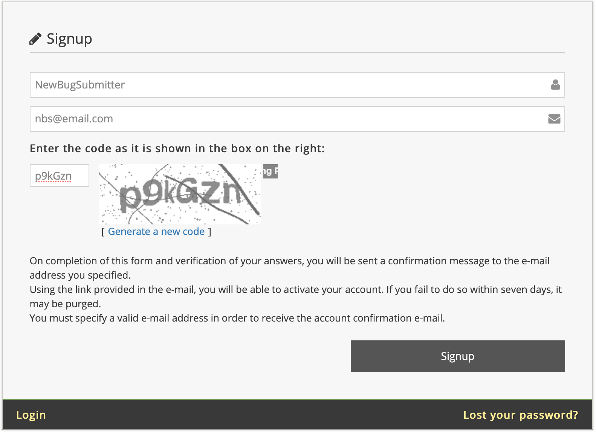
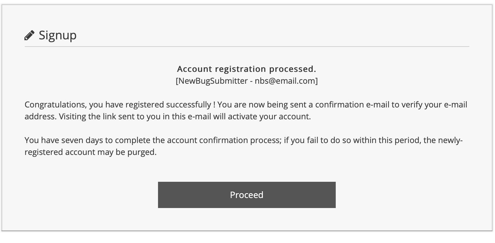

## 소개

이 문서는 버그 제보를 최대한 빨리 처리할 수 있도록 작성하는 방법에 대한 안내서입니다.

우선, Kali Linux는 우리가 속한 커뮤니티에 환원하고자 하는 열정에서 탄생했습니다. 개발자로서 우리의 목표는 Kali Linux 사용자 커뮤니티 전체를 위해 더 나은 환경을 만들기 위해 프로젝트를 지속적으로 개선하고 발전시키는 것입니다. 여러분에게 지원을 제공하는 개발자들은 순수한 이타심으로 자원 봉사를 하는 분들입니다. Kali Linux는 그들이 여러분에게 주는 선물입니다. 의견을 제시할 때 이 점을 염두에 두시기 바랍니다.

둘째, 성공적인 버그 제보의 목표는 Kali Linux 개발자들이 해당 문제를 재현하고 실패 상황을 확인할 수 있도록 하는 것입니다. Kali 개발팀이 보고된 실패를 재현할 수 있으면, 근본 원인을 파악할 때까지 추가 정보를 수집할 수 있습니다. 실패를 재현할 수 없는 경우, 개발팀은 제출자가 보고한 결과를 재현할 수 있을 때까지 추가 정보를 요청할 것입니다.

참고로, 저희 팀은 **영어**로 작성된 내용을 가장 잘 이해합니다. (ROKFOSS 팀에 Kali Linux 버그를 제출해선 안됩니다!)

우리가 여러분을 도울 수 있도록 도와주세요! 문제 해결을 위한 최상의 출발점을 주기 위해:

- 가능한 모든 정보를 제공하세요. 관련 내용에 집중하려고 노력하되, 불확실한 경우에는 정보가 너무 적은 것보다 많은 것이 좋습니다.
- 버그 제보를 객관적으로 유지하고 직면한 사실에 집중하세요.
- 무엇이 '사실'인지 매우 명확하게 하세요 - 로그, 스크롤백 캡처 등을 통해 가능한 한 문서화하고, 무엇이 여러분의 가설인지 구분하세요.
- 위키피디아와 같은 비-1차 자료를 "사실"로 인용하지 마세요. 중요한 것은 위키피디아가 주장하는 바가 아니라 여러분의 시스템에서 무슨 일이 일어나고 있는지 입니다.
- 단일 보고서에 여러 문제를 포함하지 말고 필요에 따라 추가 보고서를 제출하세요. 한 사람이 한 가지 하드웨어 조합에 대한 한 가지 버그에 대해 하나의 보고서를 제출해야 합니다. 단일 보고서에 여러 변형을 포함하려고 하면 특정 문제를 파악하기 매우 어렵습니다. 또한 비슷한 버그로 보이는 것이 실제로는 관련이 없을 수 있습니다.
- 개발자 중 한 명이 추가 정보를 요청하면, 요청하는 내용을 이해하고 합리적인 시간 내에 제공하도록 최선을 다하세요. 요청 사항을 이해하지 못한 경우 명확한 설명을 요청하세요. 우리는 더 많은 안내를 제공하기 위해 최선을 다할 것입니다. "저도 그래요!" 또는 "+1"과 같은 아무런 도움이 되지 않는 댓글은 달지 마세요.
- 버그를 수정하는 데 걸리는 시간에 대해 불평하지 마세요. 기억하세요! 개발자들은 본업이 있는 자원봉사자들이며, 그들의 일은 여러분의 버그를 수정하는 것이 아닙니다.

## 버그 제보 작성 방법

Kali Linux 버그 트래커는 [bugs.kali.org](https://bugs.kali.org/)에서 찾을 수 있습니다. 이 섹션에서는 새 계정 가입, 시스템 프로필 생성, 버그 트래커에 제출할 상세 버그 제보 작성 방법을 안내합니다.

### 버그 트래커 계정 가입하기

버그 트래커에서 제보를 제출하거나 기존 제보에 댓글을 달기 전에 계정을 만들어야 합니다.
버그 트래커 웹사이트에서 **신규 계정 가입**을 클릭하세요.



사용자 이름, 이메일 주소를 제공하고 CAPTCHA 챌린지에 응답하세요. **가입** 버튼을 클릭하여 진행하세요.



성공하면 다음 페이지에서 계정 등록이 처리되었고 버그 트래커 시스템이 제공한 이메일 주소로 확인 메일을 보냈다고 알려줍니다. 계정을 활성화하려면 이메일에 있는 링크를 방문해야 합니다.

계정이 활성화되면 **계속하기**를 클릭하여 버그 트래커 로그인 페이지로 이동하세요.



### 이전 제보와 중복되지 않는지 확인하기

제보를 시작하기 전에 문제와 관련된 키워드로 사이트를 검색하세요. 하드웨어와 관련이 없는 버그가 이미 존재한다면, 요청을 중복하거나 새로운 정보를 제공하지 않는 불필요한 메모(예: "저도 그래요" 또는 "+1")를 추가하지 마세요. 버그가 이미 보고된 경우, ID 링크를 클릭하여 문제 해결 진행 상황을 볼 수 있습니다.

그러나 문제가 하드웨어 관련이라고 생각되면, 유사하게 보이더라도 본인의 '특정' 정보로 새 보고서를 제출하세요. 같은 데스크톱이나 노트북 모델을 가지고 있다고 해서 문제가 동일하다고 가정하지 마세요. 완전히 일치하지 않을 가능성이 큽니다.

### 제보 작성하기

제보를 시작하려면 계정에 로그인하고 랜딩 페이지에서 **문제 보고** 링크를 클릭하세요. 가능한 많은 정보를 제공해야 합니다. 확실하지 않다면 이 문서 시작 부분의 지침을 검토하세요.

제보에서 다음 필드는 '필수'입니다:

- 카테고리
- 요약
- 설명

다른 필드들이 필수는 아니지만, 각 옵션에 가능한 많은 정보를 포함하고 다음 필드에 특별히 주의를 기울이는 것이 좋습니다:

- 재현 가능성 - 이 버그는 얼마나 재현 가능합니까? 항상? 가끔? 특정 상황에서만?
- 프로필 선택 - 무엇을 실행하고 있으며, '어디서' 실행하는지 알아야 합니다.
- 재현 단계 - 여기서 매우 명확하게 설명하고 가능한 많은 구체적인 세부 정보를 제공하세요.
- 추가 정보
- 파일 업로드(오류 로그, 스크린샷)

#### 적절한 카테고리 선택하기

현재 Kali 버그 트래커에는 8개의 카테고리가 있습니다. 요청을 시작하기 전에 다음 중 하나에 적절하게 지정되었는지 확인하세요:

- 기능 요청
- 일반 버그
- Kali 패키지 버그
- Kali 패키지 개선
- Kali 웹사이트 및 문서
- 새 도구 요청
- 대기 중인 도구 추가
- 도구 업그레이드

버그 트래커에서 지원을 요청하거나 질문을 하지 마세요. Kali Linux는 [Kali 문서](/docs/), [Kali 포럼](https://forums.kali.org/), [IRC 채팅룸](/docs/community/kali-linux-irc-channel/)(OFTC의 **_#kali-linux_**)을 포함한 여러 지원 옵션을 제공합니다.

#### 설명적인 요약 제공하기

요약 필드는 기본적으로 버그 제보의 '제목'이며 Kali 개발자와 다른 방문자들이 가장 먼저 보게 되는 것입니다. 문제나 요청을 설명하는 짧지만 설명적인 요약을 제공하세요.

좋은 요약: 저장소에서 설치한 크로미움 패키지가 루트 사용자로 실행되지 않음

나쁜 요약: 크로미움이 작동하지 않음

요약에 모든 것을 포함할 필요는 없지만, 제보를 제출하는 이유를 전달해야 합니다.

#### dpkg를 사용하여 제보용 패키지 및 버전 찾기

dpkg 플래그 조합을 사용하여 설치된 패키지를 찾을 수 있습니다. 이러한 명령의 출력에서 관련 정보를 제보에 포함하는 것이 중요합니다. 출력은 텍스트 파일에 저장하여 업로드할 수도 있습니다(이 문서에서 나중에 설명).

- dpkg --search
- dpkg --list
- dpkg --status

샘플 출력

```console
kali@kali:~$ which chromium
/usr/bin/chromium
kali@kali:~$
kali@kali:~$ type chromium
chromium is /usr/bin/chromium
kali@kali:~$
kali@kali:~$ dpkg --search /usr/bin/chromium
chromium: /usr/bin/chromium
kali@kali:~$
kali@kali:~$ dpkg --list chromium
Desired=Unknown/Install/Remove/Purge/Hold
| Status=Not/Inst/Conf-files/Unpacked/halF-conf/Half-inst/trig-aWait/Trig-pend
|/ Err?=(none)/Reinst-required (Status,Err: uppercase=bad)
||/ Name           Version      Architecture Description
+++-==============-============-============-=================================
ii  chromium       76.0.3809.100-1 amd64       web browser
kali@kali:~$
kali@kali:~$ dpkg --status chromium
Package: chromium
Status: install ok installed
Priority: optional
Section: web
Installed-Size: 188290
Maintainer: Debian Chromium Team <chromium@packages.debian.org>
Architecture: amd64
Source: chromium-browser
Version: 76.0.3809.100-1
[...]
kali@kali:~$
```

### 설명 시나리오 작성하기

이것은 여러분이 겪고 있는 문제에 대해 잘 구성된 설명을 제공하여 우리를 도울 수 있는 기회입니다. 가능한 많은 세부 사항과 사실을 제공해주세요.

해당되는 경우 다음 내용을 포함하도록 하세요:

- 오류 메시지의 '정확하고 완전한 텍스트'(화면 출력 또는 로그 파일)
- 문제를 발생시키기 위해 '정확히' 무엇을 입력했거나 어떤 조치를 취했는지
- 해결책, 해결 방법 또는 패치를 제안할 수 있다면 그것도 제공하세요
- 문제가 있는 패키지 버전과 종속 패키지 관련 정보
- 커널 버전, 공유 C 라이브러리 및 적절해 보이는 기타 세부 정보
- `uname -a` 명령의 출력
- `dpkg -s libc6 | grep ^Version` 명령의 출력
- 해당하는 경우 소프트웨어 버전(예: `python -V` 등)
- 하드웨어 세부 정보
- 장치 드라이버에 관한 문제를 보고하는 경우, 시스템의 모든 하드웨어에 대한 전체 세부 정보를 제공하세요 - 저장소에서 lshw를 설치하여 시스템에 대한 완전한 보고서를 얻을 수 있습니다.
- 관련 있어 보이는 다른 세부 정보 추가
- 제보가 "너무 길다"고 걱정하지 마세요 - 정보가 관련성 있는 한 포함시키세요.

다음은 개발팀이 버그를 즉시 재현하고 이해하려고 시도할 수 있는 정보를 제공하는 좋은 버그 제보의 예입니다:

- - -

> **패키지**: Chromium
>
> **아키텍처**: amd64
>
> **유지 관리자**: Debian Chromium Maintainers
>
> **소스**: chromium-browser
>
> **버전**: 76.0.3809.100-1
>
> Kali Linux 저장소에서 'apt install chromium' 명령을 사용하여 Chromium 웹 브라우저를 설치했습니다. Kali 메뉴에서 응용 프로그램/인터넷/Chromium 웹 브라우저를 선택하여 프로그램을 실행했습니다. Chromium은 예상대로 실행되지 않고, 대신 오류 팝업 창을 표시했습니다.
>
> 오류 메시지는 "Chromium은 루트로 실행할 수 없습니다. 일반 사용자로 Chromium을 시작하세요. 루트로 실행하려면 프로필 정보 저장을 위해 대체 --user-data-dir을 지정해야 합니다."라고 되어 있었습니다.
>
> 팝업 창을 닫기 위해 닫기 버튼을 클릭했습니다.
>
> **uname -a 출력**: Linux kali 5.2.0-kali1-amd64 #1 SMP Debian 5.2.9-2kali1 (2019-08-22) x86_64 GNU/Linux
>
> **C 라이브러리 버전**: 2.29-2

- - -

### 재현 가능성의 중요성

Kali Linux 버그 트래커를 사용하면 보고되는 문제의 빈도를 제공할 수 있습니다. 새 도구나 기존 도구 업그레이드를 요청하는 경우 드롭다운 옵션에서 **N/A**를 선택하면 됩니다. 버그를 제출하는 경우 적절한 응답을 제공하세요.

위의 예를 계속하자면, 설계상 크로미움은 루트로 실행되지 않으므로 드롭다운 메뉴에서 '항상'을 선택하게 됩니다.

정확한 응답을 제공하는 것이 매우 중요합니다. Kali 개발자가 문제를 재현하려고 시도할 때 빈도를 알아야 합니다. 문제가 가끔 발생하지만 '항상'으로 표시했다면, 테스트를 수행하는 개발자가 문제를 경험하지 않을 수 있으므로 문제가 조기에 종결될 수 있습니다.

### 문제 재현 단계 제공하기

설명 섹션과 비교하면 중복된 것처럼 보일 수 있지만, 이 섹션은 문제를 재현하기 위해 취한 단계'만' 포함해야 합니다. 일부 단계는 불필요해 보일 수 있지만, 가능한 한 잘 프로세스를 문서화하는 것이 중요합니다. 누락된 단계가 문제 재현의 핵심일 수 있습니다.

다음은 크로미움 버그 예시를 재현하는 좋은 단계 세트의 예입니다.

- - -

1. 응용 프로그램/액세서리/터미널을 선택하여 터미널 창 열기
2. 터미널에 'apt install chromium'을 입력하고 엔터를 눌러 명령 실행
3. 응용 프로그램/인터넷/크로미움 웹 브라우저를 선택하여 크로미움 웹 브라우저 실행 시도

- - -

### 추가 정보 제공하기

이 섹션에서는 문제와 관련이 있다고 생각하는 추가 정보를 제공할 수 있습니다. 문제에 대한 해결책이나 해결 방법이 있다면 이 섹션에 제공하세요. 다시 한 번, 사실에 충실하고 개발자가 문제를 재현할 수 있도록 단계를 명확하게 문서화하는 것이 중요합니다.

유용한 "추가 정보"의 예:

- - -

여러 포럼에 잘 문서화된 간단한 해결책이 있습니다. 시도해봤는데 제 경우에는 문제가 해결됐습니다.

- 텍스트 편집기로 /etc/chromium/default 열기
- --user-data-dir 플래그 추가
- 예: CHROMIUM_FLAGS="--user-data-dir"

향후 릴리스에서 이 플래그가 필요하지 않도록 저장소 버전의 크로미움에 패치를 적용할 수 있을까요?

- - -

#### 관련 파일 업로드하기

때로는 텍스트로 쉽게 입력할 수 없는 정보를 개발팀에게 제공하는 것이 중요합니다. 제보의 이 섹션에서는 스크린샷과 로그 파일을 추가할 수 있습니다. 설정된 크기 제한을 염두에 두세요.

'파일 선택' 버튼을 클릭하여 파일을 추가할 수 있습니다. 이렇게 하면 시스템의 파일 관리자가 열리고 제보에 첨부할 파일을 선택할 수 있습니다. 파일을 선택한 후 '열기' 버튼을 클릭하여 제보로 돌아가서 '파일 업로드' 버튼을 클릭하세요.

#### 제보 제출하기

이 시점에서 제보를 제출할 준비가 되었습니다. 남은 일은 '제보 제출' 버튼을 클릭하는 것뿐입니다. 제보가 제출되고 추적 ID가 할당됩니다. 제보는 '내 보기' 페이지의 '내가 보고한 항목' 아래에 표시됩니다. 이를 통해 문제 해결까지의 과정을 추적할 수 있습니다.

#### 요약

버그 제보는 Kali Linux 개발팀이 직접 문제를 확인할 수 있도록 도와줍니다. 그들이 여러분과 함께 문제를 직접 경험할 수 없기 때문에, 여러분은 그들이 자신의 시스템에서 동일한 문제를 재현할 수 있을 만큼 상세한 지침을 제공해야 합니다.

취한 단계, 본 것, 행동, 그리고 예상 결과를 포함하여 모든 것을 자세히 설명하세요.

가능하면 연구를 통해 문제 또는 해결책을 찾으려고 노력하세요 - 오픈소스 개발은 참여적인 과정임을 기억하세요! 시스템 문제를 해결할 수 있는 해결책을 제공할 수 있다면, 버그를 보고할 때와 같은 수준의 상세한 정보를 개발자에게 제공하세요. 개발자들이 프로세스를 성공적으로 반복할 수 있도록 '정확히' 무엇을 했는지 아는 것이 중요합니다. 그렇다고 해서 예상치 못한 동작을 일으킨 증상에 대한 전체 설명을 제출하지 않는 것은 아닙니다.

개발자가 여러분이 전달하려는 내용을 오해하지 않도록 정확하고 명확하며 간결하게 작성하세요.

추가 정보를 제공할 준비를 하세요; 개발자들은 정보가 필요하지 않으면 요청하지 않을 것입니다.

요청에 대해 인내심을 가지세요. 개발자들도 여러분만큼이나 문제를 해결하고 싶어합니다. 우리는 하는 일을 사랑하며 Kali Linux를 역대 가장 발전된 침투 테스팅 배포판으로 계속 만들어 나가는 것을 자랑스럽게 생각합니다. 그리고 사용자 커뮤니티인 여러분의 도움에 감사드립니다.
