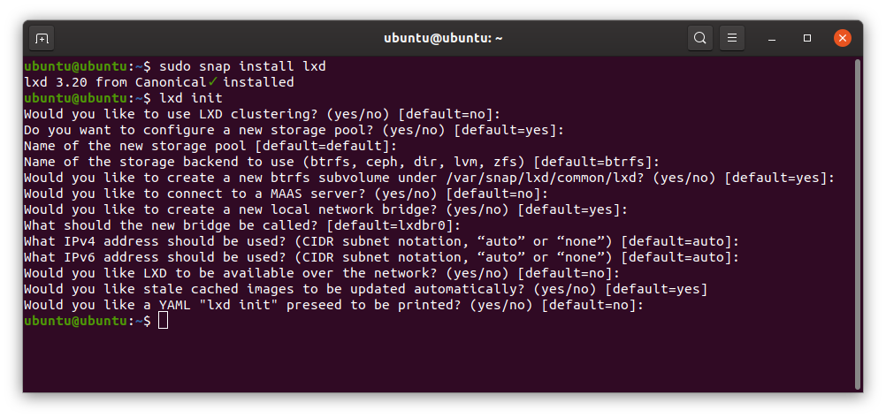
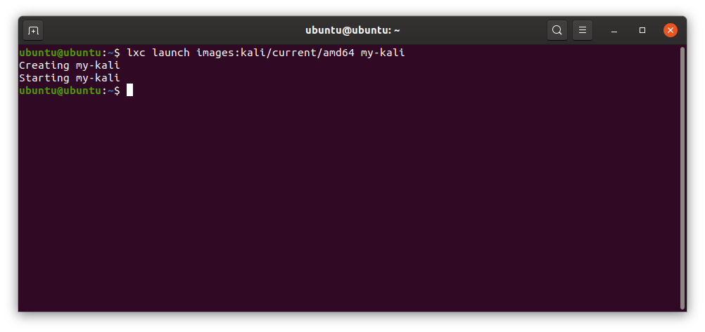
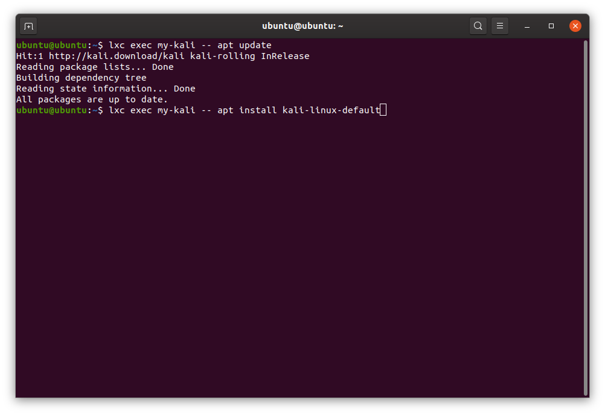
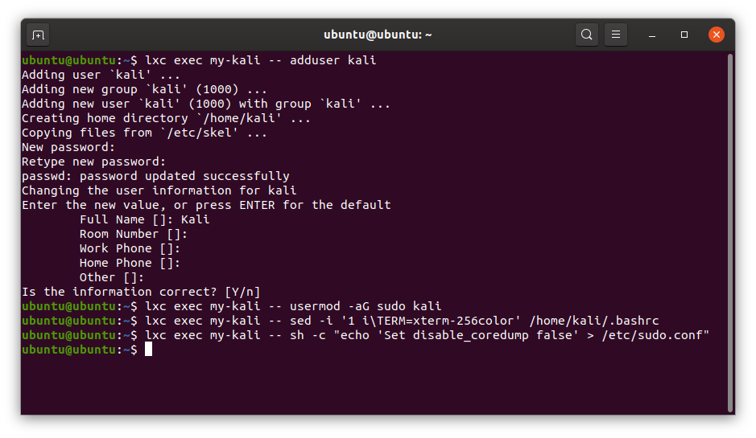
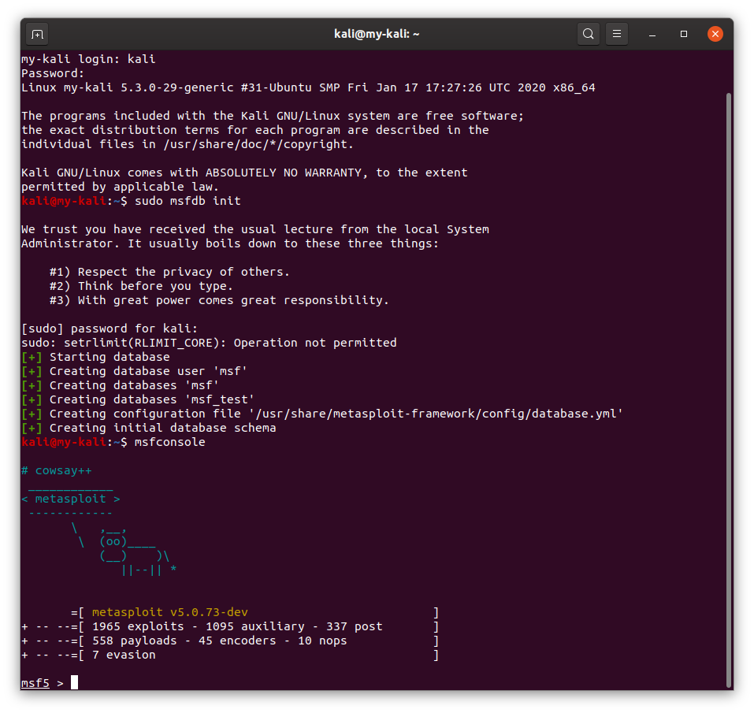
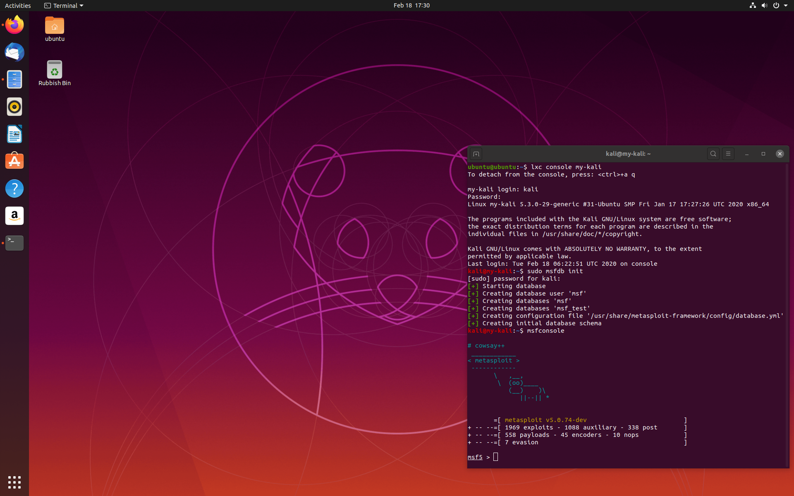

## 목차:

- [개요](#개요)
- [Ubuntu 호스트에서 명령줄 Kali LXD 컨테이너](#Ubuntu-호스트에서-명령줄-Kali-LXD-컨테이너)
- [Ubuntu 호스트에서 GUI Kali LXD 컨테이너](#Ubuntu-호스트에서-GUI-Kali-LXD-컨테이너)
- [Kali 호스트에서 권한 있는 Kali LXC 컨테이너](#Kali-호스트에서-권한-있는-Kali-LXC-컨테이너)
- [Kali 호스트에서 권한 없는 Kali LXC 컨테이너](#Kali-호스트에서-권한-없는-Kali-LXC-컨테이너)
- [참고 자료](#참고자료)

---

## 개요

**칼리 리눅스 컨테이너는 다음 용도에 이상적인 솔루션입니다**


- **다른 Linux 배포판 내에서 칼리 리눅스 실행**
- 개발 또는 테스트 활동을 위한 격리된 환경 제공

**가상 머신의 오버헤드 없이, Docker는 애플리케이션에 선호되는 솔루션인 반면, LXC/LXD는 전체 시스템에 선호됩니다**.

리눅스 컨테이너는 소프트웨어 개발이나 테스트에 매우 유용한 스냅샷 및 프리징과 같은 기능을 제공합니다.

칼리 이미지는 [LXC 및 LXD용 이미지 서버](https://images.linuxcontainers.org/)([amd64](https://images.linuxcontainers.org/images/kali/current/amd64/) 및 [arm64](https://images.linuxcontainers.org/images/kali/current/arm64/))에서 제공되며, "images:" 이미지 서버를 사용하는 LXD나 "lxc-download" 템플릿을 사용하는 LXC에서 쉽게 실행할 수 있습니다.

LXC는 Linux kernel containment 기능을 위한 사용자 공간 인터페이스입니다. 강력한 API와 간단한 도구를 통해 Linux 사용자가 시스템이나 애플리케이션 컨테이너를 쉽게 생성하고 관리할 수 있게 해줍니다.

LXD는 차세대 시스템 컨테이너 관리자입니다. 가상 머신과 유사한 사용자 경험을 제공하지만 대신 Linux 컨테이너를 사용합니다. 이것은 다양한 Linux 배포판에서 사용할 수 있는 사전 제작된 이미지를 기반으로 하며, 매우 강력하면서도 꽤 간단한 REST API를 중심으로 구축되었습니다.

<u>LXD vs LXC:</u>

LXD는 둘 중 더 편리하지만 Ubuntu나 다른 배포판(칼리 등)에서는 스냅 패키지로만 사용할 수 있습니다.

LXC는 더 많은 배포판에서 사용 가능하며 기본적으로 지원되고 snapd 실행이 필요하지 않기 때문에 칼리에서 선호됩니다.

---

### Ubuntu 호스트에서 명령줄 칼리 LXD 컨테이너

우분투에 칼리 리눅스 컨테이너를 설치하는 것은 몇 가지 단계만 필요합니다:

1. LXD 설치
2. 칼리 컨테이너 실행
3. 컨테이너 내 추가 패키지 설치
4. 비루트 사용자 생성
5. 로그인

---

1 - snap을 통해 lxd를 설치하고 초기 설정을 수행합니다:

```console
kali@kali:~$ sudo snap install lxd
kali@kali:~$ lxd init
```


2 - 다음 명령으로 첫 번째 칼리 리눅스 컨테이너를 실행합니다:

```console
kali@kali:~$ lxc launch images:kali/current/amd64 my-kali
```


3 - 다음을 통해 컨테이너 내부에 추가 패키지를 설치합니다:

```console
kali@kali:~$ lxc exec my-kali -- apt update
kali@kali:~$ lxc exec my-kali -- apt install -y kali-linux-default kali-desktop-xfce
```


4 - 비루트 사용자를 생성합니다 - 이 예제에서는 "kali"를 생성합니다:

```console
kali@kali:~$ lxc exec my-kali -- adduser kali
kali@kali:~$ lxc exec my-kali -- usermod -aG sudo kali
kali@kali:~$ lxc exec my-kali -- sed -i '1 i\TERM=xterm-256color' /home/kali/.bashrc
kali@kali:~$ lxc exec my-kali -- sh -c "echo 'Set disable_coredump false' > /etc/sudo.conf"
```


5 - "kali" 사용자로 새 컨테이너에 로그인합니다:

```console
kali@kali:~$ lxc console my-kali
```





완료되었습니다!

##### 컨테이너 관리:

- 시작: `lxc start my-kali`
- 중지: `lxc stop my-kali`
- 제거: `lxc destroy my-kali`

---

### Ubuntu 호스트에서 GUI Kali LXD 컨테이너

GUI 애플리케이션을 실행하기 위한 칼리 컨테이너 설치는 몇 가지 추가 단계가 있는 이전 예제와 유사합니다:

1. LXD 설치
2. GUI 프로필 생성 및 칼리 GUI 컨테이너 실행
3. 컨테이너 내 추가 패키지 설치
4. 비루트 사용자 생성
5. 칼리 Xfce 패널 시작
6. 칼리 Xfce 패널 사용자 정의

---

1 - snap을 통해 lxd를 설치하고 초기 설정을 수행합니다(아직 수행하지 않은 경우):

```console
kali@kali:~$ sudo snap install lxd
kali@kali:~$ lxd init
```

2 - 다음 명령으로 첫 번째 칼리 리눅스 컨테이너를 실행합니다:

```console
kali@kali:~$ wget https://blog.simos.info/wp-content/uploads/2018/06/lxdguiprofile.txt
kali@kali:~$ lxc profile create gui
kali@kali:~$ cat lxdguiprofile.txt | lxc profile edit gui
kali@kali:~$ lxc profile list
kali@kali:~$ lxc launch --profile default --profile gui images:kali/current/amd64    gui-kali
```

3 - 다음을 통해 컨테이너 내부에 추가 패키지를 설치합니다:

```console
kali@kali:~$ lxc exec gui-kali -- apt update
kali@kali:~$ lxc exec gui-kali -- apt install -y kali-linux-default
kali@kali:~$ lxc exec gui-kali -- apt install -y kali-desktop-xfce
```

4 - 비루트 사용자를 생성합니다 - 이 예제에서는 "kali":

```console
kali@kali:~$ lxc exec gui-kali -- adduser kali
kali@kali:~$ lxc exec gui-kali -- usermod -aG sudo kali
kali@kali:~$ lxc exec gui-kali -- sed -i '1 i\TERM=xterm-256color' /home/kali/.bashrc
kali@kali:~$ lxc exec gui-kali -- echo "export DISPLAY=:0" >> /home/kali/.bashrc
kali@kali:~$ lxc exec gui-kali -- sh -c "echo 'Set disable_coredump false' > /etc/sudo.conf"
```

5 - KALI 및 ROOT 사용자를 위한 컨테이너 내 오디오 수정:

```console
kali@kali:~$ lxc exec my-kali -- sh -c "echo 'export PULSE_SERVER=unix:/tmp/.pulse-native' | tee --append /root/.profile"
kali@kali:~$ lxc exec my-kali -- sh -c "echo 'export PULSE_SERVER=unix:/tmp/.pulse-native' | tee --append /home/kali/.profile"
kali@kali:~$ lxc exec my-kali -- sh -c "echo 'default-server = unix:/tmp/.pulse-native' | tee --append /etc/pulse/client.conf"
kali@kali:~$ lxc restart my-kali
```

6 - 다음을 통해 칼리 Xfce 패널 시작:

```console
kali@kali:~$ lxc exec gui-kali -- sudo -u kali xfce4-panel
```

원하는 대로 패널을 사용자 정의하세요.

##### 컨테이너 관리:

- 시작: `lxc start gui-kali`
- 중지: `lxc stop gui-kali`
- 제거: `lxc destroy gui-kali`

---

### 칼리 호스트에서 권한 있는 칼리 LXC 컨테이너

권한 있는 컨테이너는 루트에 의해 생성되고 루트로 실행되는 컨테이너입니다. 권한 없는 컨테이너보다 설정이 더 빠르지만 본질적으로 안전하지 않습니다. 칼리 호스트에 권한 있는 칼리 리눅스 컨테이너를 설치하려면 다음만 필요합니다:

1. lxc 설치 및 설정
2. 이미지 서버에서 칼리 이미지 다운로드
3. 컨테이너 시작
4. 컨테이너에 연결

---

1 - lxc를 설치하고 네트워크를 설정합니다:

```console
kali@kali:~$ sudo apt install -y lxc libvirt0 libpam-cgfs bridge-utils libvirt-clients libvirt-daemon-system iptables ebtables dnsmasq-base
kali@kali:~$
kali@kali:~$ sudo cat <<EOF > /etc/lxc/default.conf
lxc.net.0.type = veth
lxc.net.0.link = virbr0
lxc.net.0.flags = up
lxc.apparmor.profile = generated
lxc.apparmor.allow_nesting = 1
EOF
kali@kali:~$
kali@kali:~$ sudo virsh net-start default
kali@kali:~$ sudo virsh net-autostart default
```

2 - 다음을 통해 이미지 서버에서 칼리 리눅스 이미지를 다운로드합니다:

```console
kali@kali:~$ lxc-create -t download -n my-kali
```

이것은 사용 가능한 모든 이미지를 나열합니다.

메시지가 표시되면 다음을 입력하세요:

- Distribution: _kali_
- Release: _current_
- Architecture: _amd64_ (또는 필요에 따라 다른 아키텍처)

3 - 다음으로 컨테이너를 시작합니다:

```console
kali@kali:~$ sudo lxc-start -n my-kali -d
```

4 - 다음을 통해 컨테이너에 연결합니다:

```console
kali@kali:~$ sudo lxc-attach -n my-kali
```

이제 완료되었습니다. 다음으로 루트 비밀번호를 설정하고 "kali-linux-default" 메타패키지를 설치해야 합니다.

##### 컨테이너 관리:

- 시작: `sudo lxc-start -n my-kali -d`
- 중지: `sudo lxc-stop -n my-kali`
- 목록: `sudo lxc-ls -f`
- 정보: `sudo lxc-info -n my-kali`
- 제거: `sudo lxc-destroy -n my-kali`

---

### 칼리 호스트에서 권한 없는 칼리 LXC 컨테이너

권한 없는 컨테이너는 사용자 컨텍스트에서 실행되며 더 안전한 것으로 간주되어 권한 있는 컨테이너보다 선호됩니다. 설정이 약간 더 복잡합니다:

1. lxc 설치 및 설정
2. 권한 없는 컨테이너를 위한 LXC 설정
3. 이미지 서버에서 칼리 이미지 다운로드
4. 컨테이너 시작
5. 추가 패키지 설치
6. 비루트 사용자 생성
7. 로그인

---

1 - lxc 설치(필요한 경우):

```console
kali@kali:~$ sudo apt install -y lxc libvirt0 libpam-cgfs bridge-utils libvirt-clients libvirt-daemon-system iptables ebtables dnsmasq-base
```

2 - 권한 없는 컨테이너를 위한 LXC 설정

```console
kali@kali:~$ echo "$USER veth virbr0 10" | sudo tee -i /etc/lxc/lxc-usernet
kali@kali:~$ sudo sh -c 'echo "kernel.unprivileged_userns_clone=1" > /etc/sysctl.d/80-lxc-userns.conf'
kali@kali:~$ sudo sysctl kernel.unprivileged_userns_clone=1
kali@kali:~$ sudo chmod u+s /usr/libexec/lxc/lxc-user-nic
kali@kali:~$
kali@kali:~$ mkdir -p ~/.config/lxc
kali@kali:~$ cp /etc/lxc/default.conf ~/.config/lxc/default.conf
kali@kali:~$ sed -i 's/lxc.apparmor.profile = generated/lxc.apparmor.profile = unconfined/g' ~/.config/lxc/default.conf
```

다음으로 `/etc/subuid` 및 `/etc/subgid`에 나열된 것과 일치하는 subuid 및 subgid가 있는 두 줄을 `~/.config/lxc/default.conf`에 추가해야 합니다. 먼저 `cat /etc/s*i d grep $USER`를 통해 ID를 확인합니다. 결과는 다음과 같아야 합니다:

```plaintext
kali:100000:65536
kali:100000:65536
```

다음 명령에서 ID를 이전 출력의 ID로 대체하세요:

```console
kali@kali:~$ echo lxc.idmap = u 0 100000 65536 >> ~/.config/lxc/default.conf
kali@kali:~$ echo lxc.idmap = g 0 100000 65536 >> ~/.config/lxc/default.conf
```

3 - 다음을 통해 이미지 서버에서 칼리 리눅스 이미지를 다운로드합니다:

```console
kali@kali:~$ lxc-create -t download -n my-kali
```

이것은 사용 가능한 모든 이미지를 나열합니다.

메시지가 표시되면 다음을 입력하세요:

- Distribution: _kali_
- Release: _current_
- Architecture: _amd64_ (또는 필요에 따라 다른 아키텍처)

4 - 다음으로 컨테이너를 시작합니다:

```console
kali@kali:~$ lxc-start -n my-kali -d
```

하지만 로그인하기 전에 몇 가지 설치 후 설정 작업을 수행합니다

5 - 기본 패키지 설치:

```console
kali@kali:~$ lxc-attach -n my-kali apt update
kali@kali:~$ lxc-attach -n my-kali apt install -y kali-linux-default
```

6 - 비루트 사용자 생성:

```console
kali@kali:~$ lxc-attach -n my-kali --clear-env adduser <username>
kali@kali:~$ lxc-attach -n my-kali --clear-env adduser <username> sudo
```

7 - 다음을 통해 비루트 사용자로 로그인:

```console
kali@kali:~$ lxc-console
```

그리고 콘솔에서 색상을 얻기 위해 초기 로그인 시 다음을 수행합니다:

```console
kali@kali:~$ sed -i '1 i\TERM=xterm-256color' ~/.bashrc
kali@kali:~$ . ~/.bashrc
```

##### 컨테이너 관리:

- 시작: `sudo lxc-start -n my-kali -d`
- 중지: `sudo lxc-stop -n my-kali`
- 목록: `sudo lxc-ls -f`
- 정보: `sudo lxc-info -n my-kali`
- 제거: `sudo lxc-destroy -n my-kali`

---

## 참고 자료:

- [리눅스 컨테이너](https://linuxcontainers.org/)
- [우분투 데스크탑에에서 LXD 컨테이너의 GUI 앱을 실행하는 방법](https://blog.simos.info/how-to-easily-run-graphics-accelerated-gui-apps-in-lxd-containers-on-your-ubuntu-desktop/)
