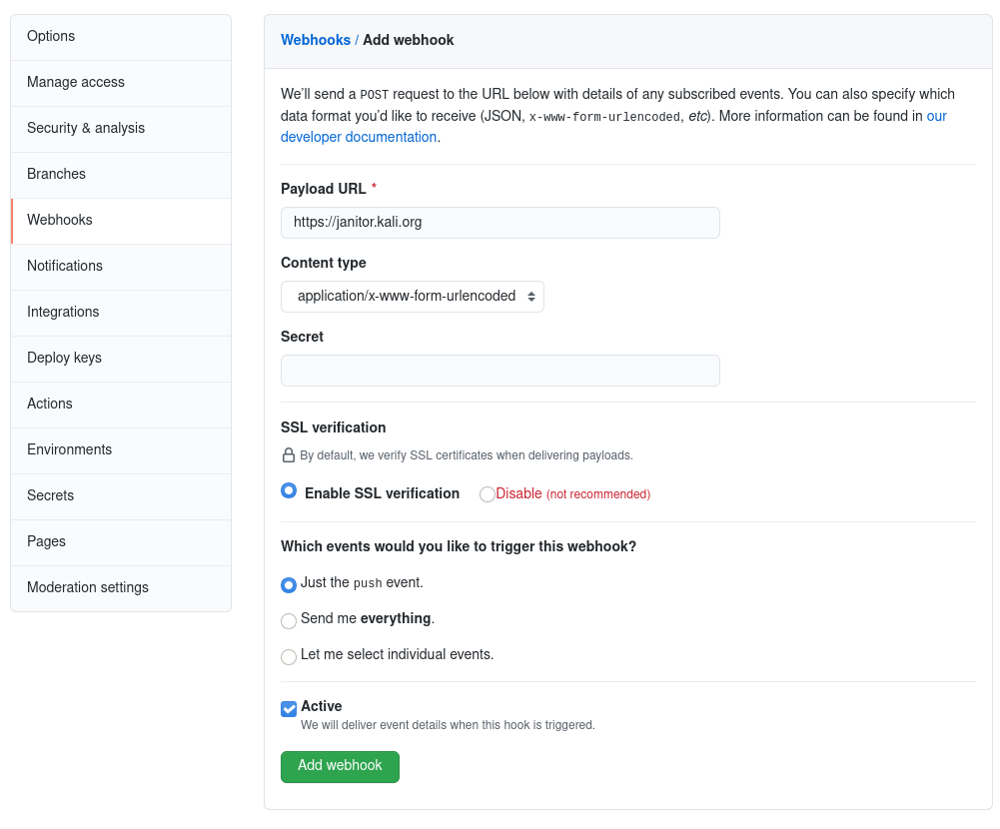

칼리는 점점 더 많은 보안 도구 패키지를 유지 관리하는 데 도움이 되는 자동화 구축에 많은 노력을 기울이고 있어요. 이 글에서는 칼리 봇이 무엇인지, 어떻게 작동하는지, 그리고 칼리 봇이 제대로 작업할 수 있도록 주의해야 할 몇 가지 점을 소개해요.

## 소개

### 칼리 봇이란?

칼리 봇은 실제로 Jelmer Vernooij가 개발한 [Debian Janitor Bot](https://salsa.debian.org/jelmer/debian-janitor/)의 인스턴스예요. 우리의 인스턴스는 [janitor.kali.org](https://janitor.kali.org/)에서 실행되며 [kali-bot](https://gitlab.com/kali-bot) GitLab 계정을 제어하여 변경 사항을 푸시하고 패키징 저장소에 [병합 요청](https://gitlab.com/groups/kalilinux/packages/-/merge_requests)을 제출할 수 있어요.

### 무엇을 할 수 있나요?

많은 기능이 있지만 현재 세 가지를 사용하고 있어요:

1. 패키징 git 저장소에 작은 수정/개선사항을 푸시할 수 있어요. 이것이 [lintian-fixes](https://janitor.kali.org/lintian-fixes/) 작업이에요;
2. [kali-experimental](/docs/general-use/kali-branches/) 저장소에서 새로운 업스트림 릴리스를 자동으로 패키징하고 git 저장소에서 해당 병합 요청을 제안할 수 있어요. 이것이 [fresh-releases](https://janitor.kali.org/fresh-releases/) 작업이에요;
3. 업스트림 개발자가 git 저장소에 변경 사항을 푸시할 때마다 [kali-bleeding-edge](/docs/general-use/kali-bleeding-edge/)에서 git 스냅샷을 자동으로 패키징할 수 있어요. 이것이 [fresh-snapshots](https://janitor.kali.org/fresh-snapshots/) 작업이에요.

## 업스트림 개발자를 위한 정보

친애하는 인포섹 개발자 여러분, 칼리는 여러분 소프트웨어 사용자에게 최고의 경험을 제공하고자 하며, 이를 위해 (칼리 봇의 도움으로) 최신 버전을 제공하기 위해 노력하고 있어요!

### 권장사항

아래 권장사항을 따르면 칼리 봇이 여러분의 릴리스(및 git 스냅샷)에서 작동하는 패키지를 준비할 수 있는 가능성을 최대화해요.

* 공개 git 저장소에서 소프트웨어를 유지하세요. 당연해 보이지만 여전히 tarball로만 릴리스되는 소프트웨어가 있어요.

* 릴리스를 위한 git 태그를 생성하고 푸시하세요. 우리는 [uscan](https://manpages.debian.org/uscan)이라는 도구로 새로운 업스트림 릴리스를 모니터링해요. 이 도구는 패키징 저장소의 `debian/watch`에 제공된 지침을 따라요. 해당 파일은 일반적으로 git 호스팅의 "tags" 또는 "releases" 페이지를 가리키며, uscan이 HTML을 파싱하여 최신 릴리스 tarball의 URL을 찾아내요.

* git 스냅샷과 크게 다른 릴리스 tarball을 빌드하지 마세요. 이상적으로는 패키징 규칙이 릴리스 tarball과 `git archive`로 생성된 것 모두에 적용될 수 있어야 해요.

* (빌드할 것이 없더라도) 항상 일부 빌드 시스템을 제공하여 소프트웨어를 시스템 전체 방식으로 설치하는 지침을 제어하세요. 그렇지 않으면 설치 지침이 칼리 패키지에 인코딩되고 자동화된 패키지 업데이트가 최신 버전에 이전 지침을 적용하려고 시도할 것이며, 중요한 변경사항을 만들었다면 작동하지 않을 수 있어요.

  빌드 시스템은 비표준 위치에 파일을 설치하는 방법을 제공해야 한다는 점을 유의하세요. Makefile을 사용하면 패키지 빌드는 일반적으로 `make install DESTDIR=$(pwd)/debian/tmp`를 호출하여 루트 파일 시스템을 방해하지 않고 `.deb` 파일로 패킹되는 임시 디렉토리에 파일을 설치해요(그렇게 하면 필요한 권한이 없어서 빌드가 실패할 거예요). 간단한 Makefile의 예시로 [dnsenum](https://salsa.debian.org/pkg-security-team/dnsenum)을 참조하세요.

### kali-bleeding-edge에서 적시 업데이트 받는 방법

칼리 봇은 모니터링해야 할 패키지가 많아서 git 저장소에 변경사항을 푸시했다는 것을 알아차리는 데 시간이 걸릴 수 있어요. 봇이 즉시 저장소를 확인하기를 원한다면 푸시 이벤트를 `https://janitor.kali.org/`에 알리는 웹훅을 구성하세요.

GitHub의 경우 "Settings" 탭의 "Webhooks" 섹션에서 할 수 있어요. 아래와 같이 양식을 작성하고 "Add webhook"을 클릭하세요:

이덕분에 버그를 신고한 사용자들을 [kali-bleeding-edge 문서](/docs/general-use/kali-bleeding-edge/)로 안내하고 kali-bleeding-edge에서 사용 가능한 패키지에서 문제가 실제로 해결되었는지 확인해달라고 요청할 수 있어요.

{}
웹훅을 설정했는데 kali-bleeding-edge 저장소에서 업데이트된 패키지가 보이지 않는다면, 이 페이지의 나머지 부분을 읽어서 무엇이 잘못되었는지 알아볼 수 있어요. 막히면 언제든지 [devel@kali.org](mailto:devel@kali.org)로 연락해주시면 최선을 다해 해결해드릴게요.
{}

## 칼리 개발자를 위한 정보

칼리 봇은 아직 상대적으로 젊고 실행하는 다양한 작업에서 잘못될 수 있는 것들이 많아요. 이 섹션에서는 봇이 예상한 작업을 하지 않은 이유를 이해하기 위해 어디를 확인할 수 있는지 보여주려고 해요.

### 웹 인터페이스 알아보기

[기본 웹 인터페이스](https://janitor.kali.org/)는 각 패키지에서 각 작업의 최신 실행 결과를 보여주고 결과와 빌드 결과에 접근하는 방법에 대한 사실적 정보를 제공해요.

cupboard라고 불리는 [다른 웹 인터페이스](https://janitor.kali.org/cupboard/)도 있는데, 백엔드에서 무슨 일이 일어나고 있는지에 대한 더 많은 정보(및 제어)를 제공해요. 예정된 작업의 큐, 최근 실행된 작업의 기록, 게시를 기다리고 있는 작업 결과, 게시 전 인간 승인을 기다리는 작업 등을 볼 수 있어요.

다양한 페이지에서 다른 버튼으로 칼리 봇에 지시를 보낼 수 있는 가능성을 제공해요. 하지만 버튼을 클릭하는 것은 gitlab.com 계정으로 연결되어 있고 [kalilinux/packages](https://gitlab.com/groups/kalilinux/packages/-/group_members) 그룹의 멤버인 경우에만 효과가 있어요.

### 칼리 봇의 워크플로우 이해하기

모든 가능한 패키지에서 모든 가능한 작업을 정기적으로 트리거하는 스케줄러가 있어요(허용된 조합은 publish-policy.json 파일에 정의되어 있으며, 이 파일은 칼리 개발자만 접근할 수 있어요). [결과 큐](https://janitor.kali.org/cupboard/queue)를 볼 수 있어요.

그다음 모든 작업을 실행하는 워커가 있어요. 작업은 보통 패키징 git 저장소에서 일부 변경을 자동화하는 도구인 `debian-svp`(`silver-platter` 내의 명령어) 실행이에요.

변경이 완료되면 봇은 추가된 변경으로 패키지를 다시 빌드하고, 패키지가 여전히 빌드되는지 확인하고, 생성된 패키지를 수정되지 않은 패키지의 빌드 결과와 비교해요.

이 단계에서 패키지가 성공적으로 빌드되면 변경이 "준비됨"으로 간주되고 대상 저장소에 병합되거나 더 이상 사용되지 않을 때까지 [해당 웹페이지](https://janitor.kali.org/cupboard/ready)에 나타나요.

빌드가 완료되면 변경사항이 게시할 큐에 들어가요. 보통 곧 일어나지만 속도 제한으로 인해 지연될 수 있어요(봇은 실수가 너무 많은 저장소에 영향을 미치기 전에 발견될 수 있도록, 그리고 개발자가 즉시 압도되지 않도록 느린 속도로 결과를 게시해요). 해당 작업 페이지의 "Publish now" 버튼으로 이러한 제한을 피할 수 있어요.

### lintian-fixes에 대해 알아야 할 것들

이 작업은 재현하기 쉽고 실패할 가능성이 낮아요. 패키징 git 저장소 내에서 [lintian-brush](https://salsa.debian.org/jelmer/lintian-brush) 도구를 실행하는 것뿐이에요.

도구가 무언가를 수정할 수 없을 때는 실패하지 않고 아무것도 하지 않아요. 또한 기본 구성에서는 명백하게 올바른 단일 수정이 있을 때만 무언가를 수정해요. 관리자 대신 의견이 분분한 선택을 하지 않을 거예요.

칼리 맥락에서 이 작업은 `gbp dch`로 독립적인 커밋에서 `debian/changelog`를 업데이트하고 있다는 것을 감지하므로 `debian/changelog`에 작업을 문서화하지 않아야 해요. 최근 기록이 각 변경과 함께 변경로그를 업데이트했다면 봇이 따라할 거예요(`--no-update-changelog` 명령줄 옵션으로 수동 실행에서 이 동작을 비활성화할 수 있어요).

칼리에서 구성된 게시 정책은 봇이 이러한 변경사항을 패키징 git 저장소에 직접 푸시하도록 해요(즉, 병합 요청을 제출하지 않을 거예요).

### fresh-releases에 대해 알아야 할 것들

이 작업은 `uscan`을 실행하여 git 패키징 저장소에 아직 없는 소프트웨어의 새로운 업스트림 버전이 있는지 확인해요. 새로운 버전을 찾으면 `gbp import-orig`로 가져오고 `gbp dch`로 변경로그를 업데이트해요.

적절한 `deb-src` 라인이 APT의 sources.list에 있는 kali-rolling 시스템에서 `debian-svp new-upstream --debian-revision=0kali1 --require-uscan --refresh-patches --dry-run --skip-empty --diff <package>`를 실행하여 이 모든 것을 로컬에서 재현할 수 있어요(`silver-platter`가 설치된 상태에서).

칼리에서 구성된 게시 정책은 봇이 `upstream`과 `pristine-tar` 브랜치의 업데이트를 직접 푸시하도록 하지만, `kali/master` 브랜치의 변경사항은 병합 요청으로 제안될 거예요. 동시에 결과 패키지도 `kali-experimental`에 업로드될 거예요.

현재의 주요 단점은 현재 패키징으로 빌드되지 않는 새로운 업스트림 릴리스가 있으면 봇이 아무것도 하지 않는다는 거예요(패키징 규칙을 업데이트해야 하기 때문에). 이 상황을 개선하는 방법은 [이 티켓](https://github.com/jelmer/janitor/issues/93)에서 추적되고 있어요.

### fresh-snapshots에 대해 알아야 할 것들

이 작업은 최신 업스트림 git 커밋을 기반으로 업데이트된 패키지를 빌드하려고 시도해요. 이를 달성하기 위해 먼저 `debian/control`의 `Homepage` 필드와/또는 `debian/upstream/metadata`의 `Repository` 필드를 확인하여 업스트림 git 저장소를 식별하려고 해요.

이 저장소를 찾으면 `git archive`로 업데이트된 업스트림 tarball을 생성해요. 해당 tarball에 주어진 버전은 `<ver>+git<date>.<n>.<commit>` 형태로 보일 거예요. 여기서 `<ver>`는 최신 업스트림 버전, `<date>`는 마지막 커밋의 날짜, `<n>`은 같은 날에 여러 업데이트가 있는 경우 숫자 증가분, `<commit>`은 정확히 어떤 커밋이 패키징되었는지 알 수 있는 짧은 커밋 식별자예요.

그다음 새로운 업스트림 tarball을 `gbp import-orig`하고 `gbp dch`로 변경로그를 업데이트해요.

`debian-svp new-upstream --snapshot --dry-run --diff <package>`를 실행하여 이 모든 것을 로컬에서 재현할 수 있어요.

칼리에서 구성된 게시 정책은 결과 패키지를 `kali-bleeding-edge`에 업로드할 뿐이에요. git 저장소 변경사항은 현재 어디에도 푸시되지 않아요([janitor.kali.org/git/](https://janitor.kali.org/git/)에서 접근할 수 있는 봇 자체의 git 저장소 제외).

### 그렇다면 칼리 봇이 왜 작업을 하지 않았을까요?

* 변경사항을 빌드했지만 속도 제한으로 인해 작업이 아직 게시되지 않았을 수도 있어요. [게시 준비가 된](https://janitor.kali.org/cupboard/ready) 변경사항 목록을 확인해보세요.
* 실패했을 수도 있어요. 관심 있는 패키지의 작업 로그를 확인해보세요. `/cupboard/pkg/<package>` URL이 시작점이어야 해요(예: [amass](https://janitor.kali.org/cupboard/pkg/amass/)). 그다음 최근 실행을 확인하고 관심 있는 작업의 최신 실행을 찾으세요.
* 이상하거나 이해되지 않거나 잘못 보이는 것을 발견하면 언제든지 [devel@kali.org](mailto:devel@kali.org)에 신고하거나 봇의 일반적인 문제라고 생각되면 [직접 janitor 관리자에게](https://github.com/jelmer/janitor/issues/new) 신고하세요.

## 특별한 감사

먼저 Janitor Bot을 작성한 [Jelmer Vernooij](https://www.jelmer.uk/)에게 큰 박수를 보내고 싶어요. 그는 우리의 요구에 맞게 봇을 커스터마이징하고 [우리가 신고한](https://salsa.debian.org/jelmer/debian-janitor/-/issues?label_name%5B%5D=kali) 수많은 문제를 해결하기 위해 우리와 함께 매우 열심히 작업했어요.
