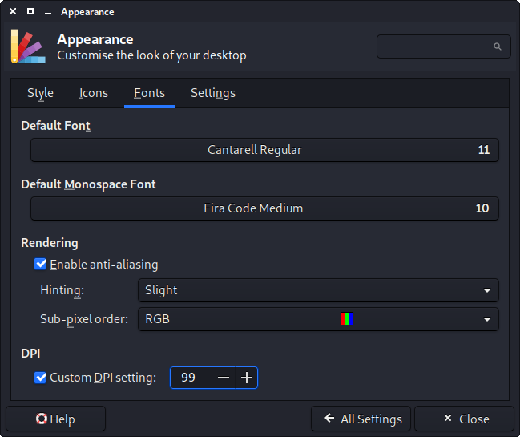

Kali Linux를 시작할 때 특정 요소들이 예상보다 크게 보일 수 있어요. 이는 **DPI** (**Dots Per Inch**) / **PPI** (**Pixels Per Inch**)가 올바르지 않기 때문일 수 있어요. 만약 요소들이 예상보다 작게 보인다면 [HiDPI 가이드](/docs/general-use/hidpi/)를 참고해 보세요.

이런 현상은 그래픽 카드 드라이버나 모니터 프로필 문제 등 다양한 이유로 발생할 수 있어요.

이 가이드는 단일 화면 설정에 대해 다룰 거예요. **다중 디스플레이 출력을 테스트할 하드웨어가 없어서 관련 가이드를 작성할 수 없어요. 따라서 [커뮤니티 기여](/docs/community/contribute/)를 찾고 있어요. 하드웨어와 전문 지식이 있으시다면, [이 가이드를 수정](https://gitlab.com/kalilinux/documentation/kali-docs/edit/master/general-use/hidpi/index.md)해 주세요!**

- - -

## 문제

일부 애플리케이션을 열면 아래 예시처럼 글꼴이 예상보다 크게 나타날 수 있어요. 여기서 왼쪽은 **Qt**(`QTerminal`)를 사용하는 터미널이고 오른쪽은 **GTK**(`xfce4-terminal`)를 사용하는 터미널이에요.


**Qt**가 너무 크기 때문에 조정이 필요해요. 먼저 어떤 값으로 변경할지 찾은 다음 변경사항을 적용해야 해요.

## 문제 위치 찾기

먼저 [xrdb](https://packages.debian.org/buster/x11-xserver-utils)를 사용해서 X 서버의 데이터베이스 _(X는 그래픽 디스플레이 출력을 담당하는 시스템이에요)_ 에서 어떤 값들이 있는지 확인해요:

```console
kali@kali:~$ xrdb -q
*customization:	-color
Xft.antialias:	1
Xft.hinting:	1
Xft.hintstyle:	hintslight
Xft.rgba:	rgb
Xcursor.theme_core:	1
kali@kali:~$
```

DPI가 미리 정의된 흔적이 보이지 않아요. 다음 도구로 넘어가 봐요.

[xdpyinfo](https://manpages.debian.org/buster/x11-utils/xdpyinfo.1.en.html)를 사용하면 현재 사용 중인 X에 대한 디스플레이 정보를 볼 수 있어요 _(다양한 시점에서 동적으로 정의되는 값들이에요. 예: 시작 시, 새 화면 연결 시 등)_:

```console
kali@kali:~$ xdpyinfo | grep 'dimensions\|resolution'
  dimensions:    1680x1050 pixels (160x90 millimeters)
  resolution:    267x296 dots per inch
kali@kali:~$
```

값이 한 번만 반환되었다는 건 모니터가 하나만 있다는 의미예요. 좋아요! 그런데 좋지 않은 점은 감지된 물리적 화면 크기가 `160x90mm`라는 거예요. 이것이 글꼴이 매우 크게 보이는 이유를 설명해 주고 있어요(DPI가 매우 크기 때문). 또한 **화면 해상도**가 `1680 x 1050`이고 DPI는 `~267`인 것을 확인할 수 있어요.

다음으로 [xrandr](https://packages.debian.org/buster/x11-xserver-utils)를 사용해서 **extension RandR** _(크기 조정 및 회전)_ 가 보고하는 내용이 일치하는지 확인해 봐요:

```console
kali@kali:~$ xrandr -q | grep -iw 'screen\|connected'
Screen 0: minimum 8 x 8, current 1680 x 1050, maximum 32767 x 32767
HDMI-0 connected 1680x1050+0+0 (normal left inverted right x axis y axis) 160mm x 90mm
kali@kali:~$
```

역시 모니터가 하나군요. 또한 해상도도 `xdpyinfo`가 알려준 것과 일치해요. **HDMI** 케이블을 사용하고 있으며 해상도와 크기도 동일해요.

X의 로그를 확인해 봐요:

```console
kali@kali:~$ grep DPI /var/log/Xorg.0.log
[     7.324] (--) NVIDIA(0): DPI set to (266, 296); computed from "UseEdidDpi" X config
kali@kali:~$
```

이는 `xrandr`가 보고한 DPI 값과 매우 가까워요 _(1만큼 차이가 있어요)_. 해당 그래픽 드라이버가 **NVIDIA**이고, `EDID`에서 DPI 값을 가져오려고 하고 있어요 _(GPU가 모니터에서 데이터를 읽으려고 하는 거예요)_

원한다면 [edid-decode](https://manpages.debian.org/buster/edid-decode/edid-decode.1.en.html)를 사용하여 **EDID** 값을 확인할 수 있어요:

```console
kali@kali:~$ sudo apt install -y edid-decode
kali@kali:~$
kali@kali:~$ xrandr --props | edid-decode -c -s
EDID version: 1.3
[...]
Maximum image size: 16 cm x 9 cm
[...]
Warnings:

Block 0 (Base Block):
  Basic Display Parameters & Features: Dubious maximum image size (160x90 is smaller than 10x10 cm)

Failures:

All Blocks:
  One or more of the timings is out of range of the Monitor Ranges:
    Vertical Freq: 24 - 75 Hz (Monitor: 23 - 75 Hz)
    Horizontal Freq: 27.000 - 79.976 kHz (Monitor: 26.000 - 68.000 kHz)
    Maximum Clock: 148.500 MHz (Monitor: 150.000 MHz)

EDID conformity: FAIL
kali@kali:~$
```

**EDID 값이 잘못된 것 같아요**, 그러니 모니터의 정보를 믿지 말아야 해요! 수동으로 사용할 값을 정의해야 해요.

가장 쉬운 방법은 화면의 제조사/모델을 확인하는 거예요 _(장치 뒤나 아래에 스티커가 있나요?)_. 그렇지 않으면 줄자를 꺼내는 전통적인 방법을 사용할 수도 있어요.

## 왜 잘못되었나요?

OS가 우리 화면 크기를 어떻게 인식하고 있을까요?

약간의 수학을 사용해서 (`1cm`는 `10mm` & `25.4mm`는 `1 인치`), 밀리미터(mm)를 인치(in)로 변환할 수 있어요:

_출력 결과가 `dimensions: 1680x1050 pixels (160x90 millimeters)`였으니, "너비"는 `160`이고 "높이"는 `90`이에요_

```console
kali@kali:~$ echo 'print(160/25.4)' | python3
6.299212598425197   # 6.3 in
kali@kali:~$
kali@kali:~$ echo 'print(90/25.4)' | python3
3.543307086614173   # 3.5 in
kali@kali:~$
```

이제 `√(너비² + 높이²) = 대각선` 공식으로 화면 대각선 크기를 찾을 수 있어요:

```console
kali@kali:~$ echo 'print( ( ((160/25.4) ** 2)+((90/25.4) ** 2) ) ** (0.5) )' | python3
7.227385728616465  # 7.2 in
kali@kali:~$
```

화면 뒤의 스티커에는 **20인치**라고 적혀있는데, 실제로는 **7.2인치**만 감지됐어요!

## 올바른 값 찾기

`√(너비² + 높이²) / 대각선 = DPI` 공식을 사용하면:

_출력 결과가 `dimensions: 1680x1050 pixels (160x90 millimeters)`였으니, "너비"는 `1680`이고 "높이"는 `1050`, 그리고 올바른 대각선은 `20`이에요_

```console
kali@kali:~$ # e.g. (((width ** 2)+(height² ** 2) ) ** (0.5) ) / diagonal )
kali@kali:~$
kali@kali:~$ echo 'print( (((1680 ** 2)+(1050 ** 2) ) ** (0.5) ) / 20 )' | python3
99.05680188659434  # 99 DPI
kali@kali:~$
```

**따라서 DPI를 267x296이 아니라 `99x99`로 설정해야 해요**.

## 수정하기

여러 가지 수정 방법이 있으며, 각각 장단점이 있어요:

- `~/.Xresources` 편집 _(X 구성 **권장 방법**)_
- `~/.xsessionrc` 편집 _(X 시작 스크립트)_
- NVIDIA 드라이버 설정
- Xfce GUI 설정 _(데스크톱 환경 구성)_

#### Xresources

X를 (사용자별로) 구성할 수 있어요. 터미널 창에서 다음 명령어를 실행하세요:

```console
kali@kali:~$ echo "Xft.dpi: 99" >> ~/.Xresources
kali@kali:~$
kali@kali:~$ cat ~/.Xresources
Xft.dpi: 99
kali@kali:~$
kali@kali:~$ xrdb -merge ~/.Xresources
kali@kali:~$
```

`xrdb -merge`를 실행한 후에는 로그아웃이 필요하지 않아요. 문제가 있던 프로그램을 다시 열면 글꼴이 "정상"으로 보일 거예요.

#### xsessionrc

이것은 그래픽 로그인 시 자동으로 실행되는 셸 스크립트예요. 터미널 창에서 다음 명령어를 실행하세요:

```console
kali@kali:~$ echo "xrandr --dpi 99" >> ~/.xsessionrc
kali@kali:~$
kali@kali:~$ cat ~/.xsessionrc
xrandr --dpi 99
kali@kali:~$
kali@kali:~$ xfce4-session-logout --logout
kali@kali:~$
```

로그아웃했다가 다시 로그인한 후, 문제가 있던 프로그램을 열면 글꼴이 "정상"으로 보일 거예요.

#### NVIDIA 드라이버 설정

또 다른 방법은 NVIDIA 드라이버가 DPI를 처리하도록 하는 거예요.

X용 구성 파일이 없다면, 하나를 생성한 다음 이동시켜야 해요:

```console
kali@kali:~$ sudo apt install -y nvidia-xconfig
kali@kali:~$
kali@kali:~$ sudo nvidia-xconfig
kali@kali:~$
kali@kali:~$ sudo mv /etc/X11/xorg.conf /usr/share/X11/xorg.conf.d/20-nvidia.conf
kali@kali:~$
```

이제 구성 파일을 편집해서 `Section "Device"` 섹션에 다음 두 줄을 포함시킬 수 있어요:

- `Option "UseEdidDpi" "False"`
- `Option "DPI" "99 x 99"`

```console
kali@kali:~$ sudo vim /usr/share/X11/xorg.conf.d/20-nvidia.conf
kali@kali:~$
kali@kali:~$ cat /usr/share/X11/xorg.conf.d/20-nvidia.conf
[...]
Section "Device"
    Identifier     "Device0"
    Driver         "nvidia"
    VendorName     "NVIDIA Corporation"
    Option         "UseEdidDpi" "False"
    Option         "DPI" "99 x 99"
EndSection
[...]
kali@kali:~$
kali@kali:~$ xfce4-session-logout --logout
kali@kali:~$
```

로그아웃했다가 다시 로그인한 후, 문제가 있던 프로그램을 열면 글꼴이 "정상"으로 보일 거예요.

#### Xfce 설정

Xfce는 다음과 같이 구성할 수 있어요:

- Kali -> 설정 -> 모양새 -> 글꼴 -> DPI
  - 활성화: `사용자 정의 DPI 설정`
  - 값: `99`




{}
버그로 인해 `사용자 정의 DPI 설정`을 토글하거나 값을 증가/감소시킨 다음 이전 값으로 복원해야 할 수도 있어요.
{}

로그아웃이 필요하지 않으므로 문제가 있던 프로그램을 다시 열면 글꼴이 "정상"으로 보일 거예요.

- - -

## 참조

추가 읽을거리가 필요하다면 다음을 참조하세요:

- [http.download.nvidia.com/XFree86/Linux-x86/390.132/README/dpi.html](https://http.download.nvidia.com/XFree86/Linux-x86/390.132/README/dpi.html)
- [wiki.ubuntu.com/X/Troubleshooting/HugeFonts](https://wiki.ubuntu.com/X/Troubleshooting/HugeFonts)
- [wiki.archlinux.org/index.php/HiDPI](https://wiki.archlinux.org/index.php/HiDPI)
- [wiki.archlinux.org/index.php/Xrandr](https://wiki.archlinux.org/index.php/Xrandr)
