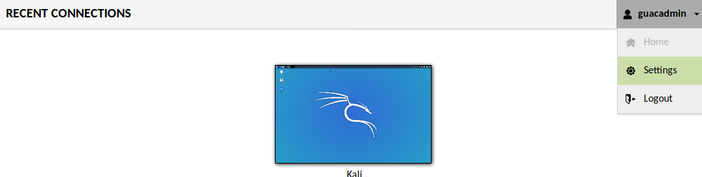
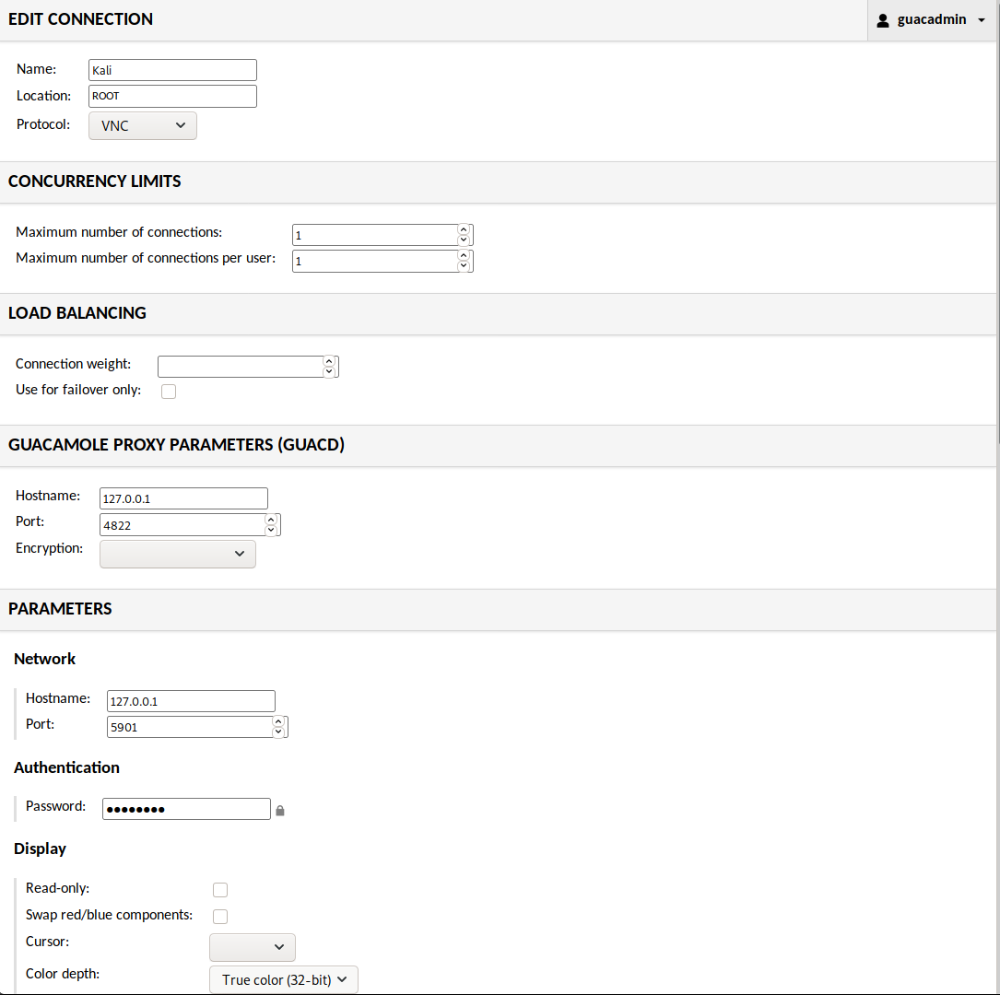

Kali와 상호작용하는 여러 방법이 있어요. 콘솔에 직접 앉아서 그래픽 환경을 사용하거나, SSH를 통해 원격으로 Kali를 사용할 수도 있어요(이 방법은 명령줄 액세스를 제공해요). 또는 VNC를 설정하여 원격 그래픽 액세스가 가능하게 할 수도 있어요(이 경우 로컬호스트에서만 VNC가 수신 대기하고 SSH를 통해 포트 포워딩을 하는 등 보안을 철저히 하세요). 또 다른 방법으로는 필요한 VNC 클라이언트를 설치하는 대신 브라우저에서 Kali와 상호작용할 수도 있어요.

이 가이드는 Apache Guacamole를 다루고 있지만, [noVNC](/docs/general-use/novnc-kali-in-browser/)에 대한 가이드도 있어요. 각각 장단점이 있어요. Guacamole는 더 완전한 솔루션으로, 여러 프로토콜을 지원하고 사용자 인증이 있는 중앙 페이지에서 클라이언트가 연결할 수 있어요.

Apache Guacamole은 [Debian에 패키지로 포함되어 있지 않으며](https://wiki.debian.org/Guacamole), 설정을 완료하기 위한 [여러 단계](https://guacamole.apache.org/doc/gug/installing-guacamole.html)가 있어요 (또는 [도커 이미지](https://guacamole.apache.org/doc/gug/guacamole-docker.html)를 사용할 수도 있어요). 설치 과정을 돕는 자동화 스크립트가 있어요.

첫 번째 단계는 스크립트를 다운로드하는 거예요:

```console
kali@kali:~$ sudo apt update
kali@kali:~$
kali@kali:~$ sudo apt install -y git
kali@kali:~$
kali@kali:~$ git clone https://github.com/MysticRyuujin/guac-install.git /tmp/guac-install
kali@kali:~$
```

{}
중요! 동부 표준시(Eastern time zone)에 있다면 다른 시간대로 변경해야 해요. Apache에는 EDT를 유효한 시간대로 인식하지 않는 버그가 있어요.
{}

이 문제를 해결하기 위해 시간대를 중부 표준시(Central time)로 변경할 거예요:

```console
kali@kali:~$ sudo rm /etc/localtime
kali@kali:~$
kali@kali:~$ sudo ln -s /usr/share/zoneinfo/US/Central /etc/localtime
```

별도의 MySQL 데이터베이스 호스트가 없고 MFA(다중 인증)도 사용하지 않는 "독립형(standalone)" 설치를 진행할 거예요 _(SSH 터널 뒤에 숨길 예정이기 때문에)_:

```console
kali@kali:~$ cd /tmp/guac-install/
kali@kali:/tmp/guac-install$ sudo ./guac-install.sh --nomfa --installmysql --mysqlpwd S3cur3Pa$$w0rd --guacpwd P@s$W0rD
[...]
Cleanup install files...

Installation Complete
- Visit: http://localhost:8080/guacamole/
- Default login (username/password): guacadmin/guacadmin
***Be sure to change the password***.

kali@kali:/tmp/guac-install$
```

모든 서비스가 정상적으로 동작하는지 빠르게 확인해보세요:

```console
kali@kali:/tmp/guac-install$ systemctl status tomcat9 guacd mysql
● tomcat9.service - Apache Tomcat 9 Web Application Server
     Loaded: loaded (/lib/systemd/system/tomcat9.service; enabled; vendor preset: disabled)
     Active: active (running) since Thu 2020-03-05 17:39:38 GMT; 1min 14s ago
       Docs: https://tomcat.apache.org/tomcat-9.0-doc/index.html
   Main PID: 33192 (java)
      Tasks: 47 (limit: 19107)
     Memory: 454.8M
     CGroup: /system.slice/tomcat9.service
             └─33192 /usr/lib/jvm/default-java/bin/java -Djava.util.logging.config.file=/var/lib/tomcat9/conf/logging.properties -Djava.util.logging.manager=org.apache.juli.ClassLoaderLogManager -Djava.a>

● guacd.service - LSB: Guacamole proxy daemon
     Loaded: loaded (/etc/init.d/guacd; generated)
     Active: active (running) since Thu 2020-03-05 14:04:34 GMT; 3h 36min ago
       Docs: man:systemd-sysv-generator(8)
      Tasks: 1 (limit: 19107)
     Memory: 11.5M
     CGroup: /system.slice/guacd.service
             └─991 /usr/local/sbin/guacd -p /var/run/guacd.pid

Warning: Journal has been rotated since unit was started. Log output is incomplete or unavailable.

● mysql.service - LSB: Start and stop the mysql database server daemon
     Loaded: loaded (/etc/init.d/mysql; generated)
     Active: active (running) since Thu 2020-03-05 17:39:46 GMT; 1min 6s ago
       Docs: man:systemd-sysv-generator(8)
      Tasks: 34 (limit: 19107)
     Memory: 88.9M
     CGroup: /system.slice/mysql.service
             ├─33670 /bin/sh /usr/bin/mysqld_safe
             ├─33787 /usr/sbin/mysqld --basedir=/usr --datadir=/var/lib/mysql --plugin-dir=/usr/lib/x86_64-linux-gnu/mariadb19/plugin --user=mysql --skip-log-error --pid-file=/run/mysqld/mysqld.pid --soc>
             └─33788 logger -t mysqld -p daemon error
kali@kali:/tmp/guac-install$
kali@kali:/tmp/guac-install$ sudo ss -antup | grep "mysqld\|guacd\|java"
tcp    LISTEN  0       80                 127.0.0.1:3306         0.0.0.0:*       users:(("mysqld",pid=33787,fd=21))
tcp    LISTEN  0       5                  127.0.0.1:4822         0.0.0.0:*       users:(("guacd",pid=991,fd=4))
tcp    LISTEN  0       100                        *:8080               *:*       users:(("java",pid=33192,fd=36))
kali@kali:/tmp/guac-install$
```

모든 서비스가 제대로 실행되고 있어요.

다음으로 Kali에서 VNC 서비스를 활성화할 거예요.

TigerVNC를 사용할 거예요:

```console
kali@kali:~$ sudo apt install -y tigervnc-standalone-server
kali@kali:~$
kali@kali:~$ mkdir -p ~/.vnc/
kali@kali:~$
kali@kali:~$ vim ~/.vnc/xstartup
kali@kali:~$
kali@kali:~$ cat ~/.vnc/xstartup
#!/bin/sh

#############################
##          All            ##
unset SESSION_MANAGER
unset DBUS_SESSION_BUS_ADDRESS
export SHELL=/bin/bash

#############################
##          Gnome          ##
#[ -x /etc/vnc/xstartup ] && exec /etc/vnc/xstartup
#[ -r $HOME/.Xresources ] && xrdb $HOME/.Xresources
#vncconfig -iconic &
#dbus-launch --exit-with-session gnome-session &


############################
##           LXQT         ##
####exec openbox-session
#exec startlxqt


############################
##          KDE           ##
#exec /usr/bin/startkde


############################
##          XFCE          ##
startxfce4 &
kali@kali:~$
kali@kali:~$ vncserver :1
```

다음으로 guacamole 관리자 패널에 가서 새 연결을 만들 거예요.

먼저 오른쪽 상단 드롭다운 메뉴에서 "Settings"를 클릭하세요



그런 다음 "Connections" 탭을 클릭하고 "New connection"을 클릭하세요. 아래 필드들을 채우세요:



색상이 제대로 표시되도록 "Color depth"를 설정해야 해요. 잘못 설정하면 일부 회색이 보라색이나 다른 색상으로 표시될 수 있어요.

모든 설정이 완료되면 오른쪽 상단 드롭다운에서 "Home"으로 이동한 다음 새로 만든 연결을 클릭하세요.
