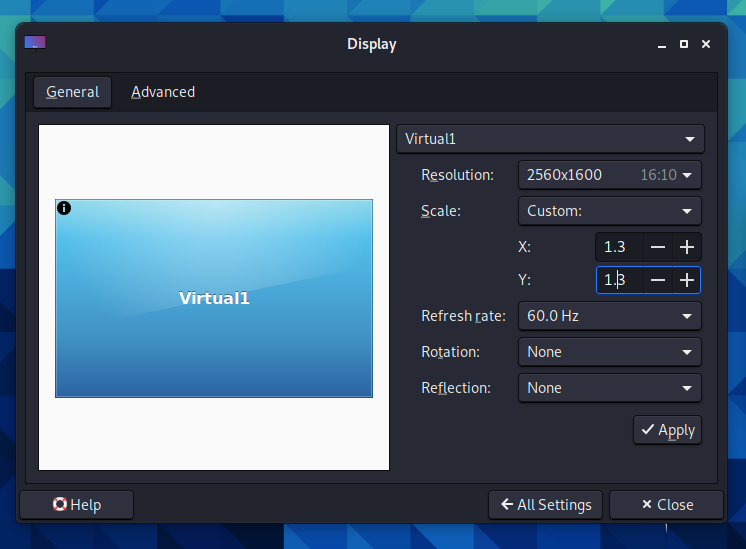

칼리 리눅스를 시작할 때, 특정 요소들(**창/버튼** 또는 **텍스트/글꼴**)이 **예상보다 작게** 보일 수 있어요. 이는 **HiDPI**(일명 **High DPI**) 때문일 수 있어요. 이는 소프트웨어가 어떻게 만들어졌는지(예: GTK2, GTK3, Qt5 등)에 따라 달라져요. 이런 현상은 그래픽 카드 드라이버나 모니터 프로필과 같은 다양한 이유로 발생할 수 있어요.

만약 요소들이 "정상"보다 **더 크게** 보인다면, [DPI 수정 가이드](/docs/general-use/fixing-dpi/)를 참조하세요.

이 가이드는 단일 화면 설정에 대해 다룰 거예요. **다중 디스플레이 출력을 테스트할 하드웨어가 없어서 관련 가이드를 작성할 수 없어요. 따라서 [커뮤니티 기여](/docs/community/contribute/)를 찾고 있어요. 하드웨어와 전문 지식이 있으시다면, [이 가이드를 수정](https://gitlab.com/kalilinux/documentation/kali-docs/edit/master/general-use/hidpi/index.md)해 주세요!**

## 데스크톱 환경 - Xfce

Xfce는 HiDPI 모니터를 지원해요. 하지만 하드웨어, 버전, 문제에 따라 몇 가지 설정을 조정해야 할 수도 있어요.


이 과정을 더 쉽게 하기 위해, Kali는 이제 HiDPI 모드를 제공해요. 이 모드는 GTK, QT 및 자바 기반 인터페이스에 대한 스케일링 팩터를 조정하여 사용자가 각각을 수동으로 수정할 필요가 없게 해요. 애플리케이션 메뉴에서 'Kali HiDPI mode'를 열거나 터미널에서 `kali-hidpi-mode`를 실행하여 이 모드를 전환할 수 있어요.


kali-hidpi-mode는 재시작 없이도 스케일링 팩터를 변경할 수 있지만, 모든 변경 사항이 제대로 적용되도록 세션을 닫고 다시 로그인하는 것이 좋아요.

이 모드는 모든 창을 2배율로 스케일링할 수 있지만, 일부 디스플레이에서는 이 비율이 너무 클 수 있어요. 이런 경우에는 HiDPI 모드를 활성화한 다음 Xfce의 디스플레이 설정에서 사용자 정의 비율 스케일링을 구성할 수 있어요. 권장 구성은 1.3x-1.5x이에요.



아래는 수동 설정에 대한 더 자세한 설명이에요.

### 스케일링 팩터

#### GTK

Kali에 로그인한 후, 배경 화면은 "정상"으로 보이지만 다른 모든 것이 "읽기에 조금 작게" 보일 수 있어요.


"**스케일링 팩터**"를 "**x1**"에서 "**x2**"로 늘리면 이 문제를 해결할 수 있어요. 명령줄이나 그래픽 방식 두 가지 방법으로 이 작업을 수행할 수 있어요:

- 터미널 창에서 다음 명령어를 실행하세요:

```console
kali@kali:~$ echo export GDK_SCALE=2 >> ~/.xsessionrc
kali@kali:~$
kali@kali:~$ xfconf-query -c xfwm4 -p /general/theme -s Kali-Dark-xHiDPI
kali@kali:~$
kali@kali:~$ xfconf-query -c xsettings -p /Gdk/WindowScalingFactor -n -t 'int' -s 2
kali@kali:~$
```

- 그래픽 방식:
  - Kali -> 설정 -> 모양새 -> **설정** -> **윈도우 스케일링**
  - Kali -> 설정 -> 모양새 -> **윈도우 관리자** -> **테마: `Kali-Dark-xHiDPI`**


남아있는 아티팩트를 정리하는 가장 빠른 방법은 **로그아웃했다가 다시 로그인**하는 것이에요.

#### Qt

[qTerminal](https://packages.debian.org/testing/qterminal)과 같은 일부 앱은 앞서 설명한 스케일 팩터를 사용하지 않으므로 별도로 구성해야 해요.

이를 위해 `~/.xsessionrc` 파일에 다음 환경 변수를 설정해야 해요:

```console
kali@kali:~$ echo export QT_SCALE_FACTOR=2 >> ~/.xsessionrc
kali@kali:~$
```

### 커서 크기

HiDPI 설정을 활성화하면 마우스 크기에 문제가 생길 수 있으며, 마우스를 올려놓은 애플리케이션에 따라 크기가 달라지는 것을 볼 수 있어요.

이 문제를 해결하려면 다음 명령어로 커서 크기를 강제로 지정할 수 있어요:

```console
kali@kali:~$ echo export XCURSOR_SIZE=48 >> ~/.xsessionrc
kali@kali:~$
```

{}
`48`보다 큰 값을 시도해야 할 수도 있어요.
{}

- - -

## 로그인 화면 - LightDM

로그인 화면(`lightdm`)에서 로그인 상자가 "정상"보다 작게 보이는 문제가 있나요?


가능한 해결책은 "`xft-dpi`"를 "`180` (**또는 더 높게**)"으로 설정하는 것이에요:

```console
kali@kali:~$ grep xft-dpi /etc/lightdm/lightdm-gtk-greeter.conf
xft-dpi = 96
kali@kali:~$
kali@kali:~$ sudo vim /etc/lightdm/lightdm-gtk-greeter.conf
kali@kali:~$
kali@kali:~$ cat /etc/lightdm/lightdm-gtk-greeter.conf
[greeter]
[...]
xft-dpi = 180
[...]
kali@kali:~$
```

{}
`180`보다 큰 값을 시도해야 할 수도 있어요.
{}
