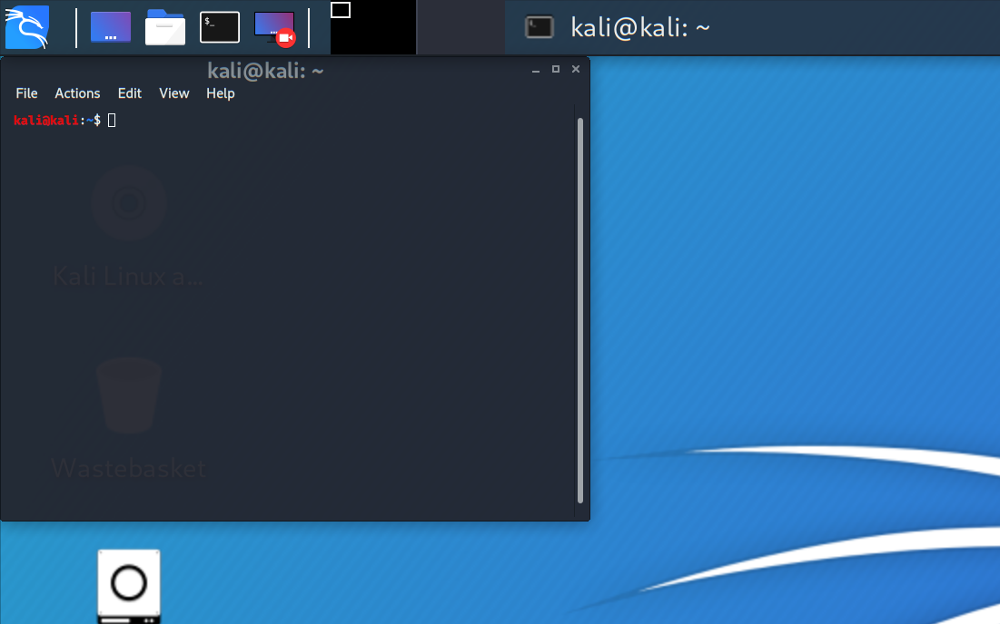
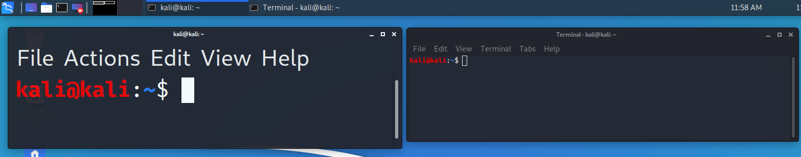
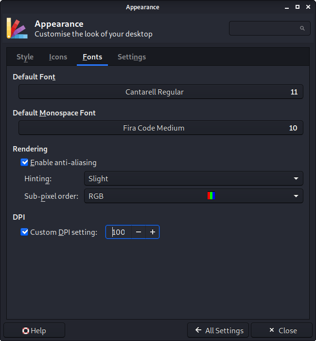

Upon starting Kali back up, certain things may appear larger than expected. This could be because of HiDPI (aka High DPI). Depending on how the software was made, it could be using gtk2, gtk3, QT5 etc.

This could be happening for various reasons, such as the graphic card drivers and/or the monitor profile.

This guide will cover single screen setups. We do not have the hardware in order to test multiple display outputs to write up the guide. So we are looking for [community contribution](https://www.kali.org/docs/community/contribute/) to help out. If you have the hardware, and expertise, please [edit this guide](https://gitlab.com/kalilinux/documentation/kali-docs/edit/master/general-use/hidpi/index.md)!

## Xfce

Xfce does support HiDPI monitors. Though you may need to alter a few places, depending on your hardware, versions and issues to get it working.

#### Scaling Factor

After logging into Kali, the wallpaper may look "normal", but everything else might be "a little small to read". Increasing the "Scaling Factor" from "x1" to "x2" should address this problem.


You have two ways of altering this, either graphical or through the command line. To alter the scaling factor to "*x2*":

- Graphical:
  - "*Kali -> Settings -> Appearance -> Settings -> Windows Scaling*"
  - "*Kali -> Settings -> Appearance -> Window Manager -> Theme: Kali-Dark-xHiDPI"


- In a terminal window, run the following commands:
  - `kali@kali:~$ echo export GDK_SCALE=2 >> .xsessionrc`
  - `kali@kali:~$ xfconf-query -c xfwm4 -p /general/theme -s Kali-Dark-xHiDPI`

The quickest way to clean up any left over artifacts is to now log out and in again.

Alternatively, you can run the following command to change the window scaling factor immediately. But, it will only work if you have already changed the value before, using the appearance application.  
`xfconf-query -c xsettings -p /Gdk/WindowScalingFactor -s 2`

#### Qt apps

Some apps, such as qterminal, don't use the scale factor explained before, so they need to be configure separately. To do so, you need to set the following environmental variables in the ~/.xsessionrc file:

```
export QT_AUTO_SCREEN_SCALE_FACTOR=0
export QT_FONT_DPI=180
```

```
kali@kali:~$ nano ~/.xsessionrc
kali@kali:~$ cat ~/.xsessionrc
export QT_AUTO_SCREEN_SCALE_FACTOR=0
export QT_FONT_DPI=180
kali@kali:~$
```

#### HiDPI general script

In case you need a more general script to enable HiDPI in your desktop, here you have one that applies the configurations explained before. Remember to log out and in again after running it.

```
xfconf-query -c xfwm4 -p /general/theme -s Kali-Dark-xHiDPI

cat <<- EOF >> .xsessionrc
    export GDK_SCALE=2
    export QT_AUTO_SCREEN_SCALE_FACTOR=0
    export QT_FONT_DPI=180
EOF
```

#### Small/Large Font

Upon opening some applications, the font may appear larger/smaller than expected. For example, this could be inside a terminal window.



In the example below, you can see two different terminal software, one using QT (`QTerminal`) and the other using GTK (`xfce4-terminal`)



You have two ways of altering this, either graphical or through the command line. To alter the DPI:

- Graphical:
  - "*Kali -> Settings -> Appearance -> Fonts -> DPI*"
    - Enable: `Custom DPI Settings`
    - Value: `180`




- In a terminal window, run the following commands:
```
kali@kali:~$ nano ~/.xsessionrc
kali@kali:~$ cat ~/.xsessionrc
xrandr --dpi 200
kali@kali:~$
```

Due to a bug, you will need to either toggle `Custom DPI Settings` or increase/decrease the value then restore it back to the value previously.

The next time you open the program back up, the font should now be normal.

#### Login Screen


If you notice an issue with the login screen (`lightdm`), you can set "*xft-dpi*" to "*180* (or higher)".

```
kali@kali:~$ grep xft-dpi /etc/lightdm/lightdm-gtk-greeter.conf
xft-dpi = 96
kali@kali:~$ sudo nano /etc/lightdm/lightdm-gtk-greeter.conf
kali@kali:~$ cat /etc/lightdm/lightdm-gtk-greeter.conf
[greeter]
...SNIP...
xft-dpi = 200
...SNIP...
kali@kali:~$
```
