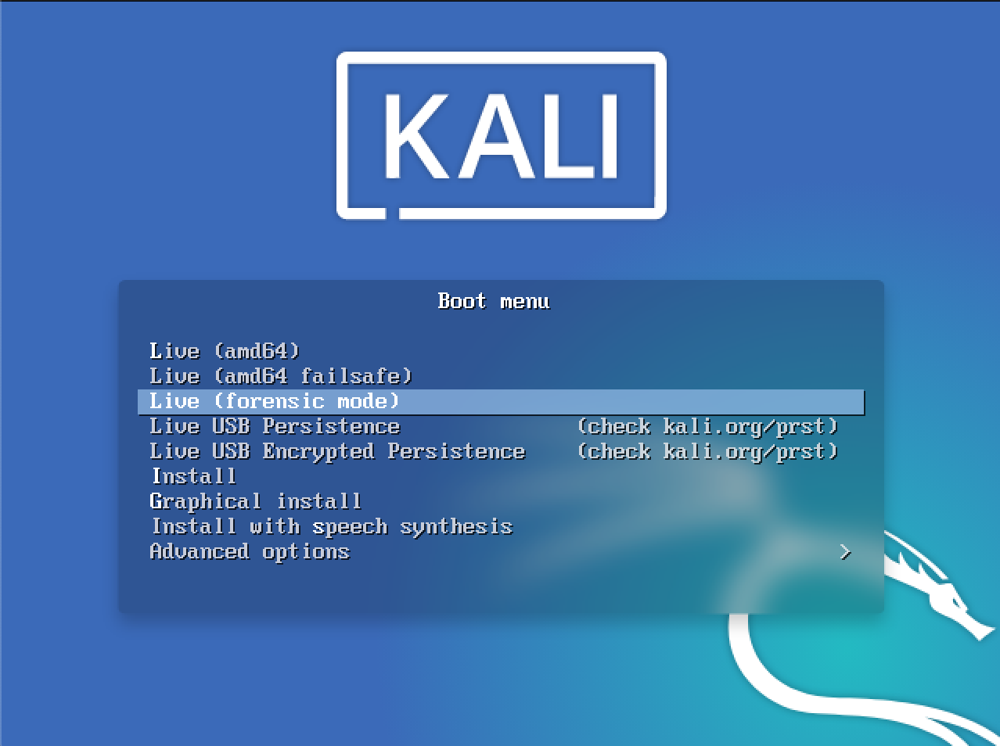

칼리 리눅스 "Live"는 [BackTrack Linux](https://www.backtrack-linux.org/)에서 처음 도입된 기능인 "포렌식 모드"를 제공해요. "포렌식 모드 라이브 부팅" 옵션은 여러 이유로 매우 인기가 있어요:

- 칼리 리눅스는 널리 그리고 쉽게 이용 가능하며, 많은 잠재적 사용자들이 이미 칼리 ISO 또는 부팅 가능한 USB 드라이브를 가지고 있어요.
- 포렌식 필요성이 생겼을 때, 칼리 리눅스 "Live"는 빠르고 쉽게 칼리 리눅스를 작업에 투입할 수 있게 해요.
- 칼리 리눅스에는 가장 인기 있는 오픈 소스 포렌식 소프트웨어가 미리 로드되어 있어, 포렌식 작업이 필요할 때 편리한 도구 세트가 돼요.

포렌식 부팅 모드로 부팅하면, 시스템의 일반 작동에 몇 가지 _매우 중요한 변화_가 생겨요:

1. 첫째, 내부 하드 디스크는 _절대_ 건드리지 않아요. 스왑 파티션이 있어도 _사용되지 않으며_ 내부 디스크가 자동으로 마운트되지 않아요. 우리는 이를 검증하기 위해 먼저 표준 시스템을 가져와 하드 드라이브를 제거했어요. 상용 포렌식 패키지를 사용하여 드라이브의 해시가 계산되었어요. 그런 다음 드라이브를 컴퓨터에 다시 연결하고 포렌식 모드에서 칼리 리눅스 "Live"를 부팅했어요. 칼리를 일정 시간 사용한 후, 시스템을 종료하고, 하드 드라이브를 제거한 뒤 해시를 다시 계산했어요. 이 해시들이 일치하여, 어떤 식으로든 드라이브에 아무런 변화가 없었음을 나타냈어요.

2. 다른, 동등하게 중요한 변화는 이동식 미디어의 자동 마운트가 **_비활성화_**된다는 것이에요. USB 썸 드라이브, CD 등은 삽입할 때 **_자동으로 마운트되지 않아요_**. 이 아이디어 뒤에 있는 개념은 간단해요: 포렌식 모드에서는, _**직접적인 사용자 행동**_ 없이 _**어떤**_ 미디어에도 **_아무 일도_** 일어나지 않아야 해요. 사용자로서 당신이 하는 _모든 것_은 _당신의 책임_이에요.

실제 세계에서 어떤 종류의 포렌식에 칼리를 사용할 계획이라면, 우리는 이 중 어떤 것에 대해서도 우리의 말을 그대로 믿지 말라고 권장해요. 모든 포렌식 도구는 _항상_ 검증되어야 하며, 이를 통해 도구를 사용하게 될 모든 상황에서 어떻게 행동할지 알 수 있어요.
마지막으로, 칼리는 계속해서 사용 가능한 최고의 오픈 소스 침투 테스트 도구 모음을 제공하는 데 초점을 맞추고 있지만, _당신이_ 좋아하는 오픈 소스 포렌식 도구를 놓쳤을 가능성이 항상 존재해요. 만약 그렇다면, [알려주세요](https://bugs.kali.org/)! 우리는 항상 칼리에 추가하여 더 좋게 만들 수 있는 고품질 오픈 소스 도구를 찾고 있어요.
