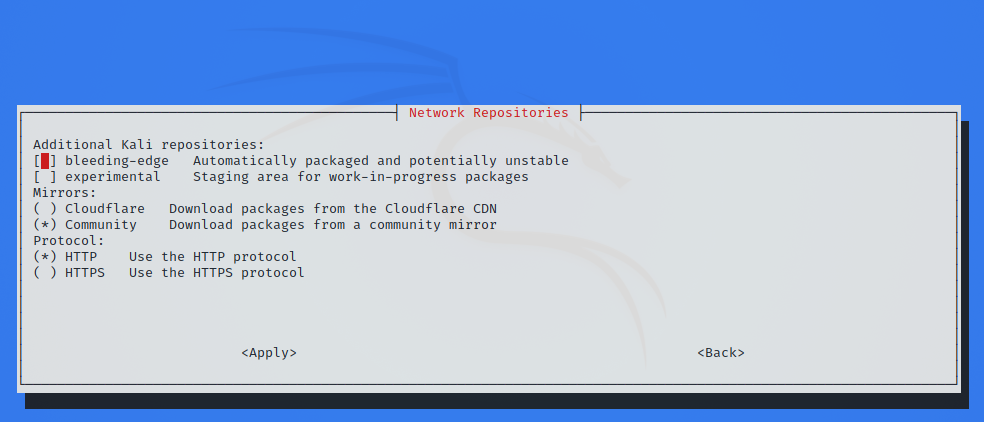

저장소(repositories)라는 주제는 항상 크고 자주 대두되는 주제예요. 사람들이 자주 잘못 이해하고 혼동하는 항목이기도 해요. 어떤 조치를 취하기 전에 아래 정보와 연결된 참조를 읽어 주세요.

## 기본 네트워크 저장소 값

표준 클린 설치된 칼리 리눅스에서 네트워크 액세스가 있다면, `/etc/apt/sources.list`에 다음과 같은 항목이 있어야 해요:

```console
kali@kali:~$ grep -v '#' /etc/apt/sources.list | sort -u
deb http://http.kali.org/kali kali-rolling main contrib non-free non-free-firmware

kali@kali:~$
```

출력이 위와 정확히 일치하지 않는다면, 새로운 추가 패키지를 설치하거나 업데이트를 받지 못할 수 있어요.
이는 다음과 같은 이유로 발생할 수 있어요:

- [브랜치](/docs/general-use/kali-branches/)를 전환했을 경우.
- 하드코딩된 다른 [미러](/docs/community/kali-linux-mirrors/)를 사용하는 경우.

이를 변경하려면 "브랜치 전환하기" 섹션을 읽는 것이 좋아요.

[칼리 2020.3](/blog/kali-linux-2020-3-release/) 이후부터는, 칼리 설정이 완료된 후에는 설치 중 네트워크 접속이 없었더라도 기본적으로 네트워크 저장소가 활성화돼요.

## 칼리 메인 브랜치 전환하기

칼리에는 선택할 수 있는 두 가지 [메인 브랜치](/docs/general-use/kali-branches/)가 있어요(설정에 가장 적합한 옵션을 읽어보세요):

- **kali-rolling** - 기본 & 자주 업데이트됨
- **kali-last-snapshot** - 포인트 릴리스로 더 "안정적" & "가장 안전함"

`kali-rolling` 브랜치 활성화는 다음 명령어로 수행돼요:

```console
kali@kali:~$ echo "deb http://http.kali.org/kali kali-rolling main contrib non-free non-free-firmware" | sudo tee /etc/apt/sources.list
```

`kali-last-snapshot` 브랜치 활성화는 다음 명령어로 수행돼요:

```console
kali@kali:~$ echo "deb http://http.kali.org/kali kali-last-snapshot main contrib non-free non-free-firmware" | sudo tee /etc/apt/sources.list
```

이러한 변경은 `sudo apt update`를 실행한 후에만 적용된다는 점을 참고하세요.

## 칼리 추가 브랜치 활성화하기

칼리는 특수한 경우를 위해 [추가 브랜치](/docs/general-use/kali-branches/)를 제공해요. 이론적으로는 사용하는 메인 브랜치에 상관없이 이러한 브랜치를 활성화할 수 있어요. 그러나 실제로는 `kali-rolling`과 함께 사용하도록 설계되었어요. 정확히 어떻게 하는지 알지 못한다면 `kali-last-snapshot`과 함께 사용하는 것은 권장하지 않아요. 이러한 추가 브랜치는 다음과 같아요:

- **kali-experimental** - 테스트 중이거나 작업 진행 중인 패키지
- **kali-bleeding-edge** - 업스트림 git 저장소에서 자동으로 업데이트되는 패키지

이러한 브랜치의 활성화 또는 비활성화는 명령줄 도구 `kali-tweaks`의 *Network Repositories* 섹션에서 가장 잘 수행돼요:



원하는 경우 명령줄에서 수동으로 이러한 브랜치를 활성화할 수도 있어요. 예를 들어, `kali-experimental`은 다음 명령어로 활성화돼요:

```console
kali@kali:~$ echo "deb http://http.kali.org/kali kali-experimental main contrib non-free non-free-firmware" | sudo tee /etc/apt/sources.list.d/kali-experimental.list
```

위 명령어에서는 `/etc/apt/sources.list` 파일을 수정하지 않고 대신 새 파일 `/etc/apt/sources.list.d/kali-experimental.list`을 생성한다는 점에 유의하세요. 이는 하나의 관례예요: `/etc/apt/sources.list` 파일은 메인 브랜치만 포함해야 하며, 추가 브랜치는 `/etc/apt/sources.list.d/`에 있어야 하며, 파일 하나에 브랜치 하나씩이에요.

이 관례를 따르면 `kali-experimental` 브랜치를 비활성화하는 것이 간단해요:

```console
kali@kali:~$ sudo rm /etc/apt/sources.list.d/kali-experimental.list
```

`kali-bleeding-edge` 브랜치는 비슷한 명령어로 활성화할 수 있으며, 브랜치 이름만 변경하면 돼요:

```console
kali@kali:~$ echo "deb http://http.kali.org/kali kali-bleeding-edge main contrib non-free non-free-firmware" | sudo tee /etc/apt/sources.list.d/kali-bleeding-edge.list
```

`kali-bleeding-edge` 비활성화하기:

```console
kali@kali:~$ sudo rm /etc/apt/sources.list.d/kali-bleeding-edge.list
```

## Sources.list 형식

```plaintext
deb   http://http.kali.org/kali   kali-rolling   main contrib non-free non-free-firmware
<아카이브>   <미러>                <브랜치>                <구성 요소>
```

- **아카이브**는 패키지 또는 패키지의 소스를 원하는지에 따라 `deb`(일반 바이너리) 또는 `deb-src`(소스)가 될 거예요.
- **미러**는 `http://http.kali.org/kali`이어야 해요. 이것은 가장 좋은 [미러](/docs/community/kali-linux-mirrors/)로 안내할 로드 밸런서예요.
- **브랜치**는 사용하고자 하는 [칼리 버전](/docs/general-use/kali-branches/)이에요.
- **구성 요소**는 [데비안 자유 소프트웨어 지침(DFSG)](https://www.debian.org/social_contract#guidelines)을 기반으로 사용하고자 하는 패키지예요. 칼리는 기본적으로 모든 것을 포함해요.

## 기본 오프라인 설치 값

칼리 설정 프로세스 중에 저장소에 접근할 네트워크 연결이 없는 경우, 칼리 리눅스의 오프라인 설치를 수행하게 돼요. 이는 칼리를 설치한 매체에 있는 패키지와 버전으로 제한될 거예요. 그러면 칼리가 설치된 후에도 이 매체에서 패키지를 계속 설치하도록 구성돼요.

이는 패키지 업데이트나 새로운 추가 도구를 받지 못하게 되어 답답할 수 있어요. 아래 값과 일치한다면 오프라인 미디어가 활성화되어 있는지 확인할 수 있어요(또는 이 옵션을 활성화하고 싶은 경우):

```console
kali@kali:~$ cat /etc/apt/sources.list
#

# deb cdrom:[Kali GNU/Linux 2020.1a _Kali-last-snapshot_ - Official amd64 DVD Binary-1 with firmware 20200213-14:56]/ kali-rolling main non-free

#deb cdrom:[Kali GNU/Linux 2020.1a _Kali-last-snapshot_ - Official amd64 DVD Binary-1 with firmware 20200213-14:56]/ kali-rolling main non-free

# This system was installed using small removable media
# (e.g. netinst, live or single CD). The matching "deb cdrom"
# entries were disabled at the end of the installation process.
# For information about how to configure apt package sources,
# see the sources.list(5) manual.
kali@kali:~$
kali@kali:~$ sudo apt-cdrom add
Using CD-ROM mount point /media/cdrom/
Identifying... [ea19ff4bedaa6c8f4662c0e8c58ed44c-2]
Scanning disc for index files...
Found 2 package indexes, 0 source indexes, 0 translation indexes and 0 signatures
This disc is called:
'Kali GNU/Linux 2020.1a _Kali-last-snapshot_ - Official amd64 DVD Binary-1 with firmware 20200213-14:56'
Reading Package Indexes... Done
Writing new source list
Source list entries for this disc are:
deb cdrom:[Kali GNU/Linux 2020.1a _Kali-last-snapshot_ - Official amd64 DVD Binary-1 with firmware 20200213-14:56]/ kali-rolling main non-free
Repeat this process for the rest of the CDs in your set.
kali@kali:~$
```

출력이 위와 일치한다면, 업데이트를 받고 싶은 경우 브랜치 전환 섹션을 참조하세요.

하지만 네트워크 연결이 있고 네트워크 저장소에 액세스할 수 있다면, 자동으로 활성화될 거예요. 따로 할 일은 없어요.

## 비-칼리 저장소

칼리가 제공하는 것 외에 추가 도구와 소프트웨어(예: [signal](https://signal.org/))를 설치하려면 추가 저장소를 포함해야 할 수도 있어요. `/etc/apt/sources.list`를 수정하지 마세요. 이 파일은 칼리 리눅스 운영 체제용이에요. 추가 도구와 소프트웨어는 `/etc/apt/sources.list.d/` 디렉토리의 자체 파일에 배치되어야 해요(예: `/etc/apt/sources.list.d/repo-name.list`, `repo-name`을 미러 이름으로 대체). 각 미러는 자체 파일에 있는 것이 좋아요.

비-칼리 OS에 칼리 저장소를 추가하면(예: 우분투에 칼리 추가 시도), 시스템이 작동하지 않을 가능성이 크게 높아져요. 바로 발생하지 않을 수도 있지만, 경고 없이 손상될 수 있어요. 우리는 지원을 제공할 수 없을 거에요(수년 동안 보아온 바에 따르면, 대부분의 다른 OS도 도움이 되지 않을 거예요).

마찬가지로, 다른 운영 체제의 저장소를 칼리에 추가하면(예: 칼리에 우분투를 넣으려는 시도), 설치가 손상될 거예요. 이것은 칼리 리눅스 시스템이 손상되는 가장 일반적인 이유예요.

어떤 안내서에서 위와 다른 것을 하라고 한다면, 이는 비공식 조언이며 칼리 리눅스에서 전혀 지원되지 않아요. 대부분의 경우, 이 교훈을 배운 후 사용자들은 재설치를 하게 돼요.

## 미러

우리는 [공식 칼리 리눅스 미러](/docs/community/kali-linux-mirrors/) 목록과 [자신만의 미러 설정 방법에 대한 가이드](/docs/community/setting-up-a-kali-linux-mirror/)를 제공해요. 이는 LAN에서만 접근 가능한 로컬 저장소로 유지되거나 원격 개인 저장소가 될 수 있어요. 또는 가능하다면, [커뮤니티에 다시 공유](/docs/community/contribute/)하여 지리적 지역에 있는 다른 사람들이 혜택을 받을 수 있도록 공개할 수도 있어요.

## 소스 저장소

저장소에서 `deb`를 사용하면 바이너리 패키지를 다운로드할 수 있어요. 그러나 패키지의 소스가 필요한 경우(원하는 경우 패키지를 직접 컴파일하거나 패키지 문제를 디버깅하기 위해), 저장소에 `deb-src`를 추가 줄로 추가할 수 있어요:

```console
kali@kali:~$ echo "deb-src http://http.kali.org/kali kali-rolling main contrib non-free non-free-firmware" | sudo tee -a /etc/apt/sources.list
```

위의 [브랜치](/docs/general-use/kali-branches/)에는 `kali-rolling`을 사용했지만, 원하는 값을 선택할 수 있어요.
