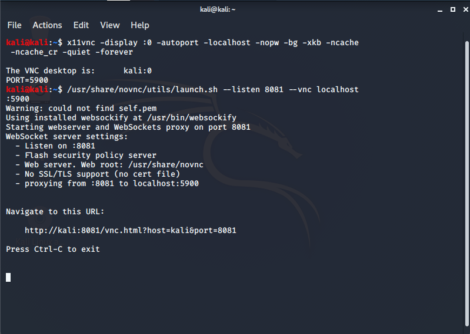
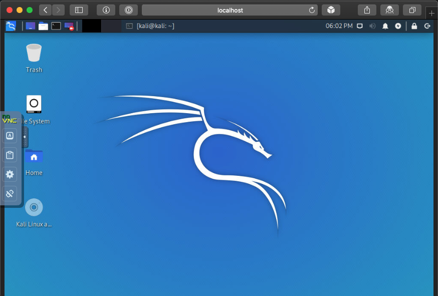

칼리와 상호작용하는 여러 가지 방법이 있어요. 직접 콘솔에 앉아서 작업하거나(대부분 그래픽 경험을 위해), SSH를 통해 원격으로 칼리를 사용하거나(명령줄 액세스 제공), 또는 VNC를 설정하여 원격 그래픽 액세스를 허용할 수도 있어요(VNC가 루프백에서만 수신 대기하고 SSH를 통해 포트 전달하는 등 보안을 철저히 하세요). 또 다른 접근 방식은 필요한 VNC 클라이언트를 설치하는 대신 브라우저에서 칼리와 상호작용하는 것이에요.

이 가이드는 noVNC를 다루고 있지만, [Apache Guacamole](/docs/general-use/guacamole-kali-in-browser/)에 대한 가이드도 있어요. 각각 장단점이 있어요. NoVNC는 필요한 서비스가 적어(오버헤드가 낮음) 더 가벼운 접근법으로, 빠른 "일회성 연결" 솔루션을 제공해요.

먼저 업데이트를 하고, 필요한 패키지를 설치해요 _(VNC 솔루션으로 [x11vnc](https://packages.debian.org/testing/x11vnc)을 선택했어요. 원하는 다른 VNC 서비스로 변경할 수 있지만, 지원은 다를 수 있어요.)_:

```console
kali@kali:~$ sudo apt update
kali@kali:~$
kali@kali:~$ sudo apt install -y novnc x11vnc
kali@kali:~$
```

다음으로 VNC 세션을 시작해요. 더 안전하게 하기 위해 로컬호스트에서만 실행하기로 했어요 _(`x11vnc`의 내장 HTTP 기능은 건너뛰어요. 이는 자바가 필요하고, noVNC가 HTML5 환경을 제공하므로 클라이언트에 따로 설치하지 않으려고 해요)_:

```console
kali@kali:~$ x11vnc -display :0 -autoport -localhost -nopw -bg -xkb -ncache -ncache_cr -quiet -forever

The VNC desktop is:      localhost:0
PORT=5900
kali@kali:~$
```

참고: 여기서는 현재 데스크톱인 `display :0`을 사용하고 있어요.

VNC에 어떤 포트가 사용되고 있는지 다시 확인할 수 있어요:

```console
kali@kali:~$ ss -antp | grep vnc
LISTEN    0         32                127.0.0.1:5900            0.0.0.0:*        users:(("x11vnc",pid=8056,fd=8))
LISTEN    0         32                    [::1]:5900               [::]:*        users:(("x11vnc",pid=8056,fd=9))
kali@kali:~$
```

포트 5900이 사용되고 있는 것을 볼 수 있어요.

그런 다음 noVNC를 실행해요(이렇게 하면 `8081/TCP`가 열려요):

```console
kali@kali:~$ /usr/share/novnc/utils/novnc_proxy --listen 8081 --vnc localhost:5900
```



더 나은 방법으로, SSH를 활성화해요:

```console
kali@kali:~$ sudo systemctl enable ssh --now
kali@kali:~$
```

그런 다음 원격 머신에서 칼리 설정으로 SSH 연결을 해요 _(먼저 포트 포워딩을 활성화해야 할 수도 있어요)_

```console
$ ssh kali@192.168.13.37 -L 8081:localhost:8081
```


