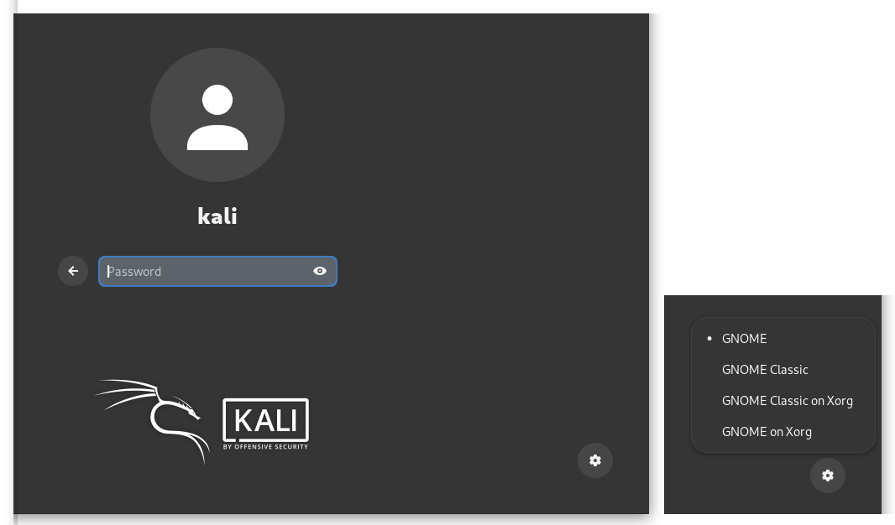
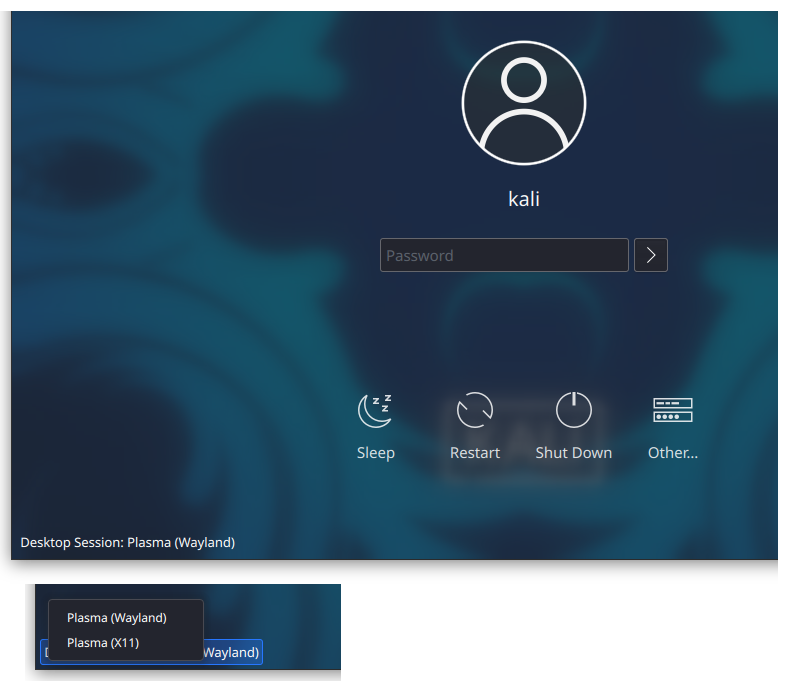

## Wayland란 무엇인가요? 또는 X11이란?

리눅스 시스템에서 디스플레이 서버는 그래픽 스택의 중심 부분으로, 화면에 보이는 모든 것을 표시하는 데 관여하며, 사용자 입력(마우스, 키보드, 터치스크린 등)도 처리해요.

[X11](https://www.x.org/)(X 윈도우 시스템, X.Org 또는 간단히 X라고도 함)은 1984년에 처음 출시된 Linux용 전통적인 디스플레이 서버로, 오늘날에도 널리 사용되고 있어요. [Wayland](https://wayland.freedesktop.org/)는 X11의 대체품이에요. 2008년에 처음 출시되었으며, 그 이후로 활발하게 개발되어 실제로 X11을 대체하고 있어요.

이 글을 쓰는 시점에서, 일부 리눅스 데스크톱 환경(또는 간단히 DE)은 Wayland를 기본적으로 사용하고, 다른 일부는 여전히 X11을 사용해요. 일부 DE는 많은 작업이 필요하기 때문에 Wayland로 이식되지 않을 거에요.

이 간략한 소개를 마치기 위해: XWayland는 호환성 레이어로, X11 애플리케이션이 Wayland 데스크톱 환경에서 실행될 수 있게 해요.


## 칼리 리눅스의 Wayland

### 칼리 리눅스에서 Wayland를 사용하고 있는지 확인하는 방법

터미널을 열고 다음을 입력하세요:

```console
kali@kali:~$ echo $XDG_SESSION_TYPE
```

출력이 `wayland`라면, 데스크톱이 Wayland 하에서 실행 중이에요. 출력이 `x11`이라면, 데스크톱이 X11 하에서 실행 중이에요.

### Xfce

Xfce 데스크톱은 X11을 사용하며, 가까운 미래에 이것이 바뀔 가능성은 없어요. 더 자세한 내용은 [Xfce Wayland 개발 로드맵](https://wiki.xfce.org/releng/wayland_roadmap)을 확인할 수 있어요.

### GNOME

칼리 리눅스에서 GNOME 데스크톱은 기본적으로 X11 디스플레이 서버를 사용해요.

이 점에서 칼리 리눅스는 다른 리눅스 배포판보다 보수적이에요: Wayland는 페도라 25(2016년 11월 출시), 데비안 10(2019년 7월), 우분투 21.04(2021년 4월)에서 기본값이 되었어요.

위의 타임라인을 보면, 칼리 리눅스도 GNOME 데스크톱에서 언젠가 Wayland로 전환할 것으로 예상할 수 있어요. 하지만 현재로서는 로드맵에 없어요.

#### Wayland로 전환하기

{}
이 부분은 경험 있는 사용자만을 위한 것이에요. 이 단계를 따른다면, 발생할 수 있는 문제를 스스로 해결할 수 있을 것으로 예상해요.
{}

X11 대신 Wayland를 사용하려면, 터미널을 열고 다음 명령어를 입력하세요:

```console
kali@kali:~$ sudo mkdir -p /etc/systemd/system/gdm.service.d
kali@kali:~$ sudo ln -sf /dev/null /etc/systemd/system/gdm.service.d/disable-wayland.conf
```

그런 다음 재부팅하고 로그인하면 이제 Wayland를 사용하고 있어요. X11로 다시 전환하고 싶다면, `disable-wayland.conf` 파일을 제거하고 재부팅하세요:

```console
kali@kali:~$ sudo rm /etc/systemd/system/gdm.service.d/disable-wayland.conf
```

Wayland로 전환한 후에는 로그인 화면에서 Wayland와 X11 중에서 선택할 수 있는 옵션이 생겨요: 화면 오른쪽 하단에서 _설정_ 아이콘을 클릭하고, X11을 사용하고 싶다면 _GNOME on Xorg_를 선택하세요.



### KDE

[칼리 리눅스 2023.1](https://www.kali.org/blog/kali-linux-2023-1-release/)<!-- ie. plasma-desktop 4:5.27.0-1 --> 이후부터, Wayland가 KDE 데스크톱의 기본 디스플레이 서버가 되었어요.

이로 인해 문제가 발생한다면(예: 일부 애플리케이션이 제대로 표시되지 않거나, 이전에 없던 그래픽 이슈가 발생한다면), 레거시 X11 서버를 대신 사용해 볼 수 있어요. 로그인 화면에서 선택할 수 있어요: 화면 왼쪽 하단에서 _Desktop Session_을 클릭하고 _Plasma (X11)_을 선택하세요.


