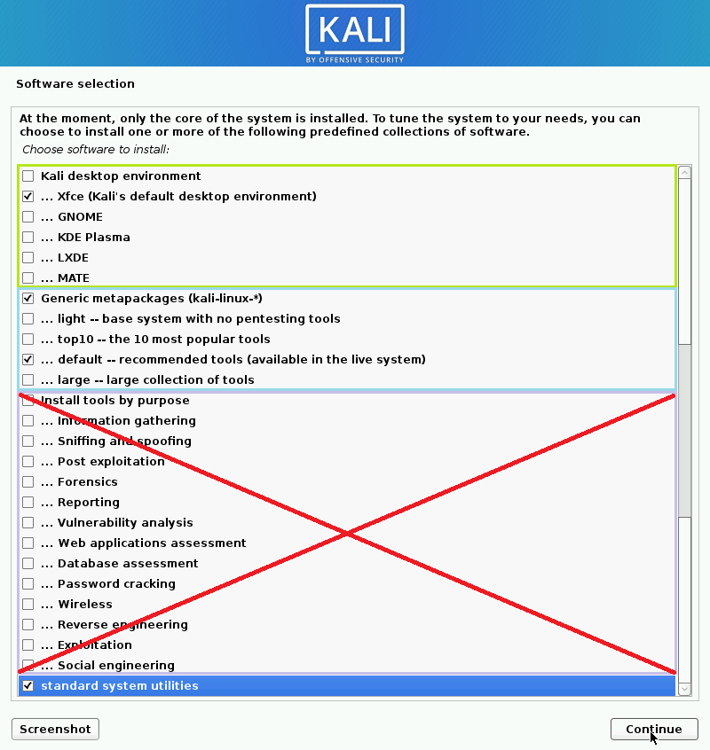

## Overview

#### In this section, we will describe the process of installing Kali Linux on x86/amd64 hardware using the images published on the [Kali Linux download page](https://kali.org/downloads).  

&nbsp;&nbsp;

## Content

- [Which image to choose](#which-image-to-choose)
- [Which desktop environment and software collection to choose during installation](#which-desktop-environment-and-software-collection-to-choose-during-installation)

&nbsp;

&nbsp;&nbsp;

### Which image to choose

------

The [Kali Linux download page](https://kali.org/downloads) offers three different image types for download, each available for both 32bit and 64bit architectures. If in doubt, use the image for your architecture labelled (Installer)

&nbsp;&nbsp;

#### Installer  

**This is the recommended image to install Kali Linux**. It contains a copy of the default packages and can be used for offline installations without a network connection.  
This image cannot be used to boot a live system. It is only an installer image.  

&nbsp;

#### NetInstaller

This image can be used if the standard installer image is too big to download. It is very small because it doesn't contain copies of the packages to install. They will all be downloaded during installation. This requires a network connection and will slow down the installation time. Only use this image if you have reasons not to use the standard installer image above.  
This image cannot be used to boot a live system. It is only an installer image.  

&nbsp;

#### Live  

Image to run Kali Linux without installing it and is perfect for running off a USB stick.
Although you are able to install Kali from this image, we do not recommend it as that will require a network connection and slow down the installation as all packages have to be downloaded.

&nbsp;&nbsp;

### Which desktop environment and software collection to choose during installation:

------

Each Kali Linux image allows the user to select the preferred desktop environment and software collection to be installed with the operating system.

**We recommend to stick with the defaults and add packages after the installation as required.**

We do however offer the choice for a more efficient installation experience for advanced users but it comes with a few pitfalls to be aware of:

a) The software selection screen lists the following section headers:

- *Kali desktop environment*

- *Generic metapackages (kali-linux-*)*

- *Install tools by purpose*

  Whilst these headers have tick boxes for technical reasons, they are actually not doing anything as these entries are only headers for the sections. Just ignore them. Selection have to be made for each of the items in those sections.

&nbsp;&nbsp;

b) Select one or the other. Most collections are subsets or supersets of others and are not meant to be combined.
We recommend to:

- Select one desktop environment in the "*Kali desktop environment*" section

- Select either

  - one metapackage in section "Generic metapackages (kali-linux-*)"
    

    *or*

  - select one or more metapackages in section "Install tools by purpose"
    

- Select "standard system utilities" 

&nbsp;&nbsp;

------

The following sections contain step by step guides on how to install Kali Linux in different scenarios. Each of these guides use the standard "Installer" image.