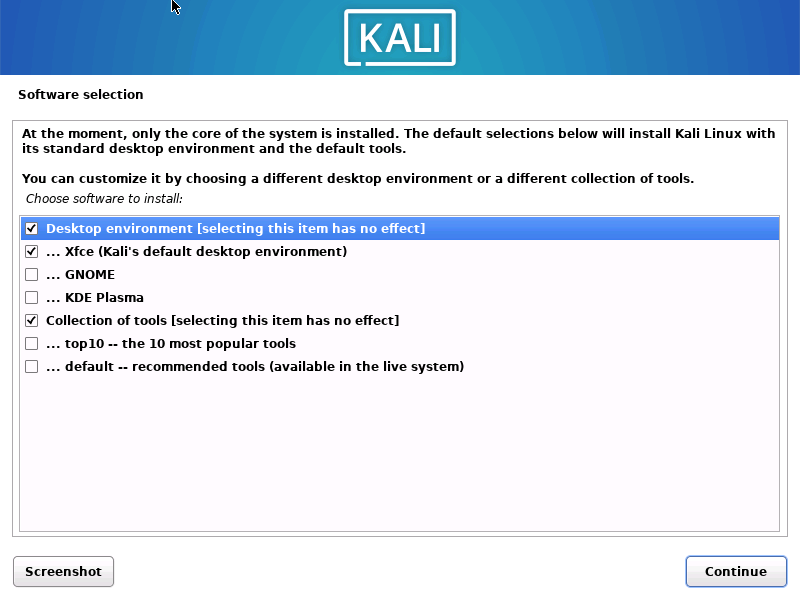

칼리는 전통적으로 침투 테스트 배포판으로만 권장되어 왔고, 이유가 있었어요. 하지만 수년에 걸쳐 칼리는 더 안정적이 되었고 사용자들이 어떤 이유로든 사용할 수 있는 시스템으로 발전해왔어요. 여전히 주로 침투 테스트 배포판이지만, 많은 사용자들이 사이버 보안 분야에 있지 않을 수도 있다는 점을 인정해요. 칼리를 설치하고 싶지만 도구가 필요 없거나 UI만 원하는 사용자들을 위해 이 가이드를 준비했어요.

## 기본 구성의 칼리 설치하기

도구 없이 칼리를 얻는 것은 꽤 쉬워요. 대부분 [칼리 리눅스 설치하기](/docs/installation/hard-disk-install/) 방법을 따를 거예요. 중요한 부분은 다음 패키지들을 선택하는 거예요:



물론 원하는 데스크톱 환경을 선택할 수 있어요. KDE가 와콤 태블릿에 대한 지원이 뛰어나다는 점도 언급할 가치가 있어요! 하지만 KDE를 다른 데스크톱 배포판과 섞어 사용하지 않도록 주의하세요. 이렇게 하면 버그가 발생할 수 있어요.

설치하고 로그인한 후에는 몇 가지 할 일이 있어요. 이건 일상적인 사용 사례뿐만 아니라 항상 해야 할 일이라는 점을 기억하세요! 먼저 루트 사용자의 비밀번호를 변경해볼게요:

```console
kali@kali:~$ sudo su
[sudo] password for kali:
root@kali:/home/kali#
root@kali:/home/kali# passwd
New password:
Retype new password:
passwd: password updated successfully

root@kali:/home/kali#
```

이후 시스템이 최신 상태인지 확인할 수 있어요:

```console
kali@kali:~$ sudo apt update && sudo apt full-upgrade -y
....
kali@kali:~$
kali@kali:~$ [ -f /var/run/reboot-required ] && sudo reboot -f
```

이제 kali-tweaks가 올바르게 구성되었는지 확인해서 설정을 마무리할 수 있어요:

```console
kali@kali:~$ kali-tweaks
```

우리가 찾고 있는 것은 '강화(Hardening)' 섹션에서 필요한 변경사항이에요. 시스템을 더 안전하게 만들기 위해 옵션을 해제하면 돼요.
