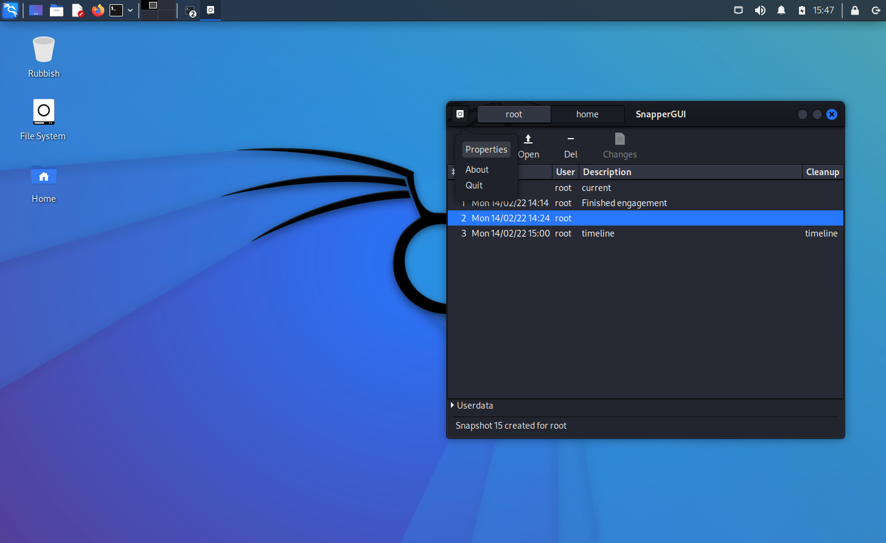
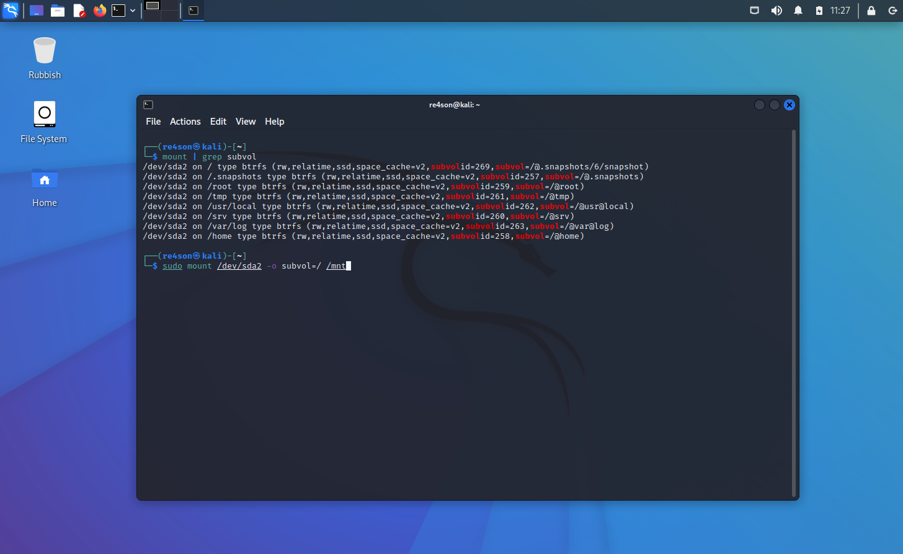

중요한 고객 보고서를 삭제하거나, 임원 회의 직전에 고장난 드라이버를 설치한 후 시간을 되돌릴 수 있으면 좋겠다고 생각해본 적 있나요?

좋은 소식이에요! 이제 가능하거든요!

칼리 리눅스 버전 2022.1 이상을 btrfs 파일 시스템으로 설치하고 설치 후 스냅샷 기능을 활성화하기만 하면 돼요.

부트 메뉴를 통해 저장된 스냅샷으로 부팅하고 이전 시스템 상태로 쉽게 롤백할 수도 있어요:


#### 목차

- [목차](#목차)
- [개요](#개요)
  - [설치 개요](#설치-개요)
  - [파티션 구성](#파티션-구성)
- [칼리 리눅스 BTRFS 설치 단계](#칼리-리눅스-btrfs-설치-단계)
  - [칼리 리눅스 설치 절차](#칼리-리눅스-설치-절차)
- [사용 방법](#사용-방법)
  - [구성 수정하기](#구성-수정하기)
  - [추가 구성 만들기](#추가-구성-만들기)
  - [스냅샷 생성하기](#스냅샷-생성하기)
  - [스냅샷 목록 보기](#스냅샷-목록-보기)
  - [스냅샷 삭제하기](#스냅샷-삭제하기)
  - [롤백](#롤백)
  - [차이점 보기](#차이점-보기)
  - [스냅샷 내용 탐색하기](#스냅샷-내용-탐색하기)
- [부팅 불가능한 시스템에서 완전 복구](#부팅-불가능한-시스템에서-완전-복구)
  - [마지막으로 알려진 정상 스냅샷으로 부팅하기](#마지막으로-알려진-정상-스냅샷으로-부팅하기)
  - [롤백](#롤백-1)
- [참조](#참조)

#### 개요

[btrfs](https://btrfs.wiki.kernel.org/index.php/Main_Page)는 풀링, 스냅샷, 체크섬, 여러 장치 통합 스패닝과 같은 고급 기능을 구현하는 것을 목표로 하는 현대적인 Copy on Write(CoW) 리눅스 파일 시스템이에요. 특히 [스냅샷](https://btrfs.wiki.kernel.org/index.php/UseCases#Snapshots_and_subvolumes) 지원 기능이 베어메탈(물리 시스템)에 칼리를 설치할 때 btrfs를 매력적으로 만들어요. VMware나 VirtualBox 같은 가상화 솔루션은 자체 스냅샷 기능을 제공하기 때문에 이런 환경에서는 btrfs를 사용할 필요가 크지 않아요.

이 안내서의 스냅샷 전략은 SUSE의 친구들이 만든 "snapper"라는 도구를 중심으로 해요. Snapper는 apt 작업 흐름에 투명하게 연결되어 모든 apt 작업 전후에 자동으로 스냅샷을 생성해요. 이 멋진 작은 기능 덕분에 업그레이드가 망가진 후에 시스템을 쉽게 롤백할 수 있어요.

게다가 [Antynea](https://github.com/Antynea)가 만든 [grub-btrfs](https://github.com/Antynea/grub-btrfs)를 추가해서 grub 부팅 메뉴에 스냅샷 목록을 자동으로 추가할 수 있어요.

[Ricardo Vieira](https://github.com/ricardomv)가 만든 [Snapper-gui](https://github.com/ricardomv)도 우리 삶을 더 쉽게 만드는 훌륭한 도구예요.

##### 설치 개요

스냅샷 기능이 있는 칼리 리눅스를 설치하는 것은 파일 시스템으로 btrfs를 사용한다는 점을 제외하면 표준 설치와 매우 비슷해요.

설치 후에는 몇 가지 도구를 설치하고 snapper의 기본 구성을 만들 거에요.

##### 파티션 구성

파일 시스템으로 "btrfs"를 선택하면 설치 프로그램이 자동으로 다음 서브볼륨 레이아웃을 만들어요:

```plaintext
마운트 포인트        | 서브볼륨           | 설명
-------------------------------------------------------------------------
/                   | @                 | 루트 파일시스템 (/boot 포함)
/.snapshots         | @.snapshots       | Snapper의 스냅샷 디렉토리
/home               | @home             | 사용자 홈 디렉토리
/root               | @root             | root 사용자의 홈 디렉토리
/var/log            | @var@log          | 로그 파일
/srv                | @srv              | 이 시스템이 제공하는 사이트별 데이터
/tmp                | @tmp              | 임시 파일
/usr/local          | @usr@local        | 로컬 데이터를 위한 세 번째 계층
```

#### 칼리 리눅스 BTRFS 설치 단계

##### 칼리 리눅스 설치 절차

1. 설치를 시작하려면 선택한 설치 미디어로 부팅하세요. 칼리 부팅 화면이 나타날 거예요. _그래픽 설치_를 선택하세요.
2. 설치 단계는 파일 시스템을 "ext4"에서 "btrfs"로 변경하는 것을 제외하면 기본 칼리 설치와 동일해요:

"디스크 파티션" 화면에서 "자동 - 전체 디스크 사용"을 선택하세요:


"계속"을 클릭하세요:


`/` 파티션을 더블클릭하세요:


"btrfs"를 선택하세요:


"파티션 설정 완료"를 선택하고 계속하세요:


"파티셔닝 완료 및 디스크에 변경 사항 쓰기"를 선택하고 설치를 계속하세요.


---

3. 설치 후 로그인하고 터미널에서 다음 명령을 실행하세요:

```console
# 보안 root 비밀번호를 설정하세요. 그렇지 않으면 복구 쉘에 로그인하기 어려울 수 있어요
$ sudo passwd

# 필수 도구 설치하기
$ sudo apt update && sudo apt install btrfs-progs snapper snapper-gui grub-btrfs

# 루트 파일 시스템 "/"를 위한 snapper 구성 만들기
$ sudo cp /usr/share/snapper/config-templates/default /etc/snapper/configs/root
$ sudo sed -i 's/^SNAPPER_CONFIGS=\"\"/SNAPPER_CONFIGS=\"root\"/' /etc/default/snapper

# "updatedb"가 스냅샷을 인덱싱하는 것을 방지하여 시스템 속도 저하 방지
$ sudo sed -i '/# PRUNENAMES=/ a PRUNENAMES = ".snapshots"' /etc/updatedb.conf
```

4. 읽기 전용 스냅샷에서 작동하도록 데스크톱 관리자를 조정해야 해요. 사용 중인 데스크톱 환경을 선택하세요:

GNOME:

```console
# 읽기 전용 스냅샷으로 부팅할 수 있도록 gdm 재구성
# GDM은 로그인 중에 "/var/lib/gdm3"와 "/var/lib/AccountService"에 쓰기 액세스 권한이 필요해요.
# 이를 위해 추가 서브볼륨을 만들어야 해요:

$ mount # 주 파티션 선택, 예시에서는 </dev/sda1>. 여러분의 것으로 </dev/sda1>을 바꾸세요
$ sudo mount </dev/sda1> /mnt
$ sudo btrfs subvolume create /mnt/@var@lib@gdm3
$ sudo btrfs subvolume create /mnt/@var@lib@AccountsService

$ sudo mv /var/lib/gdm3/* /var/lib/gdm3/.* /mnt/@var@lib@gdm3
$ sudo mv /var/lib/AccountsService/* /var/lib/AccountsService/.* /mnt/@var@lib@AccountsService/

$ sudo vi /etc/fstab # 다음을 추가하세요(여러분의 <UUID>로 대체)

# 설치 중 /var/lib/gdm3는 /dev/sda1에 있었음
UUID=<dc1ca012-9349-4fcf-b761-ca323379b019> /var/lib/gdm3   btrfs   defaults,subvol=@var@lib@gdm3 0       0

# 설치 중 /var/lib/AccountsService는 /dev/sda1에 있었음
UUID=<dc1ca012-9349-4fcf-b761-ca323379b019> /var/lib/AccountsService   btrfs   defaults,subvol=@var@lib@AccountsService 0       0

# 변경 사항을 적용하려면 재부팅하세요
$ sudo reboot
```

KDE:

```console
# KDE는 별도의 설정 없이 바로 작동하니, 그냥 재부팅하고 즐기세요
$ sudo reboot
```

XFCE:

```console
# 읽기 전용 스냅샷으로 부팅할 수 있도록 lightdm 재구성
$ sudo sed -i 's/^#user-authority-in-system-dir=false/user-authority-in-system-dir=true/' /etc/lightdm/lightdm.conf
$
$ sudo reboot
```

   

---

5. 첫 번째 재부팅은 첫 번째 자동 스냅샷을 생성해요. 다시 한번 재부팅하면 이 스냅샷에 대한 새 부팅 메뉴 항목을 찾을 수 있어요:


축하해요, 자동 스냅샷 기능이 있는 칼리 시스템을 설치했어요! 이제 몇 가지 기본 사용 예를 살펴볼게요.

---

#### 사용 방법

##### 구성 수정하기

기본적으로 칼리는 시스템 롤백을 허용하기 위해 루트 디렉토리의 스냅샷을 생성해요.
스냅샷은 apt 작업 중, 지정된 시간 간격, 그리고 매 부팅 시마다 자동으로 생성돼요. "snapper-gui" 도구를 통해 구성을 변경할 수 있어요. 왼쪽 상단 모서리의 작은 아이콘을 클릭하고 "속성"을 선택하세요:




---

##### 추가 구성 만들기

홈 디렉토리의 스냅샷을 만들려면 snapper-gui를 사용하여 새 구성을 만들 수 있어요.

"새로 만들기" -> "구성 만들기"를 클릭하세요


---

##### 스냅샷 생성하기

snapper-gui를 사용하여 수동으로 스냅샷을 생성하려면 적절한 구성 탭(이 경우 home)을 선택하고 "새로 만들기" -> "스냅샷 생성"을 클릭하세요


---

##### 스냅샷 목록 보기

스냅샷은 snapper-gui에 나열돼요:


또는 `snapper` 명령줄 도구를 사용하여 모든 구성의 스냅샷을 볼 수 있어요:

```console
$ sudo snapper list -a
```

---

##### 스냅샷 삭제하기

스냅샷을 삭제하는 가장 쉬운 방법은 snapper 명령줄 도구를 사용하는 거예요:

`sudo snapper delete <번호-또는-번호-범위>`


자, 쉽죠?

이제 아마도 snapper 명령줄 옵션을 살펴볼 때가 됐을 거예요:

`snapper --help`

---

##### 롤백
이전 스냅샷으로 롤백하려면 두 가지를 기억해야 해요:
- 파일 시스템의 루트 `/`는 서브볼륨 `/@`에 설치되었으며, btrfs 파티션의 루트 `/`가 아니에요
- 스냅샷은 **읽기 전용**이라는 점만 제외하면 다른 서브볼륨처럼 취급돼요
- 롤백하려는 스냅샷을 찾기 위해 읽기 전용 스냅샷으로 쉽게 부팅할 수 있어요.

따라서 우리가 해야 할 일은 btrfs 파티션을 마운트하고 현재 루트 서브볼륨 `@`를 마지막 스냅샷으로 교체하는 거예요. 안전을 위해 현재 루트(`@`) 서브볼륨을 백업할게요.

예시:

```console
# "/"가 포함된 장치를 확인하고 다음 단계를 위해 기억해 두세요:
mount | grep 'subvol=/@)'

# 루트 파티션을 마운트하세요(위에서 본 내용으로 "/dev/sda2"를 대체하세요):
sudo mount /dev/sda2 -o subvol=/ /mnt

# 이전 루트를 옮기세요:
sudo mv /mnt/@ /mnt/@_badroot

# "이전 스냅샷의 읽기-쓰기 복사본을 "@"로 만들어 롤백하세요:
sudo btrfs subvolume snapshot /mnt/@.snapshots/XXXXX/snapshot /mnt/@

# 이게 다예요, 재부팅하세요:
sudo reboot -f
```


---

##### 차이점 보기

Snapper에는 스냅샷 간의 차이 보기와 같은 강력한 기능이 가득 들어있어요:


---

##### 스냅샷 내용 탐색하기
스냅샷의 내용도 탐색할 수 있어요:


---

#### 부팅 불가능한 시스템에서 완전 복구

##### 마지막으로 알려진 정상 스냅샷으로 부팅하기

마지막 업그레이드로 기기가 고장났다고 가정해 볼게요. "apt install"을 실행할 때마다 두 개의 스냅샷이 생성돼요. 하나는 설치 전에 "pre" 스냅샷이 생성되고 설치 후에 "post" 스냅샷이 생성돼요.

마지막 "apt upgrade"를 취소하려면 마지막 "pre" 스냅샷으로 부팅하고 모든 것이 다시 작동하는지 확인해요:


이제 스냅샷에 로그인할 수 있어요.


스냅샷이 읽기 전용이므로 로그인 후 애플릿 하나나 두 개에서 오류 메시지가 표시될 수 있다는 점에 유의하세요. 그냥 무시하세요.

주변을 둘러보고 롤백하고 싶은 내용이 맞는지 확인하세요.

##### 롤백

"/" 자체가 서브볼륨 "@"임을 기억하세요. 스냅샷으로 롤백하기 위해 해야 할 일은 "@"를 원하는 스냅샷으로 교체하는 거예요.

1. 먼저 모든 서브볼륨을 포함하는 물리 파티션을 마운트해야 해요. 먼저 찾아보죠

`mount | grep 'subvol='`



그리고 마운트하세요(이 예제에서는 /dev/sda2):

`sudo mount /dev/sda2 -o subvol=/ /mnt`

해당 파티션의 내용을 나열하면 스냅샷을 포함하는 것을 포함한 모든 서브볼륨을 볼 수 있어요:


---

2. 현재 루트를 스냅샷으로 교체하기 전에, 안전을 위해 "@"를 이동할게요:

`sudo mv /mnt/@ /mnt/@_old`


---

3. 이제 현재 읽기 전용 스냅샷의 읽기-쓰기 스냅샷을 만들 수 있어요(이 예제에서는 위 쿼리에 따라 읽기 전용 스냅샷 "6"으로 부팅함):

`sudo btrfs subvolume snapshot /mnt/@.snapshots/6/snapshot /mnt/@`


이제 다 끝났어요. 이제 아무 일도 없었던 것처럼 우리의 아름다운 기기를 재부팅할 수 있어요:


---

#### 참조
- [Btrfs 위키](https://btrfs.wiki.kernel.org/index.php/Main_Page)
- [Btrfs 데비안 사이트](https://wiki.debian.org/Btrfs)
- [Snapper](http://snapper.io/)
- [Snapper-GUI](https://github.com/ricardomv/snapper-gui)
- [grub-btrfs](https://github.com/Antynea/grub-btrfs)
