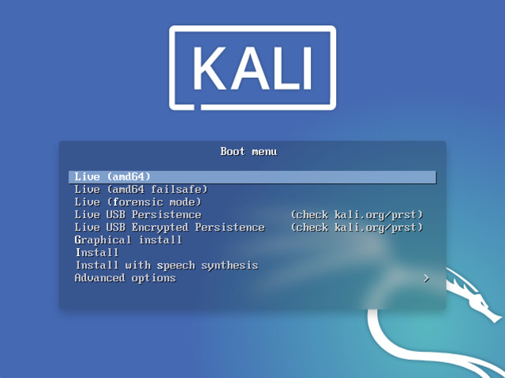
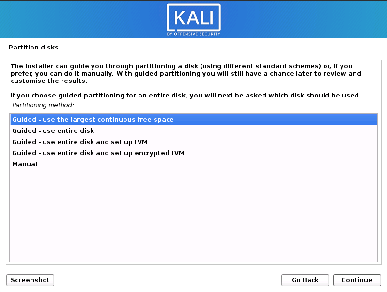
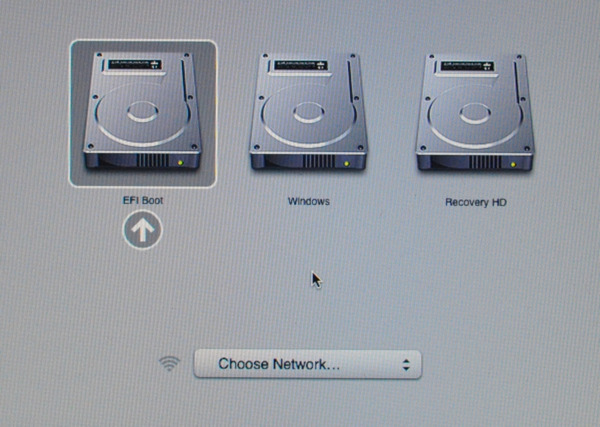
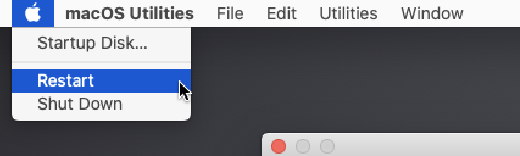

{}
중요! 최신 Mac 하드웨어(예: T2/Apple Silicon)는 리눅스가 전혀 또는 잘 작동하지 않아요. 이는 [리눅스 전반](https://github.com/Dunedan/mbp-2016-linux/)에 해당하며 칼리 리눅스에만 국한된 것이 아니에요.
기기의 모델 및 연식에 따라 성공적인 경험이 달라질 수 있어요.
{}

이 가이드에서는 [rEFInd](http://www.rodsbooks.com/refind/) 부트 매니저를 사용하여 macOS/OS X와 칼리 리눅스를 이중 부팅하는 방법을 보여드릴게요. macOS/OS X를 완전히 교체하려면 [Mac 하드웨어에 칼리 단일 부팅](/docs/installation/hard-disk-install-on-mac/) 가이드를 참조하세요.

서드파티 부트 매니저인 **rEFInd**를 사용하면 _([rEFIt](http://refit.sourceforge.net/)의 포크)_ macOS/OS X 기본 옵션보다 부팅 시 더 많은 제어 권한을 가질 수 있어요. 이중 부팅에 완벽한데, 기기 전원을 켤 때마다 키보드 단축키를 사용하지 않아도 칼리 리눅스를 부팅할 수 있기 때문이에요. rEFInd는 또한 그렇지 않으면 부팅할 수 없는 USB 장치에서 오래된 하드웨어(예: 비EFI)가 부팅되도록 돕는 장점이 있어요. 칼리 리눅스가 설치되면, rEFInd는 부팅 중에 숨겨지거나 완전히 제거되도록 사용자 지정할 수 있어요.

예시에서는 macOS High Sierra(10.13)를 사용하는 Mac Mini(2011년 중반)에 칼리 리눅스를 설치할 거예요. 동일한 절차는 macOS Catalina(10.15)를 사용하는 Mac Book Air(2014년 초)에서도 테스트되었어요.

### 설치 전 준비사항

이 가이드는 다음을 가정해요:

- [칼리 리눅스 단일 부팅 설치 가이드](/docs/installation/hard-disk-install/)를 읽으셨어요. 이 가이드도 동일한 설치 전 준비사항(시스템 요구사항 및 설정 가정)을 가지고 있어요.
- [칼리 리눅스를 다운로드](/docs/introduction/download-official-kali-linux-images/)할 때는 인스톨러 옵션이 아닌 [**라이브** 이미지](/docs/introduction/what-image-to-download/#which-image-to-choose)를 선택하세요.
- 설치할 단일 디스크가 있어요 _(운영 체제별로 전용 디스크가 아님)_.
- 현재 macOS/OS X 10.7 이상을 실행 중이에요 _(최신 버전이 더 선호됨)_ 하드웨어가 인텔(PowerPC CPU가 아님)이라는 의미이기 때문이에요.
- Mac 하드웨어 모델 및 연식에 따라 다음을 발견할 수 있어요:
  - CD/DVD **또는** USB 드라이브를 사용하여 부팅할 때 **다른 결과**가 나타날 수 있어요.
    - **rEFInd**가 미리 설치되어 있으면 특히 오래된 하드웨어와 비EFI 장치에서 **USB 드라이브**로부터의 부팅 가능성을 높일 수 있어요.
  - 그래픽 설치 프로그램을 사용할 때 트랙패드가 작동하지 않을 수 있어요(하지만 칼리 리눅스가 설치된 후에는 작동해요).
  - 내장 무선 기능이 작동하지 않을 수 있는데, 이는 `firmware-b43-installer`가 [기본 이미지에 포함되어 있지 않기](https://gitlab.com/kalilinux/packages/kali-meta/-/commit/bdd4daa7be16e5114e21ade252638211e7d54813) 때문이에요.

---

[칼리 리눅스 단일 부팅 설치 가이드](/docs/installation/hard-disk-install/)와는 다른 이미지를 사용해야 해요. **라이브** 이미지가 필요하기 때문이에요. 파티션을 마운트하지 않고 디스크 구조를 편집해야 하기 때문이에요(그렇지 않으면 파티션이 사용 중이게 돼요). 디스크 레이아웃 변경이 완료된 후에도 라이브 이미지를 사용하여 칼리 리눅스를 설치할 수 있지만, 다음과 같은 차이점이 있어요:

- [데스크톱 환경](/docs/general-use/switching-desktop-environments/) 변경 또는 제거.
- [메타패키지](/docs/general-use/metapackages/)의 설치 또는 제거.

이 두 가지 모두 설치 후에 해결할 수 있어요. 인스톨러 이미지로 바꾸는 것을 피할 수 있기 때문이에요(여러 개의 CD/DVD/USB가 필요하거나 중간에 다시 이미지를 만들어야 함).

{}
이 설치는 기존 파티션 편집이 포함되므로 쉽게 잘못될 수 있어요. 어떤 파티션을 수정하고 있는지, 칼리 리눅스를 어디에 설치하는지 주의하세요.

문제가 발생할 경우를 대비해 macOS/OS X 파일의 백업을 준비해 두는 것이 좋아요.
{}

### macOS/OS X 파티션 크기 조정 절차

칼리 리눅스를 설치하기 전에 하드 디스크에 공간이 필요해요. macOS/OS X 파티션의 형식에 따라 사용할 방법이 달라져요.

- macOS/OS X Sierra(10.12) 이전 버전은 Mac OS Extended(HFS+)를 사용해요.
  - 칼리 리눅스 라이브 세션에서 GParted를 사용하여 크기를 조정할 수 있어요
- macOS/OS X High Sierra(10.13) 이후 버전은 Apple File System(APFS)이 기본이에요.
  - 일반 macOS/OS X 세션 또는 복구 모드(권장)에서 크기를 조정할 수 있어요.

#### HFS+/GParted

1. 크기 조정을 시작하려면 **칼리 리눅스 설치 미디어를 삽입**하고 **기기 전원을 켜세요**. 즉시 [부팅 메뉴가 표시될 때까지 **옵션(또는 Alt) ⌥** 키를 누르고 있으세요](https://support.apple.com/ko-kr/102603) (rEFInd가 설치된 경우 rEFInd, 그렇지 않으면 기본 macOS/OS X).
macOS/OS X 설정에 따라 **복구 HD**가 있을 수도 있고 없을 수도 있어요.


- - -

2. 부팅 메뉴가 나타나면 모든 것이 예상대로 작동하는 경우 **두** 볼륨이 보여요:

- **EFI Boot** - **UEFI**를 지원하는 **최신 하드웨어**. **GUID 파티션 테이블(GPT)** 파티션이 사용되는 것이 일반적이에요.
- **Windows** - "비EFI" 부팅. **BIOS**를 사용하는 **오래된 하드웨어**에서 사용돼요. 여기서는 주로 **마스터 부트 레코드(MBR)** 파티션 테이블을 볼 수 있어요.

{}
**하나의 볼륨**(EFI Boot)만 보이는 경우 설치 미디어가 이 기기에서 **지원되지 않아요**. 기기의 펌웨어 연식 때문일 수 있어요.
**rEFInd**를 설치하고 다시 시도하는 것이 좋아요. rEFInd는 부트 매니저이기 때문이에요.
{}

칼리 리눅스가 [데비안 기반](/docs/policy/kali-linux-relationship-with-debian/)임에도 불구하고, macOS/OS X는 항상 비EFI 부팅 미디어를 Windows로 감지해요. **EFI Boot** 볼륨을 선택하여 계속하는 것이 좋아요. 그러나 설치가 이 지점에서 멈추면 전원을 껐다 켜고 Windows(비EFI/BIOS인 칼리 리눅스)를 선택하세요. 성공 여부는 Mac 하드웨어의 모델과 연식에 따라 달라져요.


- - -

3. 칼리 리눅스 **부팅 화면**이 표시될 거예요. **라이브**를 선택하면 칼리 리눅스 기본 데스크톱으로 부팅돼요.



- - -

4. 이제 **[GParted](https://packages.debian.org/testing/gparted)**를 실행하세요. 기존 macOS/OS X 파티션을 축소하여 빈 공간에 칼리 리눅스를 설치할 공간을 확보할 거예요.


- - -

5. GParted가 열리면 **macOS/OS X 파티션**을 **선택**하고 칼리 리눅스 설치를 위한 충분한 공간(최소 20GB 권장)을 남기고 **크기를 조정**하세요.

설정에 따라 보통 두 번째 옵션(가장 큰 파티션)인 경우가 많아요. 예시에는 세 개의 파티션이 있어요:

- EFI 업그레이드 파티션(`/dev/sda1`)
- macOS/OS X의 주 운영 체제(`/dev/sda2`)
- 시스템 복구(`/dev/sda3`)

{}
파티션에서 흰색이 아닌 부분으로 이동하면 사용 중인 섹션을 편집하는 거예요. 사용 중이지 않은 파티션 영역만 제거하세요.

세 번째 파티션(`/dev/sda3`)은 그대로 두고 실제 설치(`/dev/sda2`)만 축소해도 괜찮아요.
{}

{}
모든 macOS/OS X 파티션을 함께 그룹화하여 빈 공간을 끝에 배치하고 싶다면 그렇게 해도 돼요.
{}


- - -

6. macOS/OS X 파티션 크기를 조정한 후에는 하드 디스크에 **"모든 작업 적용"**을 꼭 하세요. GParted를 종료하고 **재부팅**하세요.

#### APFS/복구

명령줄이나 그래픽(디스크 유틸리티 사용) 모두 사용해서 크기 조정이 가능해요. 두 옵션 모두 "일반" 세션 또는 복구 모드에서 크기 조정을 지원해요. 복구 모드를 사용하면 드라이브가 사용 중이 아니므로 문제 발생 가능성이 줄어들어요. 명령줄 방법을 추천하는데, 이렇게 하면 빈 파티션을 만들 수 있어서 나중에 설정 과정이 간단해져요.

1. 명령줄에 접근하려면: **Spotlight->터미널**

2. `diskutil list`를 사용하여 크기를 조정하려는 디스크가 `disk0s2`이고 약 \~500GB임을 확인할 수 있어요:

```console
$ diskutil list
/dev/disk0 (internal, physical):
   #:                       TYPE NAME                    SIZE       IDENTIFIER
   0:      GUID_partition_scheme                        *500.1 GB   disk0
   1:                        EFI EFI                     209.7 MB   disk0s1
   2:                 Apple_APFS Container disk1         499.9 GB   disk0s2

/dev/disk1 (synthesized):
   #:                       TYPE NAME                    SIZE       IDENTIFIER
   0:      APFS Container Scheme -                      +499.9 GB   disk1
                                 Physical Store disk0s2
   1:                APFS Volume Macintosh HD            16.6 GB    disk1s1
   2:                APFS Volume Preboot                 21.4 MB    disk1s2
   3:                APFS Volume Recovery                516.2 MB   disk1s3
   4:                APFS Volume VM                      20.5 KB    disk1s4

$
```

- - -

3. 500GB를 400GB로 줄이려고 해요. 이렇게 하면 칼리 리눅스에 100GB가 생겨요(최소 20GB를 권장해요):

```console
$ sudo diskutil apfs resizeContainer disk0s2 400g
Password:
Started APFS operation
Aligning shrink delta to 99,898,105,856 bytes and targeting a new physical store size of 400,000,000,000 bytes
Determined the minimum size for the targeted physical store of this APFS Container to be 17,949,245,440 bytes
Resizing APFS Container designated by APFS Container Reference disk1
The specific APFS Physical Store being resized is disk0s2
Verifying storage system
Using live mode
Performing fsck_apfs -n -x -l /dev/disk0s2
Checking volume
Checking the container superblock
Checking the EFI jumpstart record
Checking the space manager
Checking the object map
Checking the APFS volume superblock
Checking the object map
Checking the fsroot tree
Checking the snapshot metadata tree
Checking the extent ref tree
Checking the snapshots
Checking the APFS volume superblock
Checking the object map
Checking the fsroot tree
Checking the snapshot metadata tree
Checking the extent ref tree
Checking the snapshots
Checking the APFS volume superblock
Checking the object map
Checking the fsroot tree
Checking the snapshot metadata tree
Checking the extent ref tree
Checking the snapshots
Checking the APFS volume superblock
Checking the object map
Checking the fsroot tree
Checking the snapshot metadata tree
Checking the extent ref tree
Checking the snapshots
Verifying allocated space
The volume /dev/disk0s2 appears to be OK
Storage system check exit code is 0
Shrinking APFS Physical Store disk0s2 from 499,898,105,856 to 400,000,000,000 bytes
Shrinking APFS data structures
Shrinking partition
Modifying partition map
Finished APFS operation
$
```

- - -

4. `diskutil list`를 다시 빠르게 확인하면 성공적으로 완료된 것을 볼 수 있어요:

```console
$ diskutil list
/dev/disk0 (internal, physical):
   #:                       TYPE NAME                    SIZE       IDENTIFIER
   0:      GUID_partition_scheme                        *500.1 GB   disk0
   1:                        EFI EFI                     209.7 MB   disk0s1
   2:                 Apple_APFS Container disk1         400.0 GB   disk0s2

/dev/disk1 (synthesized):
   #:                       TYPE NAME                    SIZE       IDENTIFIER
   0:      APFS Container Scheme -                      +400.0 GB   disk1
                                 Physical Store disk0s2
   1:                APFS Volume Macintosh HD            16.6 GB    disk1s1
   2:                APFS Volume Preboot                 21.4 MB    disk1s2
   3:                APFS Volume Recovery                516.2 MB   disk1s3
   4:                APFS Volume VM                      20.5 KB    disk1s4
$
```

### 칼리 리눅스 설치 절차

1. 이 시점부터 설치 절차는 파티셔닝 단계까지 [칼리 리눅스 하드 디스크 설치](/docs/installation/hard-disk-install/)와 유사해요.
이 시점에서 **"안내됨 - 가장 큰 연속 여유 공간 사용"**을 선택해야 해요 _("안내됨 - 전체 디스크" 대신)_ 이는 이전에 **gparted**로 만든 공간이에요.

_부팅 메뉴를 보기 위해 시작할 때 [**옵션(또는 Alt) ⌥** 키를 누르고 있어야 한다는 점](https://support.apple.com/ko-kr/102603)을 잊지 마세요(rEFInd가 설치되어 있지 않은 경우)._



- - -

2. [칼리 리눅스 단일 부팅 설치 가이드](/docs/installation/hard-disk-install/)를 계속 따라갈 수 있지만, 라이브 이미지를 사용하고 있기 때문에 [데스크톱 환경](/docs/general-use/switching-desktop-environments/) 또는 [메타패키지](/docs/general-use/metapackages/)를 선택할 수 있는 옵션은 없어요. 설치가 완료되면 **재부팅**하세요.

기본적으로 macOS/OS X는 다른 운영 체제/설치 미디어가 아닌 자체적으로 부팅해요. 이미 여러 번 해봤듯이 [옵션(또는 Alt) ⌥ 키](https://support.apple.com/ko-kr/102603)를 계속 눌러야 해요. 이 방법은 "작동"하지만 macOS/OS X 외에는 아무 것도 부팅하지 않기 쉬우므로 이상적이지 않아요. rEFInd는 macOS/OS X의 제한적인 기본 부트 매니저를 대체하여 더 많은 옵션을 제공해요(테마도 적용할 수 있어요).



### rEFInd 설치하기

rEFInd는 보다 폭넓은 옵션을 제공하여 macOS/OS X의 제한적인 기본 부트 매니저를 대체하는 부트 매니저예요. 칼리 리눅스 설치 전후에 macOS/OS X나 칼리 리눅스에서 설치할 수 있어요.

**macOS/OS X El Capitan** (10.11) 출시 이후 [추가 보안 기능](https://www.rodsbooks.com/refind/sip.html)인 **[시스템 무결성 보호](https://support.apple.com/ko-kr/102149) (SIP)**가 도입되었어요. macOS/OS X에서 rEFInd를 설치하려면 먼저 이것을 일회성으로 우회하거나_(권장)_ 비활성화해야 해요. 또는 칼리 리눅스에서 rEFInd를 설치할 수도 있어요 _(라이브 모드보다는 칼리 리눅스가 설치된 후에 하는 것을 추천해요)_.


#### macOS/OS X에서 rEFInd 설치하기

복구 모드에서는 공간과 도구/라이브러리가 제한적이므로 rEFInd를 쉽게 다운로드할 수 없어요(예: curl이 https를 지원하지 않음). 따라서 일반 macOS/OS X 세션에서 rEFInd를 다운로드한 다음 복구 모드로 재부팅하여 설치할 거예요.

이 글을 작성할 때 [rEFInd](https://sourceforge.net/projects/refind/)의 최신 버전은 **0.12.0**이에요.

1. rEFInd를 다운로드하고 올바른 zip 파일인지 확인한 다음 압축을 풀어요:

```console
$ curl -s -L https://sourceforge.net/projects/refind/files/0.12.0/refind-bin-0.12.0.zip -o ~/Downloads/refind.zip
$
$ file Downloads/refind.zip
Downloads/refind.zip: Zip archive data, at least v1.0 to extract
$
$ unzip -q -d Downloads/ Downloads/refind.zip
$
$ ls Downloads/
refind-bin-0.12.0 refind.zip
$
```

2. macOS/OS X를 다시 시작하고, [부팅 로고가 표시될 때까지 **명령(⌘)** 및 **R** 키를 동시에 누르세요](https://support.apple.com/ko-kr/102603). 이 시점에서 펌웨어 비밀번호가 있다면 계속하기 위해 입력해야 해요.

이렇게 하면 펌웨어에 내장된 **macOS/OS X의 [복구 시스템](https://support.apple.com/ko-kr/102655)** 버전을 사용하여 **SIP를 우회**할 거예요(인터넷 연결이 필요하지 않음).


- - -

3. 복구 모드가 완전히 로드되면 메뉴에서: **유틸리티->터미널**.


- - -

4. 그런 다음 압축 해제된 폴더로 이동해야 해요.

{}
경로는 하드 디스크 레이블(이 경우 `Macintosh HD`) 및 사용자 이름(`username`) 그리고 rEFInd 버전(`0.12.0`)에 따라 다를 거예요
{}

```console
# cd /Volumes/Macintosh\ HD/Users/username/Downloads/refind-bin-0.12.0/
#
# pwd
/Volumes/Macintosh HD/Users/username/Downloads/refind-bin-0.12.0
#
```

- - -

5. 쉘 스크립트 `refind-install`을 실행해요.

{}
복구 모드에 있어서 SIP가 실행되고 있지 않지만, rEFInd는 여전히 SIP가 활성화되어 있다고 생각해요. 이 설정을 덮어쓸 거예요.
{}

```console
# ./refind-install
ShimSource is none
Installing rEFInd on macOS....
Installing rEFInd to the partition mounted at /Volumes/ESP

**** ALERT: SIP ENABLED! ****

rEFInd cannot be installed because System Integrity Protection (SIP) seems
to be enabled! You must install rEFInd from your Recovery installation or
from another OS. To install from the Recovery system:

  1. Reboot
  2. Hold down Command+R as the chime sounds
  3. When the OS has booted, select Utilities->Terminal
  4. Change to this directory with the 'cd' command; it will probably be under
     /Volumes/Macintosh HD/Users/username/Downloads/refind-bin-0.12.0
  5. Re-run this script.

If you believe SIP is NOT enabled, you may attempt an installation anyhow,
but it may fail.

For more on this subject, see http://www.rodsbooks.com/refind/sip.html

Do you want to attempt installation (Y/N)? y
Copied rEFInd binary files

Copying sample configuration file as refind.conf; edit this file to configure
rEFInd.

#
```

- - -

6. macOS/OS X를 재부팅해요. 메뉴에서: **Apple->재시작**.



- - -

7. 재시작 후 새로운 부트 매니저인 rEFInd가 보일 거예요.

#### 칼리 리눅스에서 rEFInd 설치하기

**[rEFInd](https://packages.debian.org/testing/refind)**는 칼리 리눅스에도 포함되어 있어요. 다음과 같이 빠르게 설치할 수 있어요:

```console
kali@kali:~$ sudo apt update
kali@kali:~$
kali@kali:~$ sudo apt install -y refind
```

- - -

설치 중에 rEFInd를 자동으로 실행할지에 대한 메시지가 표시돼요. **예(Yes)**를 누르는 것이 좋아요. 그렇지 않으면 나중에 `sudo dpkg-reconfigure refind` (또는 `sudo refind-install`)을 실행해야 해요:

```console
 ┌────────────────────────┤ Configuring refind ├────────────────────────┐
 │                                                                      │
 │ It is necessary to install rEFInd to the EFI System Partition (ESP)  │
 │ for it to control the boot process.                                  │
 │                                                                      │
 │ Not installing the new rEFInd binary on the ESP may leave the        │
 │ system in an unbootable state. Alternatives to automatically         │
 │ installing rEFInd include running /usr/sbin/refind-install by hand   │
 │ or installing the rEFInd binaries manually by copying them from      │
 │ subdirectories of /usr/share/refind-{version}.                       │
 │                                                                      │
 │ Automatically install rEFInd to the ESP?                             │
 │                                                                      │
 │                   <Yes>                      <No>                    │
 │                                                                      │
 └──────────────────────────────────────────────────────────────────────┘

[...]

ShimSource is none
Installing rEFInd on Linux....
ESP was found at /boot/efi using vfat
Installing driver for ext4 (ext4_x64.efi)
Copied rEFInd binary files

Copying sample configuration file as refind.conf; edit this file to configure
rEFInd.

Creating new NVRAM entry
rEFInd is set as the default boot manager.
Creating //boot/refind_linux.conf; edit it to adjust kernel options.
kali@kali:~$
```

재시작 후 새로운 부트 매니저인 rEFInd가 보일 거예요.

### rEFInd 구성하기

원한다면 이제 다양한 방법으로 rEFInd를 변경할 수 있어요:

- 기본 OS 선택
- 메뉴 선택 시간 제한
- 기본 OS로 직접 부팅(참고로, 부팅 중에 **옵션(또는 Alt) ⌥** 키를 누르면 일회성 부팅 메뉴가 표시돼요).
- 사용자 지정 아이콘/테마 추가.

#### refind.conf

#### macOS/OS X El Capitan

이러한 변경 사항을 적용하려면 rEFInd의 구성 파일을 편집하면 돼요. macOS/OS X El Capitan(10.11) 이상을 사용하는 경우 파일에 액세스하기 위해 먼저 EFI 부팅 볼륨을 마운트해야 해요. 다음과 같이 하면 돼요:

```console
$ cd ~/Downloads/refind-bin-*/
$
$ sudo ./mountesp
The ESP has been identified as /dev/disk0s1; attempting to mount it....
The ESP is mounted at /Volumes/ESP
username@Usernames-Mac refind-bin-0.12.0 %

$
$ vim /Volumes/ESP/EFI/refind/refind.conf
$
```

#### macOS/OS X Yosemite

macOS/OS X Yosemite(10.10) 이전 버전을 사용하는 경우 마운트가 필요하지 않으므로 구성 파일은 다음 위치에 있어요:

```console
$ sudo vim /EFI/refind/refind.conf
$ s
```

#### 칼리 리눅스

칼리 리눅스에서 구성 파일은 다음 위치에 있어요:

```console
kali@kali:~$ sudo vim /boot/efi/EFI/refind/refind.conf
kali@kali:~$
```

### 설치 후 과정

이제 칼리 리눅스 설치를 완료했으니 시스템을 사용자 지정할 차례예요.

[일반 사용 섹션](/docs/general-use/)에서 더 많은 정보를 찾을 수 있으며, [사용자 포럼](https://forums.kali.org/)에서 칼리 리눅스를 최대한 활용하는 방법에 대한 팁도 찾을 수 있어요.
