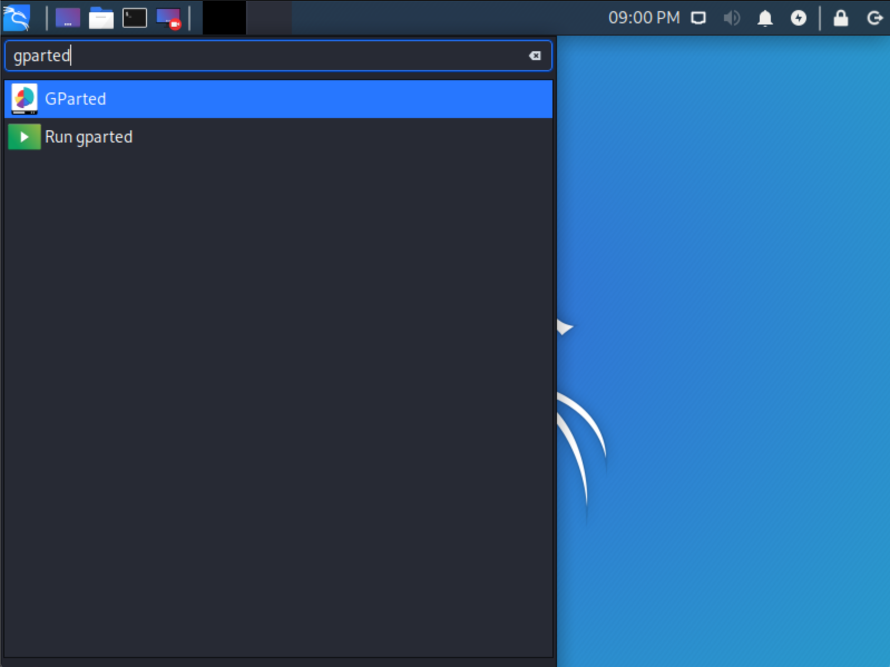
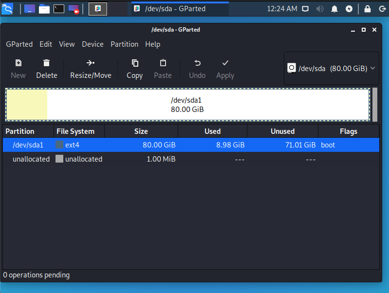
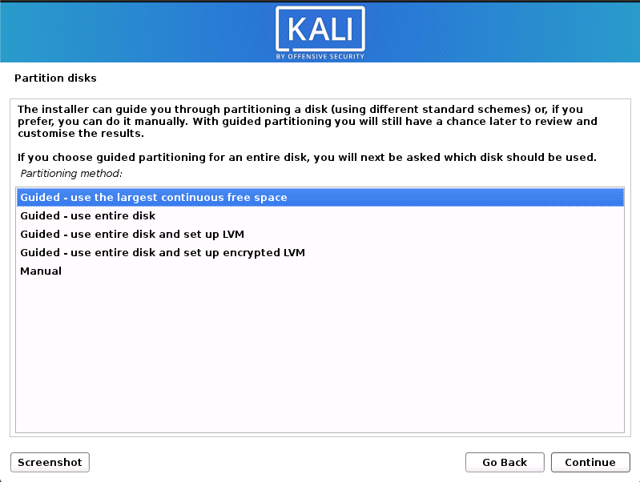

Installing Kali alongside another Linux installation can be quite useful. However, you need to exercise caution during the setup process. First, make sure that you've backed up any important data on your Linux installation. Since you'll be modifying your hard drive, you'll want to store this backup on external media. Once you've completed the backup, we recommend you peruse [Kali Linux Hard Disk Install](/docs/installation/kali-linux-hard-disk-install/), which explains the normal procedure for a basic Kali install.

In our example, we will be installing Kali Linux alongside an installation of Ubuntu, which is currently taking up 100% of the disk space in our computer. We will start by resizing our current Linux partition to occupy less space and then proceed to install Kali Linux in the newly-created empty partition.

### Installation Prerequisites

This guide will make the following assumptions when following:

- You have read our [single boot Kali Linux install guide](/docs/installation/kali-linux-hard-disk-install/), as this has the same Installation Prerequisites (system requirements & setup assumptions)
- When [downloading Kali Linux](/docs/introduction/download-official-kali-linux-images/), [pick the **live** image](/docs/introduction/what-image-to-download/#which-image-to-choose), rather than the installer option.
- A single disk to install to _(rather than a dedicate disk per operating system)_

We need to use a different image from the [single boot Kali Linux install guide](/docs/installation/kali-linux-hard-disk-install/), as we need the **live** image. This is because we need to edit the disk structure without mounting any partitions, otherwise it would be in-use. After we have finished altering the disk, we can install Kali Linux with either:
- The same live image, and post installation after the setup is complete, switch (or remove) the [desktop environment](/docs/general-use/switching-desktop-environments/), and/or change any [metapackages](/docs/general-use/metapackages/). Else,
- Switch to the installer image (by using multiple CD/DVD/USBs or re-image on the same medium), and then continue the [single boot guide](/docs/installation/kali-linux-hard-disk-install/) as exactly as before

{}
This installation has the potential to go wrong very easily as it involves editing existing partitions. Be aware of what partitions you are modifying and where you are installing Kali Linux to. 
Having a backup of your Linux files available is a good idea in the event something goes wrong.
{}

### Resize Linux Procedure

1. To start your installation, boot Kali Linux live with your chosen installation medium. You should be greeted with the Kali Boot screen. Select **Live**, and you should be booted into the Kali Linux default desktop.

2. Now launch the **[gparted](https://packages.debian.org/testing/gparted)** program. We'll use **gparted** to shrink the existing Linux partition to give us enough room to install Kali Linux.

3. Select your Linux partition & Resize it your Linux partition and leave enough space (we recommend at least 20 GB) for the Kali installation. If you are moving past into any non-white in the partition then you are editing a section that is in use. Only remove from the area of the partition that is not in use.

4. Once you have resized your Linux partition, ensure you "**Apply All Operations**" on the hard disk. Exit **gparted** and **reboot**.

### Kali Linux Installation Procedure

1. The installation procedure from this point onwards is similar to a [Kali Linux Hard Disk install](/docs/installation/kali-linux-hard-disk-install/), until the point of the partitioning, where you need to select "Guided - use the largest continuous free space" that you created earlier with **gparted**.

2. Once the installation is done, reboot. You should be greeted with a GRUB boot menu, which will allow you to boot either into Kali Linux or the other Linux install.

- - -

## Post Installation

Now that you've completed installing Kali Linux, it's time to customize your system.

The [General Use section](/docs/general-use/) has more information and you can also find tips on how to get the most out of Kali in our [User Forums](https://forums.kali.org/).
