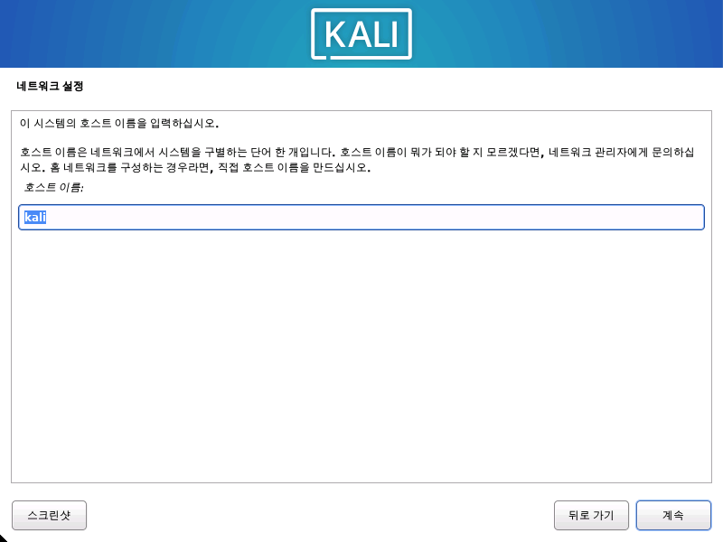
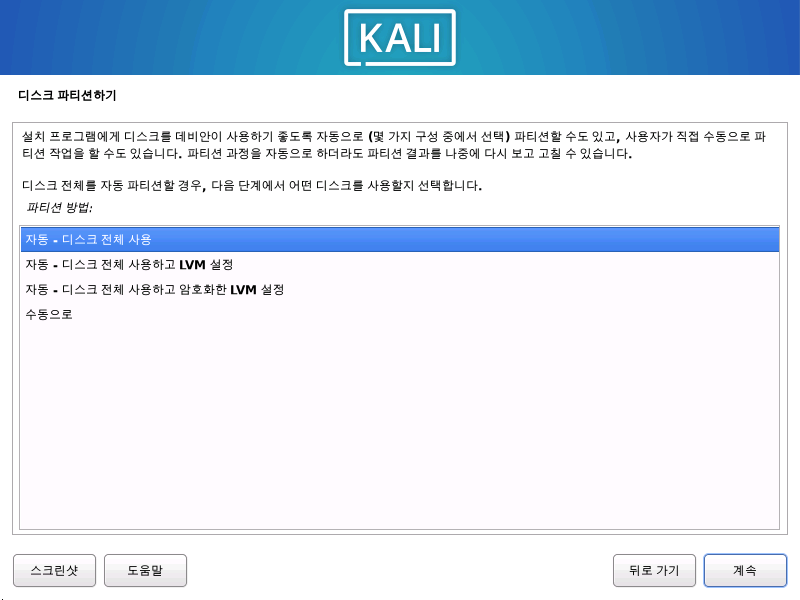
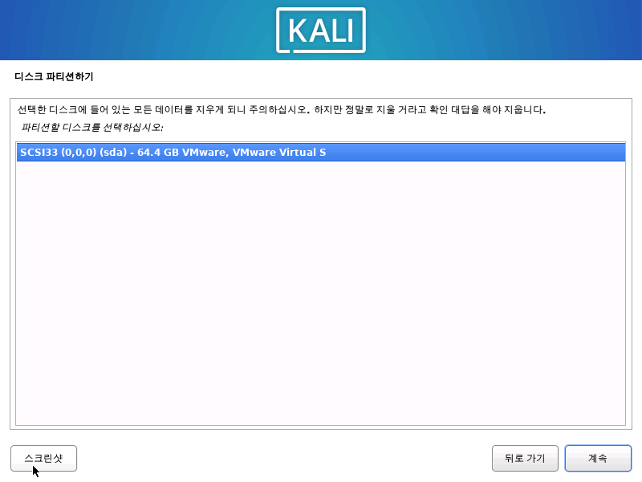
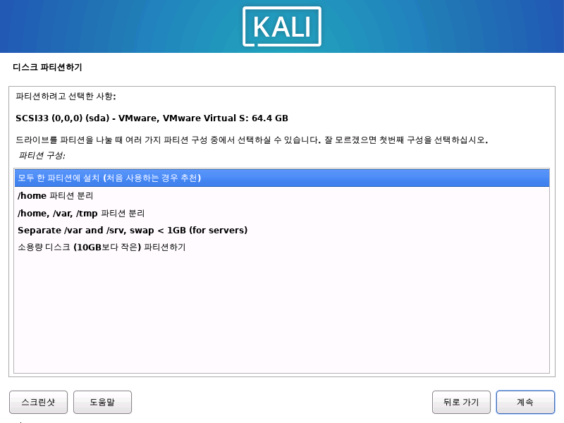
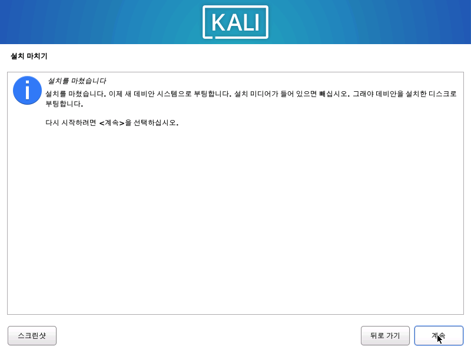

칼리 리눅스를 컴퓨터에 설치하는 것(단일 부팅)은 쉬운 과정이에요. 이 가이드에서는 파티션 암호화 옵션을 포함한 기본 설치(물리적 하드웨어 또는 [게스트 VM](/docs/virtualization/)에서 가능)를 다룰 거예요. 경우에 따라 전체 디스크 암호화(FDE)를 사용하여 암호화하고 싶은 민감한 데이터가 있을 수 있어요. 설정 과정에서 하드 디스크 또는 USB 드라이브에 LVM 암호화 설치를 시작할 수 있어요.

먼저 호환되는 컴퓨터 하드웨어가 필요해요. 칼리 리눅스는 amd64(x86_64/64비트) 플랫폼에서 지원돼요. 하드웨어 요구사항은 아래 섹션에 나열된 것처럼 최소한으로 필요하지만, 더 좋은 하드웨어는 당연히 더 좋은 성능을 제공할 거예요. UEFI가 있는 최신 하드웨어와 BIOS가 있는 오래된 시스템에서 칼리 리눅스를 사용할 수 있어요.

예시에서는 기존 운영 체제가 미리 설치되지 않은 새 게스트 VM에 칼리 리눅스를 설치할 거예요. 가이드 전체에서 다른 가능한 시나리오에 대해 설명할 거예요.

### 시스템 요구사항

칼리 리눅스의 설치 요구사항은 설치하고자 하는 것과 설정에 따라 달라져요. 시스템 요구사항은 다음과 같아요:

- 낮은 수준에서는 데스크톱이 없는 기본 SSH(Secure Shell) 서버로 칼리 리눅스를 설정할 수 있으며, **최소 128MB RAM(512MB 권장)** 및 **2GB의 디스크 공간**만 있으면 돼요.
- 더 높은 수준에서는 기본 Xfce4 데스크톱과 `kali-linux-default` [메타패키지](/docs/general-use/metapackages/)를 설치하려면 **최소 2GB RAM**과 **20GB 디스크 공간**을 목표로 해야 해요.
  - Burp Suite와 같은 리소스를 많이 사용하는 응용 프로그램을 사용할 때는 [해당 사이트](https://portswigger.net/support/burp-suite-software-faqs)에서 최소 **8GB RAM**을 권장해요 _(대규모 웹 애플리케이션인 경우 더 많이!)_ 또는 동시에 여러 프로그램을 사용하는 경우에도요.

### 설치 전 준비사항

이 가이드는 칼리 리눅스 설치 시 다음과 같은 가정을 해요:

- amd64 설치 이미지를 사용.
- CD/DVD 드라이브 / USB 부팅 지원.
- 설치할 단일 디스크.
- 인터넷에 접속할 수 있는 네트워크(DHCP 및 DNS 활성화)에 연결됨.

{}
하드 디스크의 기존 데이터를 모두 지울 것이므로 기기의 중요한 정보를 외부 매체에 백업하세요.
{}

### 설치 준비

1. [칼리 리눅스 다운로드](/docs/introduction/download-official-kali-linux-images/) _(***Installer***로 표시된 이미지를 [권장](/docs/introduction/what-image-to-download/#which-image-to-choose)해요)._

2. 칼리 리눅스 ISO를 DVD에 굽거나 [USB 드라이브에 라이브 이미지로 만드세요](/docs/usb/live-usb-install-with-windows/). _(할 수 없는 경우 [칼리 리눅스 네트워크 설치](/docs/installation/network-pxe/)를 확인하세요)._

3. 기기의 중요한 정보를 외부 매체에 백업하세요.

4. 컴퓨터가 BIOS/UEFI에서 CD/DVD/USB에서 부팅하도록 설정되어 있는지 확인하세요.

5. UEFI 설정에서 보안 부팅이 비활성화되어 있는지 확인하세요. 칼리 리눅스 커널은 서명되지 않았으며 보안 부팅으로 인식되지 않아요.

### 칼리 리눅스 설치 절차

#### 부팅

1. 설치를 시작하려면 선택한 설치 미디어로 부팅하세요. 칼리 리눅스 부팅 화면이 나타날 거예요. **그래픽 설치** 또는 **설치**(텍스트 모드)를 선택하세요.
이 예시에서는 그래픽 설치를 선택했어요.

{}
**라이브** 이미지를 사용하는 경우 **라이브**라는 다른 모드(기본 부팅 옵션)도 볼 수 있어요.
{}

#### 언어

2. 선호하는 언어를 선택하세요. 이는 설정 과정과 칼리 리눅스 사용 시 모두 사용될 거예요.

- - -

3. 지리적 위치를 지정하세요.

- - -

4. 키보드 레이아웃을 선택하세요.

#### 네트워크

5. 설정은 이제 네트워크 인터페이스를 검색하고 DHCP 서비스를 찾은 다음 시스템의 호스트 이름을 입력하라는 메시지를 표시해요. 아래 예시에서는 호스트 이름으로 **kali**를 입력했어요.

{}
DHCP 서비스가 있는 네트워크 액세스가 감지되지 않으면 네트워크 정보를 수동으로 입력하거나 지금은 네트워크를 구성하지 않을 수 있어요.
{}

- 네트워크에서 실행 중인 DHCP 서비스가 없는 경우, 네트워크 인터페이스를 탐색한 후 수동으로 네트워크 정보를 입력하라는 메시지가 표시되거나 건너뛸 수 있어요.
- 칼리 리눅스가 NIC를 감지하지 못하면 메시지가 표시될 때 드라이버를 포함하거나 [사용자 지정 칼리 리눅스 ISO](/docs/development/live-build-a-custom-kali-iso/)에 미리 포함해야 해요.
- 설정이 여러 NIC를 감지하면 설치에 사용할 것을 선택하라는 메시지가 표시될 수 있어요.
- 선택한 NIC가 802.11 기반인 경우, 호스트 이름을 묻기 전에 무선 네트워크 정보를 묻는 메시지가 표시돼요.

- - -

6. 이 시스템이 사용할 기본 도메인 이름을 선택적으로 제공할 수 있어요(값은 DHCP에서 가져오거나 기존 운영 체제가 미리 있는 경우 가져올 수 있음).

#### 사용자 계정
{}
사진에서는 암호가 단순하지만, 실제로는 길고 강력한 암호가 좋아요.
{}

7. 다음으로 시스템의 사용자 계정을 만드세요(전체 이름, 사용자 이름 및 강력한 암호). 

#### 시계
{}
계속 한국어로 설치를 진행해왔다면 이 부분은 뜨지 않을 거에요. 다음으로 넘어가주세요.
{}
8. 다음으로 시간대를 설정하세요. 

#### 디스크

9. 설치 프로그램이 이제 디스크를 검색하고 설정에 따라 다양한 옵션을 제공할 거예요.

이 가이드에서는 깨끗한 디스크를 사용하고 있어서 네 가지 옵션 중에서 선택할 수 있어요. 우리는 **자동 - 디스크 전체 사용**을 선택할 거예요. 이는 칼리 리눅스의 단일 부팅 설치이므로 다른 운영 체제를 설치하지 않을 것이고, 디스크를 지울 것에 동의하기 때문이에요.

디스크에 이미 데이터가 있는 경우, 아래 예시보다 추가 옵션 _(안내됨 - 가장 큰 연속 여유 공간 사용)_ 이 있어요. 이는 설정이 기존 데이터를 변경하지 않도록 지시하며, 다른 운영 체제로 이중 부팅하기에 완벽해요. 이번 예시에서는 해당되지 않으므로 보이지 않아요.

경험이 많은 사용자는 "수동" 파티셔닝 방법을 사용하여 더 세분화된 구성 옵션을 사용할 수 있으며, 이는 [BTRFS 가이드](/docs/installation/btrfs/)에서 더 자세히 다뤄져요.

칼리 리눅스를 암호화하려면 **자동 - 디스크 전체 사용하고 암호화한 LVM 설정**을 선택하여 전체 디스크 암호화(FDE)를 활성화할 수 있어요. 이 옵션을 선택하면 설정 과정에서(이 가이드에 표시되지 않음) 암호를 입력하라는 메시지가 표시돼요(두 번). 칼리 리눅스를 시작할 때마다 이 암호를 입력해야 해요.

- - -

10. 파티션할 디스크를 선택하세요.

- - -

11. 필요에 따라 모든 파일을 단일 파티션(기본값)에 보관하거나 최상위 디렉터리 중 하나 이상에 대해 별도의 파티션을 만들 수 있어요.

어떤 옵션을 선택할지 확실하지 않으면 "**모두 한 파티션에 설치(처음 사용하는 경우 추천)**"을 원할 거예요.

- - -

12. 다음으로 설치 프로그램이 되돌릴 수 없는 변경을 하기 전에 디스크 구성을 검토할 수 있는 마지막 기회가 있어요. '계속'을 클릭하면 설치 프로그램이 작업을 시작하고 거의 완료된 설치를 갖게 될 거예요.

#### 암호화된 LVM

이전 단계에서 활성화한 경우, 칼리 리눅스는 이제 하드 디스크의 보안 삭제를 시작한 다음 LVM 암호를 요청할 거예요.

강력한 암호를 사용해야 해요. 그렇지 않으면 약한 암호에 대한 경고가 표시돼요.

{}
이 삭제는 드라이브의 크기와 속도에 따라 "꽤 오래" (몇 시간) 걸릴 수 있어요.

위험을 감수하고 싶다면 건너뛸 수 있어요.
{}

#### 프록시 정보

13. 칼리 리눅스는 응용 프로그램을 배포하기 위해 중앙 저장소를 사용해요. 필요한 경우 적절한 프록시 정보를 입력해야 해요.

#### 메타패키지

{}
네트워크 액세스를 설정하지 않은 경우 메시지가 표시되면 **설정 계속하기**를 선택하세요.
{}

{}
**라이브** 이미지를 사용하는 경우 다음 단계가 없어요.
{}

14. 다음으로 설치할 [메타패키지](/docs/general-use/metapackages/)를 선택할 수 있어요. 기본 선택은 표준 칼리 리눅스 시스템을 설치하며 여기서 아무것도 변경할 필요가 없어요.

기본 선택을 변경하고 싶다면 [이 가이드](/docs/introduction/what-image-to-download/#which-desktop-environment-and-software-collection-to-choose-during-installation)를 참조하세요.

선택하고 나서 계속을 누르면 아래와 같은 창이 뜨면서 진행될 거에요. 시간을 갖고 기다려주면 끝날 거에요. 보통 10분은 걸리지만 환경에 따라서 더 빠를 수도 그 반대일 수도 있어요.

#### 부팅 정보

15. 다음으로 GRUB 부트 로더 설치를 확인하세요.

- - -

16. GRUB 부트로더를 설치할 하드 드라이브를 선택하세요 (**기본적으로 아무 드라이브도 선택되지 않음**).

#### 재부팅

17. 마지막으로 '계속'을 클릭하여 새로운 칼리 리눅스 설치로 재부팅하세요.

### 설치 후 과정

이제 칼리 리눅스 설치가 끝났어요! 원하는대로 커스텀하고 설치도 할 수 있게 되었네요!
한국어로 계속 설치해왔다면 재부팅하고 난 뒤에 한국어가 깨지는 걸 볼 수 있어요. 그치만 이 문제는 [칼리 리눅스 한글 깨짐 해결하기](/troubleshooting/%ED%95%9C%EA%B8%80-%EA%B9%A8%EC%A7%90-%ED%95%B4%EA%B2%B0/)를 통해서 완벽하게 해결할 수 있어요!

더 많은 정보가 필요하다면? [일반 사용 섹션](/docs/general-use/)에서 더 많은 정보를 찾을 수 있으며, [사용자 포럼](https://forums.kali.org/)에서 칼리 리눅스를 최대한 활용하는 방법에 대한 팁도 찾을 수 있어요!