## Content:

- [Overview](#overview)
- [Installation steps](#kali-linux-btrfs-installation-steps)
- [Usage](#usage)

## Overview

#### We are going to install Kali Linux to automatically create file system snapshots during apt operations so we can rollback the system after botched upgrades.

[Btrfs](https://btrfs.wiki.kernel.org/index.php/Main_Page) is a modern copy on write (CoW) filesystem for Linux aimed at implementing advanced features such as pooling, snapshots, checksums, and integrated multi-device spanning.
In particular, the [snapshot](https://btrfs.wiki.kernel.org/index.php/UseCases#Snapshots_and_subvolumes) support is what makes Btrfs attractive for Kali installations on bare metal. Virtualization solutions such as VMWare and Virtualbox provide their own snapshotting functionality and using btrfs in those environments is not really required.

The snapshotting strategy of this walkthrough centres around a tool called "apt-btrfs-snapshot" from the Ubuntu repositories,
which is a wrapper around "apt". This wrapper transparently hooks into the apt workflow and automatically creates snapshots before and after any apt operation.
This neat little feature allows to easily rollback a system after a botched upgrade.

Snapper is another useful utility to create snapshots. We are preparing the Kali system for the use of snapper by creating a separate subvolume for its snapshots but we are not
including the installation and usage of snapper in this walkthrough.
Details about snapper can be found on the following website:
[http://snapper.io/](http://snapper.io/)


### Installation Overview

Installing Kali Linux with snapshotting functionality is very similar to a standard installation with the following exceptions:

1. We pause the installation midway to set up a btrfs partition and btrfs subvolumes on the command line using the tool "partman" before continuing the installation
2. We adjust the fstab and move some folders to the new subvolumes before we reboot into the newly installed system


### Partitioning Scheme

We are going to use the following layout:

```plaintext
Mount Point         | Subvolume         | Description
-------------------------------------------------------------------------
/                   | @                 | The root filesystem incl. /boot
/home               | @home             | User home directories
/root               | @root             | The root user's home directory
/var/log            | @log              | Log files
/.snapshots         | @snapshots        | Snapper's snapshot directory
```


## Kali Linux Btrfs Installation Steps

#### Installation Prerequisites

* A minimum of 20 GB disk space for the Kali Linux install.
* RAM for i386 and amd64 architectures, minimum: 1GB, recommended: 2GB or more.
* CD-DVD Drive / USB boot support

### Preparing for the Installation

1. [Download Kali Linux](/docs/introduction/download-official-kali-linux-images/).
2. Burn the Kali Linux ISO to DVD or [Image Kali Linux Live to USB](/downloading/kali-linux-live-usb-install).
3. Ensure that your computer is set to boot from CD / USB in your BIOS.

### Kali Linux Installation Procedure

1. To start your installation, boot with your chosen installation medium. You should be greeted with the Kali Boot screen. Choose _Graphical Install_.

2. The installation steps are identical to a standard Kali installation except a pause during the step where you choose a domain name as seen below.

    
3. When prompted, pause the installation and switch to the second VT via "Ctrl + Alt + 2"

    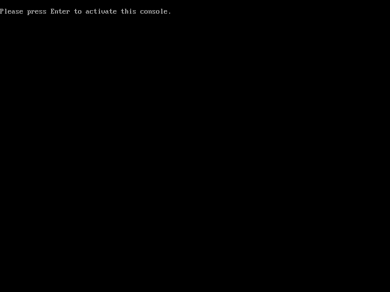


    Press `enter` to activate that console and run `partman` to partition the hard disk.

    
4. First we create two partitions: swap and root.
   Choose `manual` under "Partitioning method" and press `enter`.

    
5. Choose your hard disk:

    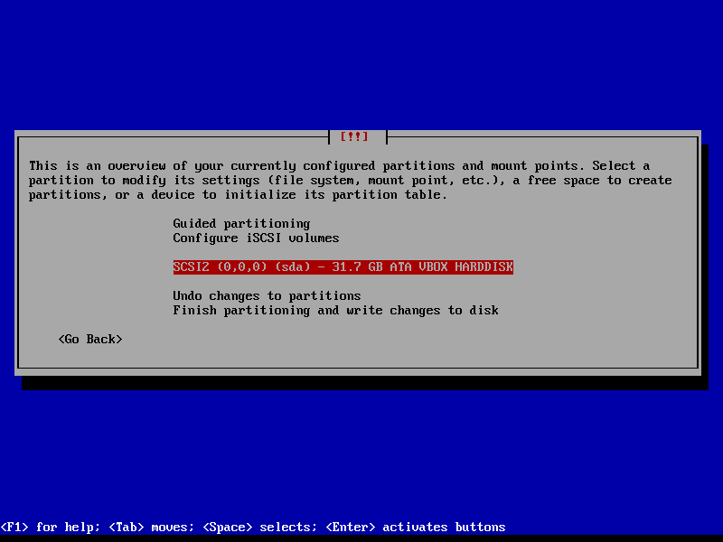
6. Confirm to create a new partition table

    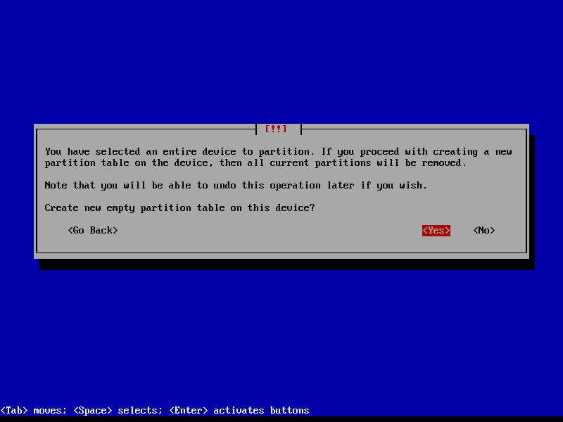
7. Next, select the newly defined "free space":

    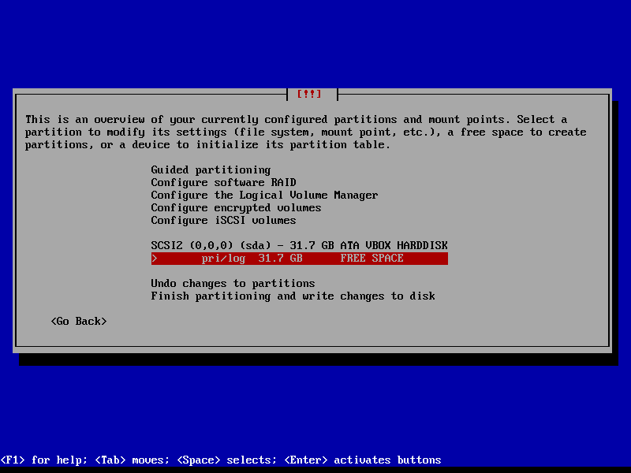
8. Select `Create a new partition`:

    
9. Pick the desired size for the swap partition:

    
10. Choose the preferred partition type:

    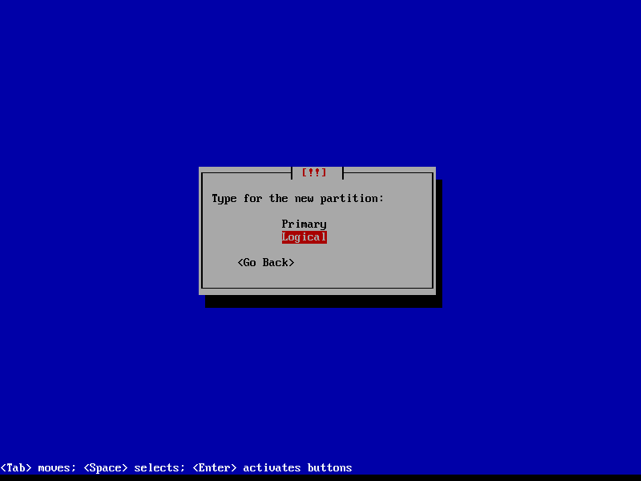
11. The location of the swap partition is personal preference, we choose "end" here so it's out of the way

    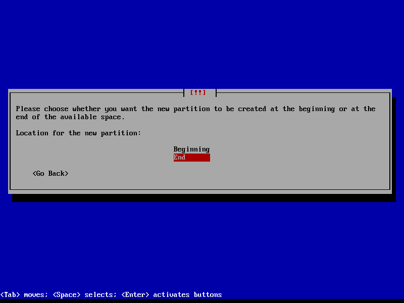
12. Choose "Done setting up the partition":

    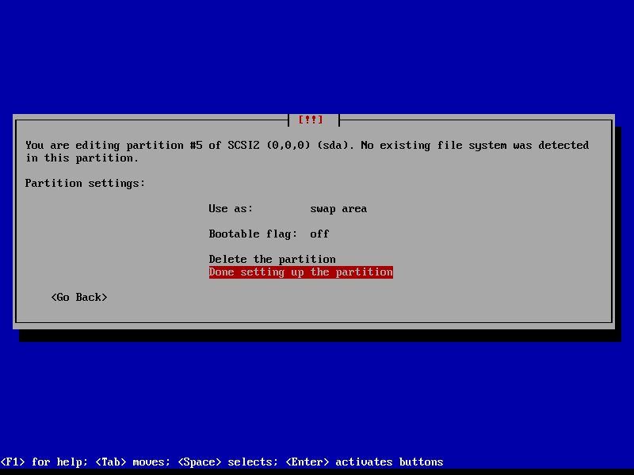
13. Next we repeat the procedure to setup the maim btrfs partition:

    
14. Let's create a new partition:

    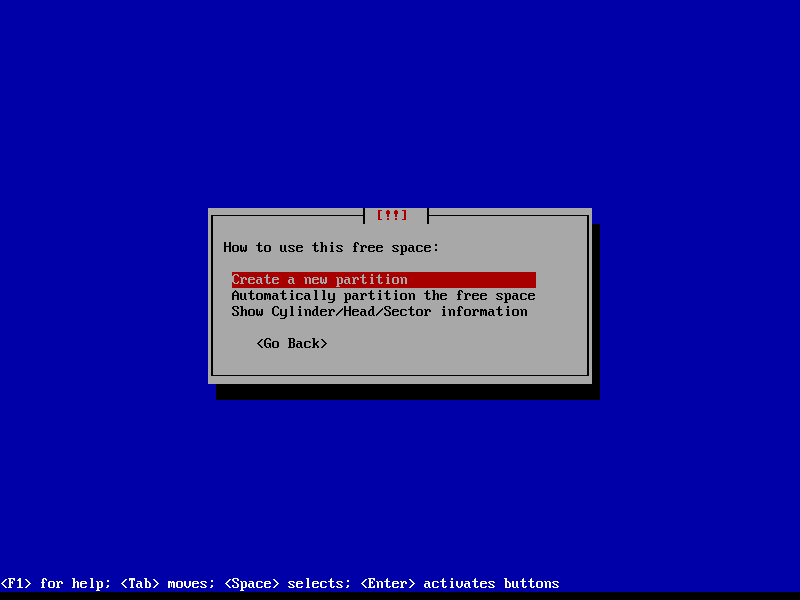
15. Use the rest of the available space:


    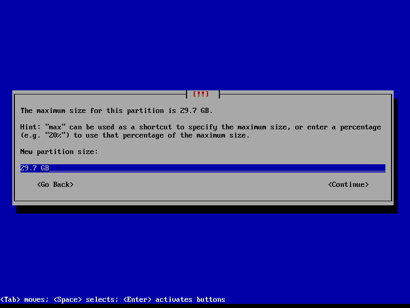
16. Choose "Primary" as partition type:

    
17. Configure the following parameters and select `Done setting up the partition`:

     ```markdown
    Use as:          btrfs journaling file system
    Mount point:     /
    Bootable flag:   on
     ```
    
18. Finish the partitioning and confirming to write the partition table to disk:

    


    
19. We return to the command line and can confirm that the new btrfs partition is mounted at /target:

    
20. Next we create the desired subvolumes:

    ```plaintext
    btrfs subvolume create /target/@
    btrfs subvolume create /target/@home
    btrfs subvolume create /target/@log
    btrfs subvolume create /target/@root
    btrfs subvolume create /target/@snapshots
    ```

    
21. Lastly we obtain the subvolume id from our new root subvolume "@" via
    ````plaintext
btrfs subvolume list /target
    ````

    here "257" - and we set that as out new default and unmount the partition
    ````plaintext
btrfs subvolume set-default 257 /target
umount /target
    ````
    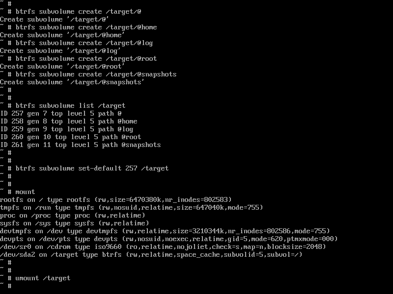
22. Now can switch back to the graphical install via Ctrl + Alt + F5 and continue with the installation:

    
23. When we get to the partitioning phase, just skip through it and confirm that we are happy to use the existing file system:

    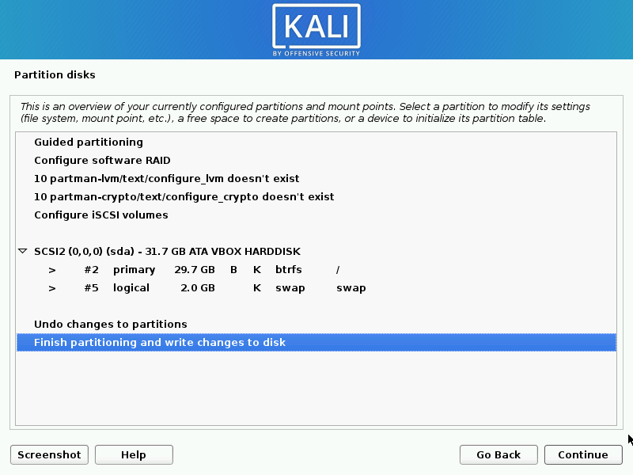


    
24. If you wish you can switch back to VT 2 and confirm that the installer has indeed mounted our "@" subvolume as the temporary root for the installation "/target":

    
25. Returning back to VT 5 we can continue with our installation until we hit the final screen were we pause for one last time:

    
26. Pressing `Ctrl + Alt + F2` we can return to VT2 and perform our post-installation steps:

    - Create temporary mount points
    - mount the subvolumes
    - move "/home", "/var/log", "/root" to their dedicated subvolumes:
    ```plaintext
    mkdir /target/mnt/root
    mkdir /target/mnt/home
    mkdir /target/mnt/log
    mkdir /target/.snapshots

    mount -t btrfs -o subvol=@root /dev/sda2 /target/mnt/root
    mount -t btrfs -o subvol=@home /dev/sda2 /target/mnt/home
    mount -t btrfs -o subvol=@log /dev/sda2 /target/mnt/log

    mv /target/root/.* /target/mnt/root/
    mv /target/home/* /target/mnt/home/
    mv /target/var/log/* /target/mnt/log/

    nano /target/etc/fstab
    ```

27. After that we can edit fstab to mount each subvolume via `nano /target/etc/fstab`:

    ```plaintext
    UUID=<UUID of btrfs partition> /               btrfs   defaults,subvol=@             0       0
    UUID=<UUID of btrfs partition> /home           btrfs   defaults,subvol=@home         0       0
    UUID=<UUID of btrfs partition> /var/log        btrfs   defaults,subvol=@log          0       0
    UUID=<UUID of btrfs partition> /root           btrfs   defaults,subvol=@root         0       0
    UUID=<UUID of btrfs partition> /.snapshots     btrfs   defaults,subvol=@snapshots    0       0
    ```

    e.g.:

    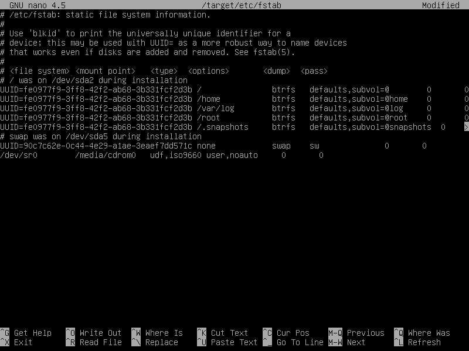
28. Optionally we can configure "locate" to ignore the .snapshot folder used by snapper (if installed later)
    Add `PRUNENAMES = ".snapshots"` to `/mnt/root/etc/updatedb.conf`

    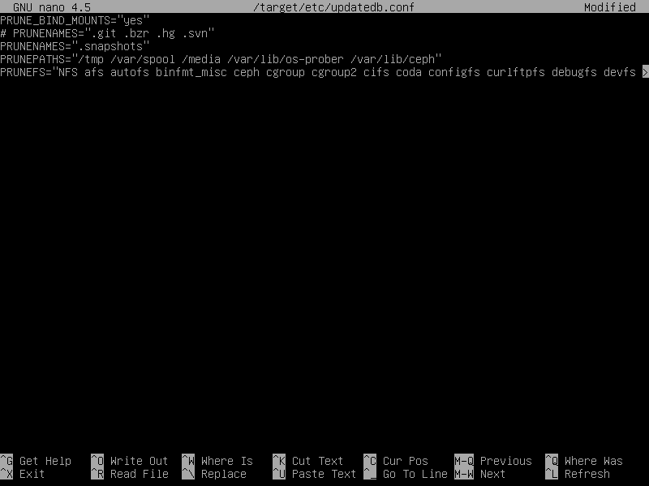
29. As the last step we have to reset the "default-subvolume" to 5, as that is a requirement for "apt-btrfs-snapshot" to work properly:

    
30. Installation is finished now and we can switch back to VT5 (`Ctrl + Alt + F5`) and reboot.

    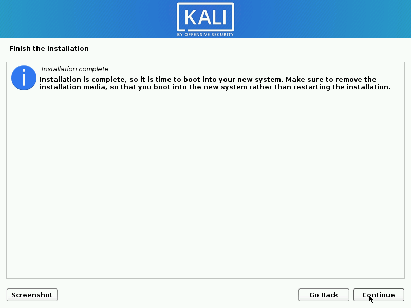
31. After the reboot we can log in and install some more tools we need.
    First let's install "btrfs-progs":

     `sudo apt install btrfs-progs`


32. Now we can download and install the "apt-btrfs-snapshot" tool from the Ubuntu repository

    ```bash
    wget https://launchpad.net/ubuntu/+archive/primary/+files/apt-btrfs-snapshot_3.5.2_all.deb
    sudo apt install ./apt-btrfs-snapshot_3.5.2_all.deb
    ```


Congratulations, you have just installed a Kali system with automatic snapshotting functionality! Next, we will cover some basic usage examples.


## Usage

### Create snapshots
Snapshots are automatically created during apt operations. There are no additional steps required, e.g.:


### List snapshots
Firstly, a snapshot is also a subvolume, thus all snapshots also show up when listing btrfs subvolumes, e.g. via
`sudo btrfs subvolume list /`


To list only the snapshots, we can use the following command:
`sudo apt-btrfs-snapshot list`


### Delete snapshots

The easiest way to delete a snapshot is by using the following command:
`sudo apt-btrfs-snapshot delete`

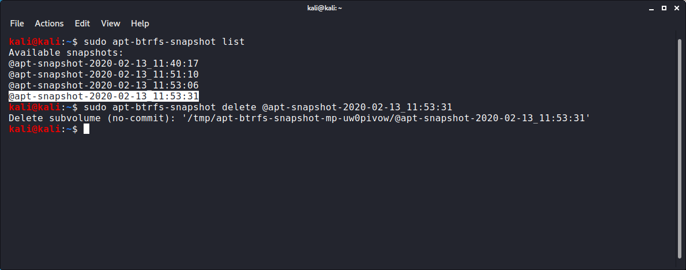

Voila, it's gone:


There are more sophisticated ways to delete multiple snapshots, e.g. the following deletes all snapshots older than 2 days:

`sudo apt-btrfs-snapshot delete-older-than 2d`

Refer to the help output for all the different features of "apt-btrfs-snapshot"

### Rollback

To roll back to a previous snapshot we have to remember two things:
- the root "/" of the file system has been installed in a subvolume "/@" and not the root of the btrfs partition "/"
- a snapshot is treated like just another subvolume

thus all we have to do is mount the btrfs partition and replace the current root subvolume "@" with the last snapshot. To be safe we'll backup the curent root ("@") subvolume.
E.g.:

```bash
# mount your root partition (replace "/dev/mmcblk2p2" with yours):
sudo mount /dev/mmcblk2p2 /mnt

# Move the old root away:
sudo mv /mnt/@ /mnt/@_badroot

# Roll back to a previous snapshot:
sudo mv /mnt/@ /mnt/@apt-snapshot-2019-10-13_18:07:40 /mnt/@

sudo reboot -f
```


### Full walkthrough from apt full-upgrade to rollback

#### full-upgrade
After a new installation we don't have any snapshots yet as we can see via:
`sudo apt-btrfs-snapshot list`


Let's do a full system upgrade:
```bash
apt update
apt full-upgrade
```


We can observe that a snapshot is being created before any packages are installed:


Once finished we can confirm that there are no more updates available:


If we list the snapshots again we can see the one that has just been created:


#### Rollback

Remember that "/" itself is the subvolume "@". To rollback to a snapshot, all we have to do is replace "@" with the snapshot we want.

1. First we have to mount the btrfs partition via:

    `sudo mount /dev/<your btrfs partition> /mnt`

    If we list the content of that partition we can see all the subvolumes, including the snapshots:


    
2. Before we replace the current root with our snapshot, let's move "@" away just to be safe:

    `sudo mv /mnt/@ /mnt/@_badroot`


    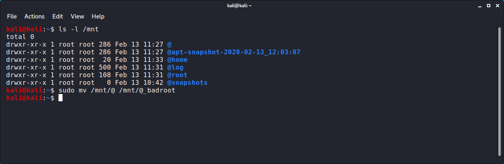
3. Now we can pick the snapshot from before the last upgrade and rename it to "@":

    `sudo mv /mnt/@apt-snapshot-2019-10-21_23:50:26 /mnt/@`


    


    And that's all there is to it, here's the new "@":


    


    Let's reboot for the rollback to take effect:


    


#### Confirming that the rollback worked

After the reboot, we can see that the snapshot is gone, because we rolled back to it:


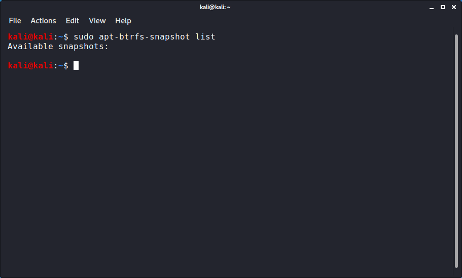


And if we issue another "apt update", we can see that we are back to where we were before the snapshot:


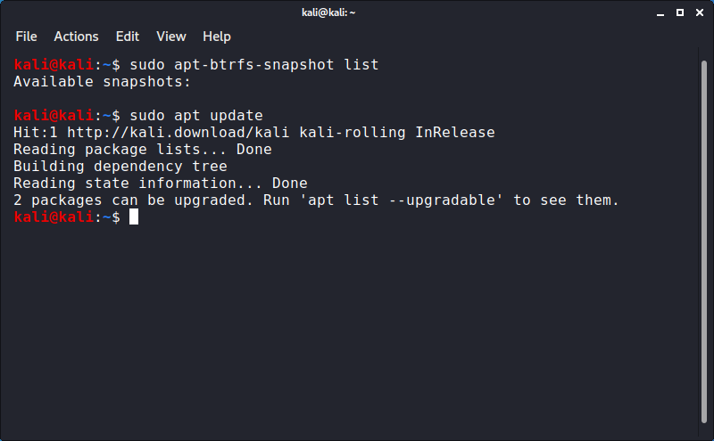


Once you confirmed that the system works you can delete the old "root" by mounting the btrfs partition and using the "btrfs subvolume delete" command:


```bash
sudo mount /dev/<your btrfs partition> /mnt
sudo btrfs subvolume delete /mnt/@_badroot
```


## References:
[Btrfs Wiki](https://btrfs.wiki.kernel.org/index.php/Main_Page),
[Btrfs Debian site](https://wiki.debian.org/Btrfs),
[apt-btrfs-snapshot](https://launchpad.net/ubuntu/+source/apt-btrfs-snapshot),
[Snapper](http://snapper.io/)
