## Content:

- [Overview](#overview)
- [Installation steps](#kali-linux-btrfs-installation-steps)
- [Usage](#usage)

## Overview

#### We are going to install Kali Linux to automatically create file system snapshots during apt operations so we can rollback the system after botched upgrades.

[Btrfs](https://btrfs.wiki.kernel.org/index.php/Main_Page) is a modern copy on write (CoW) filesystem for Linux aimed at implementing advanced features such as pooling, snapshots, checksums, and integrated multi-device spanning.
In particular, the [snapshot](https://btrfs.wiki.kernel.org/index.php/UseCases#Snapshots_and_subvolumes) support is what makes Btrfs attractive for Kali installations on bare metal. Virtualization solutions such as VMWare and Virtualbox provide their own snapshotting functionality and using btrfs in those environments is not really required.
Please note that the below procedure will not work in VirtualBox as grub fails to install in a btrfs volume in VBox.

The snapshotting strategy of this walkthrough centres around a tool called "apt-btrfs-snapshot" from the Ubuntu repositories,
which is a wrapper around "apt". This wrapper transparently hooks into the apt workflow and automatically creates snapshots before and after any apt operation.
This neat little feature allows to easily rollback a system after a botched upgrade.

Snapper is another useful utility to create snapshots. We are preparing the Kali system for the use of snapper by creating a separate subvolume for its snapshots but we are not
including the installation and usage of snapper in this walkthrough.
Details about snapper can be found on the following website:
[http://snapper.io/](http://snapper.io/)


### Installation Overview

Installing Kali Linux with snapshotting functionality is very similar to a standard installation with the following exceptions:

1. We boot into live mode and launch the installer from there
2. We pause the installation midway to set up a btrfs partition and btrfs subvolumes outside of the installer before continuing the installation
3. We adjust the fstab and move some folders to the new subvolumes before we reboot into the newly installed system

### Partitioning Scheme

We are going to use the following layout:

```plaintext
Mount Point         | Subvolume         | Description
-------------------------------------------------------------------------
/                   | @                 | The root filesystem incl. /boot
/home               | @home             | User home directories
/root               | @root             | The root user's home directory
/var/log            | @log              | Log files
/.snapshots         | @snapshots        | Snapper's snapshot directory
```

## Kali Linux Btrfs Installation Steps

#### Installation Prerequisites

* A minimum of 20 GB disk space for the Kali Linux install.
* RAM for i386 and amd64 architectures, minimum: 1GB, recommended: 2GB or more.
* CD-DVD Drive / USB boot support

### Preparing for the Installation

1. [Download Kali Linux](/docs/introduction/download-official-kali-linux-images/).
2. Burn the Kali Linux ISO to DVD or [Image Kali Linux Live to USB](/downloading/kali-linux-live-usb-install).
3. Ensure that your computer is set to boot from CD / USB in your BIOS.

### Kali Linux Installation Procedure

1. To start your installation, boot with your chosen installation medium. You should be greeted with the Kali Boot screen. Choose _Live Mode_.

2. In live mode, open a terminal window and install additional packages we will require:

    `apt install btrfs-progs debian-installer-launcher`

3. Start the ssh server so we can login remotely to do some tweaking of the partitions during the installation. Doing it from a remote host allows us to cut and paste which makes it just a bit more convenient.

    `systemctl start ssh`

4. Next we have to disconnect the machine from the network so to not confuse the installer who want full control over the network settings.

    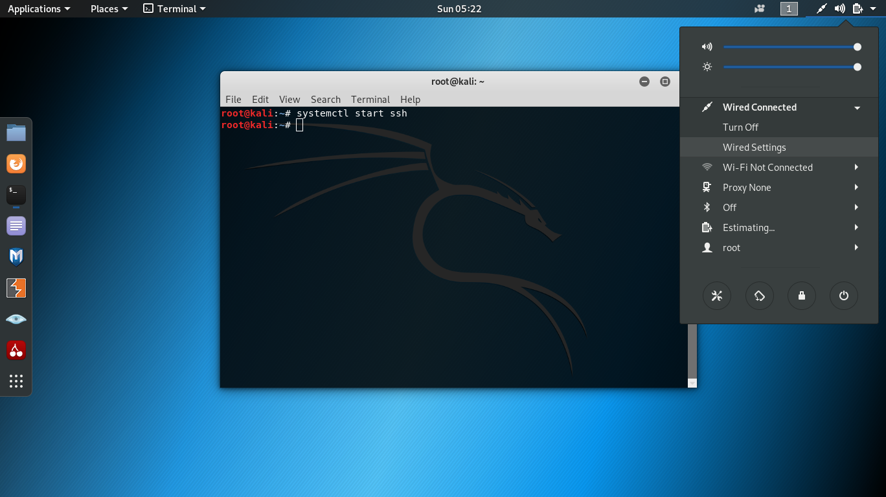
    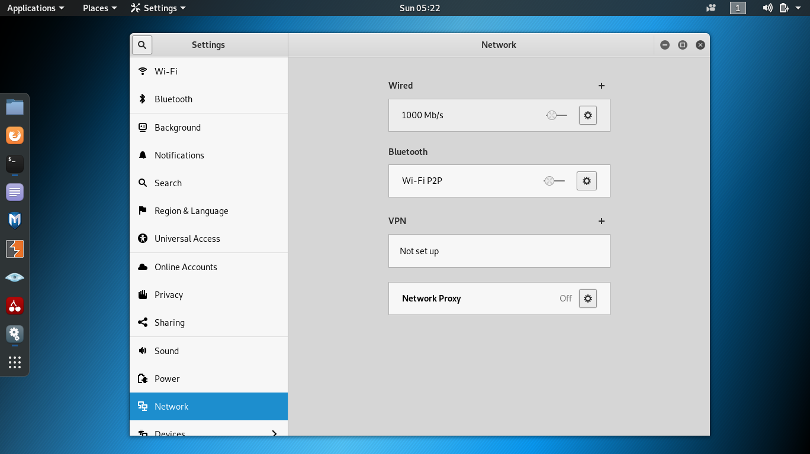
5. Now that we are ready to start the installation, launch the installer by typing:

    `debian-installer-launcher`

4. The installation steps are identical to a standard Kali installation except a pause during the step where you choose a domain name as seen below.

    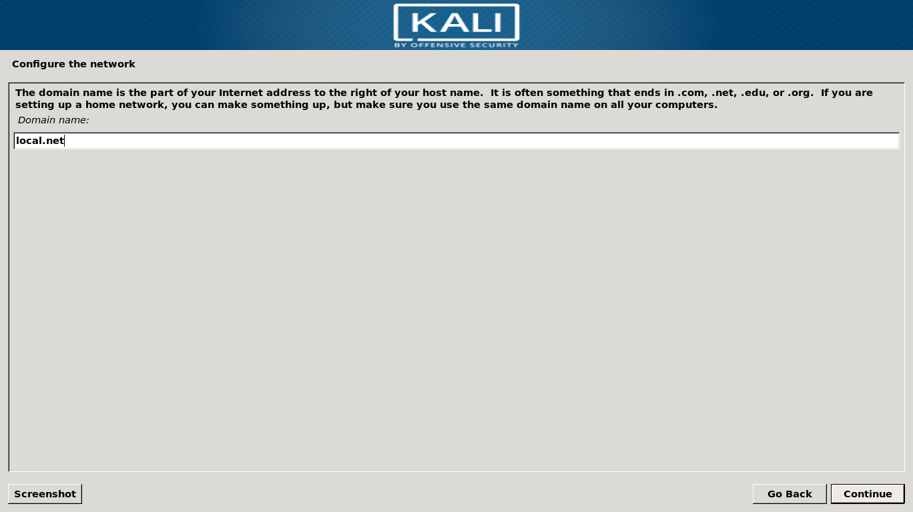
5. When prompted, pause the installation and switch to the terminal window using "Alt + Tab". Open another tab and start `gparted` to create a root partition and a swap partition

    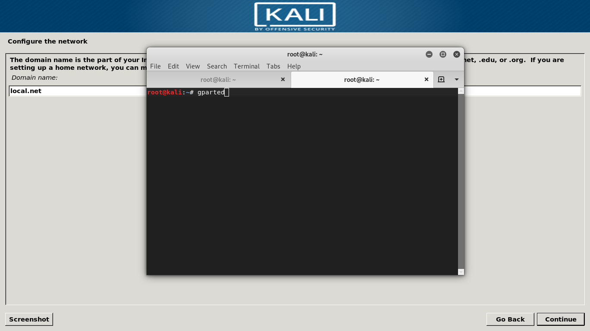

    It is important to have the boot partition before starting and do not remove it when creating the Btrfs partition.

    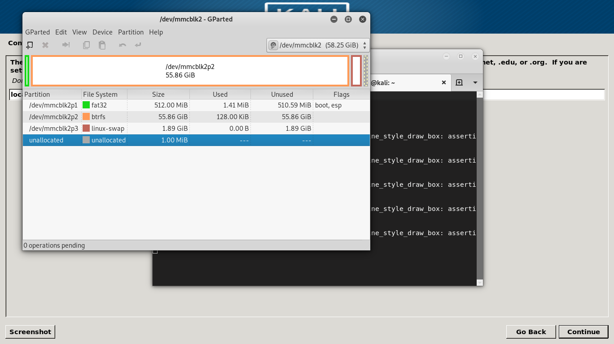
6. Once done we can use ssh to connect to the machine to more conveniently cut and paste the commands to set up the btrfs subvolumes
(Please note that all off these steps can also be performed locally):

    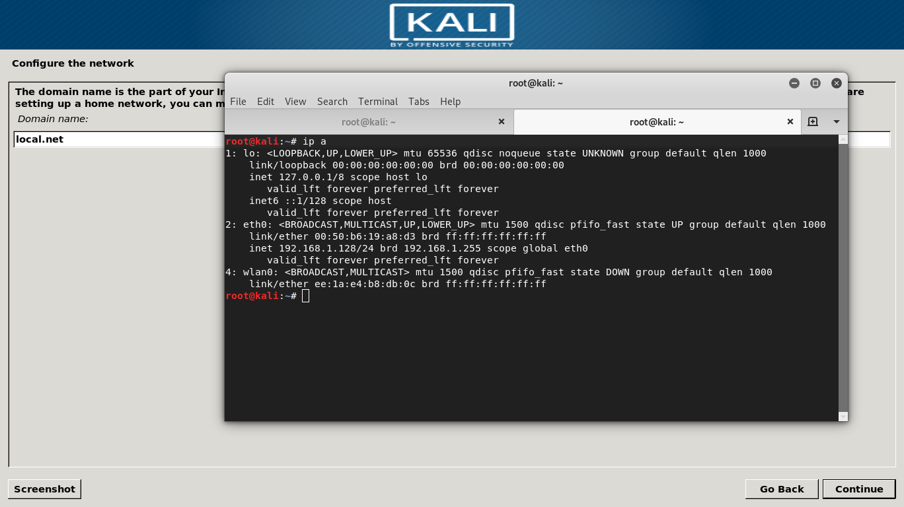
    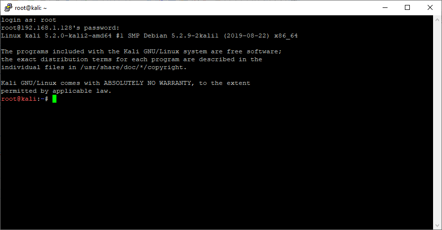
7. Let's identify the btrfs partition to create the subvolumes in via `fdisk -l`:

    
8. In our example, the btrfs partition is `/dev/mmcblk2p2` - let's mount it on `/mnt` via:

     `mount /dev/mmcblk2p2 /mnt`

     Please note that the partition name is most likely different on your machine.

    
9. Next, create the subvolumes and mountpoints:
```markdown
btrfs subvolume create /mnt/@
btrfs subvolume create /mnt/@home
btrfs subvolume create /mnt/@log
btrfs subvolume create /mnt/@root
btrfs subvolume create /mnt/@snapshots
mkdir /mnt/@/home
mkdir /mnt/@/var/log
mkdir /mnt/@/root
mkdir /mnt/@/.snapshots
```
    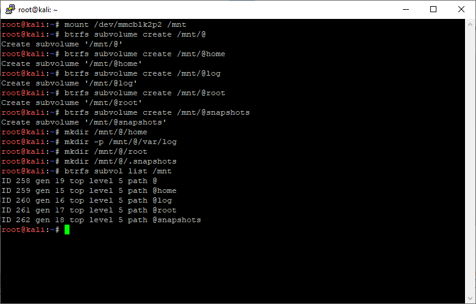
10. Set the default subvolume to the first subvolume in the list, here 256:
```markdown
btrfs subvol list /mnt
btrfs subvol set-default 256 /mnt
```

    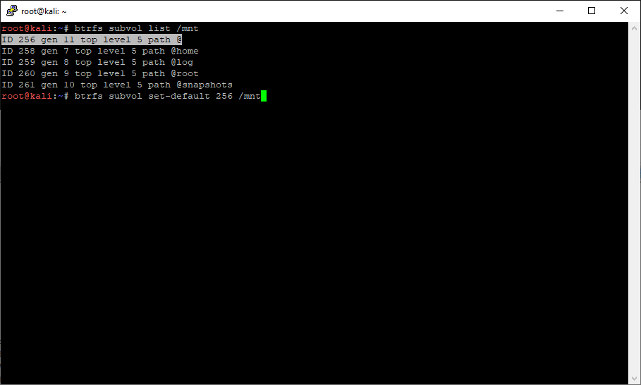
11. Lastly unmount /mnt:
`umount /mnt`

    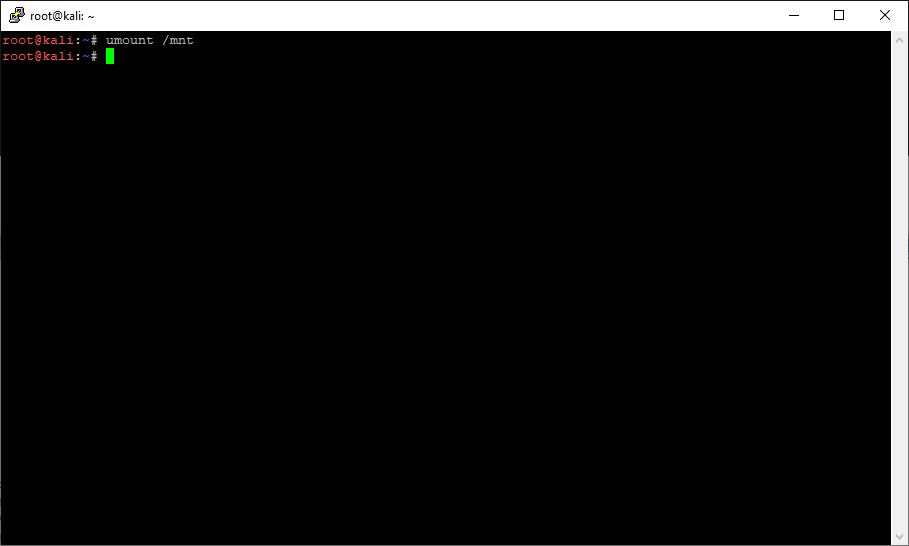
12. Now we can go back to the installer via Alt + Tab and continue with the installation:

    
13. At the partitioning stage, select "Manual" and configure the btrfs partition to be used as "/". Make sure that it is kept as is and not being formated.

    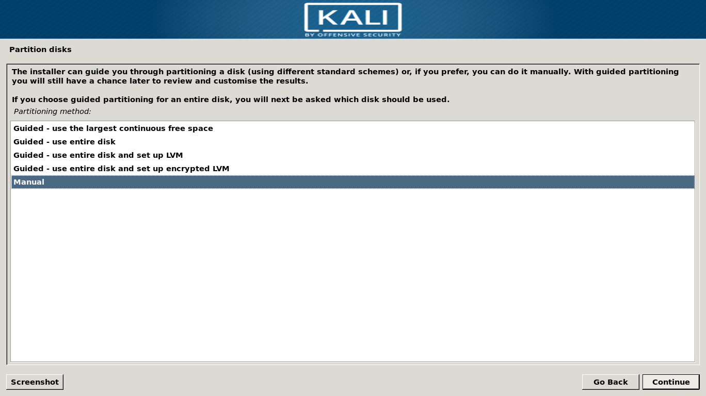

    You will want your btrfs partition to look like the following:

    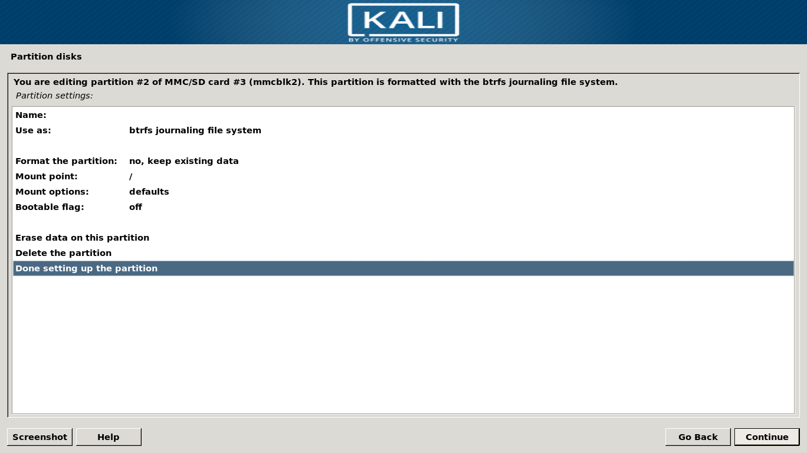
    
    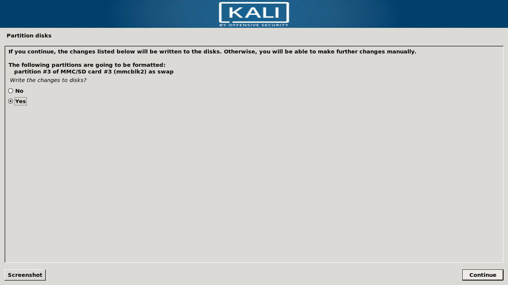
14. Once the partitioning is done, we can continue with the installation.

    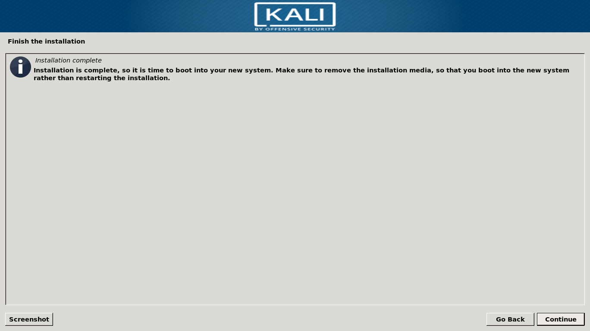
15. After the installation is completed we have to do some post-installation steps.
    First let's mount some volumes:
```markdown
mkdir /mnt/root
mkdir /mnt/root-home
mkdir /mnt/log
mount -t btrfs -o subvol=@ /dev/mmcblk2p2 /mnt/root
mount -t btrfs -o subvol=@root /dev/mmcblk2p2 /mnt/root-home
mount -t btrfs -o subvol=@log /dev/mmcblk2p2 /mnt/log
```

16. Then we can move "/root" and "/var/log" across into the new subvolumes:
```markdown
mv /mnt/root/root/.* /mnt/root-home/
mv /mnt/root/var/log/*  /mnt/log/
```

    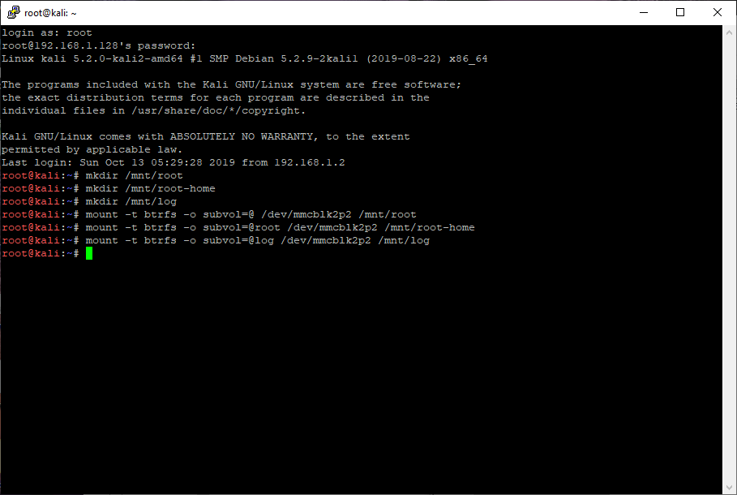
    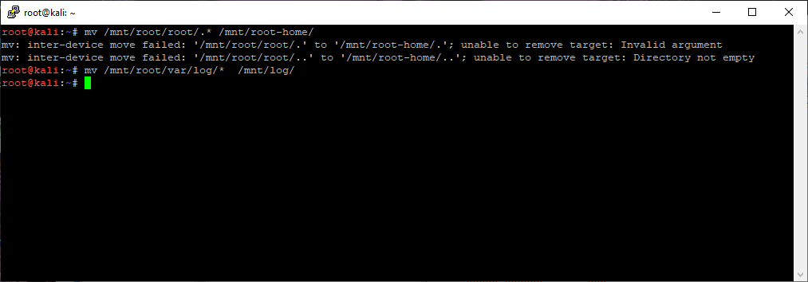
17. After that we can edit fstab to mount each subvolume:
```plaintext
UUID=<UUID of btrfs partition> /               btrfs   defaults,subvol=@             0       0
UUID=<UUID of btrfs partition> /home           btrfs   defaults,subvol=@home         0       0
UUID=<UUID of btrfs partition> /var/log        btrfs   defaults,subvol=@log          0       0
UUID=<UUID of btrfs partition> /root           btrfs   defaults,subvol=@root         0       0
UUID=<UUID of btrfs partition> /.snapshots     btrfs   defaults,subvol=@snapshots    0       0
```

     `nano /mnt/root/etc/fstab`

    e.g. from:

    

    To:

    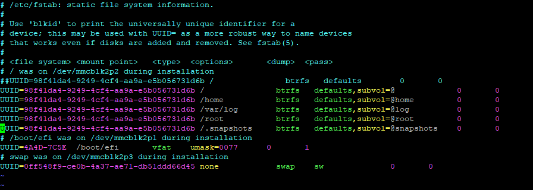
18. Lastly we configure "locate" to ignore the .snapshot folder used by snapper (if installed later)
    Add `PRUNENAMES = ".snapshots"` to `/mnt/root/etc/updatedb.conf`

    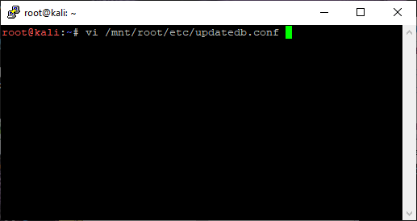
    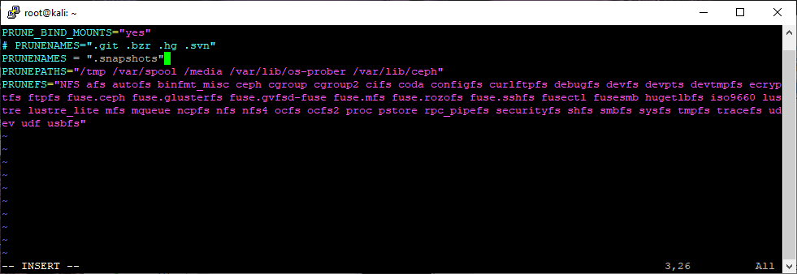
19. Installation is finished now and we can reboot.

20. After the reboot we can log in as root and install some more tools we need.
    First let's install "btrfs-progs":

     `apt install btrfs-progs`

21. Then we set the default subvolume to "5" to satisfy "apt-btrfs-snapshot":

    `btrfs subvolume set-default 5 /`

22. Now we can download and install the "apt-btrfs-snapshot" tool from the Ubuntu repository

```bash
wget https://launchpad.net/ubuntu/+archive/primary/+files/apt-btrfs-snapshot_3.5.2_all.deb
apt install ./apt-btrfs-snapshot_3.5.2_all.deb
```

Congratulations, you have just installed a Kali system with automatic snapshotting functionality! Next, we will cover some basic usage examples.

## Usage

### Create snapshots
Snapshots are automatically created during apt operations. There are no additional steps required, e.g.:


### List snapshots
Firstly, a snapshot is also a subvolume, thus all snapshots also show up when listing btrfs subvolumes, e.g. via
`btrfs subvolume list /`


To list only the snapshots, we can use the following command:
`apt-btrfs-snapshot list`


### Delete snapshots

The easiest way to delete a snapshot is by using the following command:
`apt-btrfs-snapshot delete`


Voila, it's gone:


There are more sophisticated ways to delete multiple snapshots, e.g. the following deletes all snapshots older than 2 days:

`apt-btrfs-snapshot delete-older-than 2d`

Refer to the help output for all the different features of "apt-btrfs-snapshot"

### Rollback

To roll back to a previous snapshot we have to remember two things:
- the root "/" of the file system has been installed in a subvolume "/@" and not the root of the btrfs partition "/"
- a snapshot is treated like just another subvolume

thus all we have to do is mount the btrfs partition and replace the current root subvolume "@" with the last snapshot. To be safe we'll backup the curent root ("@") subvolume.
E.g.:
```markdown
mount /dev/mmcblk2p2 /mnt                                   # mount your root partition (replace "/dev/mmcblk2p2" with yours)
mv /mnt/@ /mnt/@_badroot                                    # Move the old root away
mv /mnt/@ /mnt/@apt-snapshot-2019-10-13_18:07:40 /mnt/@     # Roll back to a previous snapshot
reboot
```

### Full walkthrough from apt full-upgrade to rollback

#### full-upgrade
After a new installation we don't have any snapshots yet as we can see via:
`apt-btrfs-snapshot list`


Let's do a full system upgrade:
```markdown
apt update
apt full-upgrade
```


We can observe that a snapshot is being created before any packages are installed:


Once finished we can confirm that there are no more updates available:


If we list the snapshots again we can see the one that has just been created:


#### Rollback
Remember that "/" itself is the subvolume "@". To rollback to a snapshot, all we have to do is replace "@" with the snapshot we want.

1. First we have to mount the btrfs partition via:

    `mount /dev/<your btrfs partition> /mnt`

    If we list the content of that partition we can see all the subvolumes, including the snapshots:

    
2. Before we replace the current root with our snapshot, let's move "@" away just to be safe:

    `mv /mnt/@ /mnt/@_badroot`

    
3. Now we can pick the snapshot from before the last upgrade and rename it to "@":

    `mv /mnt/@apt-snapshot-2019-10-21_23:50:26 /mnt/@`

    

    And that's all there is to it, here's the new "@":

    

    Let's reboot for the rollback to take effect:

    

#### Confirming that the rollback worked

After the reboot, we can see that the snapshot is gone, because we rolled back to it:


And if we issue another "apt update", we can see that we are back to where we were before the snapshot:


Once you confirmed that the system works you can delete the old "root" by mounting the btrfs partition and using the "btrfs subvolume delete" command:

```bash
mount /dev/<your btrfs partition> /mnt
btrfs subvolume delete /mnt/@_badroot
```


## References:
[Btrfs Wiki](https://btrfs.wiki.kernel.org/index.php/Main_Page),
[Btrfs Debian site](https://wiki.debian.org/Btrfs),
[apt-btrfs-snapshot](https://launchpad.net/ubuntu/+source/apt-btrfs-snapshot),
[Snapper](http://snapper.io/)
