Installing Kali Linux on your computer is an easy process. First, you'll need compatible computer hardware. Kali is supported on i386, amd64, and ARM (both armel and armhf) platforms. The hardware requirements are minimal as listed below, although better hardware will naturally provide better performance. The i386 images have a default [PAE](http://en.wikipedia.org/wiki/Physical_Address_Extension) kernel, so you can run them on systems with over 4GB of RAM. [Download the Kali Linux Installer image](/docs/introduction/download-official-kali-linux-images/) and either burn the ISO to DVD, or [prepare a USB stick with Kali Linux](/docs/usb/kali-linux-live-usb-install/) as the installation medium. If you do not have a DVD drive or USB port on your computer, check out the [Kali Linux Network Install](/docs/base-images/kali-linux-network-pxe-install/).

#### Installation Prerequisites

* A minimum of 20 GB disk space for the Kali Linux install.
* RAM for i386 and amd64 architectures, minimum: 1GB, recommended: 2GB or more.
* CD-DVD Drive / USB boot support

### Preparing for the Installation

1. [Download Kali Linux](/docs/introduction/download-official-kali-linux-images/) (We recommend the image marked (Installer)[*](../#which-image-to-choose) .
2. Burn The Kali Linux ISO to DVD or [Image Kali Linux Live to USB](/docs/usb/kali-linux-live-usb-install/).
3. Ensure that your computer is set to boot from CD / USB in your BIOS.

### Kali Linux Installation Procedure

1. To start your installation, boot with your chosen installation medium. You should be greeted with the Kali Boot screen. Choose either _Graphical_ or _Text-Mode_ install. In this example, we chose a graphical install.

   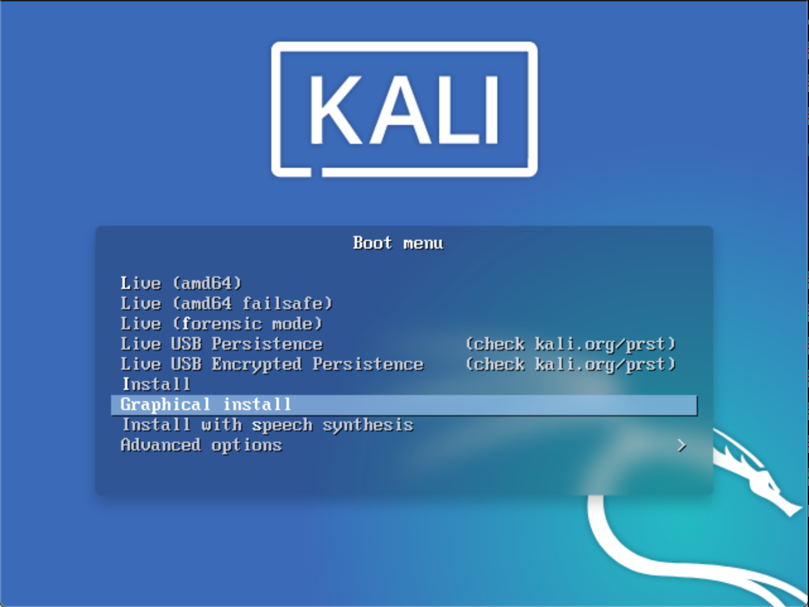  

2. Select your preferred language. 

     

3. Specify your geographic location.

   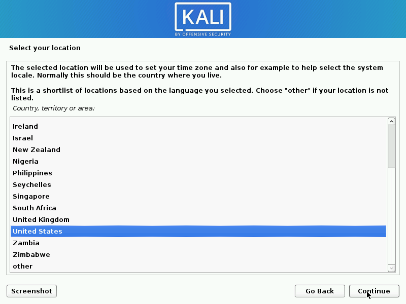  

4. Select your keyboard layout.

   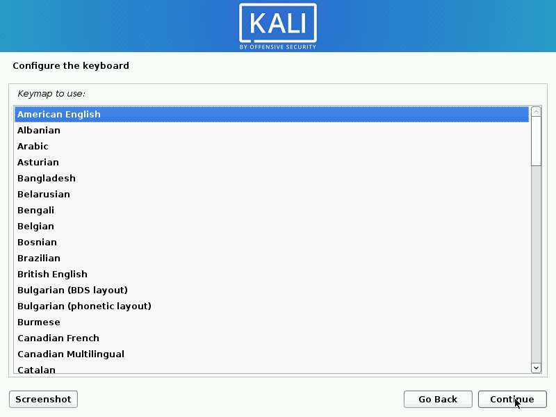  

5. The installer will copy the image to your hard disk, probe your network interfaces, and then prompt you to enter a hostname for your system. In the example below, we've entered "kali" as our hostname.

   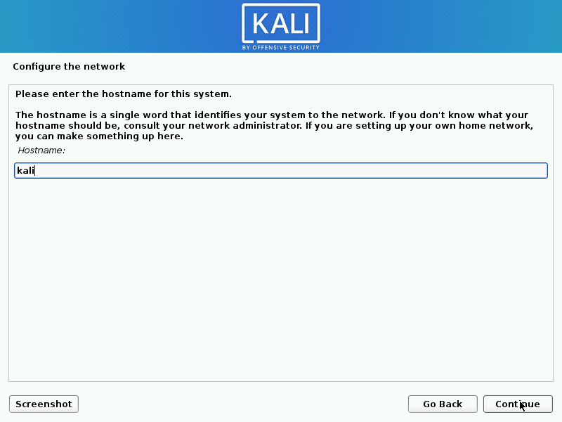  

6. You may optionally provide a default domain name for this system to use.

   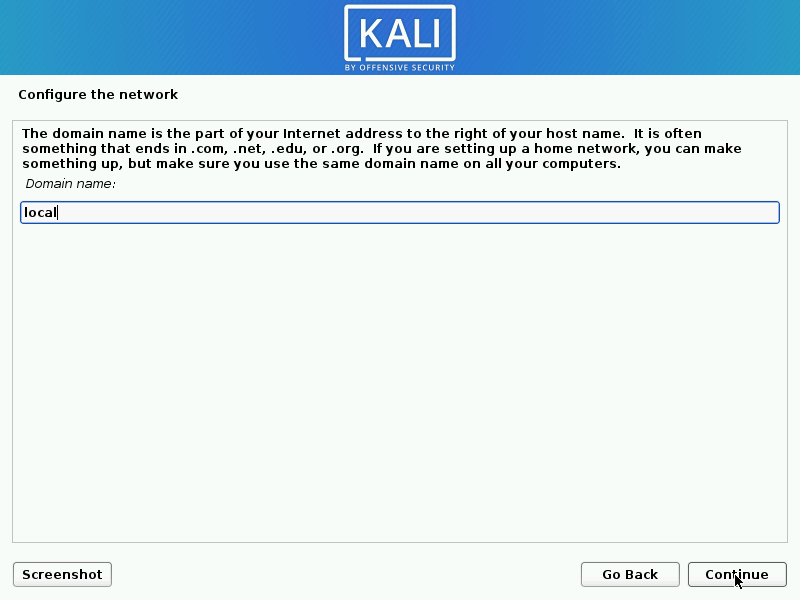  

7. Next, create the user account for the system.

   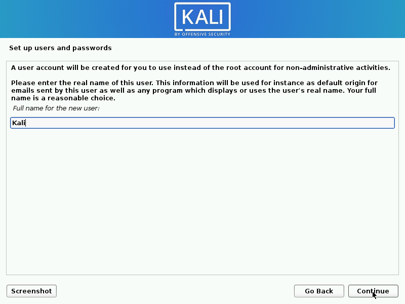  
   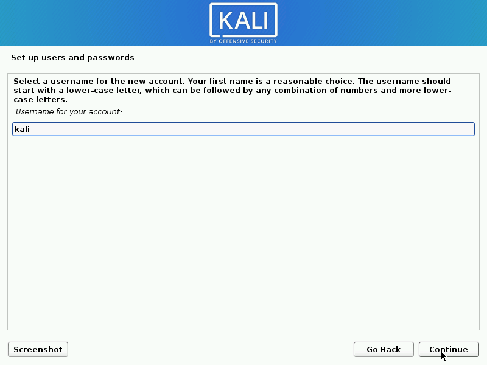  
   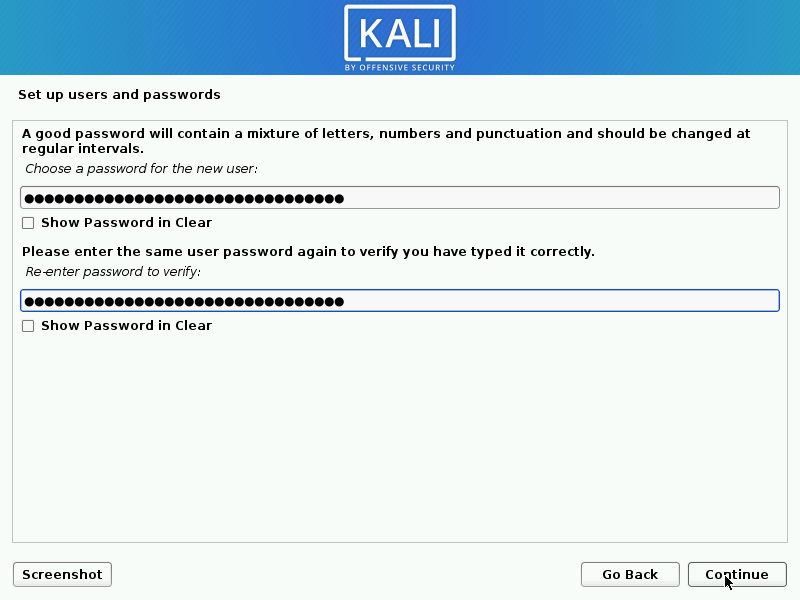  

8. Next, set your time zone.

   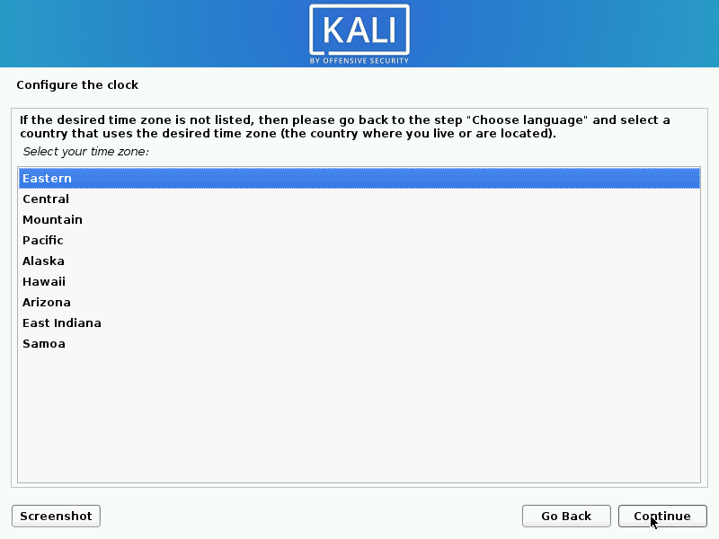  

9. The installer will now probe your disks and offer you four choices. In our example, we're using the entire disk on our computer and not configuring LVM (logical volume manager). Experienced users can use the "Manual" partitioning method for more granular configuration options.

   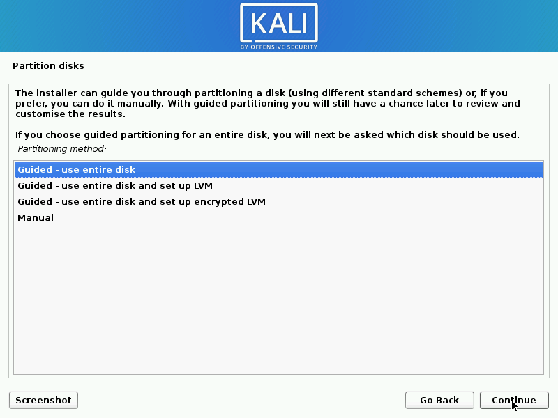  

10. Select the disk to be partitioned.

    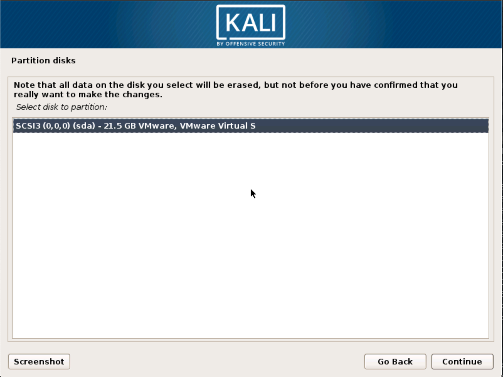  

11. Depending on your needs, you can choose to keep all your files in a single partition — the default — or to have separate partitions for one or more of the top-level directories. If you're not sure which you want, you want "All files in one partition".

    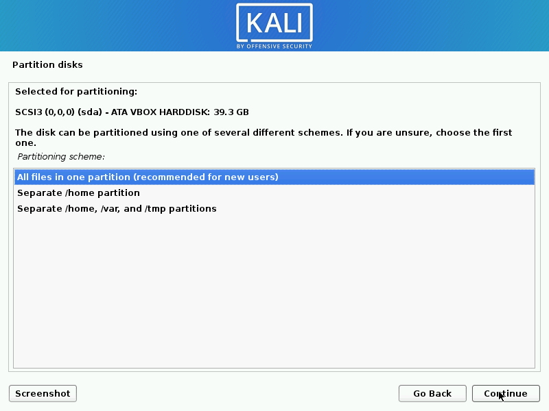  
    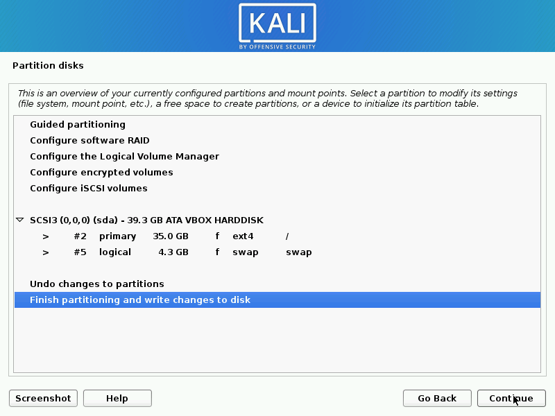  

12. Next, you'll have one last chance to review your disk configuration before the installer makes irreversible changes. After you click _Continue_, the installer will go to work and you'll have an almost finished installation.

    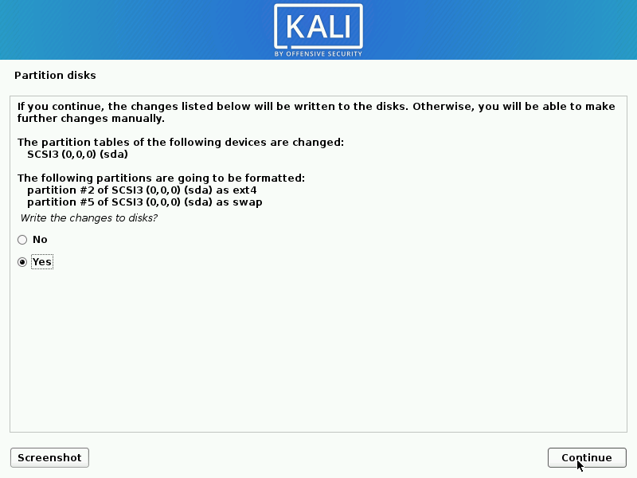  

13. Kali uses a central repository to distribute applications. You'll need to enter any appropriate proxy information as needed.

    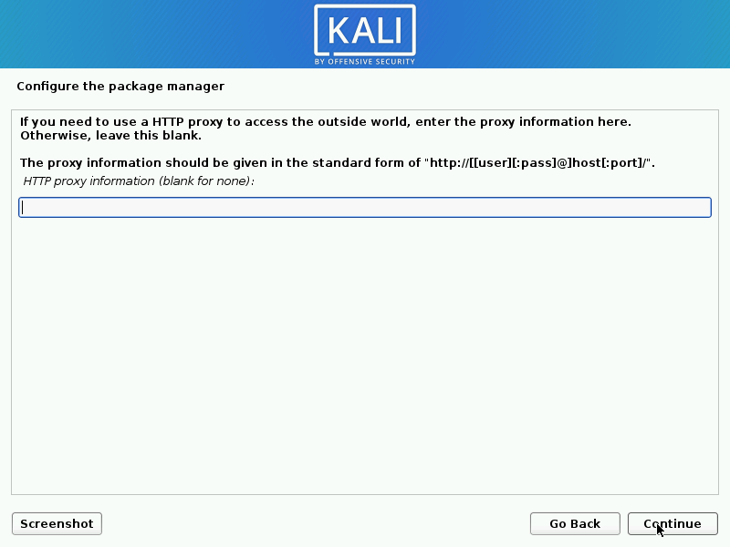  

14. Next you can select which metapackages you would like to install. The default selections will install a standard Kali Linux system and you don't really have to change anything here.  
Please [refer to this guide](../#which-desktop-environment-and-software-collection-to-choose-during-installation) if you prefer to change the default selections.  
    The 2020.1 release images and the current weekly images differ in the selection layout.
    The 2020.1 release provides the following selection screen:
    
    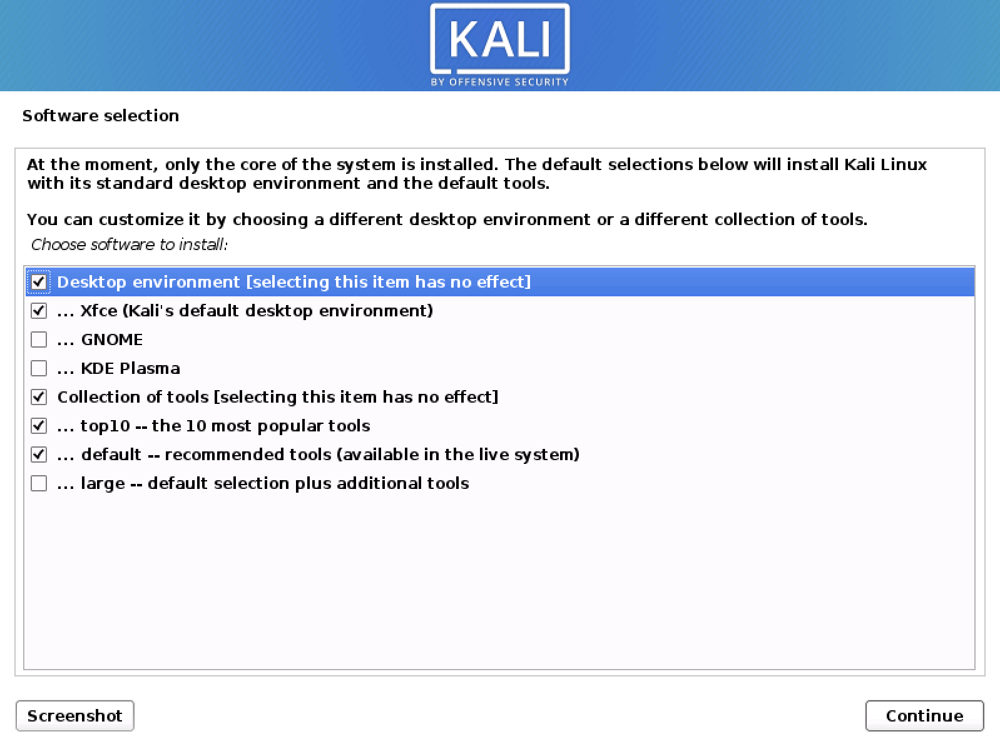
    
    The current weekly images provide the following software selection screen:
    
    
    
    If there is no working Internet connection during the installation and unless you are using the most recent weekly image, the selection screen may only contain a subset of the above, e.g.:
    
    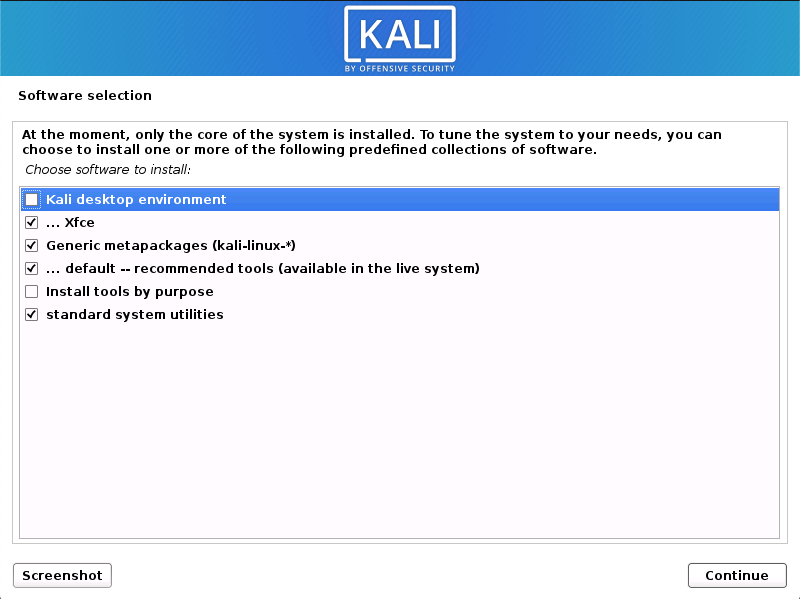

    The software selection will only list what is available to the installer during the installation. I.e. it will only contain the packages that are available in the image if there is no working Internet connection.  

15. Next confirm to install the GRUB boot loader...

    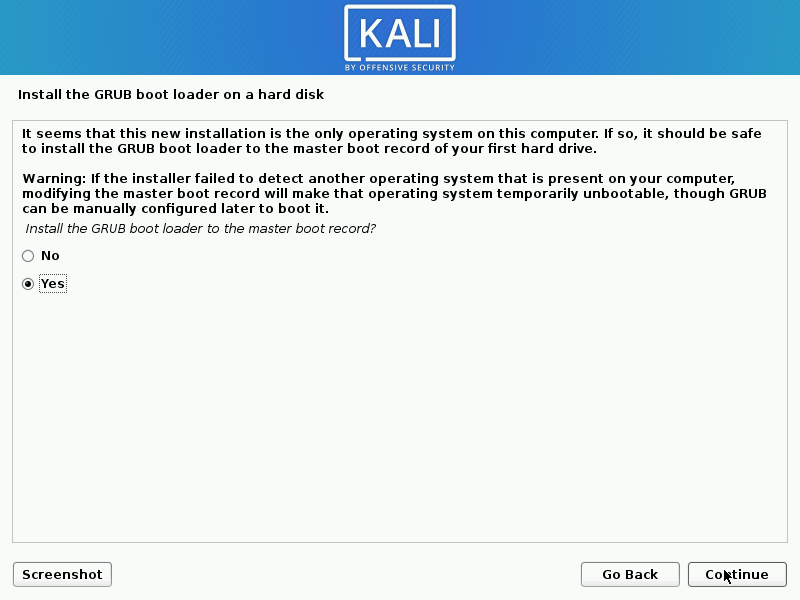  

16. ... and select the hard drive to install the GRUB bootloader in.

    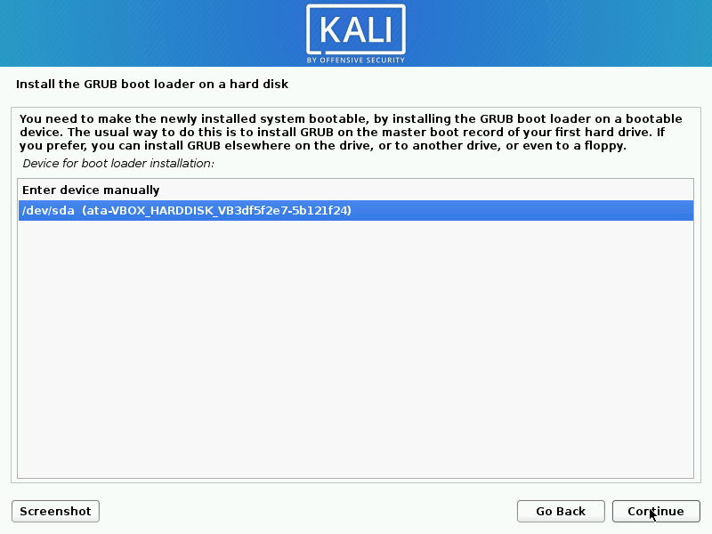  

17. Finally, click Continue to reboot into your new Kali installation.

    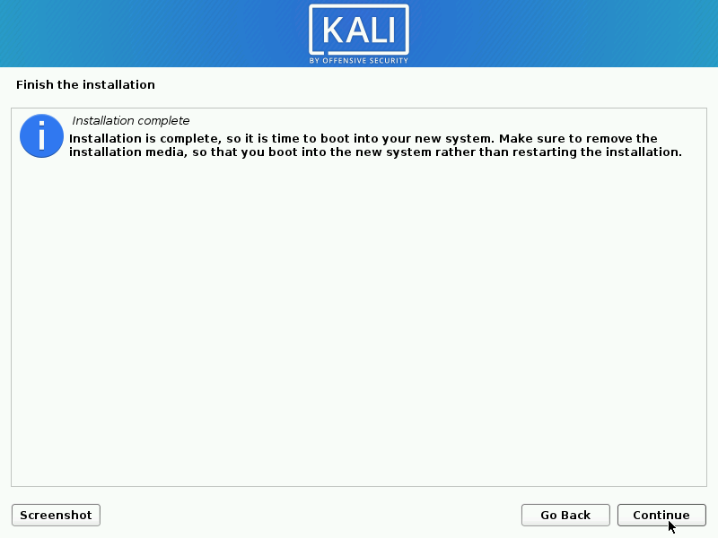  

## Post Installation

Now that you've completed installing Kali Linux, it's time to customize your system. The Kali General Use section of our site has more information and you can also find tips on how to get the most out of Kali in our [User Forums](https://forums.kali.org/).
