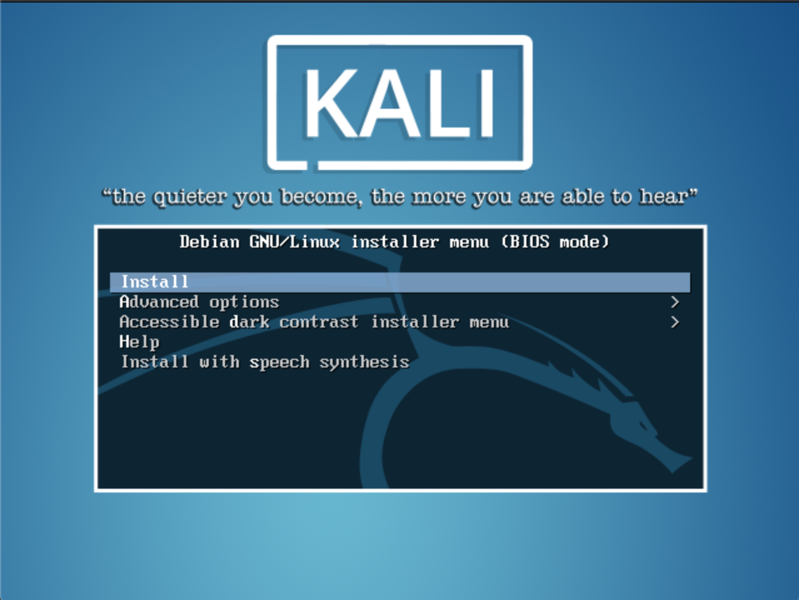
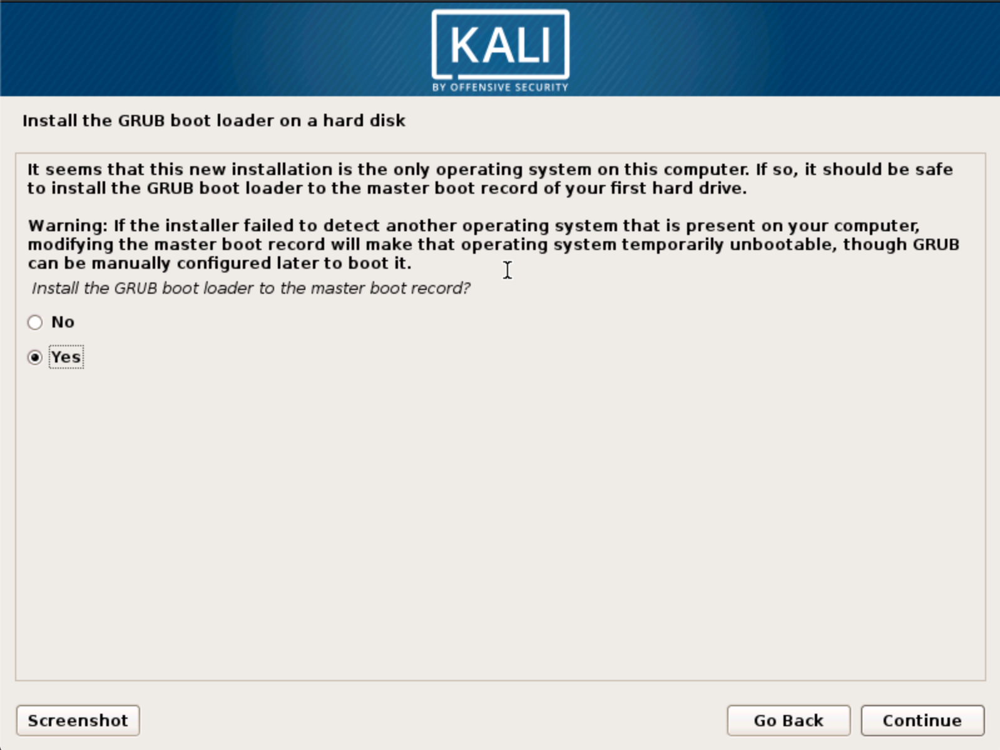
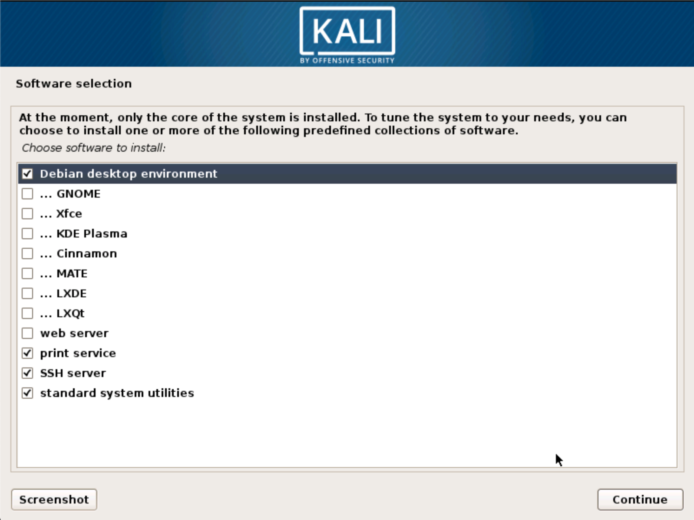

The Kali mini ISO is a convenient way to install a minimal Kali system and install it "from scratch". The mini install ISO will download all required packages from our repositories, meaning you need to have a fast Internet connection to use this installation method.

#### Installation Prerequisites

* A minimum of 8 GB disk space for the Kali Linux install.
* For i386 and amd64 architectures, a minimum of 512MB RAM.
* CD-DVD Drive / USB boot support

### Preparing for the Installation

1. Download the Kali mini ISO
	* [Text Installer](http://http.kali.org/kali/dists/kali-rolling/main/installer-amd64/current/images/netboot/mini.iso)
	* [Graphical Installer](http://http.kali.org/kali/dists/kali-rolling/main/installer-amd64/current/images/netboot/gtk/mini.iso)
2. Burn The Kali Linux ISO to DVD or [Image Kali Linux Live to USB](/docs/usb/kali-linux-live-usb-install/).
3. Ensure that your computer is set to boot from CD / USB in your BIOS.

### Kali Linux Installation Procedure

When you first boot the mini ISO, you will be presented with a small boot menu with various options. For this article, we will simply be doing a basic install.

You will next be prompted for various things such as your language and keyboard type, then you will need to select a hostname for your installation. We will stick with the default of _kali_.

Next, you will need to select your time zone, then you'll be shown the partition options. To get up and running quickly, we will use 'Guided - use entire disk' and follow the prompts all the way through to create the new partitioning setup.

In order to reduce network bandwidth, a small subset of packages will be selected by default. If you wish to add different services or features, this is the area you would make your selections.

At this point, the installer will download all of the packages it requires and install them on the system. Depending on your Internet connectivity speed, this could take some time. Eventually, you will finally be prompted to install GRUB to finish the installation.

## Post Installation

Now that you've completed installing Kali Linux, it's time to customize your system. The Kali General Use section of our site has more information and you can also find tips on how to get the most out of Kali in our [User Forums](https://forums.kali.org/).
