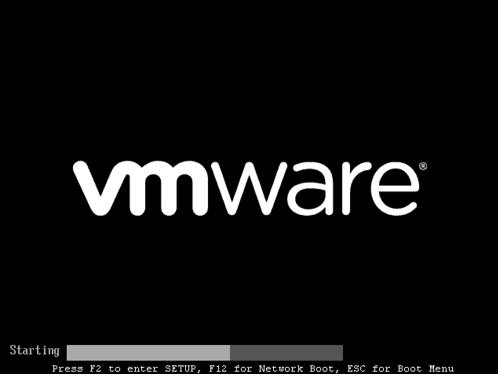
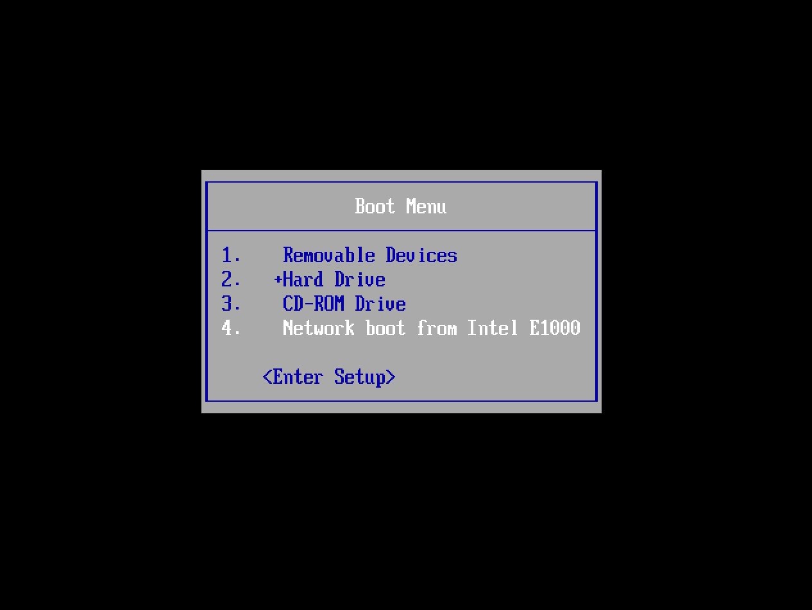
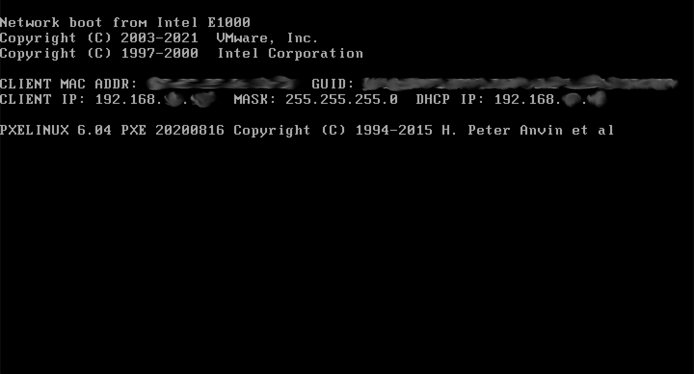
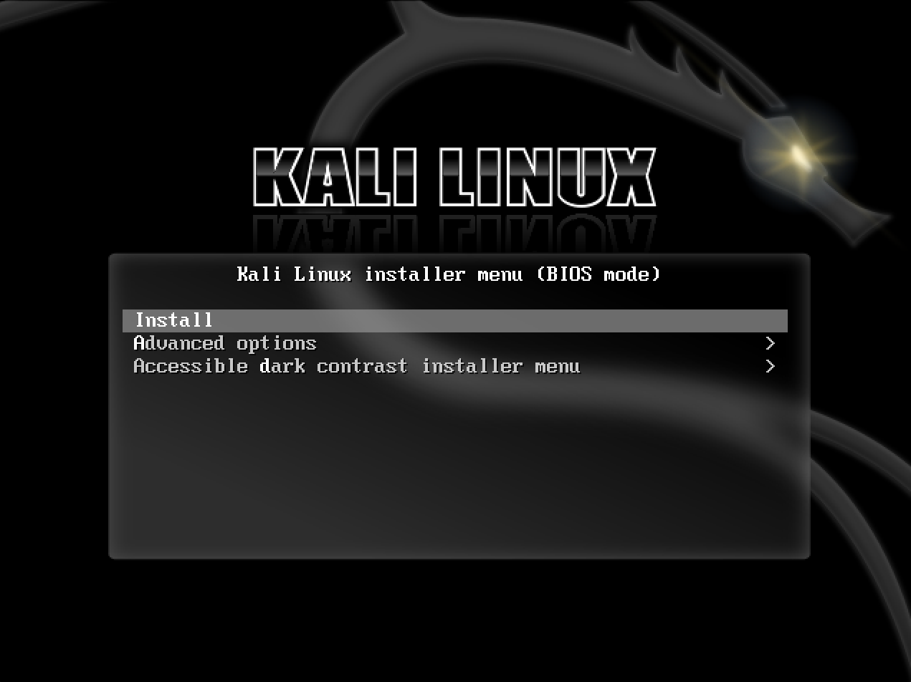
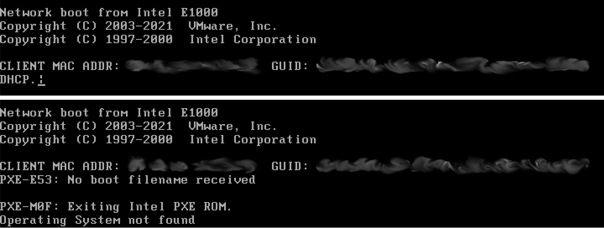

Preboot eXecution Environment([PXE](https://ko.wikipedia.org/wiki/%EC%82%AC%EC%A0%84_%EB%B6%80%ED%8C%85_%EC%8B%A4%ED%96%89_%ED%99%98%EA%B2%BD))를 사용하여 네트워크를 통해 칼리 리눅스를 부팅하고 설치하는 것이 가능해요. [CDROM](/docs/installation/hard-disk-install/)이나 [USB](/docs/usb/) 포트가 없는 단일 노트북 설치부터 칼리 리눅스 설치의 [사전 구성](https://gitlab.com/kalilinux/recipes/kali-preseed-examples)을 지원하는 기업 배포까지 다양한 환경에서 이점이 있어요.

"슬림화된" 이미지인 네트워크 부팅(Netboot)을 사용하면 설정이 작동하는 데 필요한 필수 패키지만 포함돼요. 나머지 모든 것은 설치 중에 다운로드되므로 설치 후 모든 것이 완전히 최신 상태가 되도록 해요.

PXE를 사용하는 몇 가지 다른 방법을 살펴볼 거예요. 첫 번째 방법은 **[dnsmasq](#dnsmasq를-사용한-PXE-서버-수동-설정)**로 PXE를 수동으로 설정하는 방법이에요. 마지막 방법은 **[netbootxyz](#netbootxyz를-사용하여-PXE-파일-호스팅)**를 활용하는 것으로, PXE 파일을 호스팅하고 별도의 DNS 서버를 사용하여 컴퓨터를 올바르게 연결해요.

## `dnsmasq`를 사용한 PXE 서버 수동 설정

먼저 DHCP/TFTP 서비스를 제공할 **[dnsmasq](https://packages.debian.org/testing/dnsmasq)**를 설치해야 해요:

```console
kali@kali:~$ sudo apt install -y dnsmasq
[...]
kali@kali:~$
```

- - -

`dnsmasq.conf`에서 **DHCP**, **TFTP** 및 **PXE 부팅**을 활성화하고 `dhcp-range`를 환경에 맞게 설정하세요(우리는 **192.168.101.100-200**을 사용하고 있어요).
필요한 경우 아래와 같이 `dhcp-option` 지시문을 사용하여 DNS 서버(`8.8.8.8` 및 `8.8.4.4`)와 게이트웨이(`192.168.101.1`)도 정의할 수 있어요:

```console
kali@kali:~$ cat <<EOF | sudo tee /etc/dnsmasq.conf
interface=eth0
dhcp-range=192.168.101.100,192.168.101.200,12h
dhcp-boot=pxelinux.0
enable-tftp
tftp-root=/tftpboot/
dhcp-option=3,192.168.101.1
dhcp-option=6,8.8.8.8,8.8.4.4
EOF
kali@kali:~$
```

- - -

위의 예제에서 TFTP의 홈 디렉토리로 `/tftpboot/`를 사용했는데, 이제 이 디렉토리를 생성해야 해요. 칼리 리눅스 Netboot 이미지를 보관할 거예요:

```console
kali@kali:~$ sudo mkdir -pv /tftpboot/
mkdir: created directory '/tftpboot/'
kali@kali:~$
```

- - -

편집이 완료되면 변경 사항을 적용하기 위해 dnsmasq 서비스를 재시작해야 해요:

```console
kali@kali:~$ sudo systemctl restart dnsmasq
kali@kali:~$
kali@kali:~$ sudo systemctl enable dnsmasq
kali@kali:~$
kali@kali:~$ sudo systemctl status dnsmasq
[...]
kali@kali:~$
```
<!-- systemctl enable --now dnsmasq -->

### 칼리 PXE Netboot 이미지 다운로드

이제 제공할 칼리 Netboot 이미지를 다운로드할 수 있어요:

```console
# 64비트:
sudo wget https://http.kali.org/kali/dists/kali-rolling/main/installer-amd64/current/images/netboot/netboot.tar.gz -P /tftpboot/
```

- - -

마지막 단계는 콘텐츠를 추출하고 약간의 정리를 하는 거예요:

```console
kali@kali:~$ sudo tar -zxpvf /tftpboot/netboot.tar.gz -C /tftpboot
[...]
kali@kali:~$
kali@kali:~$ sudo rm -v /tftpboot/netboot.tar.gz
removed '/tftpboot/netboot.tar.gz'
kali@kali:~$
```

### 네트워크에서 부팅하도록 대상 구성

모든 것이 구성되면 대상 시스템을 부팅하고 네트워크에서 부팅하도록 구성할 수 있어요. PXE 서버로부터 IP 주소를 받아 칼리 리눅스 부팅을 시작해야 해요.

제조사에 따라 부팅 메뉴를 불러오는 데 필요한 키보드 단축키가 다를 수 있어요. 일반적인 키는 `ESC`, `F2`, `F8` 및 `F12`예요:



그 후 네트워크 카드를 선택하세요:



모든 것이 제대로 작동하면 곧 다음과 비슷한 화면이 표시돼요.
IP 주소를 얻는 데 몇 초가 걸릴 수 있다는 점에 유의하세요:



마지막으로 Netboot GRUB이 표시돼요:



### 문제 해결

다음 화면 중 하나가 표시되면 기기가 PXE 서비스에서 IP 주소를 얻지 못했기 때문일 수 있어요:



가장 먼저 할 일은 dnsmasq의 상태를 확인하는 거예요:

```console
kali@kali:~$ sudo systemctl status dnsmasq
[...]
     Active: active (running) since Wed 2023-06-07 13:48:15 BST; 17s ago
[...]
Jun 07 13:48:15 kali dnsmasq-dhcp[1960]: DHCP, IP range 192.168.101.100 -- 192.168.101.200, lease time 12h
Jun 07 13:48:15 kali dnsmasq-tftp[1960]: TFTP root is /tftpboot/
Jun 07 13:48:15 kali dnsmasq[1960]: reading /etc/resolv.conf
Jun 07 13:48:15 kali dnsmasq[1960]: using nameserver 8.8.8.8#53
[...]
Jun 07 13:48:31 kali dnsmasq-dhcp[1960]: no address range available for DHCP request via eth0
lines 1-23/23 (END)
```

여기서 눈에 띄는 줄은 다음과 같아요:

> no address range available for DHCP request via eth0

가능한 이유는 IP 범위(`192.168.101.100 -> 192.168.101.200`)가 인터페이스(`192.168.0.3`)에서 사용하는 범위를 벗어났기 때문이에요:

```
kali@kali:~$ ip a
[...]
2: eth0: <BROADCAST,MULTICAST,UP,LOWER_UP> mtu 1500 qdisc mq state UP group default qlen 1000
[...]
    inet 192.168.0.3/24 brd 192.168.1.255 scope global dynamic noprefixroute eth0
[...]
kali@kali:~$
```

동적으로 구성을 생성해볼 수 있어요:

```console
kali@kali:~$ interface=eth0
kali@kali:~$
kali@kali:~$ network=$( ip -4 addr show dev ${interface} | grep -oP '(?<=inet\s)\d+(\.\d+){2}' )
kali@kali:~$
kali@kali:~$ cat <<EOF | sudo tee /etc/dnsmasq.conf
interface=${interface}
dhcp-range=${network}.100,${network}.200,12h
dhcp-boot=pxelinux.0
enable-tftp
tftp-root=/tftpboot/
dhcp-option=3,$( ip -4 route show dev ${interface} | grep -oP '(?<=default\svia\s)(\d+(\.\d+){3})' )
dhcp-option=6,8.8.8.8,8.8.4.4
EOF
kali@kali:~$
kali@kali:~$ sudo systemctl restart dnsmasq
kali@kali:~$
kali@kali:~$ sudo systemctl status dnsmasq
[...]
```

{}
기존 DHCP 서비스를 비활성화해야 해요. 그렇지 않으면 어떤 서비스가 더 빨리 응답할 수 있는지에 대한 경쟁이 발생할 거예요.
{}

### 설치 후 과정

이제 칼리 리눅스 설치를 완료했으니 시스템을 사용자 지정할 차례예요. [일반 사용 섹션](/docs/general-use/)에서 더 많은 정보를 찾을 수 있으며, [사용자 포럼](https://forums.kali.org/)에서 칼리 리눅스를 최대한 활용하는 방법에 대한 팁도 찾을 수 있어요.

#### 자동 업데이트

미래에 이 시스템을 사용하고 싶다면 마지막으로 해야 할 일은 커널 업데이트가 있을 때 정기적으로 새 Netboot 이미지를 가져오는 크론 작업을 설정하는 거예요. 간단한 스크립트를 만들고 권한을 설정해 볼게요:

```console
kali@kali:~$ sudo mkdir -pv /opt/pxe/
mkdir: created directory '/opt/pxe/'
kali@kali:~$
kali@kali:~$ cat <<'EOF' | sudo tee /opt/pxe/tftpboot.sh
#!/usr/bin/env sh

## PXE 이미지를 저장할 경로
tftp=/tftpboot

## amd64 (64비트)
arch=amd64

## PXE 이미지가 있는 이전 디렉토리를 완전히 제거하고 생성
rm -rfv "${tftp:?}"/*

## 최신 버전 다운로드
wget "https://http.kali.org/kali/dists/kali-rolling/main/installer-${arch}/current/images/netboot/netboot.tar.gz" -O "${tftp}/netboot.tar.gz"

## 압축 해제
tar -zxpvf /tftpboot/netboot.tar.gz -C "${tftp}"

## 정리
rm -v "${tftp}/netboot.tar.gz"
EOF
kali@kali:~$
kali@kali:~$ sudo chmod 0700 /opt/pxe/tftpboot.sh
kali@kali:~$
kali@kali:~$ sudo chown root: /opt/pxe/tftpboot.sh
```

- - -

새 사용자 `tftp`를 만들고 두 폴더의 권한을 설정해볼게요:

```console
kali@kali:~$ sudo adduser --system --home /opt/pxe/ tftp
adduser: Warning: The home dir /opt/pxe/ you specified already exists.
Adding system user `tftp' (UID 117) ...
Adding new user `tftp' (UID 117) with group `nogroup' ...
adduser: The home directory `/opt/pxe/' already exists.  Not touching this directory.
adduser: Warning: The home directory `/opt/pxe/' does not belong to the user you are currently creating.
kali@kali:~$
kali@kali:~$ sudo chown -R tftp: /opt/pxe/ /tftpboot/
kali@kali:~$
```

- - -

마지막으로 일정 작업을 설정해야 해요. [cron](https://crontab.guru/#0_5_*_*_2)을 사용할 거예요:

```console
kali@kali:~$ sudo crontab -u tftp -e
[...]
0 5 * * 2 /opt/pxe/tftpboot.sh >/dev/null
kali@kali:~$
```

이제 매주 화요일 05:00에 Netboot 이미지가 자동으로 업데이트될 거예요!

### PXE 사전 구성

#### 사전 구성 파일

다음 사전 구성 파일을 사용하여 칼리 인스턴스를 자동으로 설치할 수 있어요. 패키지 선택, 사용자 정보, 지역 정보 및 하드 드라이브를 사용 중인 것과 일치하도록 변경해야 해요. 또는 이들 중 어떤 것에 대해 물어보길 원한다면 해당 줄을 주석 처리하면 돼요:

```console
kali@kali:~$ cat <<'EOF' | sudo tee /opt/pxe/preseed.cfg
# 패키지 선택
d-i pkgsel/include string kali-linux-default kali-desktop-xfce

# 사용자 정보
d-i passwd/user-fullname string kali
d-i passwd/username string kali
d-i passwd/user-password password kali
d-i passwd/user-password-again password kali

# 지역 정보
d-i time/zone string US/Eastern
d-i debian-installer/locale string en_US
d-i debian-installer/language string en
d-i debian-installer/country string US
d-i debian-installer/locale string en_US.UTF-8
d-i keyboard-configuration/xkb-keymap select us

# 하드 드라이브
d-i grub-installer/bootdev string /dev/sda

d-i netcfg/get_hostname string kali
d-i netcfg/get_domain string unnasigned-domain
tasksel tasksel/first multiselect standard
d-i mirror/country string enter information manually
d-i mirror/suite string kali-rolling
d-i mirror/codename string kali-rolling
d-i mirror/http/hostname string http.kali.org
d-i mirror/http/directory string /kali
d-i mirror/http/proxy string
d-i partman-auto/method string regular
d-i partman-auto-lvm/guided_size string max
d-i partman-auto/choose_recipe select atomic
d-i partman-partitioning/confirm_write_new_label boolean true
d-i partman/choose_partition select finish
d-i partman/confirm boolean true
d-i partman/confirm_nooverwrite boolean true
d-i partman-md/confirm boolean true
d-i partman-partitioning/confirm_write_new_label boolean true
d-i partman/choose_partition select finish
d-i partman/confirm boolean true
d-i partman/confirm_nooverwrite boolean true
d-i grub-installer/only_debian boolean true
d-i grub-installer/with_other_os boolean true
d-i finish-install/reboot_in_progress note
d-i apt-setup/services-select multiselect
d-i apt-setup/non-free boolean true
d-i apt-setup/contrib boolean true
d-i apt-setup/disable-cdrom-entries boolean true
d-i apt-setup/enable-source-repositories boolean false
d-i pkgsel/upgrade select full-upgrade
d-i passwd/root-login boolean false
d-i preseed/early_command string anna-install eatmydata-udeb
d-i pkgsel/update-policy select none
popularity-contest popularity-contest/participate boolean false
encfs encfs/security-information boolean true
encfs encfs/security-information seen true
console-setup console-setup/charmap47 select UTF-8
samba-common samba-common/dhcp boolean false
macchanger macchanger/automatically_run boolean false
kismet-capture-common kismet-capture-common/install-users string
kismet-capture-common kismet-capture-common/install-setuid boolean true
wireshark-common wireshark-common/install-setuid boolean true
sslh sslh/inetd_or_standalone select standalone
atftpd atftpd/use_inetd boolean false
EOF
kali@kali:~$
```

#### initrd에 사전 구성 파일 통합

이를 initrd에 통합하여 자동으로 실행하려면 다음과 같이 해야 해요:

_64비트/AMD64를 사용하는 것으로 가정해요._

```console
kali@kali:~$ cd /tftpboot/debian-installer/amd64/
kali@kali:/tftpboot/debian-installer/amd64$
kali@kali:/tftpboot/debian-installer/amd64$ sudo gunzip initrd.gz
kali@kali:/tftpboot/debian-installer/amd64$
kali@kali:/tftpboot/debian-installer/amd64$ sudo cp -v /opt/pxe/preseed.cfg preseed.cfg
'/opt/pxe/preseed.cfg' -> './preseed.cfg'
kali@kali:/tftpboot/debian-installer/amd64$
kali@kali:/tftpboot/debian-installer/amd64$ echo preseed.cfg | sudo cpio -H newc -o -A -F initrd
6 blocks
kali@kali:/tftpboot/debian-installer/amd64$ sudo gzip initrd
kali@kali:/tftpboot/debian-installer/amd64$
```

이제 남은 일은 네트워크에서 부팅하고 "설치"를 선택한 다음 무인 설정이 진행되는 것을 지켜보는 거예요!

## netbootxyz를 사용하여 PXE 파일 호스팅

netbootxyz를 설치하고 사용하려면 [공식 문서](https://netboot.xyz/docs/docker)를 따르는 것을 권장해요. 이를 통해 서버를 설정하고 새 DHCP 서버를 생성하는 대신 기존 DHCP 서버를 사용하여 해당 서버를 가리키고, 웹 인터페이스를 통해 항목을 관리할 수 있어요.
