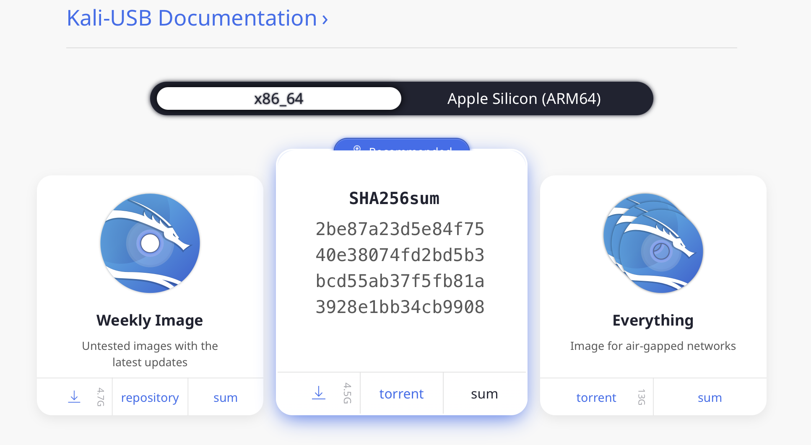

{}
중요! 절대로 공식 출처가 아닌 곳에서 칼리 리눅스 이미지를 다운로드하지 마세요.
다운로드한 파일의 SHA256 체크섬을 항상 [공식 값](/docs/introduction/download-images-securely/)과 대조해서 확인하세요.
악의적인 행위자가 Kali 설치본을 변조하여 악성 코드를 삽입하고 비공식적으로 호스팅하는 것은 매우 쉽습니다.
{}

#### 공식 칼리 리눅스 이미지를 구할 수 있는 곳

##### Intel 기반 PC용 ISO 파일

표준 Windows 및 Apple PC에서 [USB 드라이브](/docs/usb/)로 Kali "Live"를 실행하려면, 칼리 리눅스 [부팅 가능 ISO 이미지](/docs/installation/)가 필요합니다.

칼리 리눅스 이미지는 직접 다운로드 가능한 ".iso/.img" 파일 또는 ".torrent" 파일로 제공됩니다.

- [Intel 기반 PC용 공식 Kali ISO](/get-kali/)

표준 또는 커스텀 칼리 리눅스 ISO를 직접 빌드하는 것은 [매우 간단한 과정](/docs/development/live-build-a-custom-kali-iso/)입니다.

##### 가상 머신 이미지

[VMware나 VirtualBox](/docs/virtualization/)에서 "게스트"로 칼리 리눅스를 실행하고 싶다면, 게스트 도구가 이미 설치된 사전 빌드된 칼리 리눅스 가상 머신을 이용할 수 있습니다.

- [공식 칼리 리눅스 VMware 및 VirtualBox 이미지](/get-kali/#kali-virtual-machines)

##### ARM 이미지

[ARM 기반 장치](/docs/arm/)의 하드웨어 아키텍처는 상당히 다양하므로, 모든 기기에서 작동하는 단일 이미지를 갖는 것은 불가능합니다. [ARM 아키텍처](/get-kali/)용 사전 빌드된 칼리 리눅스 이미지는 다양한 장치에 사용할 수 있습니다.

자신만의 ARM 이미지를 로컬에서 빌드하기 위한 스크립트도 [GitLab에서 제공](https://gitlab.com/kalilinux/build-scripts/kali-arm)됩니다. 자세한 내용은 [ARM 크로스 컴파일 환경 설정](/docs/development/arm-cross-compilation-environment/)과 [커스텀 칼리 리눅스 ARM chroot 빌드](/docs/development/kali-linux-arm-chroot/) 문서를 참조하세요.

#### 다운로드한 Kali 이미지 확인하기

##### 왜 이 과정이 필요한가요?

칼리 리눅스 Live를 실행하거나 하드 디스크에 설치하기 전에, 여러분이 가지고 있는 것이 실제로 칼리 리눅스이지 가짜가 아닌지 확실히 해야 합니다. 칼리 리눅스는 전문적인 침투 테스팅 및 포렌식 도구 모음입니다. 전문 침투 테스터로서 도구의 무결성에 대한 절대적인 신뢰는 매우 중요합니다. 도구가 신뢰할 수 없다면, 여러분의 조사도 신뢰할 수 없게 됩니다.

더욱이, 선도적인 침투 테스팅 배포판으로서 Kali의 강점은 가짜 버전의 칼리 리눅스가 무의식적으로 배포된다면 _엄청난 피해_를 줄 수 있다는 것을 의미합니다. Kali처럼 _보이게_ 하면서 매우 의심스러운 것들을 숨기려는 사람들이 많이 있으며, 여러분은 절대로 그러한 것을 실행하고 싶지 않을 것입니다.

이를 피하는 방법은 간단합니다:

- 칼리 리눅스는 _오직_ [kali.org/get-kali/](/get-kali/)에 있는 공식 다운로드 페이지를 통해서만 다운로드하세요 - SSL 없이는 이 페이지를 탐색할 수 없습니다. 연결을 암호화하면 공격자가 "중간자(man-in-the-middle)" 공격을 통해 다운로드를 수정하기가 더 어렵습니다. 이러한 소스에도 몇 가지 잠재적인 약점이 있습니다 - SHA256SUMS 파일로 다운로드를 확인하는 방법과 공식 Kali 개발 팀의 개인 키에 대한 서명을 확인하는 방법을 참조하여 절대적인 확신에 더 가까워질 수 있습니다.
- 이미지를 다운로드한 후, _실행하기 전에_, _항상_ 아래에 설명된 절차 중 하나를 사용하여 체크섬을 확인해 실제로 그것이 예상했던 것인지 검증하세요.

다운로드를 확인하기 위한 여러 방법이 있습니다. 각 방법은 특정 수준의 보증을 제공하며, 그에 상응하는 노력이 필요합니다. 여기에서는 3가지 방법을 소개합니다:

1. 공식 칼리 리눅스 "다운로드" 미러에서 ISO 이미지를 다운로드하고, ISO의 SHA256 해시를 계산하여 칼리 리눅스 사이트에 나열된 값과 비교할 수 있습니다. 이 방법은 빠르고 쉽지만, [DNS 포이즈닝](https://en.wikipedia.org/wiki/DNS_spoofing#Cache_poisoning_attacks)을 통한 전복에 잠재적으로 취약합니다. 예를 들어, "kali.org" 도메인이 실제 칼리 리눅스 사이트로 연결된다고 가정합니다. 만약 그렇지 않다면, 공격자는 가짜 웹 페이지에서 "조작된" 이미지와 일치하는 SHA256 서명을 제시할 수 있습니다. 아래의 "ISO의 서명 수동 확인(직접 다운로드)" 섹션을 참조하세요.

2. 토렌트를 통해 ISO 이미지를 다운로드할 수 있으며, 이 경우 계산된 SHA256 서명이 포함된 서명되지 않은 파일도 함께 다운로드됩니다. 그런 다음 shasum 명령(Linux 및 macOS에서) 또는 유틸리티(Windows에서)를 사용하여 파일의 계산된 서명이 보조 파일의 서명과 일치하는지 자동으로 확인할 수 있습니다. 이 방법은 "수동" 방법보다 더 쉽지만 동일한 약점이 있습니다: 다운로드한 토렌트가 실제 칼리 리눅스가 아니더라도 서명은 여전히 유효할 수 있습니다. 아래 "포함된 서명 파일을 사용한 ISO 서명 확인(토렌트 다운로드)" 섹션을 참조하세요.

3. 다운로드한 칼리 리눅스가 진짜인지 가능한 한 확실하게 확인하기 위해 공식 칼리 리눅스 개인 키로 서명된 일반 텍스트 서명 파일과 동일한 파일의 버전을 다운로드하고, GNU Privacy Guard(GPG)를 사용하여 먼저 계산된 SHA256 서명과 일반 텍스트 파일의 서명이 일치하는지 확인한 다음, SHA256 해시가 포함된 파일의 서명된 버전이 공식 키로 올바르게 서명되었는지 확인할 수 있습니다.

이 더 복잡한 과정을 사용하여 다운로드한 ISO를 성공적으로 검증한 경우, 여러분이 갖고 있는 것이 공식 이미지이며 어떤 방식으로든 변조되지 않았다는 완전한 확신을 갖고 진행할 수 있습니다. 이 방법은 가장 복잡하지만 이미지의 무결성에 대한 독립적인 보증을 제공하는 장점이 있습니다. 이 방법이 실패할 수 있는 유일한 경우는 공식 칼리 리눅스 개인 키가 공격자에 의해 훼손될 뿐만 아니라 칼리 리눅스 개발 팀에 의해 그 후 취소되지 않는 경우입니다. 이 방법은 SHA256SUMS 파일을 사용한 확인 섹션을 참조하세요.

##### _무엇이_ 필요한가요?

Linux를 실행 중이라면 아마도 이미 [GPG](https://www.gnupg.org/)(GNU Privacy Guard)가 설치되어 있을 것입니다. Windows나 macOS를 사용 중이라면 플랫폼에 맞는 버전을 설치해야 합니다.

- Windows PC를 사용 중이라면 [여기](https://gpg4win.org/download.html)에서 GPG4Win을 다운로드하여 설치하세요.
- macOS를 실행하는 Mac을 사용 중이라면 [여기](https://gpgtools.org/)에서 GPGTools를 다운로드하여 설치하세요. 또는 [Homebrew](https://brew.sh)가 설치되어 있다면 `brew install gnupg`를 실행하세요.

GPG를 설치한 후에는 칼리 리눅스 공식 키를 다운로드하여 가져와야 합니다. 다음 명령어로 이 작업을 수행하세요:

```console
$ wget -q -O - https://archive.kali.org/archive-key.asc | gpg --import
```

또는 다음 명령어를 사용하세요

```console
$ gpg --keyserver hkps://keys.openpgp.org --recv-key 827C8569F2518CC677FECA1AED65462EC8D5E4C5
```

출력은 다음과 같아야 합니다:

```plaintext
gpg: key ED65462EC8D5E4C5: public key "Kali Linux Archive Automatic Signing Key (2025) <devel@kali.org>" imported
gpg: Total number processed: 1
gpg:               imported: 1  (RSA: 1)
```

다음 명령어로 키가 올바르게 설치되었는지 확인하세요:

```console
$ gpg --fingerprint 827C8569F2518CC677FECA1AED65462EC8D5E4C5
```

출력은 다음과 같을 것입니다:

```plaintext
pub   rsa4096 2025-04-17 [SC] [expires: 2028-04-17]
      827C 8569 F251 8CC6 77FE  CA1A ED65 462E C8D5 E4C5
uid           [ unknown] Kali Linux Archive Automatic Signing Key (2025) <devel@kali.org>
```

이제 칼리 리눅스 다운로드를 검증할 준비가 되었습니다.

#### 다운로드한 이미지를 어떻게 확인하나요?

##### ISO의 서명 수동 확인하기(직접 다운로드)

다운로드 페이지에서 ISO를 직접 다운로드한 경우 다음 절차로 확인하세요.

Linux나 macOS에서는 다운로드한 ISO 이미지의 SHA256 체크섬을 다음 명령어로 생성할 수 있습니다(ISO 이미지 이름이 "kali-linux-2025.1-live-amd64.iso"이고 현재 디렉토리에 있다고 가정):

```console
$ shasum -a 256 kali-linux-2025.1-live-amd64.iso
```

출력은 다음과 같아야 합니다:

```plaintext
2be87a23d5e84f7540e38074fd2bd5b3bcd55ab37f5fb81a3928e1bb34cb9908  kali-linux-2025.1-live-amd64.iso
```

Windows에서는 명령 프롬프트를 열고 다음을 실행하세요:

```console
certutil -?
```

certutil을 사용할 수 있다면 다음을 실행할 수 있습니다:

```console 
certutil -hashfile kali-linux-2025.1-live-amd64.iso sha256
```

다운로드를 확인하기 위해 사용합니다. 일부 Windows 버전에서는 SHA256 체크섬을 계산하는 기본 기능이 없습니다. `certutil`이 설치되어 있지 않다면 [Microsoft File Checksum Integrity Verifier](http://www.microsoft.com/en-us/download/details.aspx?id=11533)나 [Hashtab](http://implbits.com/products/hashtab/) 같은 유틸리티를 사용하여 다운로드를 확인할 수 있습니다.

결과 SHA256 서명:

```plaintext 
2be87a23d5e84f7540e38074fd2bd5b3bcd55ab37f5fb81a3928e1bb34cb9908
```

이 서명은 64비트 Intel 아키텍처 칼리 리눅스 2025.1 ISO 이미지의 공식 다운로드 페이지의 "sha256sum" 섹션에 표시된 서명과 일치하는 것을 확인할 수 있습니다:



##### 포함된 서명 파일을 사용하여 ISO의 서명 확인하기(토렌트 다운로드)

토렌트를 통해 칼리 리눅스 ISO 이미지를 다운로드한 경우, ISO 파일(예: kali-linux-2025.1-live-amd64.iso) 외에도 확장자가 ".txt.sha256sum"인 ISO의 계산된 SHA256 서명이 포함된 두 번째 파일(예: kali-linux-2025.1-live-amd64.txt.sha256sum)이 있을 것입니다.

Linux나 macOS에서 다음 명령어를 사용하여 이 파일로 다운로드의 신뢰성을 확인할 수 있습니다:

```console
$ grep kali-linux-2025.1-live-amd64.iso kali-linux-2025.1-live-amd64.txt.sha256sum | shasum -a 256 -c
```

이미지가 성공적으로 인증되면 응답은 다음과 같을 것입니다:

```plaintext
kali-linux-2025.1-live-amd64.iso: OK
```

Windows에서는 `certutil`이 있다면 위 명령을 사용한 다음 txt 파일의 내용을 수동으로 확인하여 두 SHA256 합계가 일치하는지 확인할 수 있습니다. `certutil`을 사용할 수 없다면 위에서 언급한 도구를 사용하여 다운로드의 SHA256 합계를 확인할 수 있습니다.

{}
중요! 앞서 설명한 대로 칼리 리눅스 이미지의 신뢰성을 확인할 수 없다면 사용하지 마세요! 사용할 경우 자신의 시스템뿐만 아니라 연결한 모든 네트워크와 해당 네트워크의 다른 시스템도 위험에 처할 수 있습니다. 중단하고 정상적인 칼리 리눅스 미러에서 이미지를 다운로드했는지 확인하세요.
{}

##### SHA256SUMS 파일을 사용하여 ISO 확인하기

{}
Windows에서 Powershell을 사용하면 완전 대문자로 된 결과를 받을 수 있습니다. 이로 인해 두 합계를 비교할 때 오류가 발생할 수 있습니다. 이 결과를 [변환기](https://convertcase.net/)를 통해 보내 적절한 결과를 얻으세요.
{}

이것은 더 복잡한 절차이지만 더 높은 수준의 검증을 제공합니다: 이미지를 다운로드한 웹사이트의 무결성에 의존하지 않고, 독립적으로 설치한 공식 칼리 리눅스 개발 팀 키에만 의존합니다. Intel 아키텍처 버전의 Kali에 대해 이 방법으로 이미지를 확인하려면 [현재 릴리스용 Kali "Live CD Image" 사이트](http://cdimage.kali.org/current/)(이 글 작성 시점에는 v2025.1)에서 세 파일을 다운로드해야 합니다:

- ISO 이미지 자체(예: kali-linux-2025.1-live-amd64.iso)
- ISO의 계산된 SHA256 해시가 포함된 파일, SHA256SUMS
- 해당 파일의 서명된 버전, SHA256SUMS.gpg

이미지의 체크섬을 확인하기 전에, SHA256SUMS 파일이 칼리 리눅스에서 생성한 것인지 확인해야 합니다. 이것이 바로 해당 파일이 SHA256SUMS.gpg에서 분리된 서명으로 Kali의 공식 키로 서명된 이유입니다. 아직 하지 않았다면, 다음 명령어로 Kali의 공식 키를 다운로드하여 키체인으로 가져올 수 있습니다:

```console
$ wget -q -O - https://archive.kali.org/archive-key.asc | gpg --import
```

또는 다음 명령어를 사용하세요

```console
$ gpg --keyserver hkps://keys.openpgp.org --recv-key 827C8569F2518CC677FECA1AED65462EC8D5E4C5
```

출력은 다음과 같아야 합니다:

```plaintext
gpg: key ED65462EC8D5E4C5: public key "Kali Linux Archive Automatic Signing Key (2025) <devel@kali.org>" imported
gpg: Total number processed: 1
gpg:               imported: 1  (RSA: 1)
```

다음 명령어로 키가 올바르게 설치되었는지 확인해야 합니다:

```console
$ gpg --fingerprint 827C8569F2518CC677FECA1AED65462EC8D5E4C5
```

출력은 다음과 같을 것입니다:

```plaintext
pub   rsa4096 2025-04-17 [SC] [expires: 2028-04-17]
      827C 8569 F251 8CC6 77FE  CA1A ED65 462E C8D5 E4C5
uid           [ unknown] Kali Linux Archive Automatic Signing Key (2025) <devel@kali.org>
```

SHA256SUMS와 SHA256SUMS.gpg를 모두 다운로드했으면 다음과 같이 서명을 확인할 수 있습니다:

```console
$ gpg --verify SHA256SUMS.gpg SHA256SUMS
gpg: Signature made Sun Apr 20 16:00:00 2025 EDT
gpg:                using RSA key 827C8569F2518CC677FECA1AED65462EC8D5E4C5
gpg: Good signature from "Kali Linux Archive Automatic Signing Key (2025) <devel@kali.org>" [unknown]
```

{}
"Good signature" 메시지가 나타나지 않거나 키 ID가 일치하지 않으면, 중단하고 정상적인 칼리 리눅스 미러에서 이미지를 다운로드했는지 검토해야 합니다. 확인 실패는 가지고 있는 이미지가 변조되었을 가능성이 높다는 것을 강력히 시사합니다.
{}

"Good signature" 응답을 받았다면, 이제 SHA256SUMS 파일의 체크섬이 실제로 칼리 리눅스 개발팀에서 제공한 것임을 확인할 수 있습니다. 검증을 완료하기 위해 남은 작업은 다운로드한 ISO에서 계산한 서명이 SHA256SUMS 파일의 서명과 일치하는지 확인하는 것입니다. Linux나 macOS에서는 다음 명령어로 이 작업을 수행할 수 있습니다(ISO 이름이 "kali-linux-2025.1-live-amd64.iso"이고 작업 디렉토리에 있다고 가정):

```console
$ grep kali-linux-2025.1-live-amd64.iso SHA256SUMS | shasum -a 256 -c
```

이미지가 성공적으로 인증되면 응답은 다음과 같을 것입니다:

```plaintext
kali-linux-2025.1-live-amd64.iso: OK
```

{}
"OK" 응답을 받지 못하면 무슨 일이 일어났는지 중단하고 검토하세요: 가지고 있는 Kali 이미지가 명백히 변조되었습니다. 절대 사용하지 마세요.
{}

이미지를 다운로드하고 확인했으면 [부팅 가능한 "칼리 리눅스 라이브" USB 드라이브 생성을 진행](/docs/usb/live-usb-install-with-windows/)할 수 있습니다.
