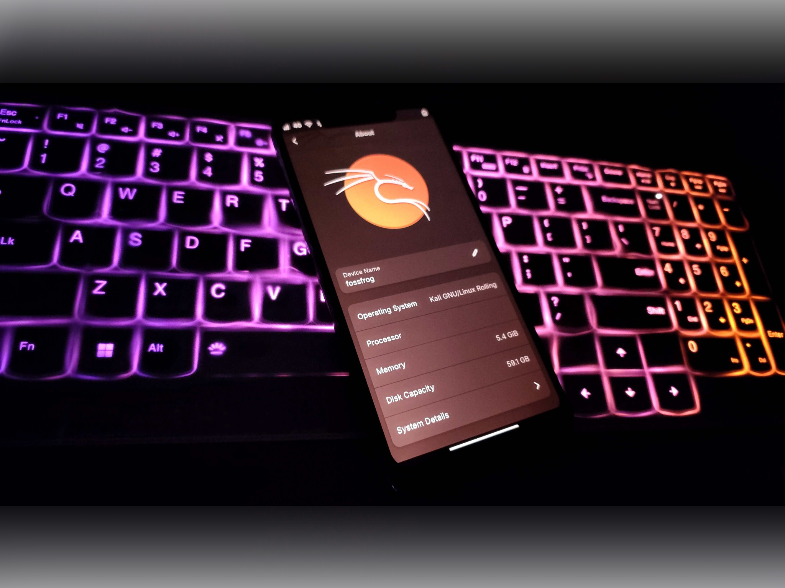

##### 칼리 넷헌터 프로는 파인폰/파인폰 프로와 퀄컴 기기 같은 메인라인 장치를 위한 순수한 칼리 리눅스예요.



## 목차:

- [개요](#개요)
- [넷헌터 프로 지원 기기](#20-넷헌터-프로-지원-기기)
- [넷헌터 프로 설치하기](#30-넷헌터-프로-설치하기)

## 개요

칼리 넷헌터 프로는 파인폰, 파인폰 프로, 그리고 퀄컴 메인라인 기기와 같은 ARM64 장치를 위해 특별히 설계된 고급 기능이 탑재된 칼리 리눅스 버전이에요. 안드로이드 위에서 실행되는 일반 넷헌터와 달리, 칼리 넷헌터 프로는 순수한 칼리 리눅스 배포판으로, 데스크톱급 침투 테스팅의 모든 힘을 모바일 플랫폼으로 가져와요. 안드로이드 시스템 위에서 실행되는 제약 없이 완전한 칼리 리눅스 경험을 제공함으로써 호환되는 모바일 기기를 휴대용 해킹 머신으로 변신시켜요. 이를 통해 전문가들은 데스크톱 환경에서 기대할 수 있는 모든 도구와 기능을 갖춘 채 모바일 기기에서 직접 침투 테스팅, 보안 평가 및 다른 사이버 보안 작업을 수행할 수 있어요.

칼리 넷헌터 프로에는 무엇이 있나요?

- 칼리 데스크톱에서 사용하는 거의 모든 도구가 있어요.

- 칼리 넷헌터 프로는 파인폰과 파인폰 Pro 같은 지원 기기에서 HDMI 출력을 통한 데스크톱 환경도 제공해요.

- 사용자는 쉽게 다른 운영 체제와 듀얼부팅할 수 있어요.

## 2.0 넷헌터 프로 지원 기기

넷헌터 프로는 특정 ARM64 기기에서 원활하게 작동하도록 특별히 설계되었어요. 아래는 칼리 넷헌터 프로가 지원하는 기기들이에요:

- 파인폰(PinePhone)
- 파인폰 Pro(PinePhone Pro)
- 포코 F1(beryllium)
- 원플러스 6(enchilada)
- 원플러스 6T(fajita)
- 샤오미 Mi MIX 2S(polaris)
- SHIFT SHIFT6mq(axolotl)

## 3.0 넷헌터 프로 설치하기

지원 기기용 칼리 넷헌터 프로 이미지 공식 릴리스는 다음 URL의 칼리 리눅스 페이지에서 다운로드할 수 있어요:

- [kali.org/get-kali/](/get-kali/)

##### 파인폰/프로 기기용 설치 단계

```
tar -xpf nethunterpro-2024.4-pinephone-phosh.img.tar.xz
dd if=nethunterpro-2024.4-pinephone-phosh.img of=/dev/mmcblkX bs=1M oflag=sync status=progress
```

##### 퀄컴 안드로이드 기기용 설치 단계



```
# SD카드에 설치하기:
tar -xpf kali-nethunterpro-2024.4-sdm845.tar.xz
simg2img flash userdata nethunterpro-*-sdm845*rootfs.img rootfs_ext4.img
dd if=rootfs_ext4.img of={sdcard_block_device} bs=1M oflag=sync status=progress
fastboot flash boot nethunterpro*boot-{model}-{variant}.img
fastboot erase dtbo # 기기에 dtbo 파티션이 있는 경우

# 내장 메모리(EMMC)에 설치하기 (fastboot 방식):
tar -xpf kali-nethunterpro-2024.4-sdm845.tar.xz
fastboot flash userdata nethunterpro-*-sdm845*rootfs.img
fastboot flash boot nethunterpro*boot-{model}-{variant}.img
fastboot erase dtbo # 기기에 dtbo 파티션이 있는 경우
```

##### 참고:
- 기기에 A/B 파티션이 있다면, 플래싱 시 슬롯을 선택할 수 있어요. 예: `fastboot flash boot_a nethunterpro*boot-{model}-{variant}.img`
- 패스트부트에서 `fastboot getvar current-slot` 명령으로 활성 슬롯을 확인할 수 있어요.
- `fastboot set_active {a 또는 b}` 명령으로 활성 슬롯을 변경할 수 있어요.
- 부팅 전에 dtbo를 지우는 것을 잊지 마세요.