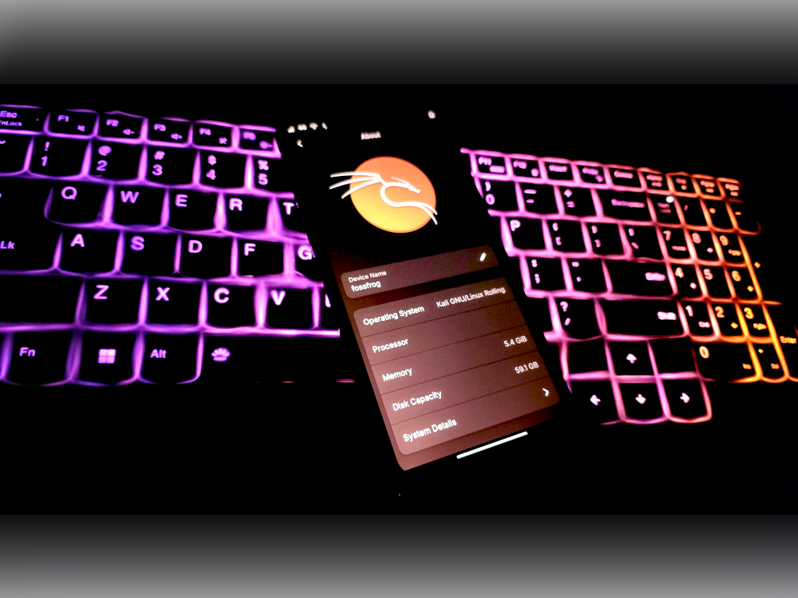

##### 칼리 넷헌터 프로는 파인폰/파인폰 프로, 퀄컴 등 메인라인 장치를 위한 순수 칼리 리눅스예요.



## 목차:

- [개요](#개요)
- [넷헌터 프로 지원 기기](#20-넷헌터-프로-지원-기기)
- [넷헌터 프로 설치하기](#30-넷헌터-프로-설치하기)

## 개요

칼리 넷헌터 프로는 파인폰, 파인폰 프로, 그리고 퀄컴 메인라인 기기와 같은 ARM64 장치를 위해 특별히 설계된 고급 기능의 칼리 리눅스 버전이에요. 표준 넷헌터가 안드로이드 위에서 동작하는 것과 달리, 넷헌터 프로는 순수 칼리 리눅스 배포판으로 데스크톱급 침투 테스팅의 모든 기능을 모바일 플랫폼에 제공합니다. 안드로이드 시스템 위에서 동작하는 제약 없이 완전한 칼리 리눅스 경험을 제공해, 호환 모바일 기기를 휴대용 해킹 머신으로 바꿔줍니다. 이를 통해 전문가들은 데스크톱 환경에서 기대할 수 있는 모든 도구와 기능을 모바일 기기에서 직접 사용할 수 있습니다.

칼리 넷헌터 프로에는 무엇이 있나요?

- 칼리 데스크톱에서 사용하는 거의 모든 도구가 포함되어 있어요.
- 파인폰, 파인폰 프로 등 지원 기기에서 HDMI 출력으로 데스크톱 환경을 제공합니다.
- 사용자는 다른 운영체제와 듀얼부팅도 쉽게 할 수 있어요.

## 2.0 넷헌터 프로 지원 기기

넷헌터 프로는 특정 ARM64 기기에서 원활하게 작동하도록 설계되었어요. 지원 기기는 다음과 같습니다:

- 파인폰(PinePhone)
- 파인폰 Pro(PinePhone Pro)
- 포코 F1(beryllium)
- 원플러스 6(enchilada)
- 원플러스 6T(fajita)
- 낫싱 폰 1(spacewar) (사전 출시, 테스트 안 됨)
- 샤오미 Mi MIX 2S(polaris)
- SHIFT SHIFT6mq(axolotl)

## 3.0 넷헌터 프로 설치하기

지원 기기용 칼리 넷헌터 프로 공식 이미지는 아래 칼리 리눅스 페이지에서 다운로드할 수 있어요:

- [kali.org/get-kali/](/get-kali/)

##### 파인폰/프로 기기용 설치 단계

```console
$ xz -d kali-nethunterpro-2025.3-pinephone-phosh.img.xz
$ dd if=kali-nethunterpro-2025.3-pinephone-phosh.img of=/dev/mmcblkX bs=1M oflag=sync status=progress
```

##### 퀄컴 안드로이드 기기용 설치 단계



```console
# SD카드에 설치하기:
$ xz -d kali-nethunterpro-2025.3-sdm845.img.xz
$ simg2img flash userdata nethunterpro-*-sdm845*rootfs.img rootfs_ext4.img
$ dd if=rootfs_ext4.img of={sdcard_block_device} bs=1M oflag=sync status=progress
$ fastboot flash boot nethunterpro*boot-{model}-{variant}.img
$ fastboot erase dtbo # 기기에 dtbo 파티션이 있는 경우

# 내장 메모리(EMMC)에 설치하기 (fastboot 방식):
$ xz -d kali-nethunterpro-2025.3-sdm845.img.xz
$ fastboot flash userdata nethunterpro-*-sdm845*rootfs.img
$ fastboot flash boot nethunterpro*boot-{model}-{variant}.img
$ fastboot erase dtbo # 기기에 dtbo 파티션이 있는 경우
```

##### 참고:
- 기기에 A/B 파티션이 있다면, 플래싱 시 슬롯을 선택할 수 있어요. 예: `fastboot flash boot_a nethunterpro*boot-{model}-{variant}.img`
- 패스트부트에서 `fastboot getvar current-slot` 명령으로 활성 슬롯을 확인할 수 있어요.
- `fastboot set_active {a 또는 b}` 명령으로 활성 슬롯을 변경할 수 있어요.
- 부팅 전에 dtbo를 지우는 것을 잊지 마세요.