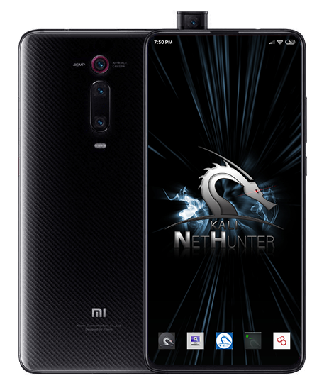
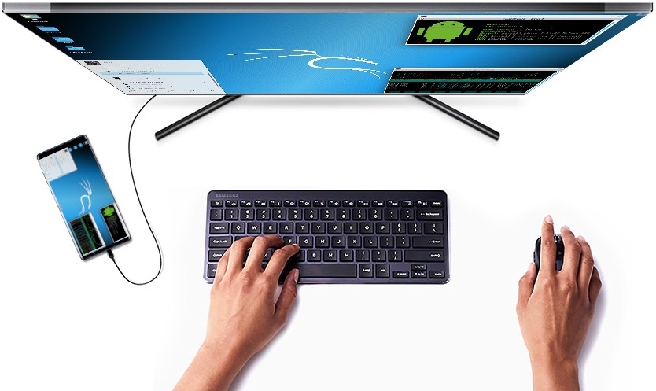
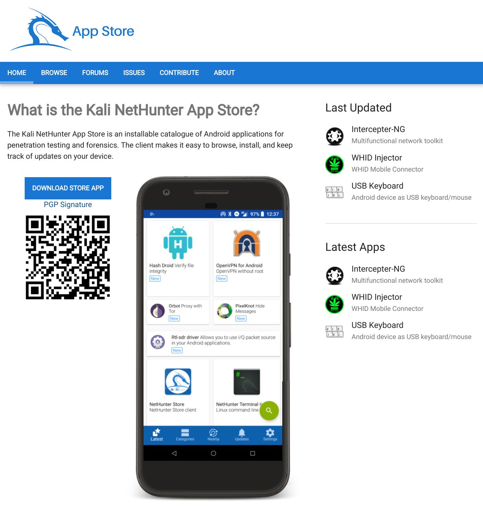
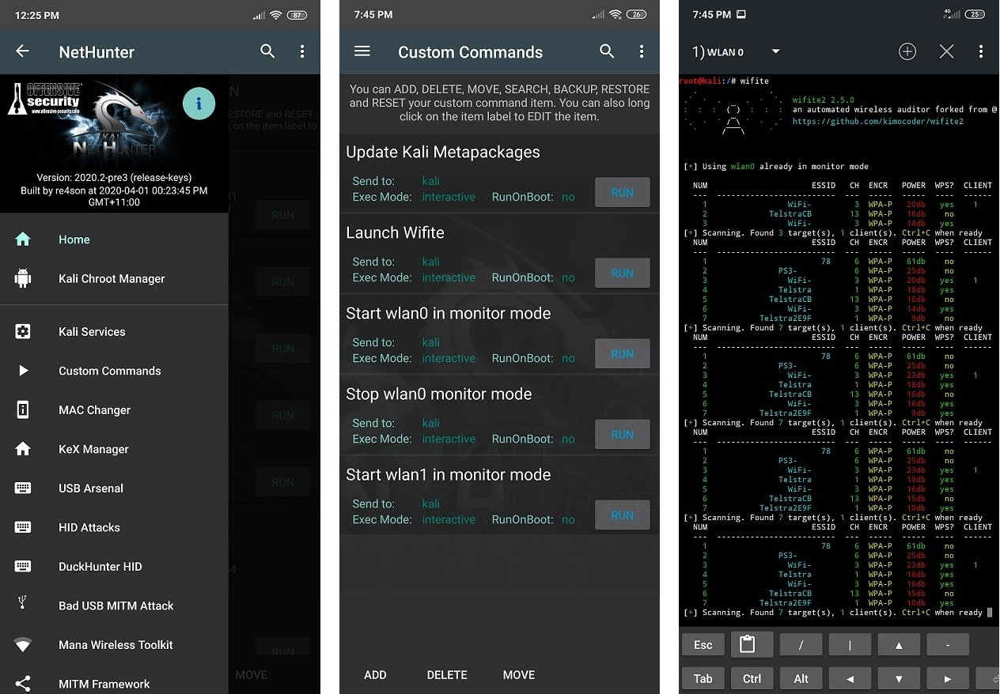

**칼리 넷헌터는 칼리 리눅스를 기반으로 한 안드로이드 기기용 무료 오픈소스 **모바일 침투 테스트 플랫폼**이에요.**

## 개요

칼리 넷헌터는 루팅되지 않은 기기(넷헌터 루트리스), 커스텀 리커버리가 있는 루팅된 기기(넷헌터 라이트), 그리고 넷헌터 전용 커널이 사용 가능한 루팅된 기기(넷헌터)에서 사용할 수 있어요.

세 가지 에디션 모두에 포함된 칼리 넷헌터의 핵심 구성 요소는 다음과 같아요:

- 칼리 리눅스가 제공하는 모든 도구와 애플리케이션이 포함된 칼리 리눅스 컨테이너(container)

- 수십 개의 전용 보안 앱이 있는 칼리 넷헌터 앱 스토어

- 칼리 넷헌터 앱 스토어에 접근하기 위한 안드로이드 클라이언트

- HDMI를 통한 화면 미러링 또는 무선 화면 캐스팅을 지원하는 전체 칼리 리눅스 데스크톱 세션을 실행할 수 있는 칼리 넷헌터 데스크톱 경험(KeX)

그림 2: HDMI 모니터로 출력되는 칼리 넷헌터 데스크톱 경험(KeX)

칼리 넷헌터 앱 스토어는 전용 클라이언트 앱이나 웹 인터페이스를 통해 접근할 수 있어요.

**2026년 3월 31일 기준으로 스토어는 오래된 상태이며, 유지보수가 제대로 이루어지지 않고 있습니다. 현재 처음부터 새로운 스토어를 새로 개발할 계획이며, 곧 작업을 시작할 예정입니다. 사용 중 "privileged extension" 관련 문제가 발생할 수 있어요. 이 경우 NH Store 설정으로 이동한 후, 고급 설정(Advanced Settings)을 활성화하고 "privileged extension" 옵션의 체크를 해제하세요.**

그림 3: 칼리 넷헌터 앱 스토어

**루팅된 두 에디션 모두 추가 도구 및 서비스를 제공해요**.
커스텀 커널은 추가 네트워크 및 USB 가젯 드라이버와 선택된 Wi-Fi 칩에 대한 Wi-Fi 인젝션(injection, 패킷 주입) 지원을 추가하여 기능을 확장할 수 있어요.

그림 4: 칼리 넷헌터 앱은 루팅된 두 에디션(넷헌터 라이트 & 넷헌터)에서 사용할 수 있어요.

칼리 리눅스에 포함된 [침투 테스트 도구](/tools/) 외에도, 넷헌터는 **HID 키보드 공격**, **BadUSB 공격**, **Evil AP MANA 공격** 등 여러 추가 클래스를 지원해요.

넷헌터를 구성하는 구성 요소에 대한 자세한 정보는 [넷헌터 구성 요소](/docs/nethunter/nethunter-components/) 페이지를 확인해보세요. 칼리 넷헌터는 [칼리](/)와 커뮤니티가 개발한 [오픈소스 프로젝트](/docs/policy/kali-linux-open-source-policy/)예요.

## 1.0 넷헌터 에디션

넷헌터는 다음 에디션 중 하나를 사용하여 거의 모든 안드로이드 기기에 설치할 수 있어요:

| 에디션            | 사용 용도                                                        |
| ------------------ | ------------------------------------------------------------ |
| 넷헌터 루트리스 | 루팅되지 않고 수정되지 않은 기기를 위한 넷헌터의 핵심 기능       |
| 넷헌터 라이트     | 커스텀 커널이 없는 루팅된 폰을 위한 전체 넷헌터 패키지 |
| 넷헌터          | 지원되는 기기를 위한 커스텀 커널이 포함된 전체 넷헌터 패키지 |

다음 표는 기능의 차이점을 보여줘요:

|      기능       | 넷헌터 루트리스 | 넷헌터 라이트 | 넷헌터 |
| :----------------: | :----------------: | :------------: | :-------: |
|     앱 스토어      |        예         |      예       |    예    |
|      칼리 CLI      |        예         |      예       |    예    |
| 모든 칼리 패키지  |        예         |      예       |    예    |
|        KeX         |        예         |      예       |    예    |
| Metasploit(DB 없음)  |        예         |      예       |    예    |
| Metasploit(DB 포함) |         아니오         |      예       |    예    |
|   넷헌터 앱    |         아니오         |      예       |    예    |
|   루트 필요    |         아니오         |      예       |    예    |
|   WiFi 인젝션   |         아니오         |       아니오       |    예    |
|    HID 공격     |         아니오         |       아니오       |    예    |
|    BT 아스날      |         아니오         |       아니오       |    예    |
|    CARsenal        |         아니오         |       아니오       |    예    |

넷헌터 루트리스의 설치는 여기에 문서화되어 있어요:
[넷헌터-루트리스](/docs/nethunter/nethunter-rootless/)

넷헌터-앱 관련 챕터는 넷헌터 & 넷헌터 라이트 에디션에만 적용돼요.

커널 관련 챕터는 넷헌터 에디션에만 적용돼요.

## 2.0 넷헌터 지원 기기 및 ROM

넷헌터 라이트는 Magisk로 루팅된 모든 안드로이드 기기에 설치할 수 있습니다. (KSU에서도 동작할 수는 있지만, 공식적으로 지원되지는 않아요.)
넷헌터의 모든 기능을 사용하려면 칼리 넷헌터용으로 특별히 제작된 기기별 커널이 필요합니다.
[넷헌터 GitLab 저장소](https://gitlab.com/kalilinux/nethunter)에는 100개 이상의 기기를 위한 250개 이상의 커널이 포함되어 있어요. 칼리 리눅스는 [넷헌터 다운로드 페이지](/get-kali/)에서 가장 인기 있는 기기용 이미지를 게시해요.
다음 실시간 보고서는 GitLab CI에 의해 자동으로 생성돼요:

- [분기별로 게시되는 공식 넷헌터 이미지 목록](https://nethunter.kali.org/images.html)
- [모든 넷헌터 지원 커널 목록](https://nethunter.kali.org/kernels.html)
- [넷헌터를 설치할 수 있는 기기 목록](https://nethunter.kali.org/device-kernels.html)

## 3.0 넷헌터 다운로드

지원되는 특정 기기용 공식 릴리스 넷헌터 이미지는 다음 URL에 있는 칼리 리눅스 페이지에서 다운로드할 수 있어요:

- [kali.org/get-kali/](https://kali.org/get-kali/)
- [주간 빌드](https://image-nethunter.kali.org/nethunter-installer/kali-weekly/)
- [일일 빌드](https://image-nethunter.kali.org/nethunter-installer/kali-daily/)

zip 파일을 다운로드한 후에는 넷헌터 zip 이미지의 SHA256 합계를 다운로드 페이지의 값과 비교하여 확인해주세요. SHA256 합계가 일치하지 않으면 설치 절차를 계속 진행하지 마세요.

## 4.0 넷헌터 빌드

GitLab 저장소에서 넷헌터 이미지를 빌드하고 싶은 분들은 Python 빌드 스크립트를 사용할 수 있어요. 자세한 정보는 [넷헌터 빌드](/docs/nethunter/building-nethunter/) 페이지를 확인해보세요.
넷헌터 인스톨러 빌더 사용 또는 자신의 기기 추가에 대한 추가 지침은 [nethunter-installer](https://gitlab.com/kalilinux/nethunter/build-scripts/kali-nethunter-installer) git 저장소에 있는 [README](https://gitlab.com/kalilinux/nethunter/build-scripts/kali-nethunter-installer/-/blob/main/README.md)에서 찾을 수 있어요.

## 5.0 안드로이드에 넷헌터 설치하기

넷헌터 이미지를 다운로드했거나 직접 빌드했다면, 다음 단계는 안드로이드 기기를 준비하고 이미지를 설치하는 거예요. "안드로이드 기기 준비"에는 다음이 포함돼요:

- 기기 **잠금 해제** 및 **스톡** AOSP 또는 LineageOS(CM)로 **업데이트**. (지원되는 ROM은 [2.0](#id-20-넷헌터-지원-기기-및-rom) 참조).
- 기기를 루팅하기 위해 **[Magisk](https://github.com/topjohnwu/Magisk) 설치**.
- Magisk에서 넷헌터를 플래시하면 완료됩니다!

- [자세한 설치 방법](/docs/nethunter/installing-nethunter/)

## 6.0 설치 후 설정

- 넷헌터 앱을 열고 필요한 권한을 허용하세요.
- 칼리 Chroot 매니저를 실행하세요.
- 넷헌터 스토어 앱을 사용하여 넷헌터 스토어에서 해커 키보드를 설치하세요.
- 필요에 따라 넷헌터 스토어에서 다른 앱들을 설치하세요.
- SSH 같은 칼리 서비스를 구성하세요.
- 커스텀 명령어를 설정하세요.
- Exploit-Database를 초기화하세요.

## 7.0 칼리 넷헌터 애플리케이션

이것은 대부분의 칼리 넷헌터 유저스페이스 도구를 포함하는 안드로이드 APK예요. 상태 정보와 넷헌터 자체(커널과 chroot)를 관리하는 도구들, 그리고 다양한 도구와 공격들이 포함되어 있어요.

chroot가 실행되지 않으면 공격 메뉴들이 회색으로 표시돼요. 일부 공격은 첫 사용 시 추가 요구사항을 다운로드하라고 알려줄 거예요.

### 넷헌터 관리

- [**홈 화면**](/docs/nethunter/nethunter-home-screen/) - 일반 정보 패널, 네트워크 인터페이스 및 HID 기기 상태.
- [**칼리 Chroot 매니저**](/docs/nethunter/nethunter-chroot-manager/) - chroot 메타패키지 설치 관리.
- [**설정**](/docs/nethunter/nethunter-settings/) - 부트 애니메이션 선택 및 다양한 설정 수정.
- [**커널**](/docs/nethunter/nethunter-kernel/) - 커널 검색, 다운로드 및 플래시
- [**모듈**](/docs/nethunter/nethunter-modules/) - 모듈 로드

### 도구

- [**칼리 서비스**](/docs/nethunter/nethunter-kali-services/) - 다양한 chroot 서비스 시작/중지. 부팅 시 활성화 또는 비활성화.
- [**커스텀 명령어**](/docs/nethunter/nethunter-custom-commands/) - 런처에 자신만의 커스텀 명령어와 기능 추가.

### 공격

- [**KeX 매니저**](/docs/nethunter/nethunter-kex-manager/) - 칼리 chroot와 즉시 VNC 세션 설정.
- [**MAC 체인저**](/docs/nethunter/nethunter-mac-changer/) - Wi-Fi MAC 주소 변경 (특정 기기에서만)
- [**오디오 매니저**](/docs/nethunter/nethunter-audio/) - KeX용 오디오 활성화.
- [**USB 아스날**](/docs/nethunter/nethunter-usbarsenal/) - USB 가젯 구성 제어.
- [**HID 공격**](/docs/nethunter/nethunter-hid-attacks/) - Teensy 스타일의 다양한 HID 공격.
- [**덕헌터 HID**](/docs/nethunter/nethunter-duckhunter/) - Rubber Ducky 스타일의 HID 공격.
- [**BadUSB MITM 공격**](/docs/nethunter/nethunter-badusb/) - 말 그대로예요.
- [**Wifipumpkin**](/docs/nethunter/nethunter-wifipumpkin/) - 버튼 클릭으로 캡티브 포털이 있는 악성 액세스 포인트 설정.
- [**WPS 공격**](/docs/nethunter/nethunter-wps/) - OneShot을 사용한 WPS 공격.
- [**블루투스 아스날**](/docs/nethunter/nethunter-btarsenal/) - 다양한 블루투스 기기에 대한 정찰, 스푸핑, 청취 또는 오디오 주입.
- [**소셜 엔지니어 툴킷**](/docs/nethunter/nethunter-set/) - 소셜 엔지니어 툴킷용 피싱 이메일 템플릿 구축.
- [**NMap 스캔**](/docs/nethunter/nethunter-nmap/) - 빠른 Nmap 스캐너 인터페이스.
- [**Metasploit 페이로드 생성기**](/docs/nethunter/nethunter-mpg/) - 실시간으로 Metasploit 페이로드 생성.
- [**Searchsploit**](/docs/nethunter/nethunter-searchsploit/) - [Exploit-Database](https://www.exploit-db.com/)에서 익스플로잇 쉽게 검색.
- **파인애플 커넥터** - USB를 통해 Hak5 WiFi 파인애플에 안드로이드로부터 WiFi 제공
- [**워드라이빙**](/docs/nethunter/nethunter-wardriving/) - 주변 Wi-Fi 네트워크를 수동적으로 스니핑
- [**CARsenal**](/docs/nethunter/nethunter-carsenal/) - 자동차 보안 도구.

## 8.0 새로운 기기에 넷헌터 포팅하기

다른 안드로이드 기기에 넷헌터를 포팅하는 데 관심이 있다면 다음 링크를 확인해보세요. 포팅이 성공하면 우리 릴리스에 이러한 커널을 포함할 수 있도록 알려주세요!

1. [수동으로 시작하기](/docs/nethunter/porting-nethunter/)
2. [커널 빌더로 시작하기](/docs/nethunter/porting-nethunter-kernel-builder/)
3. [커널 패치하기](/docs/nethunter/nethunter-kernel-1-patching/)
4. [커널 구성하기](/docs/nethunter/nethunter-kernel-2-config-1/)
5. [기기 추가하기](https://gitlab.com/kalilinux/nethunter/build-scripts/kali-nethunter-kernels)

넷헌터 팀에서 권장하는 기타 자료:

1. [Yesimxev NetHunter 커널 포팅 가이드 YouTube 영상](https://www.youtube.com/watch?v=FwSHbZqY88k) - [커널 빌더 시작하기](/docs/nethunter/porting-nethunter-kernel-builder/)와 함께 시청하는 것을 권장합니다.
2. [Akabulous의 심화 커널 포팅 가이드](https://gitlab.com/akabulous/So_You_Want_To_Build_A_Nethunter_Kernel)
3. [R0ttenBeef 커널 포팅 가이드](https://r0ttenbeef.github.io/Port-Custom-Build-of-Kali-Nethunter-to-an-Unsupported-Phone-Walkthrough/)

## 9.0 동작 확인된 하드웨어

1. [무선 카드](/docs/nethunter/wireless-cards/)
2. SDR - RTL-SDR (RTL2832U 기반)
3. 블루투스 어댑터 - Sena UD100, TP-Link UB500, 일반 CSR4.0 어댑터
4. CARsenal - [CAN USB 분석기](https://www.seeedstudio.com/USB-CAN-Analyzer-p-2888.html?srsltid=AfmBOooenIruMfjueidDJ9TK8t6e8ihd3wuCCV0i7e2YQfTTSBDhfyYw), [CANable USB](https://openlightlabs.com/), [ELM327 어댑터](https://www.carscanner.info/choosing-obdii-adapter/), [MCP25XX CAN 모듈](https://www.seeedstudio.com/I2C-CAN-Bus-Module-p-5054.html?srsltid=AfmBOorQK745b5IMop1r_Gmledh6YLwc1VlqrpDMOnUxBGrA6iCpLiEb)

CARsenal 어댑터에 대해 설명하자면, 권장하는 모든 하드웨어는 테스트를 거쳤으며 정상적으로 동작하는 것을 확인했어요. AliExpress의 클론 제품은 동작할 수도 있고, 동작하지 않을 수도 있어요. 개인적으로는 모든 제품의 클론을 구매했으며, ELM327을 제외한 모든 제품을 정상적으로 사용할 수 있었어요. ELM327은 feediag에서 클론 제품으로 감지되었고, 차량과의 연결도 성공적으로 이루어지지 않았으며, 어쨌든 가능하다면 공식 제품을 구매하는 것을 권장해요. 추후 다른 권장 제품이 추가될 수도 있어요.

## 10.0 넷헌터 앱

- [**넷헌터 터미널 애플리케이션**](/docs/nethunter/nethunter-terminal/)
- [**넷헌터 KeX 애플리케이션**](/docs/nethunter/nethunter-kex/)

## 11.0 유용한 링크

1. 넷헌터 스토어 앱은 [여기서](https://store.nethunter.com/NetHunterStore.apk) 다운로드할 수 있어요
2. 넷헌터 웹 스토어는 [여기서](https://store.nethunter.com/) 찾을 수 있어요
3. 넷헌터 앱 빌드를 위한 소스 코드는 GitLab [여기서](https://gitlab.com/kalilinux/nethunter/apps) 찾을 수 있어요
