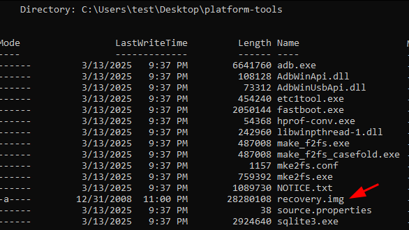

## Overview

We are going to be covering how to install Kali NetHunter on a OnePlus 5T. Steps are as follows:

- Wipe the phone
- Enable developer mode & USB debug mode
- OEM Unlock with ADB
- Install LineageOS (version 20)
- Root the device with TWRP
- Install NetHunter

We’ll be using a pre-created NetHunter image for this device but in order to install it, we’re going to remove stock OxygenOS and we will be installing LineageOS.

[According to NetHunter wiki](https://nethunter.kali.org/images.html), we need a specific version of LineageOS (version 20). I wasn’t able to find this version on LineageOS’ official website so I’ll be linking to a non official download page. Use it at your own risk.

This is an unsigned build but I didn’t have any issues while installing it. Apart from this, the installation process is identical to LineageOS v22’s installation so I’ll be following their [guide](https://wiki.lineageos.org/devices/dumpling/install/).

Also a side note, 5T’s last update was for Android v10. Installing [LineageOS v20](https://wiki.lineageos.org/devices/dumpling/) will upgrade it to Android v13 so we don’t have to disable force encryption & DM-verity.

## Developer Mode, OEM Unlocking & USB Debug Mode

Now the introduction is out of the way, let’s get started. First backup all your files, remove your Google account from the device and disable lockscreen security options. Then wipe your phone by going into Settings > System > Reset options > Erase all data (factory reset).

After reboot, you don’t need to connect to WiFi, sign in with your Google account or set a PIN. Just skip every step. We’ll be changing the OS like I mentioned anyway.

In order to enable Developer mode go to Settings > About Phone and tap “Build Number” 7 times. Now go back to Settings > System and you will see a new section called Developer.

Under Developer Options you will need to enable “OEM unlocking” and “USB debugging”. While at it, you may want to enable “Advanced reboot” aswell for the sake of convenience.

## Installing LineageOS

For this step, you’re going to need to download two files.

- [LineageOS v20 (dumpling)](https://sourceforge.net/projects/lineageos-cheeseburger/files/lineage-20/dumpling/) (non official link)
- [Android Debug Bridge SDK](https://developer.android.com/tools/releases/platform-tools)

Extract ADB. Then open up the LOS zip file you just downloaded, grab the “recover.img” file and put it in the same folder.

Now disconnect your device from your computer and hold the power button on your device and hit Bootloader.

**Tip:** You can also enter Fastboot mode by pressing Vol Up + Power while the device is powered off. To enter  Bootloader mode, press Vol Down + Power.
