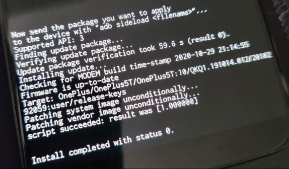
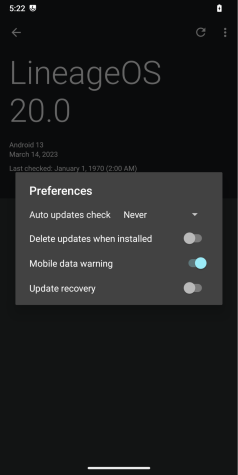
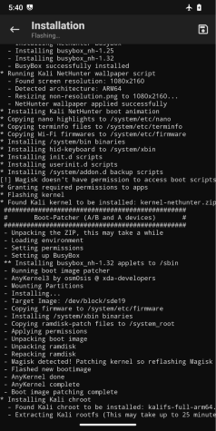

## 개요

원플러스 5T에 넷헌터를 설치하는 방법을 다룰게요. 단계는 다음과 같아요:

- 개발자 옵션, OEM 잠금 해제 및 USB 디버깅 활성화하기
- 리니지OS 설치하기
- Magisk와 TWRP로 기기 루팅하기
- 넷헌터 설치하기

이 기기를 위해 사전 제작된 넷헌터 이미지를 사용할 것이지만, 이를 설치하기 위해 기본 OxygenOS v10.0.1(Android v10)에서 LineageOS v20(Android 13)으로 변경할 예정이에요. 이 가이드는 Windows 10 VM에서 작성되었지만 Linux나 MacOS에서도 따라할 수 있어요.

시작하기 전에 모든 파일을 백업하고, Google 계정을 제거하고, 보안 옵션(PIN, 지문 등)을 비활성화하세요. 그런 다음 *설정* > *시스템* > *초기화 옵션* > *모든 데이터 삭제(공장 초기화)*로 이동하여 폰을 초기화하세요. 재부팅 후, WiFi에 연결하거나 Google 계정으로 로그인하거나 PIN을 설정할 필요가 없어요. 모든 단계를 건너뛰세요. 어쨌든 언급했듯이 OS를 변경할 예정이에요.

## 개발자 옵션, OEM 잠금 해제 및 USB 디버그 모드

개발자 모드를 활성화하려면 *설정* > *휴대폰 정보*로 이동하여 *빌드 번호*를 7번 탭하세요. 이제 *설정* > *시스템*으로 돌아가면 *개발자*라는 새 섹션이 보일 거예요. *개발자 옵션*에서 *OEM 잠금 해제*와 *USB 디버깅*을 활성화해야 해요. 또한 편의를 위해 *고급 재부팅*도 활성화하는 것이 좋아요. 이렇게 하면 전원 메뉴에서 부트로더나 패스트부트 모드로 재부팅할 수 있어요.

## LineageOS 설치하기

v20의 설치 과정은 v22와 동일하므로 그들의 [가이드](https://wiki.lineageos.org/devices/dumpling/install/)를 따를 거예요. 이 단계에서는 두 개의 파일을 다운로드해야 해요.

- [LineageOS v20 (dumpling)](https://web.archive.org/web/20230314184423/https://download.lineageos.org/devices/dumpling/builds) (lineage-20.0-20230314-nightly-dumpling-signed.zip 파일만 필요해요)
- [Android Debug Bridge SDK](https://developer.android.com/tools/releases/platform-tools)

ADB를 폴더에 압축 해제하세요. 그런 다음 방금 다운로드한 아카이브를 열고, *recovery.img* 파일을 같은 폴더에 넣으세요.

이제 기기를 컴퓨터에서 분리하고, 기기의 전원 버튼을 누른 다음 부트로더를 선택하세요.

**팁:** 기기 전원이 꺼진 상태에서 `볼륨 업` + `전원` 버튼을 눌러 *패스트부트 모드*에 들어갈 수도 있어요. *부트로더 모드*에 들어가려면 `볼륨 다운` + `전원` 버튼을 누르세요.

폰에 이 화면이 보이면, 기기를 컴퓨터에 연결하고 터미널을 실행하세요. `fastboot devices`를 입력하면 동일한 일련번호로 기기가 표시될 거예요.

**참고:** 기기가 보이지 않는다면, 드라이버를 설치해야 해요. Windows Update > 업데이트 확인 > 고급 옵션 > 선택적 업데이트 > 드라이버 업데이트로 이동하세요. 그런 다음 컴퓨터를 재시작하세요.

부트로더 잠금을 해제하려면 `fastboot oem unlock`을 입력하세요. 기기에 프롬프트가 표시될 거예요. `볼륨 다운` 버튼을 사용하여 잠금 해제를 선택하고 `전원` 버튼을 눌러 확인하세요.

**참고:** 이 시점부터, 기기를 재시작할 때마다 부트로더가 잠금 해제되었다는 경고 메시지가 표시될 거예요. 이는 정상이며 비활성화할 수 없어요.

폰이 다시 초기화되고 OOS의 초기 설정 과정이 표시될 거예요. 다시 모든 단계를 건너뛰세요. **단계 2**를 다시 수행하여 개발자 모드와 USB 디버깅을 활성화하세요. 이번에는 기기에서 USB 디버깅을 허용할지 물을 거예요. 허용을 누르세요. 이제 터미널로 돌아가서 `adb devices`를 입력하세요. 목록에서 기기가 보일 거예요.

**참고:** 기기가 보이지 않는다면, 다른 드라이버 세트를 설치해야 해요. Windows Update > 업데이트 확인 > 고급 옵션 > 선택적 업데이트 > 드라이버 업데이트로 이동하세요. 그런 다음 컴퓨터를 다시 재시작하세요.

`adb -d reboot bootloader`를 입력하여 기기를 패스트부트 모드로 재부팅하세요. 재부팅 후, `fastboot devices`를 입력하여 패스트부트 모드에서 기기에 접근할 수 있는지 확인하세요. 마지막으로 `fastboot flash recovery recovery.img`를 입력하여 recovery.img를 기기에 플래시하세요.

이 과정은 다음과 같아 보여야 해요:

이제 폰으로 돌아가서 `볼륨 다운`을 두 번 누르세요. 맨 위에 *복구 모드*가 보일 거예요. `전원` 버튼을 누르세요.

이번에는 LineageOS 복구 화면이 표시될 거예요.

*업데이트 적용*을 누른 다음 *ADB에서 적용*을 누르세요. 이제 다운로드한 LineageOS v20 zip 파일을 adb 폴더에 넣고 `adb -d sideload filename.zip`으로 기기에 푸시하세요.

설치가 시작될 거예요. 완료 후, 다음과 같은 로그가 표시되어야 해요:

이 시점에서 LineageOS로 부팅하기 전에 *Google 앱*(Play Store 등)을 설치하면 좋지만, 저는 이 기기를 순전히 넷헌터용으로 사용할 것이므로 이 단계를 건너뛰었어요.

메뉴로 돌아가서 기기를 재부팅하세요. LineageOS의 초기 설정이 표시될 거예요. 기기를 WiFi에 연결하기 전에, 안전을 위해 자동 업데이트를 비활성화하는 것이 좋아요(설정 > 시스템 > 업데이터 > 세 개의 점 > 환경설정 > 자동 업데이트 확인 > 안함).

 

## 기기 루팅하기

이 단계에서 몇 가지가 필요해요.

- [Magisk](https://github.com/topjohnwu/Magisk/releases/tag/v28.1)
- LineageOS zip 파일의 boot.img
- [TWRP](https://eu.dl.twrp.me/cheeseburger_dumpling/)

Magisk로 루팅된 부트 이미지를 만드는 것부터 시작하겠습니다. apk를 다운로드하여 boot.img 파일과 함께 폰으로 전송하세요.

파일 관리자를 열고 Magisk를 설치하세요. 보안 경고가 표시되면 예를 누르고 앱을 열어주세요.

Magisk 옆의 *설치*를 누르고, *파일 선택 및 패치*를 누른 다음 **boot.img** 파일을 선택하세요. 마지막으로 *시작하자*를 눌러 루팅된 boot.img 파일을 만드세요. 모든 것이 순조롭게 진행되면 다음과 같은 로그가 표시될 거예요:

루팅된 부트 파일은 같은 폴더에 있을 거예요(`magisk_patched-***.img`). 컴퓨터에 백업해 두세요(만일을 위해). 폰 전원을 끄고 PC에서 분리하세요.

이제 TWRP를 설치할 시간이에요. `볼륨 업`과 `전원` 버튼을 길게 눌러 패스트부트 모드로 기기를 시작하세요. 폰을 PC에 다시 연결하고(이 방식으로 하는 이유는 폰이 PC에 연결되어 있을 때 fastboot나 bootloader 명령을 무시하는 경우가 있기 때문이지만, 상황에 따라 다를 수 있어요), 터미널로 돌아가서 `fastboot devices`를 입력하여 패스트부트 모드에서 기기와 통신할 수 있는지 확인하세요. 그런 다음 `fastboot flash recovery filename.img`를 입력하여 TWRP를 플래시하세요.

그런 다음 폰으로 돌아가 `볼륨 다운`을 두 번 눌러 복구 모드를 선택하고 `전원` 버튼을 눌러 기기를 재시작하세요. TWRP가 부팅되면 *설치* > *다운로드 폴더*로 이동 > *이미지 설치*(오른쪽 하단)를 누르고 Magisk로 만든 루팅된 부트 파일을 선택하세요. 다음 화면에서 `부트` 파티션을 선택하고 스와이프하여 기기를 플래시하세요.

  

완료되면 시스템을 재부팅하세요. LOS로 돌아오면 Magisk를 열고 이제 *슈퍼 유저*와 *모듈* 탭에 접근할 수 있어야 해요. 이것은 기기가 루팅되었음을 나타냅니다.

## 넷헌터 설치하기

이것이 가장 쉬운 부분이에요. [kali.org](https://www.kali.org/get-kali/#kali-mobile)에서 OnePlus 5T용 넷헌터를 다운로드하고 기기로 전송하세요. *Magisk* > *모듈* > *저장소에서 설치*를 열고 방금 전송한 넷헌터를 선택하세요.

설치 과정은 시간이 걸릴 거예요.

기기를 재부팅한 후, OS로 부팅하는 데 시간이 걸릴 수 있어요. 인내심을 가지고 기기의 전원을 끄지 마세요. 초기 넷헌터 설정 후에 이 문제를 해결할 거예요. 아직 연결하지 않았다면 기기를 WiFi에 연결하세요.

먼저 *넷헌터 터미널*을 열고 닫으세요. 그런 다음 *Magisk* > *슈퍼유저*를 열고 *넷헌터*와 *넷헌터 터미널*을 활성화하세요. 이제 *넷헌터*를 열고 초기 설정 과정을 진행하세요. 완료 후, *넷헌터 스토어*도 업데이트하세요.

이게 다예요. 넷헌터가 준비되었어요.

**참고:** 기기가 OS로 부팅하는 데 시간이 오래 걸린다면, 복구 모드로 돌아가세요. TWRP에 들어가면 *초기화*를 누른 다음 *Dalvik / ART 캐시*와 *캐시*를 선택하세요. 마지막으로 스와이프하여 초기화하고 재부팅하세요. 몇 초 내에 부팅될 거예요.

 