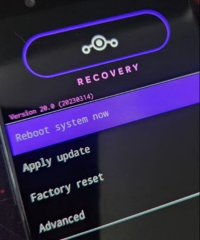
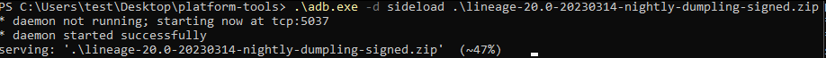
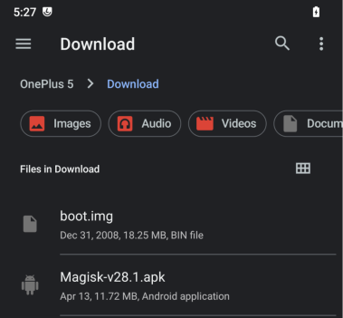
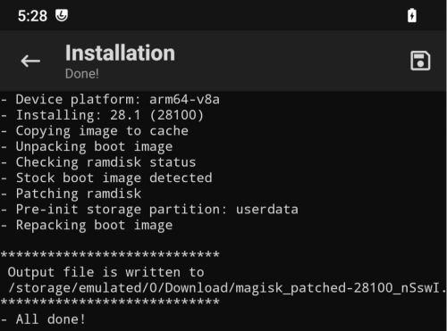

## Overview

We are going to be covering how to install Kali NetHunter on a OnePlus 5T. Steps are as follows:

- Wipe the phone
- Enable developer mode & USB debug mode
- OEM Unlock with ADB
- Install LineageOS (version 20)
- Root the device with TWRP
- Install NetHunter

We’ll be using a pre-created NetHunter image for this device but in order to install it, we’re going to remove stock OxygenOS and we will be installing LineageOS.

[According to NetHunter wiki](https://nethunter.kali.org/images.html), we need a specific version of LineageOS (version 20). I wasn’t able to find this version on LineageOS’ official website so I’ll be linking to a non official download page. Use it at your own risk.

This is an unsigned build but I didn’t have any issues while installing it. Apart from this, the installation process is identical to LineageOS v22’s installation so I’ll be following their [guide](https://wiki.lineageos.org/devices/dumpling/install/).

Also a side note, 5T’s last update was for Android v10. Installing [LineageOS v20](https://wiki.lineageos.org/devices/dumpling/) will upgrade it to Android v13 so we don’t have to disable force encryption & DM-verity.

## Developer Mode, OEM Unlocking & USB Debug Mode

Now the introduction is out of the way, let’s get started. First backup all your files, remove your Google account from the device and disable lockscreen security options. Then wipe your phone by going into Settings > System > Reset options > Erase all data (factory reset).

After reboot, you don’t need to connect to WiFi, sign in with your Google account or set a PIN. Just skip every step. We’ll be changing the OS like I mentioned anyway.

In order to enable Developer mode go to Settings > About Phone and tap “Build Number” 7 times. Now go back to Settings > System and you will see a new section called Developer.

Under Developer Options you will need to enable “OEM unlocking” and “USB debugging”. While at it, you may want to enable “Advanced reboot” aswell for the sake of convenience.

## Installing LineageOS

For this step, you’re going to need to download two files.

- [LineageOS v20 (dumpling)](https://sourceforge.net/projects/lineageos-cheeseburger/files/lineage-20/dumpling/) (non official link)
- [Android Debug Bridge SDK](https://developer.android.com/tools/releases/platform-tools)

Extract ADB. Then open up the LOS zip file you just downloaded, grab the “recover.img” file and put it in the same folder.

Now disconnect your device from your computer and hold the power button on your device and hit Bootloader.

**Tip:** You can also enter Fastboot mode by pressing `Vol Up` + `Power` while the device is powered off. To enter Bootloader mode, press `Vol Down` + `Power`.

When you see this screen on your phone, connect it to your computer and start a Terminal. Type `fastboot devices` and you should see your device with the same serial number.

Note: If you can’t see your device, you need to install drivers. Go to Windows Update > Check for updates > Advanced options > Optional updates > Driver updates. Then restart your computer.

In order to unlock bootloader, type `fastboot oem unlock`. You will see a prompt on your device. Use `Vol down` button to select unlock and hit the `Power` button to confirm.

**Note:** From this point on, you will see a warning message about bootloader being ulocked everytime you restart your phone. This is normal and there is no way of disabling it.

The phone will wipe again and you’ll be greeted with the initial setup process of OOS. Skip everything again. Redo `Step 2` to enable Dev mode and USB Debugging. This time your device will ask if you want to Allow USB Debugging. Hit Allow. Now go back to Terminal and type `adb devices`. You should see your device on the list.

**Note:** If you can’t see your device, you need to install drivers. Go to Windows Update > Check for updates > Advanced options > Optional updates > Driver updates. Then restart your computer.

Reboot your device to Fastboot mode by typing `adb -d reboot bootloader`. After the reboot, type `fastboot devices` to confirm you can access the device in fastboot mode. And finally flash the recovery.img to your device by typing `fastboot flash recovery recovery.img`.

The process should look like this:

Now go back to your phone and hit `Vol down` twice. You’ll see “Recovery mode” up top. Press the `Power` button.

This time you’ll be greeted with LineageOS’ Recovery screen.

Hit *Apply update* then *Apply from ADB*. Now put the LineageOS v20 zip file you downloaded from the SourceForge link to the adb folder and push it to your device with `adb -d sideload filename.zip`.

After the installation, you should see a log like this:

At this point you should install *Google Apps* if you’d like to use them before you boot into LineageOS but since I’m going to be using this device purely for NetHunter, I skipped that step.

Go back a step and reboot the device. You should be greeted with LineageOS’ initial setup. Before you connect your device to WiFi, you may want to disable automatic updates just to be safe (Settings > System > Updater > Three Dots > Preferences > Auto updates check > Never).

 

## Rooting the Device

You’re going to need couple things for this step.

- [Magisk](https://github.com/topjohnwu/Magisk/releases/tag/v28.1)
- boot.img file from LineageOS zip file.
- [TWRP](https://eu.dl.twrp.me/cheeseburger_dumpling/)

Let’s start with creating a rooted boot image with Magisk. Download the apk and send it to your phone along with the boot.img file.

Open the file manager and install Magisk. You’re going to get a security warning, hit yes and open up the app.

Hit *Install* next to Magisk, hit *Select and Patch a File* and then pick the **boot.img** file. Hit *LET’S GO* to create a rooted boot.img file. If everything went smoothly, you should see a log like this:

Your rooted boot.img file should be in the same folder. Back it up to your computer (just in case). Turn off your phone and disconnect it from your PC.

Now it’s time to install TWRP. Hold `Vol up` and `Power` button to start the device in Fastboot mode. Go back to your terminal and type `fastboot devices` to confirm it’s in Fastboot mode. Then type `fastboot flash recovery <filename>.img` to flash TWRP.

Then go back to your phone, hit `Vol down` twice to pick Recovery Mode and hit `Power` button to restart the device. Once TWRP is booted up hit *Install* > go to *Download folder* > hit *Install Image* (bottom right) and pick the rooted boot file you created with Magisk (it should be named `magisk_patched-***.img`). On the next screen pick the `boot` partition and swipe to flash the device.

  

