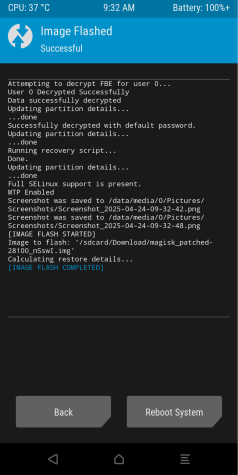

## Overview

We’ll be covering how to install NetHunter on OnePlus 5T. Steps are as follows:

- Enable Developer options, OEM Unlocking and USB Debugging
- Install LineageOS
- Root the device with Magisk and TWRP
- Install NetHunter

We’re going to use a pre-made NetHunter image created for this device but in order to install it, we’ll be changing stock OxygenOS v10.0.1 (Android v10) to LineageOS v20 (Android 13). A Windows 10 VM was used to create this guide but you should be able to follow the steps on Linux or MacOS.

Before we begin, backup all your files, remove your Google account and disable security options (like PIN, fingerprint etc). Then wipe your phone by going into *Settings* > *System* > *Reset options* > *Erase all data (factory reset)*. After reboot, you don’t need to connect to WiFi, sign in with your Google account or set a PIN. Just skip every step. We’ll be changing the OS like I mentioned anyway.

## Developer Options, OEM Unlocking & USB Debug Mode

In order to enable Developer mode go to *Settings* > *About Phone* and tap *Build Number* 7 times. Now go back to *Settings* > *System* and you will see a new section called *Developer*. Under *Developer Options* you will need to enable *OEM unlocking* and *USB debugging*. While at it, you may want to enable *Advanced reboot* aswell for the sake of convenience. This will allow you to reboot to Bootloader or Fastboot modes from the power menu.

## Installing LineageOS

v20’s installation process is identical to v22’s so I’ll be following their [guide](https://wiki.lineageos.org/devices/dumpling/install/). For this step, you’re going to need to download two files.

- [LineageOS v20 (dumpling)](https://web.archive.org/web/20230314184423/https://download.lineageos.org/devices/dumpling/builds) (you just need lineage-20.0-20230314-nightly-dumpling-signed.zip file)
- [Android Debug Bridge SDK](https://developer.android.com/tools/releases/platform-tools)

Extract ADB to a folder. Then open up the archive you just downloaded, grab the *recovery.img* file and put it in the same folder.

Now disconnect your device from your computer, hold the power button on your device and hit Bootloader.

**Tip:** You can also enter *Fastboot mode* by pressing `Vol Up` + `Power` while the device is powered off. To enter *Bootloader mode*, press `Vol Down` + `Power`.

When you see this screen on your phone, connect it to your computer and start a Terminal. Type `fastboot devices` and you should see your device with the same serial number.

**Note:** If you can’t see your device, you need to install drivers. Go to Windows Update > Check for updates > Advanced options > Optional updates > Driver updates. Then restart your computer.

In order to unlock bootloader, type `fastboot oem unlock`. You will see a prompt on your device. Use `Vol down` button to select unlock and press the `Power` button to confirm.

**Note:** From this point on, you will see a warning message about bootloader being unlocked everytime you restart your phone. This is normal and there is no way of disabling it.

The phone will wipe again and you’ll be greeted with the initial setup process of OOS. Skip everything again. Redo **Step 2** to enable Dev mode and USB Debugging. This time your device will ask if you want to Allow USB Debugging. Hit Allow. Now go back to Terminal and type `adb devices`. You should see your device on the list.

**Note:** If you can’t see your device, you need to install another set of drivers. Go to Windows Update > Check for updates > Advanced options > Optional updates > Driver updates. Then restart your computer again.

Reboot your device to Fastboot mode by typing `adb -d reboot bootloader`. After the reboot, type `fastboot devices` to confirm you can access the device in fastboot mode. And finally flash the recovery.img to your device by typing `fastboot flash recovery recovery.img`.

The process should look like this:

Now go back to your phone and hit `Vol down` twice. You’ll see *Recovery mode* up top. Press the `Power` button.

This time you’ll be greeted with LineageOS’ Recovery screen.

Hit *Apply update* then *Apply from ADB*. Now put the LineageOS v20 zip file you downloaded to the adb folder and push it to your device with `adb -d sideload filename.zip`.

It should start installing. After completion, you should see a log like this:

At this point you should install *Google Apps* (like Play Store etc) if you’d like to use them before you boot into LineageOS but since I’m going to be using this device purely for NetHunter, I skipped that step.

Go back a menu and reboot the device. You should be greeted with LineageOS’ initial setup. Before you connect your device to WiFi, you may want to disable automatic updates just to be safe (Settings > System > Updater > Three Dots > Preferences > Auto updates check > Never).

 

## Rooting the Device

You’re going to need couple things for this step.

- [Magisk](https://github.com/topjohnwu/Magisk/releases/tag/v28.1)
- boot.img from LineageOS zip file
- [TWRP](https://eu.dl.twrp.me/cheeseburger_dumpling/)

Let’s start with creating a rooted boot image with Magisk. Download the apk and send it to your phone along with the boot.img file.

Open the file manager and install Magisk. You’re going to get a security warning, hit yes and open up the app.

Hit *Install* next to Magisk, hit *Select and Patch a File* and then pick the **boot.img** file. Finally hit *LET’S GO* to create a rooted boot.img file. If everything went smoothly, you should see a log like this:

Your rooted boot file should be in the same folder (`magisk_patched-***.img`). Back it up to your computer (just in case). Turn off your phone and disconnect it from your PC.

Now it’s time to install TWRP. Hold `Vol up` and `Power` button to start the device in Fastboot mode. Connect your phone back to your PC (the reason I'm doing it this way is because my phone would ignore the fastboot or bootloader commands if it's connected to my PC but your milage may vary), go back to your terminal and type `fastboot devices` to confirm you can communicate with it in Fastboot mode. Then type `fastboot flash recovery filename.img` to flash TWRP.

Then go back to your phone, press `Vol down` twice to select Recovery Mode and press `Power` button to restart the device. Once TWRP is booted up hit *Install* > go to *Download folder* > hit *Install Image* (bottom right) and pick the rooted boot file you created with Magisk. On the next screen pick the `boot` partition and swipe to flash the device.

  

Once it’s done, reboot the system. When you’re back in LOS, open up Magisk and now you should be able to access *Super User* and *Modules* tabs. This indicates that your device is rooted.

## Installing NetHunter

This is the easiest part. Download NetHunter for OnePlus 5T from [kali.org](https://www.kali.org/get-kali/#kali-mobile) and transfer it to your device. Open up *Magisk* > *Modules* > *Install from storage* and pick NetHunter you just transferred.

The installation process will take a while to complete.

After you reboot the device, it may take a while to boot up to OS. Just be patient and don’t power off your device. We’ll fix this after the initial NetHunter setup. Connect your device to your WiFi if you haven’t already.

First open *NetHunter Terminal* and close it. Then open *Magisk* > *Superuser* and enable *NetHunter* and *NetHunter Terminal*. Now you can open *NetHunter* and go through the initial setup process. After completion, update *NetHunter Store* aswell.

That’s it. Your NetHunter is ready.

**Note:** If your device takes a long time to boot to OS, go back to Recovery mode. Once you’re in TWRP, hit *Wipe* then select *Dalvik / ART Cache* and *Cache*. Finally swipe to wipe and reboot. It should boot up in seconds.

 