<!-- REF: https://xdaforums.com/t/rom-official-kali-nethunter-for-the-oneplus-one-lineageos-18-1-r.4303579/ -->

<!--
## Cheat sheet!

Copy/paste the 2 sections into a terminal:

```console
## #1
fastboot oem unlock
rm -rf cm/; mkdir -pv cm/ && cd cm/ && unzip ../cm-11.0-XNPH44S-bacon-signed-fastboot.zip
  fastboot flash modem NON-HLOS.bin
  fastboot flash sbl1 sbl1.mbn
  fastboot flash dbi sdi.mbn
  fastboot flash aboot emmc_appsboot.mbn
  fastboot flash rpm rpm.mbn
  fastboot flash tz tz.mbn
  fastboot flash LOGO logo.bin
  fastboot flash oppostanvbk static_nvbk.bin
  #fastboot flash recovery recovery.img
  fastboot flash system system.img
  fastboot flash boot boot.img
  fastboot flash cache cache.img
  #fastboot flash userdata userdata.img      # OnePlus One 16GB
  fastboot flash userdata userdata_64G.img   # OnePlus One 64GB
  cd ../ && rm -rf cm/
fastboot flash recovery twrp-3.6.2_9-0-bacon.img
fastboot boot twrp-3.6.2_9-0-bacon.img       # Can hang at times
while ! adb devices | grep -q recovery; do sleep 2; done
adb push cm-13.1.2-ZNH2KAS3P0-bacon-signed-8502142fdc.zip /sdcard/Download/cm-13.1.2.zip; adb shell 'twrp install /sdcard/Download/cm-13.1.2.zip'
adb push lineage-17.1-20210325-nightly-bacon-signed.zip   /sdcard/Download/los-17.1.zip;  adb shell 'twrp install /sdcard/Download/los-17.1.zip'
adb push lineage-18.1-20240306-nightly-bacon-signed.zip   /sdcard/Download/los-18.1.zip;  adb shell 'twrp install /sdcard/Download/los-18.1.zip'
adb shell 'twrp wipe data'    # Alt: adb shell 'twrp format data'
adb reboot
# When at the first time install/setup wizard, complete it then power off and boot into recovery (hold power & volume down, until on/vibrate)

## #2
adb push Magisk-v27.0.apk /sdcard/Download/Magisk-27.apk; adb shell 'twrp install /sdcard/Download/Magisk-27.apk'
adb push *nethunter*oneplus1*.zip /sdcard/Download/nh-11.zip; adb shell 'twrp install /sdcard/Download/nh-11.zip'
adb reboot
# Wait then enable developer settings (enable adb + advance power menu and disable update recovery partition)
# Open Magisk, update app, patch via "Direct Install" then reboot
```
-->

<!--
**Device information**:
- Device: `OnePlus One` (aka `OnePlus 1`, aka `OPO`, aka `1+1`)
  - Model: `A0001`
  - Codename: `Bacon`
  - Release date: April/June 2014
- Stock Android ROM: [CyanogenMod 11S](https://wiki.lineageos.org/devices/bacon/) (based on Android 4.4.4 "KitKat")
  - Recovery: CyanogenMod Recovery (aka `CMR`)
- Host: Kali Linux 2024.3 x64
  - adb & fastboot versions: `34.0.5`

**Device specification**:

```console
kali@kali:~$ adb shell getprop | grep ro.product
[ro.product.board]: [MSM8974]
[ro.product.brand]: [oneplus]
[ro.product.cpu.abi]: [armeabi-v7a]
[ro.product.cpu.abi2]: [armeabi]
[ro.product.cpu.abilist]: [armeabi-v7a,armeabi]
[ro.product.cpu.abilist32]: [armeabi-v7a,armeabi]
[ro.product.cpu.abilist64]: []
[ro.product.device]: [bacon]
[ro.product.first_api_level]: [19]
[ro.product.locale]: [en-US]
[ro.product.manufacturer]: [OnePlus]
[ro.product.model]: [A0001]
[ro.product.name]: [bacon]
[ro.product.odm.brand]: [oneplus]
[ro.product.odm.device]: [bacon]
[ro.product.odm.manufacturer]: [OnePlus]
[ro.product.odm.model]: [A0001]
[ro.product.odm.name]: [bacon]
[ro.product.system.brand]: [oneplus]
[ro.product.system.device]: [bacon]
[ro.product.system.manufacturer]: [OnePlus]
[ro.product.system.model]: [A0001]
[ro.product.system.name]: [bacon]
[ro.product.vendor.brand]: [oneplus]
[ro.product.vendor.device]: [bacon]
[ro.product.vendor.manufacturer]: [OnePlus]
[ro.product.vendor.model]: [A0001]
[ro.product.vendor.name]: [bacon]
kali@kali:~$
kali@kali:~$ adb shell 'cat /proc/cpuinfo'
Processor    : ARMv7 Processor rev 1 (v7l)
[...]
kali@kali:~$
```

**ROMs**:

- Pre-installed official stock ROM was "Cyanogen" (CyanogenMod 11S - based on Android 4.4.4 "KitKat")
  - This is a (commercial) fork of the "CyanogenMod" (CyanogenMod 11)
  - Initially called CyanogenMod, but used the suffix "S" (e.g. CyanogenMod 11**S**). However, starting with v12 rebranded to be "Cyanogen OS 12" _(rather than CyanogenMod 12S)_
  - CyanogenMod aka CM
- OnePlus created their own ROM, "OxygenOS"
  - This was due to a legal issue\<\!--in India due to exclusive rights using Cyanogen OS--\>, OnePlus moved to their own ROM being the "official"
  - (Manufacture) support ended at OxygenOS 2.1.4 (Android 5.1.1 "Lollipop"), the LineageOS ROM kept on going until LineageOS 18.1 (Android 11 "Eleven")
  - OxygenOS aka OOS
- CyanogenMod closed down\<\!--December 2016--\>, the most popular community forked was "LineageOS"\<\!--January 2017--\>
  - Earliest versions was LineageOS 13 (Android 6.0.1 "Marshmallow")
  - LineageOS aka LOS
- _Various other 3rd party ROMs have been created/ported_

```plaintext
- CM 11  - CyanogenMod 11S - Android 4.4.4 "KitKat"
- CM 12  - Cyanogen OS 12  - Android 5.0.2 "Lollipop"
- CM 13  - Cyanogen OS 13  - Android 6.0.1 "Marshmallow"

- LOS 13 - LineageOS 13    - Android 6 "Marshmallow"
- LOS 14 - LineageOS 14    - Android 7 "Nougat"
- LOS 15 - LineageOS 15    - Android 8 "Oreo"
- LOS 16 - LineageOS 16    - Android 9 "Pie"
- LOS 17 - LineageOS 17    - Android 10 "Ten"
- LOS 18 - LineageOS 18    - Android 11 "Eleven"

- OOS 1  - OxygenOS 1.0    - Android 5.0.1 "Lollipop"
- OOS 2  - OxygenOS 2.1.4  - Android 5.1.1 "Lollipop"
```

- AOSP - Android Open Source Project: <https://android.googlesource.com/>
- CAF  - CodeAurora Forum: <https://bye.codeaurora.org/> (where Qualcomm releases source codes & nobody knows Qualcomm CPUs better than Qualcomm) aka optimization!
-->

We are going to be covering how to install Kali NetHunter on a OnePlus One.
This guide will use Kali Linux (as the host), a USB cable (to connect), TWRP (for recovery), Magisk (for root access) and LineageOS (Android 11, for the ROM).

At a higher level, the stages are:

- Configure host _(Install packages)_
- Configure device _(Set options in developer settings)_
- Unlock the bootloader _(Allow write in bootloader)_
- Flash recovery ROM _(Install TWRP)_
- Flash system ROM _(Install LineageOS)_
- Root device _(Install Magisk)_
- Install Kali NetHunter<!--Not Rootless or Lite-->

- - -

## Overview

_System mode -> Enable developer settings -> Enable debugging/advance power menu + disable update recovery -> Unlock bootloader -> Boot to bootloader -> Replace recovery -> Boot to recovery -> Replace ROM -> Install Magisk -> Install Kali NetHunter -> Boot to system mode -> Update & Configure -> Done!_

- - -

Preparing the host is straight forward as we are using Linux (Kali Linux) on a laptop/desktop<!--aka workstation--> - the steps to cover Windows/macOS/another Android device are not in this guide.

We are also opting for the straight forward method of using a USB cable, rather than networking _(allowing for remote Wi-Fi access)_.

- - -

Getting the device, OnePlus One, ready is a little more work.
Depending on the circumstances, it is possible to install Kali NetHunter without losing any data _(or settings)_ on the device. However, this guide is **NOT** that. It will be making the assumption that **all data will be lost**, thus a backup needs to be done before continuing.

We are also going to revert the device back to the default ROM _(CyanogenMod 11S)_ and configurations, losing any alterations previously applied _(aka "stock")_.

<!--
```console
kali@kali:~$ unzip *-fastboot*.zip
kali@kali:~$
kali@kali:~$ fastboot oem unlock
kali@kali:~$
kali@kali:~$ fastboot flash modem NON-HLOS.bin
kali@kali:~$ fastboot flash sbl1 sbl1.mbn
kali@kali:~$ fastboot flash dbi sdi.mbn
kali@kali:~$ fastboot flash aboot emmc_appsboot.mbn
kali@kali:~$ fastboot flash rpm rpm.mbn
kali@kali:~$ fastboot flash tz tz.mbn
kali@kali:~$ fastboot flash LOGO logo.bin
kali@kali:~$ fastboot flash oppostanvbk static_nvbk.bin
kali@kali:~$ fastboot flash recovery recovery.img
kali@kali:~$ fastboot flash system system.img
kali@kali:~$ fastboot flash boot boot.img
kali@kali:~$ fastboot flash cache cache.img
kali@kali:~$ #fastboot flash userdata userdata.img      # OnePlus One 16GB
kali@kali:~$ fastboot flash userdata userdata_64G.img   # OnePlus One 64GB
kali@kali:~$
kali@kali:~$ fastboot oem lock
kali@kali:~$
kali@kali:~$ fastboot reboot
```

Its also possible to change the "device tampered", simply by altering "a few hex values" ;).
This has been automated using `OnePlusOne-OnlyTamperBitToggle.zip` (or `OnePlusOne-BootUnlocker.zip`) from [here](https://xdaforums.com/t/mod-oneplus-one-unlocker-reset-unlock-tamper-bit.2820912/). Able to run (aka "install zip") by using TWRP.

`OnePlusOne-BootUnlocker.zip`:
- MD5: `54fe23cf33b01cd8ff297da2623d432f`
- SHA1: `7c7119e8d4524c12ec9d30cdc5d6b646e82c42a3`
- SHA256: `ce0d6231ecb6c5f9566df7c64afee4167bdb1aca91b1494df196a7af2414b741`

`OnePlusOne-OnlyTamperBitToggle.zip`:
- MD5: `ac49c300575af1454c82fb2601b98d99`
- SHA1: `c4705fb2a4dedecaffb96f0b450d81efdbe7e514`
- SHA256: `8817ae7cbd8e4b4c003be7fe0c750f2d33f9fd593e12b9b5fb4bd24ab0aee44a`
-->

- - -

Besides the normal booting of an Android device (this is called "system"), depending on the manufacturer, it may have at least another two maintenance modes - recovery and bootloader/fastboot mode<!--Not sure the difference between the two terms?-->. _There are other modes, such as Download/Odin, but they are most commonly found on Samsung or LG devices._

It is possible to access the OnePlus One maintenance modes by pressing keys during start up (`Power` + `Volume Down` + = Recovery, `Power` + `Volume Up` = bootloader)<!--As soon as the screen turns on and the device vibrates, let go. Alt is to use advance power menu via developer settings-->.

These maintenance modes give us the ability to replace recovery and system ROMs with custom options.

- - -

By getting into the bootloader, we are able to get more lower level access over the device. When the bootloader is unlocked, it gives us write access to the partitions, so we can now install a different recovery option by completely replacing the recovery partition on the device<!--Or we could replace the bootloader itself as we can flash/replace ANY partitions on the device - this is what `-fastboot` does-->. ROM/Stock recoveries, like CyanogenMod, LineageOS and OxygenOS, often do not give as much flexibility in their features/options, such as allowing us to disable certain checks or wiping all partitions, which custom recovery's do (like [TeamWin Recovery Project (TWRP)](https://twrp.me/) or [OrangeFox](https://orangefox.download/))<!--Over the years, there have been many other projects which are no longer being maintained, such as [CyanogenMod Recovery (CMR)](https://github.com/CyanogenMod/android_bootable_recovery) or [ClockworkMod Recovery (CWM/CWMR)](https://www.clockworkmod.com/)-->. This is due to the fact that most stock recoveries are designed with the idea of recovering their ROM and being as simple and stable to use as possible - they do not require the advance power user features<!--also able to disable signature checks-->.
Whilst the bootloader allows for low level access to the device, its functionally is simple (as that's how its designed to be). For more complicated maintenance tasks, using recovery mode is required.

- - -

Using recovery mode allows for a "factory reset", which wipes everything that is writable by a normal user (`/data` & `/cache` partitions, and clears the RAM)<!--`/system`, `/boot`, `/recovery` require 'root'-->. Depending on the recovery mode, you may also be able to wipe the `/media` & `/system` partitions.
It is also possible to install/apply/run updates/packages/scripts using sideloading via adb/USB, or the internal/SDcard storage (such as Kali NetHunter!). This is also how we can upgrade/downgrade our Android version by flashing another ROM<!--System or recovery-->.
Depending on [LineageOS recovery mode version](https://github.com/LineageOS/android_bootable_recovery), it may also be able to enable adb and view logs.

However, using a TWRP recovery mode, you can:

- [x] Do everything that LineageOS recovery mode offers
- Installing/applying/running
  - [x] Enable/disable various signature checks when installing/applying
  - [x] Queue up multiple updates to be installed at once
- Partitions
  - [x] Get overview of partition usage
 - [x] Format any partition
 - [x] Repair/resize partitions
 - [x] Change partitions file system
 - [x] Backup and restore partitions (aka complete device backup)
 - [x] Mount any partition
- [x] Terminal & file manager access

<!--
  Android version support: https://twrp.me/faq/howtocompiletwrp.html

  The first three digits is the version number, and the fourth digit, separated by a dash, specifies an update for a specific device
  v3.6.0_9-0
  v3.6.0 == Version
  9-0    == Device release
-->

- - -

<!--Should this be here or lower down in the top section?-->
Inside of the bootloader, it is possible to replace partition(s) using a binary image(s), giving a direct 1:1 copy, however, it lacks the the ability to be dynamic by running pre/post tasks scripts<!--which happens when installing from a ".ZIP" as `updater-script` will be executed (not sure about .img) - found this a confusing term, "installing a zip"-->.
<!--
- boot-patcher/META-INF/com/google/android/update-binary) - Kali NetHunter kernel installer (backend)
- nethunter/META-INF/com/google/android/update-binary) - Kali NetHunter part (frontend)
- uninstaller/META-INF/com/google/android/update-binary) - Kali NetHunter uninstaller
-->
As Kali NetHunter is not a ROM but an "[add-on](https://web.archive.org/web/20230315170356/https://wiki.lineageos.org/devices/bacon/install)"<!--Overlay? Injects?-->, it takes full advantage of this. Kali NetHunter is a series/bundle of apps and scripts to alter the device into a certain state.
Because of this, we need to match the Kali NetHunter kernel, to the Android system ROM kernel and version that is installed on the device.

<!--
The images needed to flash a system ROM via the bootloader are not as common as they once were (especially with LineageOS, this was more of apart of CyanogenMod).
These image often can be identified/indicated from their filename, by having `-fastboot` in them. Example:

- `cm-13.1.2-ZNH2KAS3P0-bacon-signed-8502142fdc.zip`          <-- requires recovery using `abd`
- `cm-13.1.2-ZNH2KAS3P0-bacon-signed-fastboot-76d803f730.zip` <-- requires bootloader using `fastboot`
-->

- - -

<!-- ### Flash Path -->
<!--Not sure if this should at the start/top or with the commands between: Flash back to stock (mostly)/Flash back to stock (mostly)-->

Here we can now flash ROMs, either system or recovery. By flashing custom ROMs, we can upgrade our Android version to a newer version or do a revert back to stock default (which is different to a factory wipe).

Upon doing various testing at this stage, depending on the desired ROM/Android version, may require multiple flashing steps to jump/hop each upgrade. _It may not be possible to jump too far ahead in versions._
Example:

```plaintext
--------------------    ----------------------    ------------------    ---------------------
  CyanogenMod 11.0   ->    CyanogenMod 12.1    ->   LineageOS 17.1   ->    LineageOS 18.1
(Android 4 "KitKat")    (Android 5 "Lollipop")    (Android 10 "Ten")    (Android 11 "Eleven")
--------------------    ----------------------    ------------------    ---------------------
```

<!--Picked CM 12/Lollipop, rather than CM 13/Marshmallow as its smaller (3 chars!)-->

<!--
  - Fastboot: CM 11.0 + TWRP -> System -> Recovery: CM 12.1.x/CM 13.1.x          -> Recovery: LOS 17.1 + LOS 18.1 + Wipe /data
  - Fastboot: CM 11.0 + TWRP -> System -> Recovery: Wipe /data + CM 13.0/CM 14.1 -> Recovery: LOS 17.1 + LOS 18.1 + Wipe /data
  - Fastboot: CM 13.1 -> System: Wizard + developer settings -> Fastboot: TWRP   -> Recovery: LOS 17.1 + LOS 18.1 + Wipe /data
-->

<!--
In the above example, CyanogenMod (CM) 11.0 was chosen as its the default stock ROM that is shipped on the device as well as having a `fastboot` image available.
These image often can be identified/indicated from their filename, by having `-fastboot` in them. Example:

- `cm-13.1.2-ZNH2KAS3P0-bacon-signed-8502142fdc.zip`          <-- requires recovery mode using `abd`
- `cm-13.1.2-ZNH2KAS3P0-bacon-signed-fastboot-76d803f730.zip` <-- requires bootloader mode using `fastboot`

_These fastboot images which need to be flash via the bootloader are not as common as they once were (more CyanogenMod, not so much with LineageOS)._

Note, there is a fastboot image of cm-13.1.2, meaning its possible to skip out a few upgrade jumps.

Using "fastboot" can be seen as a "fresh clean" install, otherwise, you are "upgrading" from the previous version. Thus the settings from the previous version MAY be carried over (depends!).
An example of this; CM 11, has disabled "update recovery partition". If upgrading to CM 13, it will still be disabled. However doing a fresh install of CM 13, it will be enabled by default.
_Settings may get carried over when updating vs fresh install_
-->

Breaking this down a bit, our flash path could be:

- [ ] Using bootloader, we can flash CyanogenMod 11.0 (CM 11)
- Then using recovery we can **either**:
  - [ ] Flash CM 12.1.x _OR_ 13.1.x
  - [ ] Flash CM 13.0 _OR_ 14.1, but would require us to wipe the `/data` partition before we are able to flash<!-- $ adb shell 'twrp wipe data' -->
- [ ] Afterwards, able to flash LineageOS 17.1 (LOS 17.1)
- [ ] Finally, flash LOS 18.1, but it requires us to wipe the `/data` partition before we reboot<!--wipe /data either before or after flashing LOS - doesn't matter, otherwise we get a black unresponsive app-like screen straight after the first time install wizard-->

<!--
  If trying to flash CM 13.0 and `/data` hasn't been wiped/format, flashing will fail with the following error:

```console
kali@kali:~$ adb push cm-13.0-20161220-SNAPSHOT-ZNH5YAO3XH-bacon.zip /sdcard/Download/cm-13.0.zip; adb shell 'twrp install /sdcard/Download/cm-13.0.zip'
cm-13.0-20161220-SNAPSHOT-ZNH5YAO3XH-bacon.zip: 1 file pushed, 0 skipped. 6.5 MB/s (395496707 bytes in 58.416s)
Installing zip file '/sdcard/Download/cm-13.0.zip'
Unmounting System...
Target: oneplus/bacon/A0001:6.0.1/MHC19Q/ZNH2KAS1KN:user/release-keys
detected filesystem ext4 for /dev/block/platform/msm_sdcc.1/by-name/system
Can't install this package on top of incompatible data. Please try another package or run a factory reset
Updater process ended with ERROR: 7
Error installing zip file '/sdcard/Download/cm-13.0.zip'
Done processing script file
kali@kali:~$
kali@kali:~$ adb shell 'twrp wipe data'
Wiping data without wiping /data/media ...
Done.
Formatting Cache using make_ext4fs...
Done processing script file
kali@kali:~$
kali@kali:~$ adb shell 'twrp install /sdcard/Download/cm-13.0.zip'
Installing zip file '/sdcard/Download/cm-13.0.zip'
Unmounting System...
Target: oneplus/bacon/A0001:6.0.1/MHC19Q/ZNH2KAS1KN:user/release-keys
detected filesystem ext4 for /dev/block/platform/msm_sdcc.1/by-name/system
Patching system image unconditionally...
Verifying the updated system image...
Verified the updated system image.
detected filesystem ext4 for /dev/block/platform/msm_sdcc.1/by-name/system
Wiping DDR
Verified DDR wipe
Writing radio image...
script succeeded: result was [t]Done processing script file
kali@kali:~$
```

CM 13.1/13.1.2/14.1 doesn't require this, just CM 12.1/13.0:
- `cm-12.1-YOG4PAS1N0-bacon-signed.zip`
- `cm-12.1-YOG7DAS2K1-bacon-signed-d347503447.zip`
- `cm-13.0-20161220-SNAPSHOT-ZNH5YAO3XH-bacon.zip` <-- need to wipe
- `cm-13.1-ZNH2KAS254-bacon-signed-9fbe6186fd.zip`
- `cm-13.1.2-ZNH2KAS3P0-bacon-signed-8502142fdc.zip`
- `cm-14.1-20161225-NIGHTLY-bacon.zip`  <-- need to wipe
- `lineage-14.1-20180220-nightly-bacon-signed.zip` <-- fails to flash (need todo an earlier version)

- - -

These are the sort of errors, if you try and jump too far ahead of versions:

```console
kali@kali:~$ adb push lineage-14.1-20180220-nightly-bacon-signed.zip /sdcard/Download/los-14.1.zip; adb shell 'twrp install /sdcard/Download/los-14.1.zip'
Installing zip file '/sdcard/Download/los-14.1.zip'
Unmounting System...
Comparing TZ version TZ.BF.2.0-2.0.0123 to TZ.BF.2.0-2.0.0096
Comparing TZ version TZ.BF.2.0-2.0.0134 to TZ.BF.2.0-2.0.0096
assert failed: oppo.verify_trustzone("TZ.BF.2.0-2.0.0123","TZ.BF.2.0-2.0.0134") == "1"
Updater process ended with ERROR: 7
Error installing zip file '/sdcard/Download/los-14.1.zip'
Done processing script file
kali@kali:~$
kali@kali:~$ adb push lineage-18.1-20240306-nightly-bacon-signed.zip /sdcard/Download/los-18.1.zip; adb shell 'twrp install /sdcard/Download/los-18.1.zip'
Installing zip file '/sdcard/Download/los-18.1.zip'
Unmounting System...
Comparing TZ version TZ.BF.2.0-2.0.0109 to TZ.BF.2.0-2.0.0096
Comparing TZ version TZ.BF.2.0-2.0.0123 to TZ.BF.2.0-2.0.0096
Comparing TZ version TZ.BF.2.0-2.0.0134 to TZ.BF.2.0-2.0.0096
assert failed: oppo.verify_trustzone("TZ.BF.2.0-2.0.0109","TZ.BF.2.0-2.0.0123","TZ.BF.2.0-2.0.0134") == "1"
Updater process ended with ERROR: 1
Error installing zip file '/sdcard/Download/los-18.1.zip'
Done processing script file
kali@kali:~$
```

- - -

Which images were tested and their grouping (need wipe /data or not!)

```console
#**cm-13.0/cm-14.1**:
adb shell 'twrp wipe data'   # Alt: adb shell 'twrp format data'
adb push cm-13.0-20161220-SNAPSHOT-ZNH5YAO3XH-bacon.zip /sdcard/Download/cm-13.0.zip; adb shell 'twrp install /sdcard/Download/cm-13.0.zip'
#adb push cm-14.1-20161225-NIGHTLY-bacon.zip /sdcard/Download/cm-14.1.zip; adb shell 'twrp install /sdcard/Download/cm-14.1.zip'

#**cm-12.1.x/cm-13.1.x**:
#adb push cm-12.1-YOG4PAS1N0-bacon-signed.zip /sdcard/Download/cm-12.1.zip;               adb shell 'twrp install /sdcard/Download/cm-12.1.zip'
#adb push cm-12.1-YOG7DAS2K1-bacon-signed-d347503447.zip /sdcard/Download/cm-12.1.zip;    adb shell 'twrp install /sdcard/Download/cm-12.1.zip'
#adb push cm-13.1-ZNH2KAS254-bacon-signed-9fbe6186fd.zip /sdcard/Download/cm-13.1.zip;    adb shell 'twrp install /sdcard/Download/cm-13.1.zip'
adb push cm-13.1.2-ZNH2KAS3P0-bacon-signed-8502142fdc.zip /sdcard/Download/cm-13.1.2.zip; adb shell 'twrp install /sdcard/Download/cm-13.1.2.zip'
```
-->

There is an element of trial and error here. Best of luck!

- - -

From here, we can then aim to get superuser access (aka "root"), which would previously be locked away in Android, and just like in Linux, this is the highest level of privilege. We now have complete freedom and control over the device. There has been various different solutions with the aim of getting root, such as [SuperSU](https://chainfire.eu/articles/995/SuperSU_v2.82-SR5_and_suhide_v1.09_released), [APatch](https://apatch.dev/), [KernelSU](https://kernelsu.org/) or [Magisk](https://github.com/topjohnwu/Magisk).
<!--
**SuperSU**:
  - Android 2.x -> 10.x? (Can't find this confirmed online, I just had issues!)
  - Chainfire -> Coding Code Mobile Technology LLC (CCMT)?
  - https://supersu.com/
  - https://www.xda-developers.com/chainfire-ending-development-root-apps/
  - https://xdaforums.com/f/supersu.3522/
**KingRoot**:
  - Android 2.x -> 6.x
  - Talks of injecting adverts/adware
  - https://web.archive.org/web/20190216132637/https://kingroot.net/?myLocale=en_US
  - https://xdaforums.com/t/root-android-2-x-6-0-kingroot-the-one-click-root-tool-for-almost-all-devices.3107461/
**APatch**:
  - Android 3.18 -> 6.1
  - Open-source!
  - https://apatch.dev/
**KernelSU**:
  - Android 12+    (Really Kernel 5.10 or higher ~ https://kernelsu.org/guide/faq.html)
  - https://kernelsu.org/
  - Open-source!
  - ARM64 only, so will not work with arm7 / ARMv7 (32-bit) / aarch32 - Which is what the OnePlus One is
**Magisk**:
  - Android 6+
  - Open-source!
  - https://github.com/topjohnwu/Magisk
-->

- - -

This means we are finally are in a place to start to install Kali NetHunter on the device!
We can do this either from recovery mode (via TWRP) or system mode (via Magisk).

- - -

Once Kali NetHunter is on the device, we can use the new app store to make sure everything is up-to-date and then run the main NetHunter app to complete the first time setup.

- - -

## Links/Downloads

- [cm-11.0-XNPH44S-bacon-signed-fastboot.zip](https://web.archive.org/web/20150302130830if_/http://builds.cyngn.com/factory/bacon/cm-11.0-XNPH44S-bacon-signed-fastboot.zip)
  <!--- MD5: `cc9280f80963077014365c037bb9a5bf`-->
  <!--- SHA1: `71a97f6ce39ddedeaef410a31c29f3369a1393f4`-->
  - SHA256: `249bf098bb2b9ea187691c5b9f6b11084071ab7a0997f38921370bfbb03ad80f`
  <!--- SHA512: `cdfe9ec6e306af746d8d4df66ad3c600c911da4c467c304c3de613798754e4efd94fa0c9ef79ba804c6c779847b0b07058b7f28fa7aea9b1fa8f5155b7ff39e7`-->
- [cm-13.1.2-ZNH2KAS3P0-bacon-signed-8502142fdc.zip](https://web.archive.org/web/20161228005517/http://builds.cyngn.com/factory/bacon/cm-13.1.2-ZNH2KAS3P0-bacon-signed-8502142fdc.zip)
  <!--- MD5: `a40ddd581f58fb1588ed19571d32fedf`-->
  <!--- SHA1: `8502142fdc1bcffb297ec14e794dea59cf5059f7`-->
  - SHA256: `53f0e58953e630e167aef100dc120d7c85a2ca779b67dfdb26f02b53547e2638`
  <!--- SHA512: `01582e078ff2ecaf61343705242644bcdb335d8d56c78871e54f0a132b6451ab78c0ca31f7b04fc114cba52353bfa358e08a99c7d26f4730ed84fd833dcec421`-->
- [lineage-17.1-20210325-nightly-bacon-signed.zip](https://archive.org/download/lineageos-17.1-20210325-bacon/lineage-17.1-20210325-nightly-bacon-signed.zip)
  <!--- MD5: `f92384cbf955efa577f3c92cd5fd5d07`-->
  <!--- SHA1: `6ca4ebdbc5b731327da448bdee2b1b377b9cc40c`-->
  - SHA256: `50d9b2a4a60b110c6f9c7b602e13ae23a85d6036352fbc877f72fec512f4682b`
  <!--- SHA512: `a80ec61cd5e8237d77ae192019a4b7763f56c4264540008f4a4e73f6f81755863403987a80263cab511d1589f717af3922b51c8796dd9e1afa9fd0ac817b1001`-->
- [lineage-18.1-20240306-nightly-bacon-signed.zip](https://lineage-archive.timschumi.net/build/18166)
  <!--- MD5: `58a42ed2da1672f4ac1ab462f2223a0c`-->
  <!--- SHA1: `a608217c0f588d009a3a12baf3d76c756506e4c6`-->
  - SHA256: `d19c26cee2e2b664dc4a84378eb92c9ced986fcba0a8e926d93e247aaa673723`
  <!--- SHA512: `fee273f6909d7b4ccc3f219a02dd85901a34e306c9a777fde2ca26c9910a85fd7174f076c81e9079a537c4f5a8c1716a59d219d6685d2d1759c38a755a3c5feb`-->
- [Magisk-v27.0.apk](https://github.com/topjohnwu/Magisk/releases/download/v27.0/Magisk-v27.0.apk)
  <!--- MD5: `4475064c5f6a5474e31f2f3dfafc22ed`-->
  <!--- SHA1: `872199f3781706f51b84d8a89c1d148d26bcdbad`-->
  - SHA256: `f511bd33d3242911d05b0939f910a3133ef2ba0e0ff1e098128f9f3cd0c16610`
  <!--- SHA512: `cf6095f2d93e078f42d26265699deed377af12f304dd83179140d32a69a034639d4e07b83b8bb999d503f6d8dc6ced46b6b88741ed39771eed6a12411648e4bc`-->
- [Magisk-v28.0.apk](https://github.com/topjohnwu/Magisk/releases/download/v27.0/Magisk-v27.0.apk)
  <!--- MD5: `4d1de127abc2e9aa2b8582c8c5614085`-->
  <!--- SHA1: `84c3cdea6f4b10d0e2abeb24bdfead502a348a63`-->
  - SHA256: `1b1eebac29f8ab1a41e5f20bbdceefb3341e93bc3d55a0f995c902b0fe877fe2`
  <!--- SHA512: `c335f687121eecc37f9bb8cc1502d3053c5e58f6cd2213fce2dee0e89d1f3b58e7fb80449a33a0ebb4f58f56b72460d37192d81c87a0aa0fa4c55bf6cc4ef571`-->
- [twrp-3.6.2_9-0-bacon.img](https://dl.twrp.me/bacon/twrp-3.6.2_9-0-bacon.img)
  <!--- MD5: `c0bf466f66629f8ae8f25c616a84767f`-->
  <!--- SHA1: `7c77b44ec1b0f47c6618efe0675800ee9e9ec8ec`-->
  - SHA256: `1b165d6feee41e705e5fc3d208762aba6fac400fb61f12fd0ae54ced0642acc8`
  <!--- SHA512: `277766e84e56c761682711c9dd9558b7a30de1c0ee19839f5877204f0ac65b7ae56a24aa6b66960016926e02281df03cdc2707cba784be6d2831dacb535507c7`-->
- [nethunter-\*-oneplus1-eleven-kalifs-full.zip](https://kali.download/nethunter-images/current/)

- - -

## Guide

### Configure Host

The first thing is to install packages on our host (Kali Linux) in order to communicate and interact with the mobile device (OnePlus One) when in various different states.
We will be using [Android Debug Bridge (ADB)](https://developer.android.com/tools/adb) and fastboot. This is because:

- adb lets you connect directly to your Android device and and perform a variety of operations when in recovery or system (aka "default normal operation")
- fastboot lets you install (flash) Android and interact with the device's bootloader

<!--
```plaintext
fastboot/bootloader <-- `fastboot`
recovery            <-- `abd`
system              <-- `adb`
```

Technically each mode has its own 'bootloader' to get into (this is where the terms can start to get confusing)!
-->

```console
kali@kali:~$ sudo apt update
[...]
kali@kali:~$ sudo apt install --yes adb fastboot
[...]
kali@kali:~$
```

<!--Using Linux is simple! Its a little more work on other OSes-->

- - -

### Configure Device

_Using developer options is not a hard requirement, but is highly recommended._

Next on the OnePlus One, we can:

- Allow the host to communicate with the device, which is done by enabling "Android debugging"<!--Easier to automate, able to install Magisk later-->
- Easier accesses the device's maintenance modes, which is done by enabling "Advanced restart"<!--Easier than pressing physical buttons on the device-->
- Stop Android updates from reverting recovery back to stock, which is done by disabling "Update recovery"<!--Allow TWRP to be installed/kept, otherwise flashing may not work-->
  - Failing to-do this may result in TWRP not being able to install<!--Depending on the ROM and version, you may be prompt during first-time install wizard to enable/disable this. This value may carry depending if you do a "fresh" install vs upgrade-->

For developer options to be visible:

- Settings -> About phone -> Build number: Press/tap 7 times

Afterwards, go into the Developer options, _which depending on the Android version_:

- Settings -> Developer options                          (Android 8 "Oreo"/LineageOS 15 or lower)
- Settings -> System -> Advanced -> Developer options    (Android 9 "Pie"/LineageOS 16 or higher)

Then either scroll down or search for:

- [ ] Android debugging: **Enable**
  - Android 11 "Eleven"/LineageOS 18, this has been renamed to "USB Debugging"<!--May also be on lower versions-->
- [ ] Advanced restart: **Enable**
  - Android 11 "Eleven"/LineageOS 18, this has been moved to: Settings -> System -> Advanced -> Gestures -> Power menu -> Advance restart
- [ ] Update recovery: **Disable**
  - Android 11 "Eleven"/LineageOS 18, this has been moved to: Settings -> System -> Updater -> Preferences -> Update recovery<!--Searching doesn't show it up too!-->

_If there is already a USB cable attached to the device, you may be prompted to trust the RSA key fingerprint._

- - -

If you haven't already attached the USB cable from the host to the device, go ahead now.
Since enabling Android debugging, as soon as the host tries to communicate with the device for the first time, you will then be prompted to allow the connected device to interact with the device. You will need to trust the RSA key fingerprint. _You may want to always trust it to stop being repeatedly asked._

<!--
Otherwise:
```console
kali@kali:~$ adb devices
List of devices attached
dea044c9  unauthorized

kali@kali:~$
```
-->

- - -

Afterwards, we should be able to communicate with the device.
Starting with `adb`, as the device should be normal/system operational state, we will check to see what devices we can see:

```console
kali@kali:~$ adb devices
* daemon not running; starting now at tcp:5037
* daemon started successfully
List of devices attached
dea044c9    device

kali@kali:~$
```

We can see there is a device attached, which has the serial number of `dea044c9`.

_The first time running in hosts/Kali's session, the daemon should start up._

- - -

### Unlock The Bootloader

Next we want to put the device into bootloader mode, as this allows us to unlock the device, with the end result being more control and freedom (such as write access to be able to flash ROMs).
We can now reboot either using the new power options menu (press and hold the power button -> tap restart -> bootloader) or run:

```console
kali@kali:~$ adb reboot bootloader
kali@kali:~$
```

<!-- NOT $ adb reboot fastboot -->

The device should now restart and say "Fastboot Mode" on the screen.<!--bootloader/fastboot mode - Not sure the difference between the two terms?-->

- - -

Making sure we can still interact, we can check with `fastboot`, as we are now in the bootloader:

```console
kali@kali:~$ fastboot devices
dea044c9     fastboot

kali@kali:~$
```

Great! A valid response and got the same device serial number.

- - -

Let's now check the status of the device:

```console
kali@kali:~$ fastboot oem device-info
(bootloader)     Device tampered: false
(bootloader)     Device unlocked: false
(bootloader)     Charger screen enabled: false
(bootloader)     Display panel:
OKAY [  0.005s]
Finished. Total time: 0.005s

kali@kali:~$
```

We can see the device's bootloader is "locked". We need to unlock it, which will give us write access to partitions, in order to flash a different ROM.

- - -

To unlock the bootloader, we can issue:

```console
kali@kali:~$ fastboot oem unlock
OKAY [  0.022s]
Finished. Total time: 0.022s

kali@kali:~$
```

<!--
```console
kali@kali:~$ fastboot flashing unlock  <-- isn't working (not sure if device or fastboot version)
```
-->

Depending on the device state, ROM and version, it may:

- Reboot into recovery mode
- Reboot back into normal/system operational state - if the device was previously locked and without TWRP recovery
- Nothing - such as if the device was already unlocked and you re-ran the same command

<!--
If the device, was previously locked, thus changing state, the device will restart again.
If the device was already unlocked and you re-ran the same command, nothing!
-->

- - -

### Flash Back To Stock (Mostly)

<!--
Author note:
  During writing this guide, I broke my original OnePlus One device whereby only the top half of the screen would respond to touch.
  Before the replacement device came from a marketplace, I was trying to interact with the physical device as little as possible (either command line or reduced steps).
  Few take away items:
    - Using CM 11 fastboot, rather than CM 13 fastboot, as a starting point, meant that "update recovery partition" was disabled by default, meaning it was easier to install TWRP at the same time as CM 11 (Couldn't do CM 13 + TWRP without completing first time wizard to disable "update recovery partition" as its then enabled by default).
    - The first time installation wizard, would respond to the device being rotated from LOS 17 or higher, allowing me to complete it - couldn't otherwise on CM 11/13.
    - Thus I was unable to use CM 13 as a starting ROM
-->

During testing, we had more success using fastboot image as a starting point, doing a complete re-image of the device (not to be confused with factory reset). This meant **every** partition was changed. This may be overkill for some people, however as a result it means the steps are repeatable and consistent, therefore reliable and stable.

Regardless of the current Android version, thanks to fastboot images we are going downgrade to shipped ROM.
At the same time, going to flash [TWRP recovery (v3.6.0_9-0)](https://twrp.me/oneplus/oneplusone.html) rather than using CyanogenMod's recovery.

Turn off the device, and remove any USB cables. Turn on the device by pressing & holding power and + volume up. When the screen turns on and device vibrates, let go.
It should shortly show "fastboot mode" on the screen.
Re-attach the USB cable back in and run the following commands:

```console
kali@kali:~$ mkdir -pv cm/ && cd cm/ && unzip ../cm-11.0-XNPH44S-bacon-signed-fastboot.zip
kali@kali:~/cm$ fastboot oem unlock
kali@kali:~/cm$ fastboot flash modem NON-HLOS.bin
kali@kali:~/cm$ fastboot flash sbl1 sbl1.mbn
kali@kali:~/cm$ fastboot flash dbi sdi.mbn
kali@kali:~/cm$ fastboot flash aboot emmc_appsboot.mbn
kali@kali:~/cm$ fastboot flash rpm rpm.mbn
kali@kali:~/cm$ fastboot flash tz tz.mbn
kali@kali:~/cm$ fastboot flash LOGO logo.bin
kali@kali:~/cm$ fastboot flash oppostanvbk static_nvbk.bin
kali@kali:~/cm$ #fastboot flash recovery recovery.img
kali@kali:~/cm$ fastboot flash system system.img
kali@kali:~/cm$ fastboot flash boot boot.img
kali@kali:~/cm$ fastboot flash cache cache.img
kali@kali:~/cm$ #fastboot flash userdata userdata.img      # OnePlus One 16GB
kali@kali:~/cm$ fastboot flash userdata userdata_64G.img   # OnePlus One 64GB
kali@kali:~/cm$ cd ../ && rm -rf cm/
kali@kali:~$
kali@kali:~$ fastboot flash recovery twrp-3.6.2_9-0-bacon.img
kali@kali:~$
kali@kali:~$ fastboot boot twrp-3.6.2_9-0-bacon.img
```
<!--Removed all output-->

_Note, we have the 64GB OnePlus One model, toggle comments if doing 16GB device!_

<!--
NOTE:`fastboot boot`vs `fastboot reboot`

_`kali@kali:~$ fastboot reboot recovery`_ # This wasn't working, checking --help "recovery" isn't a supported argument (not sure if adb/fastboot version or the device doesn't support it)

```console
kali@kali:~$ fastboot reboot   # Wait for optimizing of apps to complete
# When at the first time install wizard, power off and boot into recovery (hold power & volume down, until on/vibrate)
```

After the device restarts, coming out of bootloader and back into system mode, it will start to optimize apps.
Once complete, you will see the first time installation wizard, and its optional if you wish to fill this in  _(We do not)!_

When at the installation wizard, turn off the device (either press or hold the power button). Afterwards, boot into recovery mode by pressing and holding power and volume down, again until the screen turns on and device vibrates.
_If you did complete the installation wizard, and enabled developer mode and advance power menu just press the power button, tap reboot -> recovery._
-->

If everything went well, you should shortly see TWRP splash screen<!--takes a little longer than bootloader mode-->:

```console
kali@bdesktop:~$ adb devices
List of devices attached
dea044c9  recovery

kali@bdesktop:~$
```

- - -

### Upgrade System ROM (Update Android Version)

The plan is to go from CM 11 to CM 13.1.2 to LOS 17.1 to finally LOS 18.1 _(Android 4.4.4 "KitKat" -> Android 6 "Marshmallow" -> Android 10 "Ten" -> Android 11 "eleven")_.

<!--
Unfortunately, whilst we are in recovery mode, we cannot install Magisk at the same time before doing a reboot.
Note, at the time of writing, v28 is the latest stable release, however installing Magisk v28 via recovery/TWRP will fail later - v27 works without issues.
-->

During testing, it was found that when LOS 18.1 required `/data` to be wiped, otherwise after the first time installation wizard completed, the phone would become unresponsive (only the power button worked, screen would be on but black, like a crashed app, and phone would vibrate, but no actions taken).
The ordering of flashing LOS 18.1 and wiping `/data` does not matter, as long as its done before the device is restarted.

Using TWRP, by default it will have ABD enabled (unlike CyanogenMod/LineageOS recovery), so we can straight away start to upload (aka push) files to the device!<!--Can only `adb sideload` with CM 13, can't `adb push`-->
After uploading the files, we can use the screen and tap away, or we can stick to [command line](https://twrp.me/faq/openrecoveryscript.html):

```console
kali@kali:~$ adb push cm-13.1.2-ZNH2KAS3P0-bacon-signed-8502142fdc.zip /sdcard/Download/cm-13.1.2.zip; adb shell 'twrp install /sdcard/Download/cm-13.1.2.zip'
kali@kali:~$
kali@kali:~$ adb push lineage-17.1-20210325-nightly-bacon-signed.zip /sdcard/Download/los-17.1.zip; adb shell 'twrp install /sdcard/Download/los-17.1.zip'
kali@kali:~$
kali@kali:~$ adb push lineage-18.1-20240306-nightly-bacon-signed.zip /sdcard/Download/los-18.1.zip; adb shell 'twrp install /sdcard/Download/los-18.1.zip'
kali@kali:~$ adb shell 'twrp wipe data'    # Alt: adb shell 'twrp format data'
kali@kali:~$
kali@kali:~$ adb reboot
```

<!--Removed all output-->

_Note, we did not need to reboot in-between flashing/upgrades._

After the device restarts, apps will start to be optimized again. Once complete, the first time installation wizard will be shown. After answering the wizards questions, we are back in Android and see the launcher (aka home screen).

- - -

### Root Device

The last thing before installing Kali NetHunter, we need to be able to get root access on the device. In order to-do this, we will be using Magisk.
Magisk can be installed by either using recovery/TWRP or installing via `adb` (developer settings).
Both methods have their advantages and disadvantages; `adb` will require us to enable developer settings once again as well as generate an image file to be flashed, however recovery/TWRP will require Internet access on the device.
_Note: At the time of writing, v28 is the latest stable version. Using `adb` its possible to install any version, but in our testing via recovery/TWRP was failing to install v28 - needed to be v27_<!--Upon trying to download the rest of the external data, would just "crash"-->.

#### Install via ADB

Once developer settings are enabled again, also enable Android debugging for `adb` to work and accept the RSA key fingerprint.
Then after downloading Magisk on the host, its possible to install via:

```console
kali@kali:~$ wget 'https://github.com/topjohnwu/Magisk/releases/download/v28.0/Magisk-v28.0.apk'
[...]
kali@kali:~$ adb install Magisk-v28.0.apk
Performing Streamed Install
Success
kali@kali:~$
```
<!--
If /data was wiped AFTER flashing, will need to re-push:

```console
kali@kali:~$ adb push lineage-18.1-20240306-nightly-bacon-signed.zip /sdcard/Download/los-18.1.zip
```
-->

This will upload and install Magisk to the device.


- - -

After tapping on the Magisk app for the first time, it should prompt you to patch your boot image.

<!---->

- - -

The only option should be "Select and Patch a File".

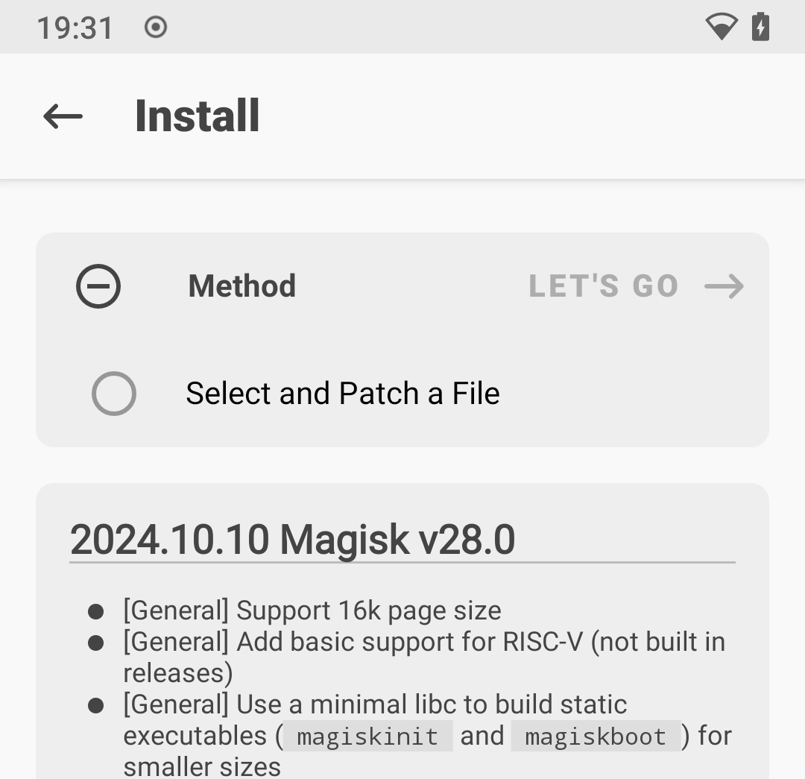

- - -

Locate the same ROM used (Download -> `los-18.1.zip`).

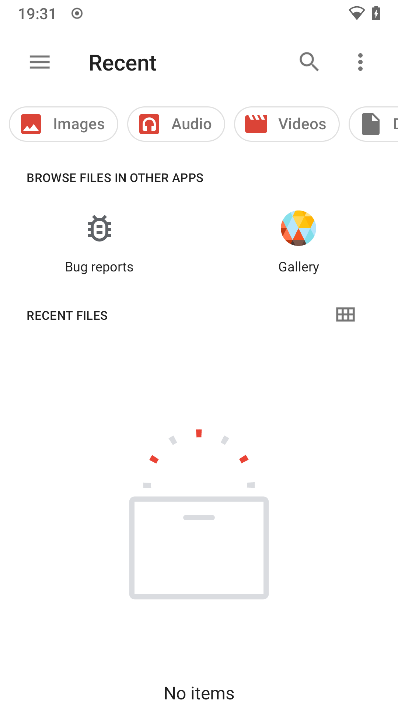

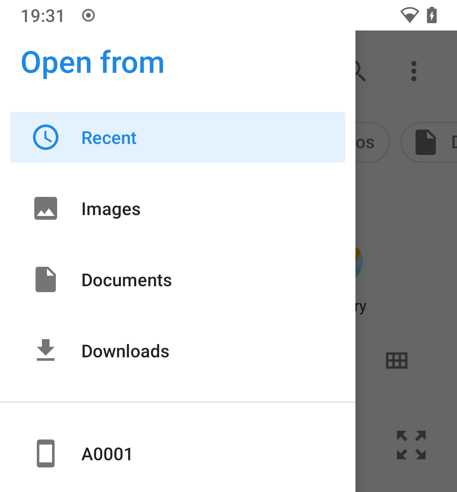


- - -

Then tap on "Let's Go"

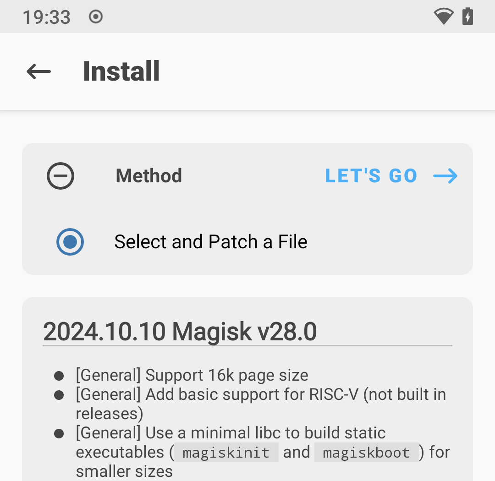

- - -

Magisk will then generate a `magisk_patched-*.img` in the same directory.

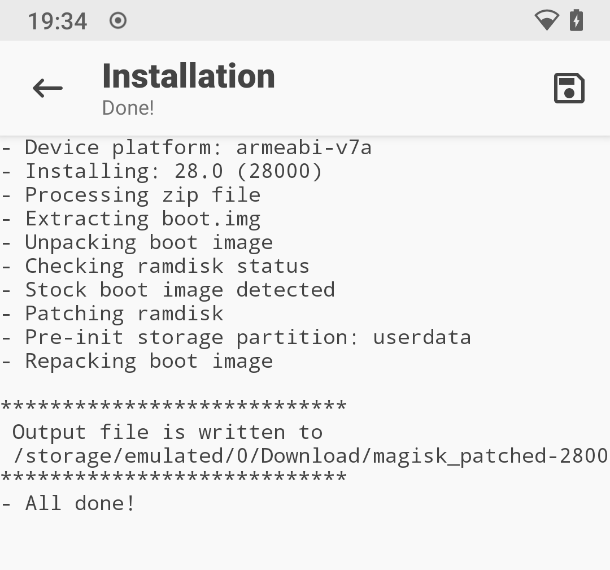

- - -

Reboot into recovery and we can use TWRP to install.

```console
kali@kali:~$ adb reboot recovery
```

Install -> Install Image -> `/sdcard/Download/: magisk_patched-*.img` -> Boot -> Swipe to confirm Flash -> Reboot System

_Note, Can't use CLI to install a image (only zip)_

- - -

When the device is back up, we are now in a place to finally install Kali NetHunter!

- - -

#### Install via Recovery/TWRP

After booting into recovery mode, using `adb` & `twrp` we can manually upload then install it:

```console
kali@kali:~$ wget 'https://github.com/topjohnwu/Magisk/releases/download/v27.0/Magisk-v27.0.apk'
[...]
kali@kali:~$ adb push Magisk-v27.0.apk /sdcard/Download/Magisk-27.apk
Magisk-v27.0.apk: 1 file pushed, 0 skipped. 7.1 MB/s (12498796 bytes in 1.680s)
kali@kali:~$
kali@kali:~$ adb shell 'twrp install /sdcard/Download/Magisk-27.apk'
Installing zip file '/sdcard/Download/Magisk-27.apk'
Unmounting System...
***********************
 Magisk 27.0 Installer
***********************
- Mounting /system
- Device is system-as-root
- Legacy SAR, force kernel to load rootfs
- No vbmeta partition, patch vbmeta in boot image
- System-as-root, keep dm-verity
- Target image: /dev/block/mmcblk0p7
- Device platform: armeabi-v7a
- Constructing environment
- Adding addon.d survival script
- Unpacking boot image
- Checking ramdisk status
- Stock boot image detected
- Patching ramdisk
- Repacking boot image
- Flashing new boot image
- Unmounting partitions
- Done
Done processing script file
kali@kali:~$
kali@kali:~$ adb reboot
```

Upon the device booting back into system, when the app is run for the first time, it will request to download the rest of the required data from the Internet.
<!--When doing v28, after accepting/agreeing to download it will "crash" - never allowing/completing-->
_Notice how the icon currenly is the stock Android._


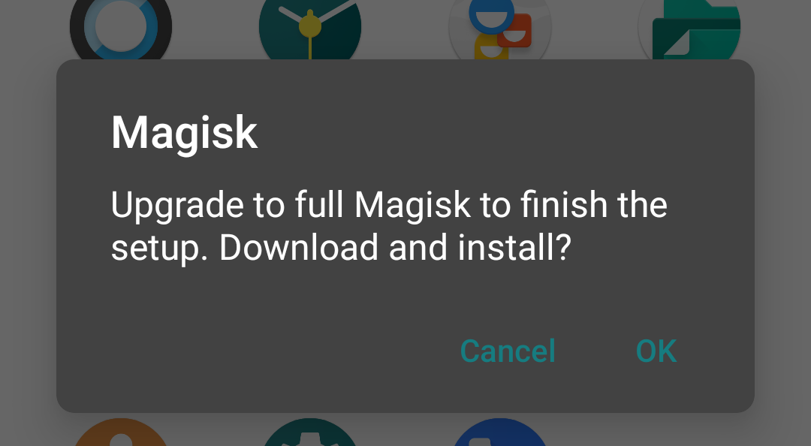


- - -

When its pulled the external data, it will then prompt before installing/upgrading.

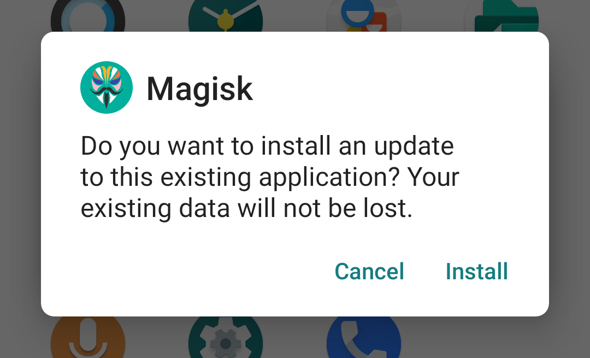


- - -

After tapping on the Magisk app for the first time, it should prompt you to patch your boot image - which can now be done all inside of the Magisk app.

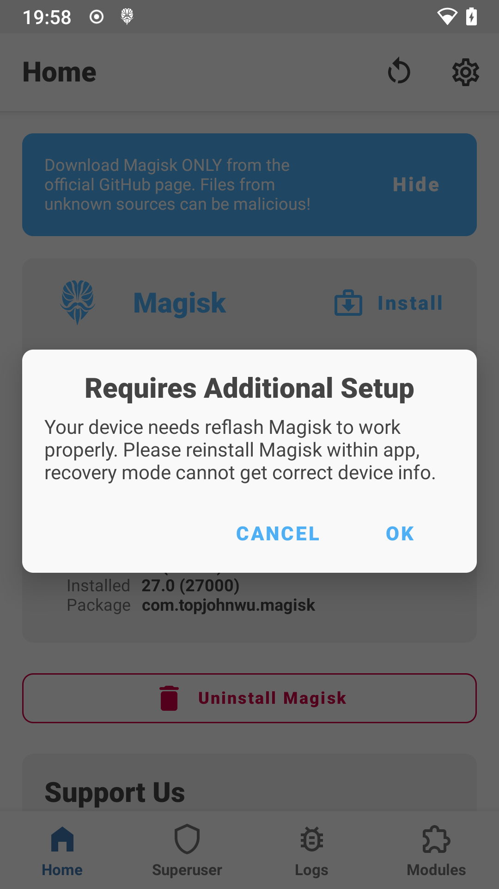

- - -

Give the app the necessary permissions, select "Direct Install (Recommended)" and wait. After it is complete, the reboot button will show up. Final step is to tab Reboot.

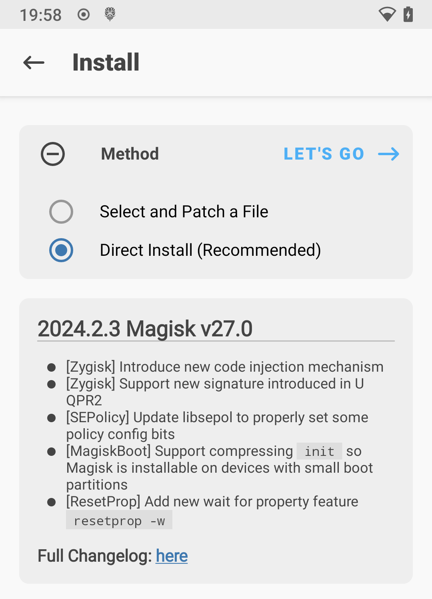

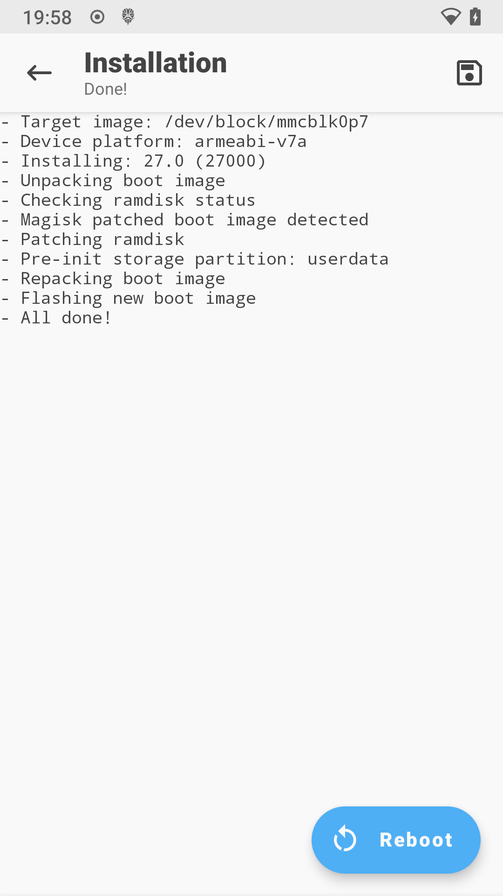

- - -

When the device is back up, we are now in a place to finally install Kali NetHunter!

- - -

### Install Kali NetHunter

Installing Kali NetHunter can currently be done two in ways:

- Recovery/TWRP
- Magisk via Modules

Again, both methods have their advantages and disadvantages; Recovery/TWRP has been around for longer, is more mature, but requires rebooting the device. Magisk is the newer method, easier, but does not (yet) support installing everything!<!--NetHunterStorePrivilegedExtension.apk doesn't get installed on /system/priv-app/ correctly... yet!-->

Either method, you will need to [download a pre-created image](/get-kali/), or [build one yourself](/docs/nethunter/building-nethunter/) _(it is simple to-do!)_.

<!--
```console
kali@kali:~$ rm *.zip; ./build.py -k oneplus1-los -11 --rootfs minimal; adb push *.zip /sdcard/Download/nh-11.zip; adb shell 'twrp install /sdcard/Download/nh-11.zip'
```
-->

Note, the Kali NetHunter Android version needs to match the same ROM and version as what is on the device!

- - -

**Install via Recovery/TWRP**

After booting into recovery mode (either by advance power menu or button combinations):

```console
kali@kali:~$ adb push nethunter-*-oneplus1-los-eleven-kalifs-full.zip /sdcard/Download/nh-11.zip; adb shell 'twrp install /sdcard/Download/nh-11.zip'
[...]
kali@kali:~$ adb reboot
```

<!--
If something goes wrong/troubleshoot, check the logs (as it has more info that whats on the screen/console)

```console
kali@kali:~$ adb shell 'cat /tmp/recovery.log'
```
-->

- - -

**Install via Magisk**

Kali NetHunter can be either uploaded by using `adb` or downloaded on the device itself.

In system mode:

```console
kali@kali:~$ adb push nethunter-*-oneplus1-los-eleven-kalifs-full.zip /sdcard/Download/nh-11.zip
```

- - -

Then, start up Magisk.
Tap on Modules -> Install from storage -> hamburger icon (3 lines) -> Downloads -> `nh-11.zip` -> Ok -> Reboot

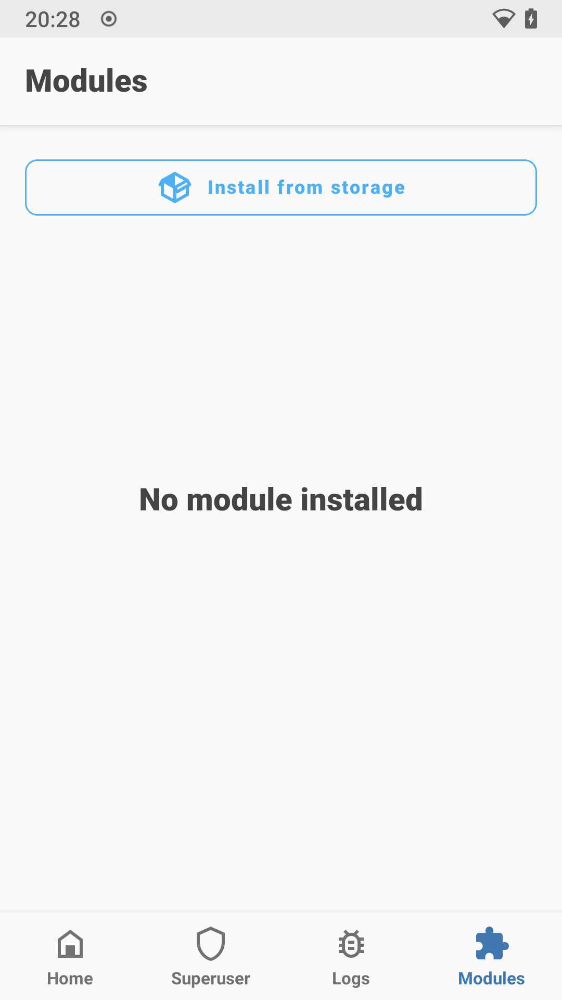

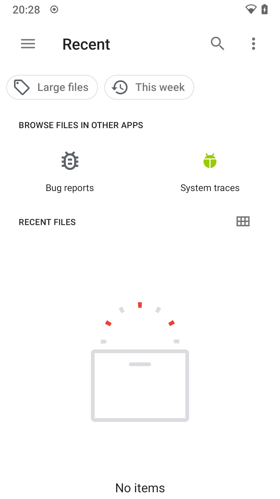

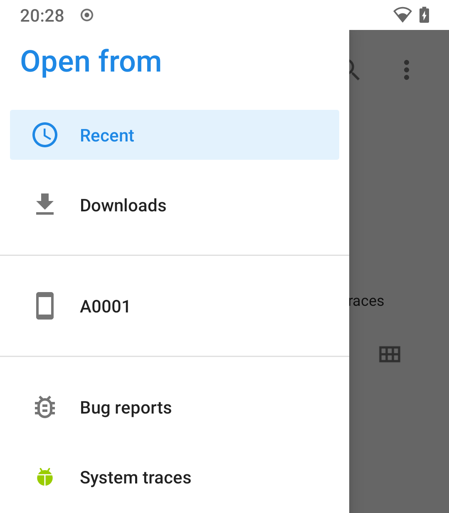

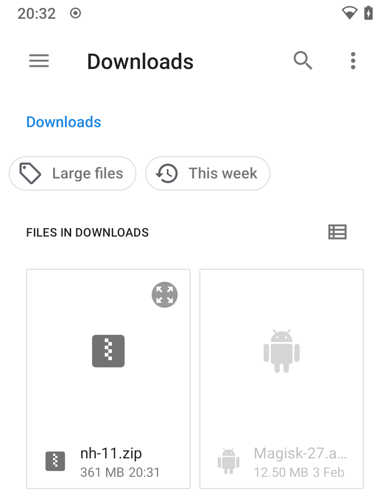

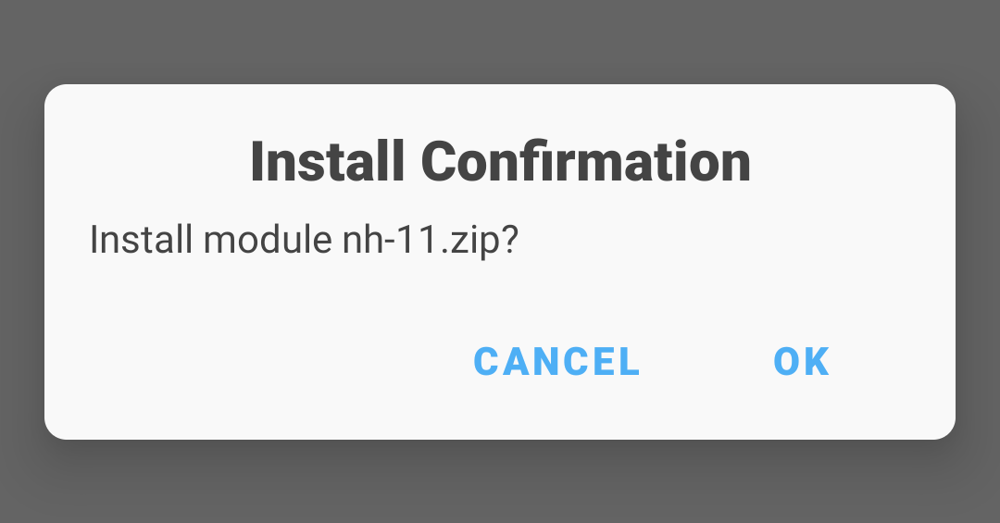

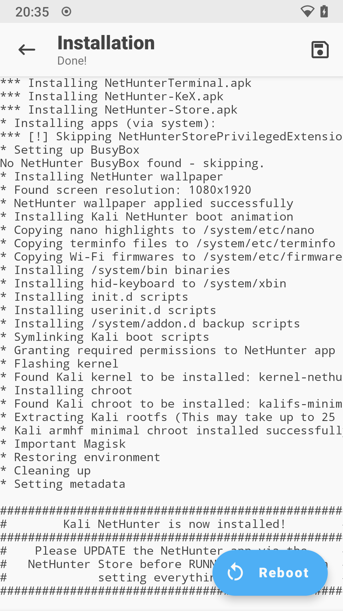

{}
The above output may change depending on the Kali NetHunter version
{}

<!--
_Otherwise: `adb shell 'su -c magisk --install-module /sdcard/Download/nh-11.zip'`_
-->

<!--
If something goes wrong/troubleshoot, check the logs (as it has more info that whats on the screen/console).
You will need to save the logs (top right).

```console
kali@kali:~$ adb shell 'cat /sdcard/Download/*.log; rm /sdcard/Download/*.log'
```
-->

- - -

## First Time Using Kali NetHunter

Upon rebooting the device, you should see:

- A new [boot animation](https://gitlab.com/kalilinux/nethunter/build-scripts/kali-nethunter-bootanimation/)
- The home screen has a [new wallpaper](https://gitlab.com/kalilinux/nethunter/nh-resources/-/tree/main/wallpaper)
- Various [new apps](https://store.nethunter.com/)!

- - -

**Updating via NetHunter Store**

Using the NetHunter Store, its possible to check and update the NetHunter app.

Its recommended to check to see if there has been an update and if so, upgrade!

- - -

**NetHunter App**

Upon opening the NetHunter app for the first time, you will have a permissions requests - Root Access (Magisk)

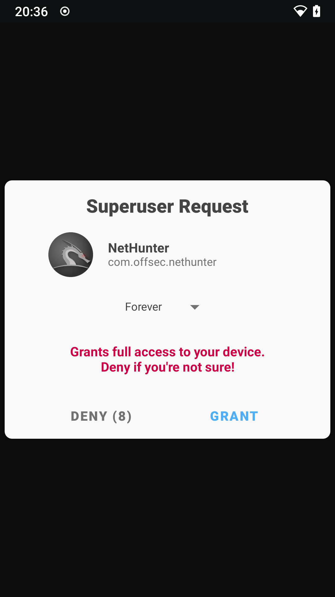

- - -

Afterwards, if there is an included filesystem/rootfs/chroot in the Kali NetHunter image that was installed, it will extract it (do not worry if not, it can be installed afterwards!)

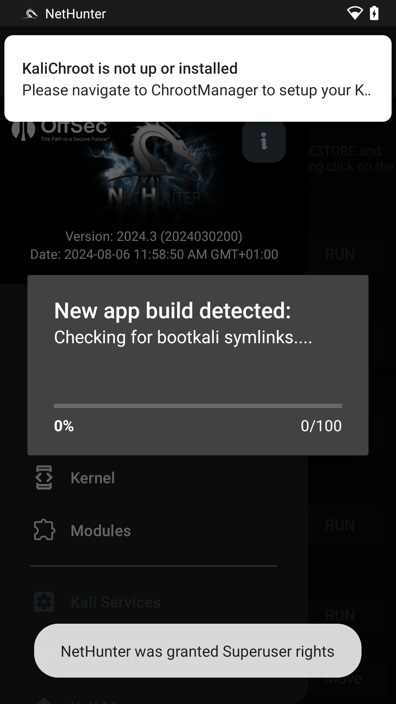

- - -

That's it!

Done!

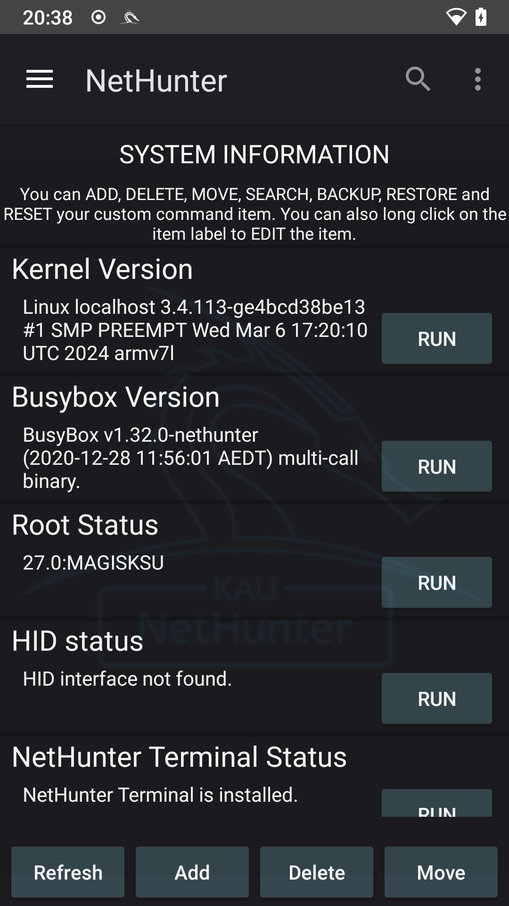

- - -

## Post Installation

Feel free to delete everything/anything in `/sdcard/Downloads/` that we have uploaded.<!-- $ adb shell 'twrp wipe data' -->

You may want to look into flashing some [Open GApps](https://opengapps.org/).

Remember the OnePlus One is a `ARM` platform (not `ARM64`):

```console
kali@kali:~$ adb shell
bacon:/ $ getprop ro.product.cpu.abi
armeabi-v7a
bacon:/ $
```
<!--
```console
bacon:/ $ getprop | grep arm
[dalvik.vm.isa.arm.features]: [default]
[dalvik.vm.isa.arm.variant]: [krait]
[ro.config.alarm_alert]: [Hassium.ogg]
[ro.odm.product.cpu.abilist]: [armeabi-v7a,armeabi]
[ro.odm.product.cpu.abilist32]: [armeabi-v7a,armeabi]
[ro.product.cpu.abi]: [armeabi-v7a]
[ro.product.cpu.abi2]: [armeabi]
[ro.product.cpu.abilist]: [armeabi-v7a,armeabi]
[ro.product.cpu.abilist32]: [armeabi-v7a,armeabi]
[ro.vendor.product.cpu.abilist]: [armeabi-v7a,armeabi]
[ro.vendor.product.cpu.abilist32]: [armeabi-v7a,armeabi]
bacon:/ $


kali@kali:~$ adb reboot recovery
kali@kali:~$ adb shell 'twrp install /sdcard/Download/open_gapps-arm-11.0-pico-20220215.zip'
```
-->
