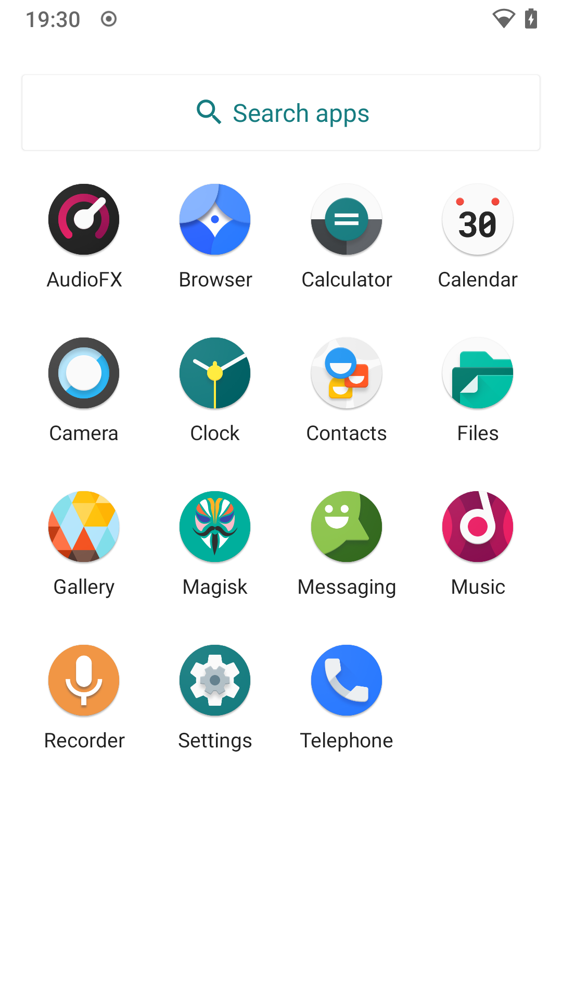
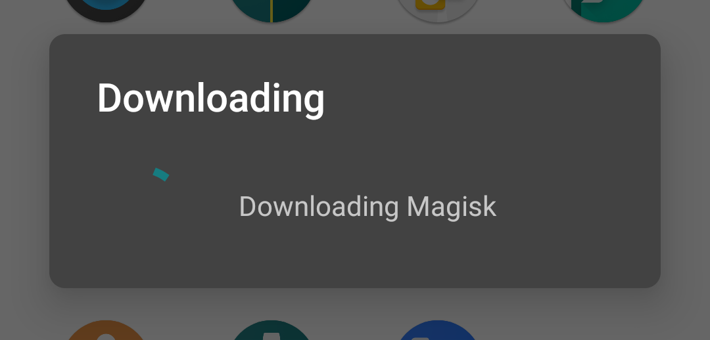

<!-- REF: https://xdaforums.com/t/rom-official-kali-nethunter-for-the-oneplus-one-lineageos-18-1-r.4303579/ -->

<!--
## Cheat sheet!

Copy/paste the 2 sections into a terminal:

```console
## #1
fastboot oem unlock
rm -rf cm/; mkdir -pv cm/ && cd cm/ && unzip ../cm-11.0-XNPH44S-bacon-signed-fastboot.zip
  fastboot flash modem NON-HLOS.bin
  fastboot flash sbl1 sbl1.mbn
  fastboot flash dbi sdi.mbn
  fastboot flash aboot emmc_appsboot.mbn
  fastboot flash rpm rpm.mbn
  fastboot flash tz tz.mbn
  fastboot flash LOGO logo.bin
  fastboot flash oppostanvbk static_nvbk.bin
  #fastboot flash recovery recovery.img
  fastboot flash system system.img
  fastboot flash boot boot.img
  fastboot flash cache cache.img
  #fastboot flash userdata userdata.img      # OnePlus One 16GB
  fastboot flash userdata userdata_64G.img   # OnePlus One 64GB
  cd ../ && rm -rf cm/
fastboot flash recovery twrp-3.6.2_9-0-bacon.img
fastboot boot twrp-3.6.2_9-0-bacon.img       # Can hang at times
while ! adb devices | grep -q recovery; do sleep 2; done
adb push cm-13.1.2-ZNH2KAS3P0-bacon-signed-8502142fdc.zip /sdcard/Download/cm-13.1.2.zip; adb shell 'twrp install /sdcard/Download/cm-13.1.2.zip'
adb push lineage-17.1-20210325-nightly-bacon-signed.zip   /sdcard/Download/los-17.1.zip;  adb shell 'twrp install /sdcard/Download/los-17.1.zip'
adb push lineage-18.1-20240306-nightly-bacon-signed.zip   /sdcard/Download/los-18.1.zip;  adb shell 'twrp install /sdcard/Download/los-18.1.zip'
adb shell 'twrp wipe data'    # Alt: adb shell 'twrp format data'
adb reboot
# When at the first time install/setup wizard, complete it then power off and boot into recovery (hold power & volume down, until on/vibrate)

## #2
adb push Magisk-v27.0.apk /sdcard/Download/Magisk-27.apk; adb shell 'twrp install /sdcard/Download/Magisk-27.apk'
adb push *nethunter*oneplus1*.zip /sdcard/Download/nh-11.zip; adb shell 'twrp install /sdcard/Download/nh-11.zip'
adb reboot
# Wait then enable developer settings (enable adb + advance power menu and disable update recovery partition)
# Open Magisk, update app, patch via "Direct Install" then reboot
```
-->

<!--
**Device information**:
- Device: `OnePlus One` (aka `OnePlus 1`, aka `OPO`, aka `1+1`)
  - Model: `A0001`
  - Codename: `Bacon`
  - Release date: April/June 2014
- Stock Android ROM: [CyanogenMod 11S](https://wiki.lineageos.org/devices/bacon/) (based on Android 4.4.4 "KitKat")
  - Recovery: CyanogenMod Recovery (aka `CMR`)
- Host: Kali Linux 2024.3 x64
  - adb & fastboot versions: `34.0.5`

**Device specification**:

```console
kali@kali:~$ adb shell getprop | grep ro.product
[ro.product.board]: [MSM8974]
[ro.product.brand]: [oneplus]
[ro.product.cpu.abi]: [armeabi-v7a]
[ro.product.cpu.abi2]: [armeabi]
[ro.product.cpu.abilist]: [armeabi-v7a,armeabi]
[ro.product.cpu.abilist32]: [armeabi-v7a,armeabi]
[ro.product.cpu.abilist64]: []
[ro.product.device]: [bacon]
[ro.product.first_api_level]: [19]
[ro.product.locale]: [en-US]
[ro.product.manufacturer]: [OnePlus]
[ro.product.model]: [A0001]
[ro.product.name]: [bacon]
[ro.product.odm.brand]: [oneplus]
[ro.product.odm.device]: [bacon]
[ro.product.odm.manufacturer]: [OnePlus]
[ro.product.odm.model]: [A0001]
[ro.product.odm.name]: [bacon]
[ro.product.system.brand]: [oneplus]
[ro.product.system.device]: [bacon]
[ro.product.system.manufacturer]: [OnePlus]
[ro.product.system.model]: [A0001]
[ro.product.system.name]: [bacon]
[ro.product.vendor.brand]: [oneplus]
[ro.product.vendor.device]: [bacon]
[ro.product.vendor.manufacturer]: [OnePlus]
[ro.product.vendor.model]: [A0001]
[ro.product.vendor.name]: [bacon]
kali@kali:~$
kali@kali:~$ adb shell 'cat /proc/cpuinfo'
Processor    : ARMv7 Processor rev 1 (v7l)
[...]
kali@kali:~$
```

**ROMs**:

- Pre-installed official stock ROM was "Cyanogen" (CyanogenMod 11S - based on Android 4.4.4 "KitKat")
  - This is a (commercial) fork of the "CyanogenMod" (CyanogenMod 11)
  - Initially called CyanogenMod, but used the suffix "S" (e.g. CyanogenMod 11**S**). However, starting with v12 rebranded to be "Cyanogen OS 12" _(rather than CyanogenMod 12S)_
  - CyanogenMod aka CM
- OnePlus created their own ROM, "OxygenOS"
  - This was due to a legal issue\<\!--in India due to exclusive rights using Cyanogen OS--\>, OnePlus moved to their own ROM being the "official"
  - (Manufacture) support ended at OxygenOS 2.1.4 (Android 5.1.1 "Lollipop"), the LineageOS ROM kept on going until LineageOS 18.1 (Android 11 "Eleven")
  - OxygenOS aka OOS
- CyanogenMod closed down\<\!--December 2016--\>, the most popular community forked was "LineageOS"\<\!--January 2017--\>
  - Earliest versions was LineageOS 13 (Android 6.0.1 "Marshmallow")
  - LineageOS aka LOS
- _Various other 3rd party ROMs have been created/ported_

```plaintext
- CM 11  - CyanogenMod 11S - Android 4.4.4 "KitKat"
- CM 12  - Cyanogen OS 12  - Android 5.0.2 "Lollipop"
- CM 13  - Cyanogen OS 13  - Android 6.0.1 "Marshmallow"

- LOS 13 - LineageOS 13    - Android 6 "Marshmallow"
- LOS 14 - LineageOS 14    - Android 7 "Nougat"
- LOS 15 - LineageOS 15    - Android 8 "Oreo"
- LOS 16 - LineageOS 16    - Android 9 "Pie"
- LOS 17 - LineageOS 17    - Android 10 "Ten"
- LOS 18 - LineageOS 18    - Android 11 "Eleven"

- OOS 1  - OxygenOS 1.0    - Android 5.0.1 "Lollipop"
- OOS 2  - OxygenOS 2.1.4  - Android 5.1.1 "Lollipop"
```

- AOSP - Android Open Source Project: <https://android.googlesource.com/>
- CAF  - CodeAurora Forum: <https://bye.codeaurora.org/> (where Qualcomm releases source codes & nobody knows Qualcomm CPUs better than Qualcomm) aka optimization!
-->

OnePlus One에 Kali NetHunter를 설치하는 방법을 알려줄게요.
이 가이드에서는 Kali Linux(호스트), USB 케이블(연결), TWRP(복구), Magisk(루트 권한 획득), LineageOS(Android 11, ROM)를 사용해요.

큰 흐름은 이래요:

    호스트 설정하기 (패키지 설치)

    기기 설정하기 (개발자 옵션 설정)

    부트로더 잠금 해제하기 (fastboot 쓰기 권한 허용)

    복구 이미지 플래싱하기 (TWRP 설치)

    시스템 ROM 플래싱하기 (LineageOS 설치)

    기기 루팅하기 (Magisk 설치)

    Kali NetHunter 설치하기 (Rootless나 Lite 버전 아님)

- - -

## 개요

시스템 모드 → 개발자 옵션 활성화 → USB 디버깅/고급 재시작 활성화 + 복구 자동 업데이트 비활성화 → 부트로더 잠금 해제 → 부트로더 모드 진입 → 복구 이미지 교체 → 복구 모드 부팅 → ROM 교체 → Magisk 설치 → Kali NetHunter 설치 → 시스템 모드로 부팅 → 업데이트 및 설정 마무리 → 완료!

호스트 설정은 어렵지 않아요. Kali Linux를 사용하는 데스크탑이나 노트북 환경이라서 따로 복잡한 준비는 필요하지 않아요.Windows나 macOS, 또는 다른 Android 기기를 사용하는 방법은 이 가이드에 포함되지 않았어요.

그리고 우리는 네트워크 연결 방식(예: Wi-Fi 원격 설치)이 아니라 USB 케이블을 이용한 간단한 방식으로 진행할 거예요. 안정적이고 직관적인 방법이에요.

기기 준비는 조금 더 손이 가요.상황에 따라, 기기에 있는 데이터를 그대로 유지한 채 Kali NetHunter를 설치할 수도 있지만,이 가이드는 그런 방식이 아니에요. 이 가이드는 모든 데이터가 삭제될 것을 전제로 작성되었어요.그러니까 중요한 데이터가 있다면 반드시 백업을 먼저 해두세요.

그리고 기기를 초기 상태(CyanogenMod 11S, 기본 ROM과 설정)로 되돌릴 거예요.이전에 해둔 커스터마이징이나 설정들은 모두 사라지게 돼요. (즉, 공장 초기화처럼 깨끗한 상태로 돌아가는 거예요)

<!--
```console
kali@kali:~$ unzip *-fastboot*.zip
kali@kali:~$
kali@kali:~$ fastboot oem unlock
kali@kali:~$
kali@kali:~$ fastboot flash modem NON-HLOS.bin
kali@kali:~$ fastboot flash sbl1 sbl1.mbn
kali@kali:~$ fastboot flash dbi sdi.mbn
kali@kali:~$ fastboot flash aboot emmc_appsboot.mbn
kali@kali:~$ fastboot flash rpm rpm.mbn
kali@kali:~$ fastboot flash tz tz.mbn
kali@kali:~$ fastboot flash LOGO logo.bin
kali@kali:~$ fastboot flash oppostanvbk static_nvbk.bin
kali@kali:~$ fastboot flash recovery recovery.img
kali@kali:~$ fastboot flash system system.img
kali@kali:~$ fastboot flash boot boot.img
kali@kali:~$ fastboot flash cache cache.img
kali@kali:~$ #fastboot flash userdata userdata.img      # OnePlus One 16GB
kali@kali:~$ fastboot flash userdata userdata_64G.img   # OnePlus One 64GB
kali@kali:~$
kali@kali:~$ fastboot oem lock
kali@kali:~$
kali@kali:~$ fastboot reboot
```

Its also possible to change the "device tampered", simply by altering "a few hex values" ;).
This has been automated using `OnePlusOne-OnlyTamperBitToggle.zip` (or `OnePlusOne-BootUnlocker.zip`) from [here](https://xdaforums.com/t/mod-oneplus-one-unlocker-reset-unlock-tamper-bit.2820912/). Able to run (aka "install zip") by using TWRP.

`OnePlusOne-BootUnlocker.zip`:
- MD5: `54fe23cf33b01cd8ff297da2623d432f`
- SHA1: `7c7119e8d4524c12ec9d30cdc5d6b646e82c42a3`
- SHA256: `ce0d6231ecb6c5f9566df7c64afee4167bdb1aca91b1494df196a7af2414b741`

`OnePlusOne-OnlyTamperBitToggle.zip`:
- MD5: `ac49c300575af1454c82fb2601b98d99`
- SHA1: `c4705fb2a4dedecaffb96f0b450d81efdbe7e514`
- SHA256: `8817ae7cbd8e4b4c003be7fe0c750f2d33f9fd593e12b9b5fb4bd24ab0aee44a`
-->

- - -

일반적으로 안드로이드 기기는 '시스템 모드'(system mode)로 부팅되지만, 제조사에 따라 최소 두 가지 이상의 유지보수 모드가 추가로 있을 수 있어요. 대표적으로는 복구 모드(recovery mode)와 부트로더/패스트부트 모드(bootloader/fastboot mode)가 있어요.<!--Not sure the difference between the two terms?--> *또 다른 모드로는 다운로드 모드(Download Mode)나 오딘 모드(Odin Mode) 등이 있는데, 이런 모드는 삼성이나 LG 기기에서 주로 사용돼요.*

OnePlus One은 전원을 켤 때 특정 키를 누르면 이런 유지보수 모드로 들어갈 수 있어요.

* `전원 버튼 + 볼륨 다운` → 복구 모드로 진입
* `전원 버튼 + 볼륨 업` → 부트로더 모드로 진입<!--As soon as the screen turns on and the device vibrates, let go. Alt is to use advance power menu via developer settings-->

이런 유지보수 모드를 활용하면, 기본 복구나 시스템 ROM을 커스텀 ROM으로 바꿀 수 있어요.

---

부트로더 모드에 들어가면 기기에 더 낮은 수준에서 접근할 수 있어요. 부트로더 잠금을 해제하면 파티션에 대한 쓰기 권한이 생기기 때문에, 복구 파티션을 완전히 교체해서 다른 복구 툴(TWRP 등)을 설치할 수 있어요.<!--Or we could replace the bootloader itself as we can flash/replace ANY partitions on the device - this is what `-fastboot` does--> CyanogenMod, LineageOS, OxygenOS 같은 기본 ROM의 복구 모드는 대부분 기능이 제한되어 있어요. 일부 체크 기능을 끄거나 전체 파티션을 초기화하는 등의 고급 기능은 커스텀 복구에서만 가능하거든요. 대표적으로는 [TWRP (TeamWin Recovery Project)](https://twrp.me/)나 [OrangeFox](https://orangefox.download/)가 있어요.<!--Over the years, there have been many other projects which are no longer being maintained, such as [CyanogenMod Recovery (CMR)](https://github.com/CyanogenMod/android_bootable_recovery) or [ClockworkMod Recovery (CWM/CWMR)](https://www.clockworkmod.com/)-->

기본 복구는 단순히 기존 ROM을 복원하기 위해 설계되어 있어서 사용은 간편하지만 고급 기능은 거의 없어요.<!--also able to disable signature checks--> 반면, 부트로더는 더 낮은 수준의 작업이 가능하지만 기능은 제한적이에요. 그래서 복잡한 유지보수 작업에는 복구 모드를 사용하는 게 좋아요.

---

복구 모드를 사용하면 '공장 초기화'(factory reset)를 할 수 있어요. 일반 사용자 영역인 `/data`와 `/cache` 파티션을 모두 지우고, RAM도 초기화돼요.<!--`/system`, `/boot`, `/recovery` require 'root'--> 복구 모드 종류에 따라서는 `/media`나 `/system` 파티션까지 지울 수 있는 경우도 있어요.

또한 ADB/USB나 내부 저장소(SD 카드 포함)를 통해 업데이트나 패키지, 스크립트를 설치하거나 실행할 수도 있어요. Kali NetHunter 설치도 이 방법으로 가능해요. 이런 방식으로 안드로이드 버전을 업그레이드하거나 다운그레이드할 수도 있어요.<!--System or recovery-->

LineageOS 복구 모드의 버전에 따라 ADB 연결을 허용하거나 로그를 확인할 수도 있어요.([관련 링크](https://github.com/LineageOS/android_bootable_recovery))

그런데 TWRP 복구 모드를 쓰면 할 수 있는 게 훨씬 많아져요:

* 기본 LineageOS 복구에서 가능한 모든 작업 수행 가능
* 설치/적용 관련

  * 설치 시 서명 체크 비활성화 가능
  * 여러 업데이트 파일을 한꺼번에 설치 가능
* 파티션 관련

  * 전체 파티션 사용량 확인
  * 파티션 포맷
  * 파티션 복구 또는 리사이즈
  * 파일 시스템 변경
  * 전체 파티션 백업 및 복원 (전체 기기 백업)
  * 원하는 파티션 마운트 가능
* 터미널 & 파일 관리자 기능도 제공돼요

<!--
  Android version support: https://twrp.me/faq/howtocompiletwrp.html

  The first three digits is the version number, and the fourth digit, separated by a dash, specifies an update for a specific device
  v3.6.0_9-0
  v3.6.0 == Version
  9-0    == Device release
-->

- - -

<!--Should this be here or lower down in the top section?-->
부트로더 모드에서는 바이너리 이미지 파일을 이용해 파티션을 직접 1:1로 교체할 수 있어요. 하지만 이 방식은 설치 전이나 후에 실행되는 스크립트 같은 동적인 작업은 할 수 없어요<!--which happens when installing from a ".ZIP" as `updater-script` will be executed (not sure about .img) - found this a confusing term, "installing a zip"-->.
<!--
- boot-patcher/META-INF/com/google/android/update-binary) - Kali NetHunter kernel installer (backend)
- nethunter/META-INF/com/google/android/update-binary) - Kali NetHunter part (frontend)
- uninstaller/META-INF/com/google/android/update-binary) - Kali NetHunter uninstaller
-->
Kali NetHunter는 ROM이 아니라 [애드온](https://web.archive.org/web/20230315170356/https://wiki.lineageos.org/devices/bacon/install) 형식이에요.<!--Overlay? Injects?--> 그래서 이를 최대한 활용할 수 있어요.
NetHunter는 여러 앱과 스크립트 묶음으로 구성되어 있고, 기기를 특정 상태로 바꿔주는 역할을 해요.

그래서 중요한 점은, 기기에 설치된 안드로이드 시스템의 커널과 버전에 맞는 Kali NetHunter 커널을 사용해야 한다는 거예요.

<!--
The images needed to flash a system ROM via the bootloader are not as common as they once were (especially with LineageOS, this was more of apart of CyanogenMod).
These image often can be identified/indicated from their filename, by having `-fastboot` in them. Example:

- `cm-13.1.2-ZNH2KAS3P0-bacon-signed-8502142fdc.zip`          <-- requires recovery using `abd`
- `cm-13.1.2-ZNH2KAS3P0-bacon-signed-fastboot-76d803f730.zip` <-- requires bootloader using `fastboot`
-->

- - -

<!-- ### Flash Path -->
<!--Not sure if this should at the start/top or with the commands between: Flash back to stock (mostly)/Flash back to stock (mostly)-->

이제 여기서 시스템이나 복구용 ROM을 플래싱할 수 있어요. 커스텀 ROM을 플래싱하면 안드로이드 버전을 최신으로 업그레이드하거나, 기본 출고 상태의 ROM으로 되돌릴 수도 있어요. (이건 공장 초기화와는 달라요)

여러 가지 테스트를 해본 결과, 원하는 안드로이드 버전이나 ROM에 따라 중간 단계들을 거쳐야 할 수도 있어요. 즉, 너무 높은 버전으로 한 번에 건너뛰는 건 어려울 수 있어요.

예를 들어 이렇게 단계적으로 넘어가야 할 수도 있어요:

```plaintext
--------------------    ----------------------    ------------------    ---------------------
  CyanogenMod 11.0   ->    CyanogenMod 12.1    ->   LineageOS 17.1   ->    LineageOS 18.1
(Android 4 "KitKat")    (Android 5 "Lollipop")    (Android 10 "Ten")    (Android 11 "Eleven")
--------------------    ----------------------    ------------------    ---------------------
```

<!--Picked CM 12/Lollipop, rather than CM 13/Marshmallow as its smaller (3 chars!)-->

<!--
  - Fastboot: CM 11.0 + TWRP -> System -> Recovery: CM 12.1.x/CM 13.1.x          -> Recovery: LOS 17.1 + LOS 18.1 + Wipe /data
  - Fastboot: CM 11.0 + TWRP -> System -> Recovery: Wipe /data + CM 13.0/CM 14.1 -> Recovery: LOS 17.1 + LOS 18.1 + Wipe /data
  - Fastboot: CM 13.1 -> System: Wizard + developer settings -> Fastboot: TWRP   -> Recovery: LOS 17.1 + LOS 18.1 + Wipe /data
-->

<!--
In the above example, CyanogenMod (CM) 11.0 was chosen as its the default stock ROM that is shipped on the device as well as having a `fastboot` image available.
These image often can be identified/indicated from their filename, by having `-fastboot` in them. Example:

- `cm-13.1.2-ZNH2KAS3P0-bacon-signed-8502142fdc.zip`          <-- requires recovery mode using `abd`
- `cm-13.1.2-ZNH2KAS3P0-bacon-signed-fastboot-76d803f730.zip` <-- requires bootloader mode using `fastboot`

_These fastboot images which need to be flash via the bootloader are not as common as they once were (more CyanogenMod, not so much with LineageOS)._

Note, there is a fastboot image of cm-13.1.2, meaning its possible to skip out a few upgrade jumps.

Using "fastboot" can be seen as a "fresh clean" install, otherwise, you are "upgrading" from the previous version. Thus the settings from the previous version MAY be carried over (depends!).
An example of this; CM 11, has disabled "update recovery partition". If upgrading to CM 13, it will still be disabled. However doing a fresh install of CM 13, it will be enabled by default.
_Settings may get carried over when updating vs fresh install_
-->

조금 더 나눠서 정리해 보면, 우리의 플래싱 경로는 다음과 같아요:

- [ ] 부트로더를 이용해 CyanogenMod 11.0 (CM 11)을 플래싱할 수 있어요
- 그리고 복구 모드를 이용해서 **다음 중 하나를** 진행할 수 있어요:
  - [ ] CM 12.1.x 또는 13.1.x 플래싱
  - [ ] CM 13.0 또는 14.1 플래싱 → 이 경우에는 `/data` 파티션을 지운 뒤에만 설치할 수 있어요 <!-- $ adb shell 'twrp wipe data' -->
- [ ] 이후에는 LineageOS 17.1 (LOS 17.1)을 플래싱할 수 있어요
- [ ] 마지막으로 LOS 18.1을 플래싱하는데, 이때는 재부팅 전에 `/data` 파티션을 반드시 지워야 해요 <!--wipe /data either before or after flashing LOS - doesn't matter, otherwise we get a black unresponsive app-like screen straight after the first time install wizard-->

<!--
  If trying to flash CM 13.0 and `/data` hasn't been wiped/format, flashing will fail with the following error:

```console
kali@kali:~$ adb push cm-13.0-20161220-SNAPSHOT-ZNH5YAO3XH-bacon.zip /sdcard/Download/cm-13.0.zip; adb shell 'twrp install /sdcard/Download/cm-13.0.zip'
cm-13.0-20161220-SNAPSHOT-ZNH5YAO3XH-bacon.zip: 1 file pushed, 0 skipped. 6.5 MB/s (395496707 bytes in 58.416s)
Installing zip file '/sdcard/Download/cm-13.0.zip'
Unmounting System...
Target: oneplus/bacon/A0001:6.0.1/MHC19Q/ZNH2KAS1KN:user/release-keys
detected filesystem ext4 for /dev/block/platform/msm_sdcc.1/by-name/system
Can't install this package on top of incompatible data. Please try another package or run a factory reset
Updater process ended with ERROR: 7
Error installing zip file '/sdcard/Download/cm-13.0.zip'
Done processing script file
kali@kali:~$
kali@kali:~$ adb shell 'twrp wipe data'
Wiping data without wiping /data/media ...
Done.
Formatting Cache using make_ext4fs...
Done processing script file
kali@kali:~$
kali@kali:~$ adb shell 'twrp install /sdcard/Download/cm-13.0.zip'
Installing zip file '/sdcard/Download/cm-13.0.zip'
Unmounting System...
Target: oneplus/bacon/A0001:6.0.1/MHC19Q/ZNH2KAS1KN:user/release-keys
detected filesystem ext4 for /dev/block/platform/msm_sdcc.1/by-name/system
Patching system image unconditionally...
Verifying the updated system image...
Verified the updated system image.
detected filesystem ext4 for /dev/block/platform/msm_sdcc.1/by-name/system
Wiping DDR
Verified DDR wipe
Writing radio image...
script succeeded: result was [t]Done processing script file
kali@kali:~$
```

CM 13.1/13.1.2/14.1 doesn't require this, just CM 12.1/13.0:
- `cm-12.1-YOG4PAS1N0-bacon-signed.zip`
- `cm-12.1-YOG7DAS2K1-bacon-signed-d347503447.zip`
- `cm-13.0-20161220-SNAPSHOT-ZNH5YAO3XH-bacon.zip` <-- need to wipe
- `cm-13.1-ZNH2KAS254-bacon-signed-9fbe6186fd.zip`
- `cm-13.1.2-ZNH2KAS3P0-bacon-signed-8502142fdc.zip`
- `cm-14.1-20161225-NIGHTLY-bacon.zip`  <-- need to wipe
- `lineage-14.1-20180220-nightly-bacon-signed.zip` <-- fails to flash (need todo an earlier version)

- - -

These are the sort of errors, if you try and jump too far ahead of versions:

```console
kali@kali:~$ adb push lineage-14.1-20180220-nightly-bacon-signed.zip /sdcard/Download/los-14.1.zip; adb shell 'twrp install /sdcard/Download/los-14.1.zip'
Installing zip file '/sdcard/Download/los-14.1.zip'
Unmounting System...
Comparing TZ version TZ.BF.2.0-2.0.0123 to TZ.BF.2.0-2.0.0096
Comparing TZ version TZ.BF.2.0-2.0.0134 to TZ.BF.2.0-2.0.0096
assert failed: oppo.verify_trustzone("TZ.BF.2.0-2.0.0123","TZ.BF.2.0-2.0.0134") == "1"
Updater process ended with ERROR: 7
Error installing zip file '/sdcard/Download/los-14.1.zip'
Done processing script file
kali@kali:~$
kali@kali:~$ adb push lineage-18.1-20240306-nightly-bacon-signed.zip /sdcard/Download/los-18.1.zip; adb shell 'twrp install /sdcard/Download/los-18.1.zip'
Installing zip file '/sdcard/Download/los-18.1.zip'
Unmounting System...
Comparing TZ version TZ.BF.2.0-2.0.0109 to TZ.BF.2.0-2.0.0096
Comparing TZ version TZ.BF.2.0-2.0.0123 to TZ.BF.2.0-2.0.0096
Comparing TZ version TZ.BF.2.0-2.0.0134 to TZ.BF.2.0-2.0.0096
assert failed: oppo.verify_trustzone("TZ.BF.2.0-2.0.0109","TZ.BF.2.0-2.0.0123","TZ.BF.2.0-2.0.0134") == "1"
Updater process ended with ERROR: 1
Error installing zip file '/sdcard/Download/los-18.1.zip'
Done processing script file
kali@kali:~$
```

- - -

Which images were tested and their grouping (need wipe /data or not!)

```console
#**cm-13.0/cm-14.1**:
adb shell 'twrp wipe data'   # Alt: adb shell 'twrp format data'
adb push cm-13.0-20161220-SNAPSHOT-ZNH5YAO3XH-bacon.zip /sdcard/Download/cm-13.0.zip; adb shell 'twrp install /sdcard/Download/cm-13.0.zip'
#adb push cm-14.1-20161225-NIGHTLY-bacon.zip /sdcard/Download/cm-14.1.zip; adb shell 'twrp install /sdcard/Download/cm-14.1.zip'

#**cm-12.1.x/cm-13.1.x**:
#adb push cm-12.1-YOG4PAS1N0-bacon-signed.zip /sdcard/Download/cm-12.1.zip;               adb shell 'twrp install /sdcard/Download/cm-12.1.zip'
#adb push cm-12.1-YOG7DAS2K1-bacon-signed-d347503447.zip /sdcard/Download/cm-12.1.zip;    adb shell 'twrp install /sdcard/Download/cm-12.1.zip'
#adb push cm-13.1-ZNH2KAS254-bacon-signed-9fbe6186fd.zip /sdcard/Download/cm-13.1.zip;    adb shell 'twrp install /sdcard/Download/cm-13.1.zip'
adb push cm-13.1.2-ZNH2KAS3P0-bacon-signed-8502142fdc.zip /sdcard/Download/cm-13.1.2.zip; adb shell 'twrp install /sdcard/Download/cm-13.1.2.zip'
```
-->

여기에는 시행착오가 조금 있을 수 있어요. 잘 되길 바랄게요!

---

이제부터는 슈퍼유저 권한(즉, root 권한)을 얻는 걸 목표로 할 수 있어요. 안드로이드에서는 기본적으로 잠겨 있던 권한인데, 리눅스에서의 루트와 마찬가지로 가장 높은 권한이에요.  이제 우리는 기기를 완전히 자유롭게, 원하는 대로 제어할 수 있게 되는 거예요.

이러한 루트 권한을 얻기 위해 여러 가지 방법이 있었어요. 예를 들어 [SuperSU](https://chainfire.eu/articles/995/SuperSU_v2.82-SR5_and_suhide_v1.09_released), [APatch](https://apatch.dev/), [KernelSU](https://kernelsu.org/), 그리고 [Magisk](https://github.com/topjohnwu/Magisk) 같은 도구들이 있어요.

<!--
**SuperSU**:
  - Android 2.x -> 10.x? (Can't find this confirmed online, I just had issues!)
  - Chainfire -> Coding Code Mobile Technology LLC (CCMT)?
  - https://supersu.com/
  - https://www.xda-developers.com/chainfire-ending-development-root-apps/
  - https://xdaforums.com/f/supersu.3522/
**KingRoot**:
  - Android 2.x -> 6.x
  - Talks of injecting adverts/adware
  - https://web.archive.org/web/20190216132637/https://kingroot.net/?myLocale=en_US
  - https://xdaforums.com/t/root-android-2-x-6-0-kingroot-the-one-click-root-tool-for-almost-all-devices.3107461/
**APatch**:
  - Android 3.18 -> 6.1
  - Open-source!
  - https://apatch.dev/
**KernelSU**:
  - Android 12+    (Really Kernel 5.10 or higher ~ https://kernelsu.org/guide/faq.html)
  - https://kernelsu.org/
  - Open-source!
  - ARM64 only, so will not work with arm7 / ARMv7 (32-bit) / aarch32 - Which is what the OnePlus One is
**Magisk**:
  - Android 6+
  - Open-source!
  - https://github.com/topjohnwu/Magisk
-->

- - -

이제 마침내 Kali NetHunter를 기기에 설치할 준비가 끝난 거예요!  
설치는 복구 모드(TWRP 사용)를 통해 할 수도 있고, 시스템 모드(Magisk 사용)에서 진행할 수도 있어요.

- - -

Kali NetHunter가 기기에 설치되면, 새로운 앱 스토어를 이용해 모든 구성 요소가 최신 상태인지 확인할 수 있어요. 그다음 NetHunter 메인 앱을 실행해서 처음 설정을 마무리하면 돼요.

- - -

## Links/Downloads

- [cm-11.0-XNPH44S-bacon-signed-fastboot.zip](https://web.archive.org/web/20150302130830if_/http://builds.cyngn.com/factory/bacon/cm-11.0-XNPH44S-bacon-signed-fastboot.zip)
  <!--- MD5: `cc9280f80963077014365c037bb9a5bf`-->
  <!--- SHA1: `71a97f6ce39ddedeaef410a31c29f3369a1393f4`-->
  - SHA256: `249bf098bb2b9ea187691c5b9f6b11084071ab7a0997f38921370bfbb03ad80f`
  <!--- SHA512: `cdfe9ec6e306af746d8d4df66ad3c600c911da4c467c304c3de613798754e4efd94fa0c9ef79ba804c6c779847b0b07058b7f28fa7aea9b1fa8f5155b7ff39e7`-->
- [cm-13.1.2-ZNH2KAS3P0-bacon-signed-8502142fdc.zip](https://web.archive.org/web/20161228005517/http://builds.cyngn.com/factory/bacon/cm-13.1.2-ZNH2KAS3P0-bacon-signed-8502142fdc.zip)
  <!--- MD5: `a40ddd581f58fb1588ed19571d32fedf`-->
  <!--- SHA1: `8502142fdc1bcffb297ec14e794dea59cf5059f7`-->
  - SHA256: `53f0e58953e630e167aef100dc120d7c85a2ca779b67dfdb26f02b53547e2638`
  <!--- SHA512: `01582e078ff2ecaf61343705242644bcdb335d8d56c78871e54f0a132b6451ab78c0ca31f7b04fc114cba52353bfa358e08a99c7d26f4730ed84fd833dcec421`-->
- [lineage-17.1-20210325-nightly-bacon-signed.zip](https://archive.org/download/lineageos-17.1-20210325-bacon/lineage-17.1-20210325-nightly-bacon-signed.zip)
  <!--- MD5: `f92384cbf955efa577f3c92cd5fd5d07`-->
  <!--- SHA1: `6ca4ebdbc5b731327da448bdee2b1b377b9cc40c`-->
  - SHA256: `50d9b2a4a60b110c6f9c7b602e13ae23a85d6036352fbc877f72fec512f4682b`
  <!--- SHA512: `a80ec61cd5e8237d77ae192019a4b7763f56c4264540008f4a4e73f6f81755863403987a80263cab511d1589f717af3922b51c8796dd9e1afa9fd0ac817b1001`-->
- [lineage-18.1-20240306-nightly-bacon-signed.zip](https://lineage-archive.timschumi.net/build/18166)
  <!--- MD5: `58a42ed2da1672f4ac1ab462f2223a0c`-->
  <!--- SHA1: `a608217c0f588d009a3a12baf3d76c756506e4c6`-->
  - SHA256: `d19c26cee2e2b664dc4a84378eb92c9ced986fcba0a8e926d93e247aaa673723`
  <!--- SHA512: `fee273f6909d7b4ccc3f219a02dd85901a34e306c9a777fde2ca26c9910a85fd7174f076c81e9079a537c4f5a8c1716a59d219d6685d2d1759c38a755a3c5feb`-->
- [Magisk-v27.0.apk](https://github.com/topjohnwu/Magisk/releases/download/v27.0/Magisk-v27.0.apk)
  <!--- MD5: `4475064c5f6a5474e31f2f3dfafc22ed`-->
  <!--- SHA1: `872199f3781706f51b84d8a89c1d148d26bcdbad`-->
  - SHA256: `f511bd33d3242911d05b0939f910a3133ef2ba0e0ff1e098128f9f3cd0c16610`
  <!--- SHA512: `cf6095f2d93e078f42d26265699deed377af12f304dd83179140d32a69a034639d4e07b83b8bb999d503f6d8dc6ced46b6b88741ed39771eed6a12411648e4bc`-->
- [Magisk-v28.0.apk](https://github.com/topjohnwu/Magisk/releases/download/v27.0/Magisk-v27.0.apk)
  <!--- MD5: `4d1de127abc2e9aa2b8582c8c5614085`-->
  <!--- SHA1: `84c3cdea6f4b10d0e2abeb24bdfead502a348a63`-->
  - SHA256: `1b1eebac29f8ab1a41e5f20bbdceefb3341e93bc3d55a0f995c902b0fe877fe2`
  <!--- SHA512: `c335f687121eecc37f9bb8cc1502d3053c5e58f6cd2213fce2dee0e89d1f3b58e7fb80449a33a0ebb4f58f56b72460d37192d81c87a0aa0fa4c55bf6cc4ef571`-->
- [twrp-3.6.2_9-0-bacon.img](https://dl.twrp.me/bacon/twrp-3.6.2_9-0-bacon.img)
  <!--- MD5: `c0bf466f66629f8ae8f25c616a84767f`-->
  <!--- SHA1: `7c77b44ec1b0f47c6618efe0675800ee9e9ec8ec`-->
  - SHA256: `1b165d6feee41e705e5fc3d208762aba6fac400fb61f12fd0ae54ced0642acc8`
  <!--- SHA512: `277766e84e56c761682711c9dd9558b7a30de1c0ee19839f5877204f0ac65b7ae56a24aa6b66960016926e02281df03cdc2707cba784be6d2831dacb535507c7`-->
- [nethunter-\*-oneplus1-eleven-kalifs-full.zip](https://kali.download/nethunter-images/current/)

- - -

## 가이드

### 호스트 설정하기

가장 먼저 할 일은 호스트(Kali Linux)에 필요한 패키지를 설치하는 거예요.  
이렇게 해야 OnePlus One과 다양한 상태(복구 모드, 시스템 모드 등)에서 연결하고 상호작용할 수 있어요.

우리는 [ADB(Android Debug Bridge)](https://developer.android.com/tools/adb)와 fastboot를 사용할 거예요.  
각 도구는 다음과 같은 역할을 해요:

- **adb**는 안드로이드 기기와 직접 연결해 복구 모드나 시스템 모드(일반적인 사용 상태)에서 다양한 작업을 실행할 수 있어요  
- **fastboot**는 안드로이드를 설치(플래싱)하거나, 부트로더 모드에서 기기와 직접 상호작용할 수 있게 해줘요

<!--
```plaintext
fastboot/bootloader <-- `fastboot`
recovery            <-- `abd`
system              <-- `adb`
```

Technically each mode has its own 'bootloader' to get into (this is where the terms can start to get confusing)!
-->

```console
kali@kali:~$ sudo apt update
[...]
kali@kali:~$ sudo apt install --yes adb fastboot
[...]
kali@kali:~$
```

<!--Using Linux is simple! Its a little more work on other OSes-->

- - -

### 기기 설정하기

_개발자 옵션을 반드시 설정해야 하는 건 아니지만, 설정해두는 걸 강력히 추천해요._

이제 OnePlus One에서 다음과 같은 설정을 해볼게요:

- 호스트(PC)와 기기가 통신할 수 있도록 **Android 디버깅**을 켜주세요<!--Easier to automate, able to install Magisk later-->
- 유지보수 모드에 쉽게 진입할 수 있도록 **고급 재시작**을 켜주세요<!--Easier than pressing physical buttons on the device-->
- Android 업데이트가 TWRP 복구를 덮어쓰지 않도록 **복구 업데이트**를 꺼주세요<!--Allow TWRP to be installed/kept, otherwise flashing may not work-->
  - 이걸 끄지 않으면 TWRP가 제대로 설치되지 않을 수 있어요<!--Depending on the ROM and version, you may be prompt during first-time install wizard to enable/disable this. This value may carry depending if you do a "fresh" install vs upgrade-->

개발자 옵션을 보이게 하려면:

- **설정 > 휴대전화 정보 > 빌드 번호**를 7번 연속으로 누르세요

이후 안드로이드 버전에 따라 개발자 옵션은 다음 위치에 있어요:

- Android 8 (Oreo) / LineageOS 15 이하:  
  **설정 > 개발자 옵션**
- Android 9 (Pie) / LineageOS 16 이상:  
  **설정 > 시스템 > 고급 > 개발자 옵션**

아래 항목들을 찾아서 설정해 주세요:

- [ ] **Android 디버깅** 켜기  
  - Android 11(LineageOS 18)에서는 'USB 디버깅'으로 표시돼요<!--May also be on lower versions-->
- [ ] **고급 재시작** 켜기  
  - Android 11(LineageOS 18)에서는:  
    **설정 > 시스템 > 고급 > 제스처 > 전원 메뉴 > 고급 재시작**에 있어요
- [ ] **복구 업데이트** 끄기  
  - Android 11(LineageOS 18)에서는:  
    **설정 > 시스템 > 업데이터 > 설정 > 복구 업데이트**<!--Searching doesn't show it up too!-->

_기기에 이미 USB 케이블이 연결되어 있다면 RSA 지문 인증 요청이 뜰 수 있어요._

---

아직 USB 케이블을 연결하지 않았다면 지금 연결해 주세요.  
Android 디버깅을 켰기 때문에, 호스트가 기기와 처음 통신하려 할 때 RSA 지문을 신뢰할지 묻는 창이 나타나요.  
‘항상 허용’에 체크하면 반복적으로 묻지 않아서 편해요.

<!--
Otherwise:
```console
kali@kali:~$ adb devices
List of devices attached
dea044c9  unauthorized

kali@kali:~$
```
-->

- - -

이제 기기와 정상적으로 통신이 가능해야 해요. 먼저 `adb`를 사용해서, 기기가 시스템(정상 부팅) 상태에 있는지 확인해볼게요.

adb 명령어를 실행해서 연결된 기기를 확인해보세요:

```console
kali@kali:~$ adb devices
* daemon not running; starting now at tcp:5037
* daemon started successfully
List of devices attached
dea044c9    device

kali@kali:~$
```

연결된 기기가 하나 보이네요. 시리얼 넘버는 `dea044c9`예요.

_처음 Kali에서 adb를 실행하면, 백그라운드에서 데몬이 자동으로 시작될 거예요._

- - -

### 부트로더 잠금 해제하기

이제 기기를 부트로더 모드로 전환할 거예요.  

이 모드는 기기의 잠금을 해제해서 ROM을 플래싱할 수 있는 쓰기 권한을 포함한 더 많은 제어 권한을 얻게 해줘요.

전원 버튼을 길게 눌러 **고급 재시작 > 부트로더**를 선택하거나, 아래 명령어를 실행해서 부트로더 모드로 재부팅할 수 있어요:


```console
kali@kali:~$ adb reboot bootloader
kali@kali:~$
```

<!-- NOT $ adb reboot fastboot -->

기기가 이제 재부팅되면서 화면에 “Fastboot Mode”라는 문구가 나타날 거예요.<!--bootloader/fastboot mode - Not sure the difference between the two terms?-->

- - -

부트로더 모드에서도 여전히 기기와 잘 연결되었는지 확인하기 위해 `fastboot` 명령어를 실행해 볼게요:

```console
kali@kali:~$ fastboot devices
dea044c9     fastboot

kali@kali:~$
```

좋아요! 제대로 응답이 왔고, 아까와 동일한 시리얼 번호가 보이네요.

- - -

이제 기기의 현재 상태를 확인해 볼게요:

```console
kali@kali:~$ fastboot oem device-info
(bootloader)     Device tampered: false
(bootloader)     Device unlocked: false
(bootloader)     Charger screen enabled: false
(bootloader)     Display panel:
OKAY [  0.005s]
Finished. Total time: 0.005s

kali@kali:~$
```

지금 기기의 부트로더가 '잠금 상태(locked)'인 걸 확인할 수 있어요. 부트로더 잠금을 해제하면 파티션에 대한 쓰기 권한을 얻을 수 있어서 다른 ROM을 플래싱할 수 있게 돼요.

- - -

부트로더 잠금을 해제하려면, 아래 명령어를 입력하면 돼요:

```console
kali@kali:~$ fastboot oem unlock
OKAY [  0.022s]
Finished. Total time: 0.022s

kali@kali:~$
```

<!--
```console
kali@kali:~$ fastboot flashing unlock  <-- isn't working (not sure if device or fastboot version)
```
-->

기기의 상태나 설치된 ROM, 버전에 따라 다음과 같은 반응이 있을 수 있어요:

- 복구 모드로 자동 재부팅될 수 있어요  
- 또는 일반적인 시스템 모드로 다시 재부팅될 수도 있어요 (기기가 이전에 잠겨 있었고, TWRP가 설치되지 않은 경우)  
- 아무 일도 일어나지 않을 수도 있어요 (예: 이미 부트로더가 잠금 해제된 상태에서 같은 명령어를 다시 실행한 경우)

<!--
If the device, was previously locked, thus changing state, the device will restart again.
If the device was already unlocked and you re-ran the same command, nothing!
-->

- - -

### (거의) 출고 상태로 되돌리기

<!--
Author note:
  During writing this guide, I broke my original OnePlus One device whereby only the top half of the screen would respond to touch.
  Before the replacement device came from a marketplace, I was trying to interact with the physical device as little as possible (either command line or reduced steps).
  Few take away items:
    - Using CM 11 fastboot, rather than CM 13 fastboot, as a starting point, meant that "update recovery partition" was disabled by default, meaning it was easier to install TWRP at the same time as CM 11 (Couldn't do CM 13 + TWRP without completing first time wizard to disable "update recovery partition" as its then enabled by default).
    - The first time installation wizard, would respond to the device being rotated from LOS 17 or higher, allowing me to complete it - couldn't otherwise on CM 11/13.
    - Thus I was unable to use CM 13 as a starting ROM
-->

테스트해본 결과, 기기를 완전히 새로 이미지로 덮어쓰는 fastboot 이미지를 시작점으로 쓰는 방식이 더 안정적이었어요.  
(이건 공장 초기화와는 달라요!) 이 방법은 **모든** 파티션이 새롭게 덮어쓰기 되기 때문에 좀 과하다고 느껴질 수 있지만,  
과정이 반복 가능하고 안정적이어서 결과적으로 더 믿을 수 있었어요.

현재 안드로이드 버전이 무엇이든 관계없이, fastboot 이미지를 이용해 출고 당시 ROM으로 다운그레이드할 수 있어요.  
이때 복구 모드는 CyanogenMod의 것이 아닌 [TWRP (v3.6.0_9-0)](https://twrp.me/oneplus/oneplusone.html)를 설치할 거예요.

이제 기기를 끄고, USB 케이블도 분리하세요.  

그 다음 전원 버튼과 볼륨 업 버튼을 동시에 길게 눌러 전원을 켜세요.  

화면이 켜지고 진동이 울리면 버튼을 떼면 돼요.  

잠시 후 화면에 “fastboot mode”가 표시될 거예요.

이제 USB 케이블을 다시 연결하고, 아래 명령어들을 실행하세요:

```console
kali@kali:~$ mkdir -pv cm/ && cd cm/ && unzip ../cm-11.0-XNPH44S-bacon-signed-fastboot.zip
kali@kali:~/cm$ fastboot oem unlock
kali@kali:~/cm$ fastboot flash modem NON-HLOS.bin
kali@kali:~/cm$ fastboot flash sbl1 sbl1.mbn
kali@kali:~/cm$ fastboot flash dbi sdi.mbn
kali@kali:~/cm$ fastboot flash aboot emmc_appsboot.mbn
kali@kali:~/cm$ fastboot flash rpm rpm.mbn
kali@kali:~/cm$ fastboot flash tz tz.mbn
kali@kali:~/cm$ fastboot flash LOGO logo.bin
kali@kali:~/cm$ fastboot flash oppostanvbk static_nvbk.bin
kali@kali:~/cm$ #fastboot flash recovery recovery.img
kali@kali:~/cm$ fastboot flash system system.img
kali@kali:~/cm$ fastboot flash boot boot.img
kali@kali:~/cm$ fastboot flash cache cache.img
kali@kali:~/cm$ #fastboot flash userdata userdata.img      # OnePlus One 16GB
kali@kali:~/cm$ fastboot flash userdata userdata_64G.img   # OnePlus One 64GB
kali@kali:~/cm$ cd ../ && rm -rf cm/
kali@kali:~$
kali@kali:~$ fastboot flash recovery twrp-3.6.2_9-0-bacon.img
kali@kali:~$
kali@kali:~$ fastboot boot twrp-3.6.2_9-0-bacon.img
```
<!--Removed all output-->

_참고: 여기에서는 64GB 모델 기준으로 설명하고 있어요. 16GB 모델을 사용 중이라면 주석 처리를 바꿔서 해당 명령어를 사용하세요!_


<!--
NOTE:`fastboot boot`vs `fastboot reboot`

_`kali@kali:~$ fastboot reboot recovery`_ # This wasn't working, checking --help "recovery" isn't a supported argument (not sure if adb/fastboot version or the device doesn't support it)

```console
kali@kali:~$ fastboot reboot   # Wait for optimizing of apps to complete
# When at the first time install wizard, power off and boot into recovery (hold power & volume down, until on/vibrate)
```

After the device restarts, coming out of bootloader and back into system mode, it will start to optimize apps.
Once complete, you will see the first time installation wizard, and its optional if you wish to fill this in  _(We do not)!_

When at the installation wizard, turn off the device (either press or hold the power button). Afterwards, boot into recovery mode by pressing and holding power and volume down, again until the screen turns on and device vibrates.
_If you did complete the installation wizard, and enabled developer mode and advance power menu just press the power button, tap reboot -> recovery._
-->

모든 과정이 잘 진행됐다면, 곧 TWRP 시작 화면이 나타날 거예요<!--takes a little longer than bootloader mode-->:

```console
kali@bdesktop:~$ adb devices
List of devices attached
dea044c9  recovery

kali@bdesktop:~$
```

- - -

### 시스템 ROM 업그레이드하기 (안드로이드 버전 업데이트)

이번에 진행할 순서는 CM 11 → CM 13.1.2 → LOS 17.1 → 최종적으로 LOS 18.1이에요 _(Android 4.4.4 "KitKat" → Android 6 "Marshmallow" → Android 10 "Ten" → Android 11 "Eleven")_

<!--
Unfortunately, whilst we are in recovery mode, we cannot install Magisk at the same time before doing a reboot.
Note, at the time of writing, v28 is the latest stable release, however installing Magisk v28 via recovery/TWRP will fail later - v27 works without issues.
-->

테스트 중 확인된 바로는 LOS 18.1을 설치할 때 `/data`를 반드시 초기화해야 했어요, 그렇지 않으면 초기 설정 마법사가 끝난 뒤 기기가 먹통이 되는 문제가 있었어요 (전원 버튼만 작동하고, 화면은 검게 유지되며 진동만 울리는 상태). LOS 18.1을 플래싱하는 순서와 `/data`를 지우는 순서는 상관없지만, 반드시 재부팅 전에 초기화를 완료해야 해요.

TWRP에서는 기본적으로 ADB가 활성화되어 있어서(CyanogenMod나 LineageOS의 복구 모드와는 다르게) 기기에 파일을 바로 업로드(push)할 수 있어요.<!--Can only `adb sideload` with CM 13, can't `adb push--> 파일을 올린 뒤에는 직접 화면을 터치해서 설치하거나, [커맨드라인](https://twrp.me/faq/openrecoveryscript.html)을 통해 설치할 수도 있어요.

```console
kali@kali:~$ adb push cm-13.1.2-ZNH2KAS3P0-bacon-signed-8502142fdc.zip /sdcard/Download/cm-13.1.2.zip; adb shell 'twrp install /sdcard/Download/cm-13.1.2.zip'
kali@kali:~$
kali@kali:~$ adb push lineage-17.1-20210325-nightly-bacon-signed.zip /sdcard/Download/los-17.1.zip; adb shell 'twrp install /sdcard/Download/los-17.1.zip'
kali@kali:~$
kali@kali:~$ adb push lineage-18.1-20240306-nightly-bacon-signed.zip /sdcard/Download/los-18.1.zip; adb shell 'twrp install /sdcard/Download/los-18.1.zip'
kali@kali:~$ adb shell 'twrp wipe data'    # Alt: adb shell 'twrp format data'
kali@kali:~$
kali@kali:~$ adb reboot
```

<!--Removed all output-->

_참고: 플래싱이나 업그레이드 중간에 재부팅할 필요는 없었어요._

기기가 재부팅되면 앱 최적화 과정이 다시 시작돼요. 최적화가 완료되면 초기 설정 마법사가 나타나고, 설정을 마친 뒤에는 안드로이드 홈 화면(런처)로 돌아오게 돼요.

- - -

### 기기 루팅하기

Kali NetHunter를 설치하기 전에 마지막으로 해야 할 일은, 기기에서 루트 권한을 얻는 거예요.  
이를 위해 우리는 Magisk를 사용할 거예요.  
Magisk는 복구 모드(TWRP)를 통해 설치할 수도 있고, `adb`(개발자 옵션)를 통해 설치할 수도 있어요.  
두 방법 모두 장단점이 있어요. `adb`를 사용할 경우 개발자 옵션을 다시 활성화해야 하고, 플래싱할 이미지 파일도 따로 생성해야 해요. 반면 복구 모드에서는 기기에 인터넷 연결이 필요해요.  
_참고: 이 글을 작성하는 시점에서 v28이 최신 안정 버전이에요. `adb`를 통해서는 어떤 버전이든 설치할 수 있었지만, 테스트 결과 복구 모드(TWRP)에서는 v28 설치가 실패했고, v27만 문제 없이 작동했어요._<!--Upon trying to download the rest of the external data, would just "crash"-->

#### ADB를 이용한 설치

개발자 옵션을 다시 켜고, Android 디버깅도 활성화해서 `adb`가 작동할 수 있도록 해주세요. RSA 키 지문 인증도 허용해야 해요.  
그 다음 Magisk를 호스트에서 다운로드하면, 다음과 같이 설치할 수 있어요:


```console
kali@kali:~$ wget 'https://github.com/topjohnwu/Magisk/releases/download/v28.0/Magisk-v28.0.apk'
[...]
kali@kali:~$ adb install Magisk-v28.0.apk
Performing Streamed Install
Success
kali@kali:~$
```
<!--
If /data was wiped AFTER flashing, will need to re-push:

```console
kali@kali:~$ adb push lineage-18.1-20240306-nightly-bacon-signed.zip /sdcard/Download/los-18.1.zip
```
-->

이 명령어는 Magisk를 기기로 업로드하고 설치해줘요.



- - -

Magisk 앱을 처음 실행하면, 부트 이미지(boot image)를 패치하라는 안내가 나타날 거예요.

<!---->

- - -

표시되는 유일한 옵션은 “파일 선택 및 패치(Select and Patch a File)”일 거예요.


- - -

사용한 것과 동일한 ROM 파일을 선택하세요 (Download → `los-18.1.zip`).

  
  


---

그다음 “Let's Go”를 눌러주세요.


---

그러면 Magisk가 같은 폴더에 `magisk_patched-*.img` 파일을 생성할 거예요.


---

복구 모드로 재부팅한 뒤, TWRP를 이용해 설치할 수 있어요.

```console
kali@kali:~$ adb reboot recovery
```

Install -> Install Image -> `/sdcard/Download/: magisk_patched-*.img` -> Boot -> Swipe to confirm Flash -> Reboot System

_참고: CLI에서는 .img 파일을 설치할 수 없고 .zip만 지원돼요._

- - -

기기가 다시 부팅되면, 이제 Kali NetHunter를 설치할 준비가 완료된 거예요!

- - -

#### 복구 모드(TWRP)를 통한 설치

복구 모드로 부팅한 후, `adb`와 `twrp`를 사용해 Magisk를 수동으로 업로드하고 설치할 수 있어요:

```console
kali@kali:~$ wget 'https://github.com/topjohnwu/Magisk/releases/download/v27.0/Magisk-v27.0.apk'
[...]
kali@kali:~$ adb push Magisk-v27.0.apk /sdcard/Download/Magisk-27.apk
Magisk-v27.0.apk: 1 file pushed, 0 skipped. 7.1 MB/s (12498796 bytes in 1.680s)
kali@kali:~$
kali@kali:~$ adb shell 'twrp install /sdcard/Download/Magisk-27.apk'
Installing zip file '/sdcard/Download/Magisk-27.apk'
Unmounting System...
***********************
 Magisk 27.0 Installer
***********************
- Mounting /system
- Device is system-as-root
- Legacy SAR, force kernel to load rootfs
- No vbmeta partition, patch vbmeta in boot image
- System-as-root, keep dm-verity
- Target image: /dev/block/mmcblk0p7
- Device platform: armeabi-v7a
- Constructing environment
- Adding addon.d survival script
- Unpacking boot image
- Checking ramdisk status
- Stock boot image detected
- Patching ramdisk
- Repacking boot image
- Flashing new boot image
- Unmounting partitions
- Done
Done processing script file
kali@kali:~$
kali@kali:~$ adb reboot
```

기기가 시스템으로 다시 부팅되고 나서 앱을 처음 실행하면, 필요한 나머지 데이터를 인터넷에서 다운로드하겠냐는 요청이 뜰 거예요.  
<!--When doing v28, after accepting/agreeing to download it will "crash" - never allowing/completing-->  
_아이콘이 아직 기본 안드로이드 아이콘인 것에 주목하세요._




- - -

외부 데이터를 받아오면, 설치 또는 업그레이드를 진행할지 물어보는 안내가 나타날 거예요.


- - -

Magisk 앱을 처음 실행하면 부트 이미지를 패치하라는 안내가 다시 뜰 거예요 — 이제는 이 과정을 Magisk 앱 안에서 전부 처리할 수 있어요.


---

앱에 필요한 권한을 부여하고, "Direct Install (Recommended)"을 선택한 뒤 기다려 주세요. 완료되면 재부팅 버튼이 나타날 거예요. 마지막으로 Reboot을 탭하면 끝이에요.

  


---

기기가 다시 부팅되면, 이제 Kali NetHunter를 설치할 준비가 완료된 거예요!

---

### Kali NetHunter 설치하기

Kali NetHunter는 현재 두 가지 방식 중 하나로 설치할 수 있어요:

- 복구 모드 (TWRP)
- Magisk 모듈을 통한 설치

각 방식마다 장단점이 있어요. 복구 모드를 사용하는 방식은 좀 더 오래되고 안정적이지만, 기기를 재부팅해야 해요. Magisk 방식은 비교적 새롭고 간편하지만 아직은 모든 구성 요소를 설치하진 못해요.<!--NetHunterStorePrivilegedExtension.apk doesn't get installed on /system/priv-app/ correctly... yet!-->

어떤 방식을 쓰든, [미리 만들어진 이미지 파일을 다운로드](/get-kali/)하거나, [직접 빌드](/docs/nethunter/building-nethunter/)해서 사용할 수 있어요 _(생각보다 간단해요!)_

---

<!--
```console
kali@kali:~$ rm *.zip; ./build.py -k oneplus1-los -11 --rootfs minimal; adb push *.zip /sdcard/Download/nh-11.zip; adb shell 'twrp install /sdcard/Download/nh-11.zip'
```
-->

참고: Kali NetHunter의 안드로이드 버전은, 기기에 설치된 ROM의 버전과 정확히 일치해야 해요!

- - -

**복구 모드(TWRP)로 설치하기**

복구 모드로 부팅하세요 (고급 전원 메뉴를 사용하거나 버튼 조합으로 진입할 수 있어요):

```console
kali@kali:~$ adb push nethunter-*-oneplus1-los-eleven-kalifs-full.zip /sdcard/Download/nh-11.zip; adb shell 'twrp install /sdcard/Download/nh-11.zip'
[...]
kali@kali:~$ adb reboot
```

<!--
If something goes wrong/troubleshoot, check the logs (as it has more info that whats on the screen/console)

```console
kali@kali:~$ adb shell 'cat /tmp/recovery.log'
```
-->

- - -

**Magisk를 통한 설치**

Kali NetHunter는 `adb`를 이용해 업로드할 수도 있고, 기기에서 직접 다운로드해서 설치할 수도 있어요.

시스템 모드에서:

```console
kali@kali:~$ adb push nethunter-*-oneplus1-los-eleven-kalifs-full.zip /sdcard/Download/nh-11.zip
```

- - -

그다음 Magisk를 실행하세요. 
Modules 탭 -> Install from storage -> hamburger icon (3 lines) -> Downloads -> `nh-11.zip` -> Ok -> 재부팅(reboot)

  
  
  
  
  


{}  
위 결과 화면은 Kali NetHunter 버전에 따라 달라질 수 있어요  
{}

<!--
_Otherwise: `adb shell 'su -c magisk --install-module /sdcard/Download/nh-11.zip'`_
-->

<!--
If something goes wrong/troubleshoot, check the logs (as it has more info that whats on the screen/console).
You will need to save the logs (top right).

```console
kali@kali:~$ adb shell 'cat /sdcard/Download/*.log; rm /sdcard/Download/*.log'
```
-->

- - -

## Kali NetHunter 첫 실행

기기가 재부팅되면 다음과 같은 것들이 보일 거예요:

- 새로운 [부트 애니메이션](https://gitlab.com/kalilinux/nethunter/build-scripts/kali-nethunter-bootanimation/)
- 홈 화면에 적용된 [새 배경화면](https://gitlab.com/kalilinux/nethunter/nh-resources/-/tree/main/wallpaper)
- 여러 가지 [새로운 앱들](https://store.nethunter.com/)!

- - -

**NetHunter 스토어를 통한 업데이트**

NetHunter 스토어를 이용하면 NetHunter 앱의 업데이트 여부를 확인하고, 최신 버전으로 업그레이드할 수 있어요.

업데이트가 있는지 꼭 확인하고, 있다면 적용하는 걸 추천드려요!

- - -

**NetHunter 앱**

NetHunter 앱을 처음 실행하면 권한 요청이 나타날 거예요 — 루트 권한 요청(Magisk)


- - -

그다음, 설치된 Kali NetHunter 이미지에 filesystem/rootfs/chroot가 포함되어 있다면 자동으로 압축이 풀릴 거예요 (혹시 포함되어 있지 않아도 걱정 마세요 — 나중에 따로 설치할 수 있어요!)


- - -

바로 그거예요!

완료됐어요!


- - -

## 설치 이후 정리

`/sdcard/Downloads/`에 업로드했던 파일들은 이제 자유롭게 삭제해도 괜찮아요.<!-- $ adb shell 'twrp wipe data' -->

필요하다면 [Open GApps](https://opengapps.org/)를 플래싱해서 구글 앱을 설치하는 것도 고려해볼 수 있어요.

참고로 OnePlus One은 `ARM` 플랫폼이에요 (`ARM64`가 아니에요).

```console
kali@kali:~$ adb shell
bacon:/ $ getprop ro.product.cpu.abi
armeabi-v7a
bacon:/ $
```
<!--
```console
bacon:/ $ getprop | grep arm
[dalvik.vm.isa.arm.features]: [default]
[dalvik.vm.isa.arm.variant]: [krait]
[ro.config.alarm_alert]: [Hassium.ogg]
[ro.odm.product.cpu.abilist]: [armeabi-v7a,armeabi]
[ro.odm.product.cpu.abilist32]: [armeabi-v7a,armeabi]
[ro.product.cpu.abi]: [armeabi-v7a]
[ro.product.cpu.abi2]: [armeabi]
[ro.product.cpu.abilist]: [armeabi-v7a,armeabi]
[ro.product.cpu.abilist32]: [armeabi-v7a,armeabi]
[ro.vendor.product.cpu.abilist]: [armeabi-v7a,armeabi]
[ro.vendor.product.cpu.abilist32]: [armeabi-v7a,armeabi]
bacon:/ $


kali@kali:~$ adb reboot recovery
kali@kali:~$ adb shell 'twrp install /sdcard/Download/open_gapps-arm-11.0-pico-20220215.zip'
```
-->
