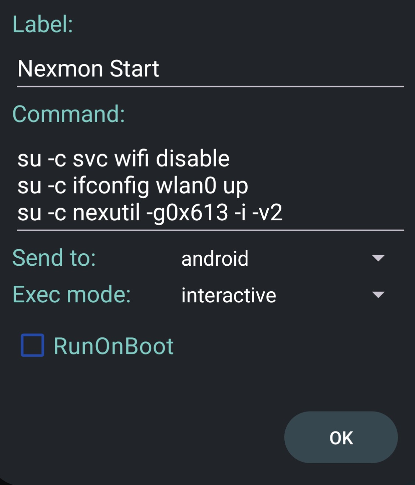

# 정보

> 이 설치 가이드와 사용된 파일들은 삼성 갤럭시 S10 Exynos9820 버전용이에요.

## 기능

| 기능  | 지원 |
| :--------------- | -----:|
| BT_RFCOMM | ✅ |
| INTERNAL_BT | ✅ |
| RTL_BT | ✅ |
| HID-4 | ✅ |
| Injection | ✅ |
| ATH9K_HTC | ✅ |
| RTL88XX | ✅ |
| RTL8188EUS (Module) | ✅ |
| NFS | ✅ |
| CAN (optional modules included) | ✅ |
| Nexmon Monitor | ✅ |
| Nexmon Injection | ✅ |
| 와이파이 5Ghz | ✅ |

> 포팅 가이드에서 찾을 수 있는 모든 설정이 적용되었어요.

## 지원 버전

| ROM  | 상태 |
| :--------------- | -----:|
| [LineageOS 21 (A14)](https://github.com/V0lk3n/nethunter_kernel_samsung_exynos9820/tree/nethunter-lineage-21) | 구 버전 |
| [LineageOS 22.1 (A15)](https://github.com/V0lk3n/nethunter_kernel_samsung_exynos9820/tree/nethunter-lineage-22.1) | 구 버전 |
| [LineageOS 22.2 (A15)](https://github.com/V0lk3n/nethunter_kernel_samsung_exynos9820/tree/nethunter-lineage-22.2) | 권장 |

> 이 가이드는 LineageOS 22.2를 사용해요

# 설치

설치를 시작해 봅시다. 다음 단계를 거쳐야 해요:
- OEM 잠금 해제
- LineageOS와 리커버리 플래시
- 기기 루팅
- Magisk 모듈 설치
- 칼리 넷헌터와 커널 플래시
- 부팅 시 경고 제거용 부트로더 플래시
- 최종 조정 및 문제 해결

## OEM 잠금 해제

OEM 잠금을 해제하려면 먼저 개발자 모드를 활성화해야 해요.

"설정 > 휴대전화 정보 > 소프트웨어 정보"를 열고, 개발자 모드가 활성화될 때까지 "빌드 번호"를 연속으로 탭하세요.

개발자 모드가 "설정"에 나타날 거예요.

개발자 모드에서 OEM 잠금 해제 옵션을 찾아 활성화하세요. fastboot로 들어가서 "볼륨+"를 길게 누른 다음 "볼륨+"를 눌러 OEM 잠금 해제를 승인하고 휴대폰을 초기화하세요.

> OEM 잠금 해제 옵션이 보이지 않으면, 기기의 날짜/시간을 수정하는 등의 해결책을 시도해 볼 수 있어요. 구글에서 이에 대해 검색해 보세요.

## USB 디버깅

기기를 부팅하고 설정하세요. 개발자 모드를 다시 활성화하세요.

"설정 > 휴대전화 정보 > 소프트웨어 정보"를 열고, 개발자 모드가 활성화될 때까지 "빌드 번호"를 연속으로 탭하세요.

개발자 모드에서 USB 디버깅을 활성화하세요.

## ROM 플래시

LineageOS 빌드, 리커버리, MindTheGapps를 다운로드하세요.

LineageOS 22.2 : [다운로드](https://github.com/V0lk3n/nethunter_kernel_samsung_exynos9820/releases/download/nethunter-22.2/lineage-22.2-20250627-nightly-beyond1lte-signed.zip)

리커버리 : [다운로드](https://github.com/V0lk3n/nethunter_kernel_samsung_exynos9820/releases/download/nethunter-22.2/recovery.img)

MindTheGapps : [다운로드](https://github.com/V0lk3n/nethunter_kernel_samsung_exynos9820/releases/download/nethunter-22.2/MindTheGapps-15.0.0-arm64-20250214_082511.zip)

### 리커버리 플래시

기기를 다운로드 모드로 부팅하세요. Heimdall을 사용하여 리커버리를 플래시하세요. 이 부분은 [LineageOS 설치 가이드](https://wiki.lineageos.org/devices/beyond1lte/install/#preparing-for-installation)를 따라할 수 있어요.

```bash
heimdall flash --RECOVERY recovery.img --no-reboot
```
> 스톡 롬을 사용하려는 경우 다운로드 모드로 부팅하여 heimdall을 사용하여 vbmeta를 플래시해야 할 수 있어요.
> vbmeta : <a href="https://github.com/V0lk3n/nethunter_kernel_samsung_exynos9820/releases/download/nethunter-22.2/vbmeta.img">다운로드</a>
>
>```bash
> heimdall flash --VBMETA vbmeta.img --no-reboot
>```

### LineageOS ROM 플래시

리커버리가 플래시되면, "볼륨- + 전원 키"를 7초간 눌러 기기를 종료하고, 바로 "볼륨+ + 빅스비 + 전원 키"를 눌러 리커버리로 부팅하세요.

리커버리로 부팅되면, "Factory reset"으로 이동하여 모든 것을 포맷하세요.

뒤로 가서 "Apply update > Apply from ADB"로 이동하고 adb sideload를 사용하여 LineageOS 빌드를 플래시하세요.

```bash
adb -d sideload lineage-22.2-20250627-nightly-beyond1lte-signed.zip
```

이제 MindTheGapps를 플래시하세요. "Apply update > Apply from ADB"를 선택하세요.

```bash
adb -d sideload MindTheGapps-15.0.0-arm64-20250214_082511.zip
```

휴대폰에 "Signature verification failed Install anyway?" 경고가 나타나면 "Yes"를 누르고, MindTheGapps 플래시가 완료될 때까지 기다리세요.

완료되면 "Reboot System Now"를 누르고 기기를 설정하세요. WiFi에 연결하세요 (루팅 단계에 필요해요).

개발자 모드를 다시 활성화하세요.

"설정 > 휴대전화 정보 > 소프트웨어 정보"를 열고, 개발자 모드가 활성화될 때까지 "빌드 번호"를 연속으로 탭하세요.

개발자 모드에서 USB 디버깅을 활성화하세요.

> 더 나은 사용 경험을 위해 고급 재부팅을 활성화하는 것을 권장해요. "시스템 > 버튼 > 전원 메뉴 > 고급 재부팅". 필요할 때 다운로드/리커버리 모드로 부팅하는 좋은 방법이에요.

## 루팅

Magisk 28.1을 다운로드하세요.

> 이 가이드 작성 시점에서 최신 Magisk는 29이지만 넷헌터에서 많은 문제가 있어요. 그래서 28.1을 사용해야 해요.

Magisk 28.1 : [다운로드](https://github.com/V0lk3n/nethunter_kernel_samsung_exynos9820/releases/download/nethunter-22.2/Magisk-v28.1.zip)

리커버리로 재부팅하고 "Apply update > Apply from ADB"로 이동하여 Magisk를 플래시하세요.

```bash
adb -d sideload Magisk-v28.1.zip
```

휴대폰에 "Signature verification failed Install anyway?" 경고가 나타나면 "Yes"를 누르고, Magisk 플래시가 완료될 때까지 기다리세요.

플래시가 완료되면 시스템으로 재부팅하고 Magisk 앱을 여세요.

설치를 완료하라는 메시지가 나타나면 yes를 선택하고 방법으로 "Direct Installation"을 선택하세요.

완료되면 재부팅하세요.

## Magisk 모듈

Magisk Overlayfs 모듈을 다운로드하세요.

Magisk Overlayfs : [다운로드](https://github.com/V0lk3n/nethunter_kernel_samsung_exynos9820/releases/download/nethunter-22.2/magisk-overlayfs-release.zip)

PlayIntegrityFix 모듈을 다운로드하세요.

PlayIntegrityFix : [다운로드](https://github.com/V0lk3n/nethunter_kernel_samsung_exynos9820/releases/download/nethunter-22.2/PlayIntegrityFix_v3.3-inject-manual.zip)

패키지를 안드로이드 기기에 전송하세요.

```bash
adb push magisk-overlayfs-release.zip /sdcard/
adb push PlayIntegrityFix_v3.3-inject-manual.zip /sdcard/
```

Magisk를 열고 "Modules > Install from storage"로 이동하여 Magisk Overlayfs 모듈을 선택하세요. "Ok"를 눌러 설치하고 설치 완료 후 재부팅하세요.

Magisk를 다시 열고, 설정에서 "Zygisk"를 활성화하세요.

"Modules > Install from storage"로 이동하여 PlayIntegrityFix 모듈을 선택하세요. "Ok"를 눌러 설치하고 설치 완료 후 재부팅하세요.

## 넷헌터

제가 선호하는 방법은 설치 프로그램을 직접 빌드하는 거예요. 하지만 원한다면 [다운로드](https://kali.download/nethunter-images/kali-2025.2/kali-nethunter-2025.2-beyond1lte-los-fifteen-full.zip)할 수도 있어요.

먼저 소스에서 빌드해봅시다.

```bash
# kali-nethunter-installer 클론 및 설정
$ git clone https://gitlab.com/kalilinux/nethunter/build-scripts/kali-nethunter-installer.git
$ cd kali-nethunter-installer
$ ./bootstrap.sh
[?] Would you like to grab the full history of kernels? (y/N):
[?] Would you like to use SSH authentication (faster, but requires a GitLab account with SSH keys)? (y/N): N
[i] Running command: git clone --depth 1 https://gitlab.com/kalilinux/nethunter/build-scripts/kali-nethunter-kernels.git kernels
Cloning into 'kernels'...

# 전체 설치 프로그램 빌드
## LOS 21
$ ./build.py -k beyond1lte-los -14 -fs full
## LOS 22.1
$ ./build.py -k beyond1lte-los -15 -fs full
## LOS 22.2
$ ./build.py -k beyond1lte-los-22.2 -15 -fs full

# 커널만 빌드
## LOS 21
$ ./build.py -k beyond1lte-los -14 -i
## LOS 22.1
$ ./build.py -k beyond1lte-los -15 -i
## LOS 22.2
$ ./build.py -k beyond1lte-los-22.2 -15 -i
```

설치 프로그램을 기기에 전송하세요.

```bash
adb push nethunter-20250629_171321-beyond1lte-los-fifteen-kalifs_full.zip /sdcard/
```

Magisk를 열고 "Modules > Install from Storage"로 이동하여 넷헌터 설치 프로그램을 선택하고 설치하세요.

넷헌터 설치가 완료될 때까지 기다리고, 메시지가 나타나면 재부팅하세요.

### 리커버리에서 커널 플래시 - 선택사항이지만 권장

리커버리로 재부팅하여 커널만 플래시하는 것도 권장해요.

리커버리로 재부팅하고 "Apply update > Apply from ADB"로 이동하여 넷헌터 커널을 플래시하세요.

```bash
adb -d sideload kernel-nethunter-20250629_173026-beyond1lte-los-fifteen.zip
```

휴대폰에 "Signature verification failed Install anyway?" 경고가 나타나면 "Yes"를 누르고, 넷헌터 커널 플래시가 완료될 때까지 기다리세요.

플래시가 완료되면 시스템으로 재부팅하세요.

## Nexmon

### Nexmon 설정

<a href="">@yesimxev</a>의 Nexmon Magisk 모듈을 다운로드하세요.

Nexmon S10 : [다운로드](https://github.com/V0lk3n/nethunter_kernel_samsung_exynos9820/releases/download/nethunter-22.2/nexmon-s10.zip)

모듈을 기기에 전송하세요.

```bash
adb push nexmon-s10.zip /sdcard/
```

Magisk를 열고 "Modules > Install from Storage"로 이동하여 Nexmon S10 모듈을 선택하세요.

설치가 완료될 때까지 기다리고 휴대폰을 재부팅하세요.

### Nexmon 사용법

모니터 모드 시작

```bash
$ svc wifi disable
$ ifconfig wlan0 up
$ nexutil -g0x613 -i -v2
```

설정을 더 쉽게 하기 위해 사용자 정의 명령어를 만들 수 있어요.



모니터 모드 중지

```bash
$ nexutil -m0
$ svc wifi enable
```

### Hijacker 설정

Hijacker 앱을 열기 전에 WiFi를 꺼야 해요.

Hijacker 앱을 열고 다음 설정을 구성하세요.

| 설정  | 값 |
| :--------------- | -----:|
| Prefix | LD_PRELOAD=/data/user/0/com.hijacker/files/lib/libnexmon.so |
| Enable Monitor Mode | ifconfig wlan0 up; nexutil -g0x613 -i -v2 |
| Disable Monitor Mode | nexutil -m0 |
| Start Monitor Mode on Airodump Start | ✅ |
| Band | Both |

# 보너스: 스플래시 스크린 플래시

부팅 경고가 성가실 수 있어요. 이런 경고를 없애기 위해 사용자 정의 스플래시 스크린을 플래시하고 싶을 거예요.

[XDA 스레드](https://xdaforums.com/t/g97xf-soldier9312s-splash-screen-changer-1-0-13-05-2019.3929748/)

[다운로드](https://androidfilehost.com/?w=files&flid=293633)

원하는 스플래시 스크린을 선택하여 다운로드하세요.

리커버리로 부팅하고 "Apply update > Apply from ADB"로 이동하여 adb sideload를 사용해 스플래시 스크린을 플래시하세요.

```bash
adb -d sideload G97X_Splash_Screen_Changer_by_SoLdieR9312_splash.zip
```

플래시가 완료될 때까지 기다리고 휴대폰을 재부팅하세요.

# 문제 해결

## 모듈 수정

모듈을 수동으로 전송해야 할 수도 있어요.

넷헌터 설치 프로그램 zip 내부에서 모듈을 찾을 수 있어요.

```bash
nethunter-20250629_171321-beyond1lte-los-fifteen-kalifs_full.zip/kernel-nethunter.zip/modules/system/lib/modules
```

"modules" 폴더를 컴퓨터로 추출하고 /sdcard/에 전송하세요.

```bash
# ADB를 사용하여 컴퓨터에서
adb push modules /sdcard/
```

휴대폰에서 넷헌터 터미널을 열고, 점 세 개 "New Session... > New Root Shell"을 누르세요.

> adb shell이 아닌 넷헌터 안드로이드 루트 터미널에서 마운트하세요. overlayfs는 다른 곳에서의 마운트를 허용하지 않아요.

/system/lib 마운트

```bash
# NH 안드로이드 루트 터미널에서
mount -o rw,remount /system/lib
```

모듈을 /sdcard에서 /system/lib로 이동하세요.

```bash
# NH 안드로이드 루트 터미널에서
mv /sdcard/modules /system/lib
```

## GPS 수정

Google Maps를 설치하고 열어서, 위치 찾기 기능을 사용하고 요청된 권한을 허용하세요.

adb나 안드로이드 루트 셸을 사용하여 gms에 위치 권한을 부여하세요.

```bash
adb root
adb shell pm grant com.google.android.gms android.permission.ACCESS_COARSE_LOCATION
adb shell pm grant com.google.android.gms android.permission.ACCESS_FINE_LOCATION
```

넷헌터 앱 > Wardriving을 확인하여 모든 것이 작동하는지 확인하세요. GPS 좌표가 보이면 모든 설정이 완료된 거예요.

# 크레딧

도와주신 분들 :
- 갤럭시 S10에 도움과 지원을 준 <a href="">Yesimxev</a>
- 갤럭시 S10에 도움과 지원을 준 <a href="">Arti</a>
- <a href="https://github.com/seemoo-lab/nexmon">Nexmon</a>
- Nexmon의 <a href="https://x.com/MarkusTieger">MarkusTieger</a>
