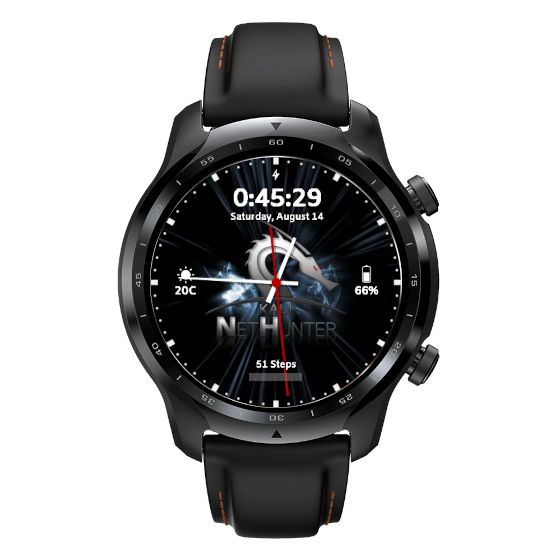

모든 버전(틱워치 프로 3 GPS/LTE/울트라 GPS/울트라 LTE)이 지원돼요.

# 포장 풀고 넷헌터를 실행하기 까지 6단계

1. 부트로더 언락
2. 기본 WearOS2로 되돌리기
3. TWRP, WearOS 이미지, Magisk, dm-verity disabler 플래시
4. 루팅 과정을 완료하기 위해 Magisk 앱 설정 마무리
5. 넷헌터 설치
6. 넷헌터 워치페이스 설정

## 1. 부트로더 언락하기

- DIY USB 케이블 또는 [3D 프린트 데이터 독](https://social.thangs.com/m/59021)을 사용하여 워치를 PC에 연결하세요, 그리고 터미널을 실행하세요.
- 만약 휴대폰에서 워치를 설정했다면 설정에 접근할 수 있습니다. 그렇지 않으면 환영 화면에서 두 버튼을 몇 초간 누르세요.
- 시스템 -> 정보 -> 빌드 번호를 10번 탭하여 개발자 설정을 활성화하세요
- ADB를 활성화하고, USB를 다시 꽂은 뒤 PC에서 디버그를 허용하세요
- 터미널에서 `adb reboot bootloader`를 사용하여 부트로더로 재부팅하세요
- `fastboot oem unlock`로 부트로더를 언락하세요

## 2. 기본 WearOS2로 되돌리기

**이 단계는 워치가 WearOS 3가 설치된 경우에만 진행하세요.**

- 위에서 설명한 방법 중 하나를 사용하요 부트로더로 다시 재부팅하세요.
- 순정 WearOS 2 ZIP 파일의 압축을 푸세요. (`ROVER_STOCK_FASTBOOT_PMRL.220704.001.zip` - LTE/Ultra LTE, `RUBYFISH_STOCK_FASTBOOT_PMRB.220703.001.zip` - GPS/Ultra GPS)
- Windows를 사용하는 경우 `flash_all.bat`을, 그 외 운영체제에서는 `flash_all.sh`를 실행하세요.
- 워치를 재부팅한 후, 데이터 포맷을 **필요한 경우에만** 승인하세요.

## 3. TWRP, OneOS 이미지, Magisk, dm-verify disabler 플래시

Magisk **24.3**이 권장돼요.
**OneOS**는 무선 인젝션을 사용할 때 권장돼요. 순정 WearOS에서는 재부팅 후 Nexmon 펌웨어나 라이브러리처럼 추가한 시스템 파일이 교체될 수 있어요.
**업데이트:** [apk0mix5900](https://github.com/apk0mix5900)의 Nexmon Magisk 모듈 덕분에 이제 순정 WearOS2도 지원돼요.

- ADB를 다시 활성화하고, `adb reboot bootloader`를 사용하여 부트로더로 재부팅하세요
- vbmeta 인증 비활성화: `fastboot --disable-verity --disable-verification flash vbmeta vbmeta.img`
- `fastboot flash recovery recovery.img`로 리커버리를 플래시하세요
- 사이드 버튼으로 리커버리를 선택해 부팅하세요 (아래 버튼은 전환, 위 버튼은 선택)
- Wipe -> 다음 페이지 -> Advanced Wipe -> Format Data를 선택하세요
- 리커버리로 재부팅하세요
- "Install -> ADB Sideload"을 선택하세요
- 순정 WearOS를 유지하려면 다음 두 단계를 건너뛰세요
  - `adb sideload`로 OneOS를 플래시하세요
  - Mobvoi 앱 패키지를 `adb sideload`로 플래시하세요
- 울트라를 사용하는 경우, 울트라 애드온 패키지를 `adb sideload`로 설치하세요 (TWRP-OEM_FOR_TICWATCH_PRO_3_ULTRA(rover).zipf - Ultra LTE, TWRP-OEM_FOR_TICWATCH_PRO_3_ULTRA_GPS(rubyfish).zip - Ultra GPS)
- `adb sideload Magisk-v24.3.apk`를 사용하여 Magisk를 플래시하세요

- `adb push Disable-DM-Verity_ForceEncrypt.zip /sdcard/`로 DM-Verity_ForceEncrypt Disabler를 복사 및 플래시 후 TWRP로 설치하세요
- 재부팅 & 초기 설정 수행 (WearOS 앱을 통해 휴대폰과 페어링)

## 4. 루팅을 완료하기 위해 Magisk 앱 설정 마무리

- 다시 ADB를 활성화하세요
- OneOS에서 앱 메뉴 버튼에 손이 닿을 수 있도록 `adb shell wm density 300`으로 밀도를 설정하세요
- Magisk 설치를 마치려면 `adb install Magisk-v24.3.apk`로 설치하세요
- Magisk 매니저를 여세요
- 오른쪽 상단 모서리에 있는 설정 버튼을 찾으세요 (찾기 조금 까다로워요)
- 자동 업데이트 비활성화를 원하면 자동 응답에서 권한을 설정하고, 향후 더 쉬운 탐색을 위해 토스트 알림을 비활성화할 수 있습니다

## 5. 넷헌터 설치

- 리커버리로 재부팅하세요
- Install -> ADB Sideload을 선택하세요
- `adb sideload`로 넷헌터 이미지를 플래시하세요
- `adb sideload`를 사용하여 Magisk apk를 다시 설치하세요
- 재부팅
- 넷헌터 앱 & chroot를 시작하세요 (첫 실행 후 재부팅될 수 있어요)
- 재부팅

## 6. 넷헌터 워치페이스 설정 (선택)

- 휴대폰에서 Facer을 설치하세요
- WearOS용 Facer ZIP 파일의 압축을 해제한 후, `adb install-multiple *.apk`를 사용하여 포함된 APK를 설치하세요
- 휴대폰에서 넷헌터를 검색하세요
- 선택 & 동기화

### 틱워치 프로 3에서 칼리 넷헌터를 즐기세요

## 다운로드

- 빌드 파일:
  - [Magisk](https://kali.download/nethunter-images/devices/rubyfish/Magisk-v24.3.apk)
  - TWRP image for [rover](https://kali.download/nethunter-images/devices/rubyfish/rover_recovery.img) or [rubyfish](https://kali.download/nethunter-images/devices/rubyfish/rubyfish_recovery.img)
  - [vbmeta 이미지](https://kali.download/nethunter-images/devices/rubyfish/vbmeta.img)
  - [dm-verity disabler](https://kali.download/nethunter-images/devices/rubyfish/Disable-DM-Verity_ForceEncrypt.zip)
  - [OneOS, Stock ROMs, Ultra addon and Mobvoi packages](https://kali.download/nethunter-images/devices/rubyfish/) _(선택)_
  - [틱워치 프로 3 넷헌터 zip](https://drive.google.com/file/d/19zTKPTbrBKFMH_pA0sWpD_7UK1zBJKjc/view?usp=sharing) - 패치된 systemd와 udev, 최신 안정 버전 NetHunter 앱(2026.1)이 포함된 Daily 2026.2 kalifs
  - [Facer app for WearOS 2](https://kali.download/nethunter-images/devices/rubyfish/facer_wearos.zip)

## 추가 추천 앱

- [TotalCommander](https://www.totalcommander.ch/android/tcandroid323-armeabi.apk): Ducky script와 같은 항목을 선택할 때 유용하며, "adb install" 방법을 사용합니다
다운로드 링크: https://www.totalcommander.ch/android/tcandroid323-armeabi.apk
- [Hijacker & Nexmon](https://github.com/apk0mix5900/nexmon-twp3-magisk/releases/download/1.0/nexmon-magisk-twp3.zip): Magisk를 통해 설치하세요

## 지원되는 기능
- 인젝션 기능이 있는 모니터 모드
- 칼리 서비스
- 커스텀 명령어
- 블루투스 Arsenal
- KeX
- MAC 변경
- HID 공격
- DuckHunter
- Nmap 스캔
- WPS 공격

## 예정된 기능 (확정 아님)

- Router Keygen (최적화가 필요함)
- Mifare Classic Tool (android.hardware.nfc가 활성화된 OS를 빌드해야 함)

## 하드웨어 제한

- 전원 공급이 부족하여 외부 어댑터는 사용할 수 없습니다. 다만, 이 커널치 추후 Y 케이블을 지원할 가능성은 있습니다!
