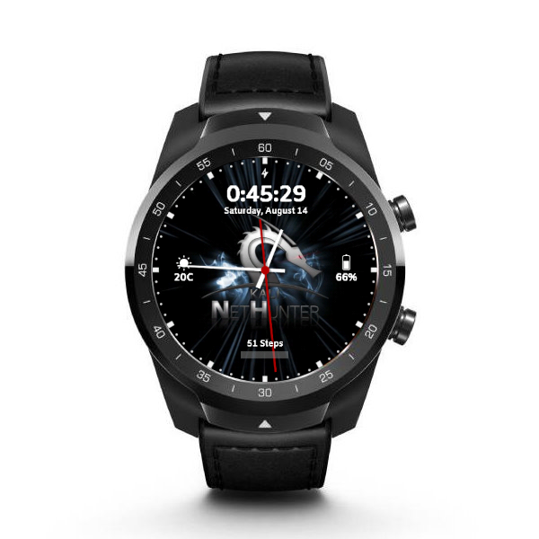

# From unpacking to running NetHunter in 6 steps:

1. Unlock the bootloader
2. Flash vendor image, TWRP, optimized WearOS image and Magisk
3. Launch Magisk app to finish the rooting process
4. Resize system partiton in TWRP
5. Install NetHunter
6. Set NetHunter watch face 

## 1. Unlock the bootloader

Download and extract the installation files into a folder.  
Download link: https://build.nethunter.com/contributors/re4son/catfish/

- Connect your watch to your PC with it's USB cable, and fire up a terminal. 
- If you have set up your watch on the phone you can access settings, otherwise hold both buttons for a few seconds on the welcome screen.
- Enable developer settings by going to System -> About -> tap Build number 10 times
- Enable ADB, re-plug USB and accept debug from PC
- Reboot into bootloader with "adb reboot bootloader" from the terminal 
- Unlock bootloader with "fastboot flashing unlock"

## 2. Flash vendor image, TWRP, optimized WearOS image and Magisk

- Again enable ADB, and reboot to bootloader with "adb reboot bootloader"
- "fastboot flash vendor vendor.img"
- "fastboot flash recovery tic-watch-pro-recovery.img"
- Boot into recovery by selecting it with the side buttons (switch with bottom one, select with upper button)
- Select Wipe -> Advanced Wipe -> select Data, Cache
- Select "Install -> ADB Sideload"
- "adb sideload 2-ROM-PWDD.190617.074-AUG-09.zip"
- "adb sideload Magisk-v21.0.zip"
- Reboot & do initial setup (pair with your phone through WearOS app)

## 3. Launch Magisk app to finish the rooting process

- Launch Magisk Manager
- You might want to disable auto-update, set grant access in auto response, and disable toast notifications for easier navigation in the future

## 4. Resize system partiton in TWRP

Upon reflashing ROM after formatted /data, I discovered that the system will have 0 space left, so we need to resize for NetHunter apps, and files
However, there was space again after going through this tutorial without /data format. In case if you have 0 space left:
- Again enable ADB 
- "adb reboot recovery"
- Select Wipe -> next page -> File System Options - select System - Resize to have ~175MB free on /system

## 5. Install NetHunter

- Select Install -> ADB Sideload
- "adb sideload" NetHunter image

Init files are not being flashed, which will be patched in the future, so for now, add a custom command to run at boot in AndroidSU terminal:
- "chmod 666 /dev/hidg*"

- Reboot 
- Start NetHunter app & chroot
- Reboot

## 6. Set NetHunter watch face

- Install Facer onto your phone from Play Store
- Search for NetHunter
- Select & Sync

### Enjoy Kali NetHunter on the TicWatch Pro

## Download link

https://www.kali.org/get-kali/#kali-mobile

## Additional supported apps

- Drivedroid: use "adb install" to install the latest version
Download link: https://store.nethunter.com/repo/com.softwarebakery.drivedroid_105000.apk
- TotalCommander: useful for selecting eg. a Ducky script, use "adb install" method
Download link: https://www.totalcommander.ch/android/tcandroid323-armeabi.apk

## Supported features

- Kali services
- Custom Commands
- MAC Changer
- HID Attacks
- DuckHunter
- Bad USB
- Nmap Scan

## Upcoming features (not guaranteed)

- Nexmon, as the chipset is supported, needs some time
- Bluetooth Arsenal (internal bluetooth via blueblinder, as carwhisperer fails to r/w when SCO channel is connected)
- Router Keygen (to be optimised)
- WPS app (to be optimised)
- Hijacker (if nexmon succeeds)
- Mifare Classic Tool (not sure of compatible NFC chip yet, need to optimise app first)

## Hardware limitations

- Power resource is not enough for any external adapters
