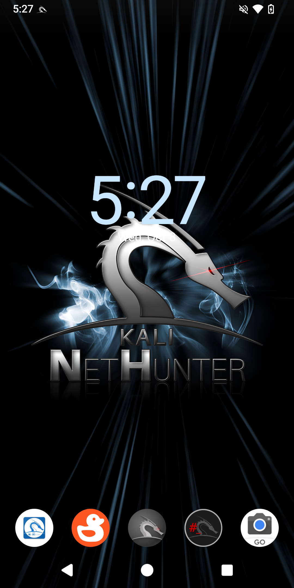

# 개봉부터 넷헌터 실행까지 5단계:
1. adb와 fastboot 설치
2. 부트로더 잠금 해제
3. LineageOS 설정을 위한 PixelExperience 리커버리 플래시
4. LineageOS 22.1과 Magisk 27를 플래싱
5. 넷헌터 설치

## 1. adb와 fastboot 설치

```console
kali@kali:~$ sudo apt update
[...]
kali@kali:~$ sudo apt install adb fastboot
[...]
kali@kali:~$
```

## 2. 부트로더 잠금 해제

1. 설정 → 휴대전화 정보로 이동한 후 "빌드 번호"를 7번 탭하여 "개발자 옵션"을 활성화해요
2. 설정 → 시스템 → 개발자 옵션으로 이동하여 "OEM 잠금 해제"를 탭한 후 기기를 종료해요
3. 볼륨 다운 + 전원 버튼을 눌러 "FASTBOOT" 화면이 나올 때까지 기다리고, PC에 연결해요
4. 터미널에서 `fastboot flashing unlock` 실행 후 볼륨 다운을 누르고 "FASTBOOT"가 다시 나타나면 `fastboot flashing unlock_critical`를 실행하세요, 만약 첫 번째 명령어 실행 후 FASTBOOT 화면이 나타나지 않으면, 휴대폰 부팅 후 3단계를 반복하고 `fastboot flashing_unlock_critical`을 사용하세요
5. 재부팅 후 부팅 화면에 "Unlocked"가 보여야 해요

## 3. LineageOS 설정을 위한 PixelExperience 리커버리 플래시

1. [PixelExperience_jasmine_sprout-13.0-20231128-0727-OFFICIAL.img](https://dl.pixelexperience.org/Pv_GKKuO_pDekL3Rihvybqd4DfekyoAW1o9LIVdEaGr8FPg6WHy0Y_VBB_te3V0XxQS1SNFw9A-IJOFTcz2-EM_-0Dc6d8h58ei8V0v64zA=/PixelExperience_jasmine_sprout-13.0-20231128-0727-OFFICIAL.img)를 다운로드하세요
2. "FASTBOOT" 화면이 나타날 때까지 볼륨 다운 버튼을 누른채 기기를 재부팅한 다음 PC에 연결하세요
3. 이제 터미널을 열고 `PixelExperience_jasmine_sprout-13.0-20231128-0727-OFFICIAL.img` 파일을 다운로드한 디렉토리로 이동한 후, 아래와 같이 리커버리를 플래시하세요.
```console
kali@kali:~$ cd Downloads/
[...]
kali@kali:~/Downloads$ fastboot flash boot_a PixelExperience_jasmine_sprout-13.0-20231128-0727-OFFICIAL.img
[...]
kali@kali:~/Downloads$ fastboot flash boot_b PixelExperience_jasmine_sprout-13.0-20231128-0727-OFFICIAL.img
[...]
kali@kali:~/Downloads$
```
4. 플래시된 리커버리로 기기를 재부팅하려면 `fastboot reboot`을 실행한 후 "RECOVERY" 화면이 나타날 때까지 볼륨 업 버튼을 길게 누르세요
5. [copy-partitions-20210323_1922.zip](https://github.com/PixelExperience-Devices/blobs/blob/main/copy-partitions-20210323_1922.zip?raw=true)를 다운로드하세요
6. 기기에서 "Apply Update"을 선택하고, "Apply from ADB"을 선택하여 사이드로드를 시작하세요.
7. 이제 `adb sideload copy-partitions-20210323_1922.zip`를 사용하세요
8. 그런 다음 "Advanced"를 탭하고, "Reboot to recovery"를 퇩하여 리커버리 모드로 재부팅하세요.
9. "Advanced" -. "Enter fastboot"로 가세요
10. [super_empty.img](https://wiki-blobs-dl.pixelexperience.org/wiki_blobs_jasmine_sprout/main/android-13/super_empty.img)를 다운로드하세요 
11. 그런 다음 fastbootd [FASTBOOT/BOOTLOADER 아님] 상태에서, PC에서 `fastboot wipe-super super_empty.img`를 사용하세요
12. 이제 다시 리커버리로 재부팅 후 "Advanced"를 탭하고, "Reboot to recovery"를 탭하세요

## 4. LineageOS 22.1과 Magisk 27를 플래싱
1. "Apply update"를 탭하고 "Apply from ADB"를 탭하세요
2. [LineageOS-22.1-jasmine-sprout.zip](https://drive.google.com/file/d/1PjuRpYekRjYiMBaS23ZxJx7YhkcUBdW9/view?usp=drive_link)를 다운로드하세요
3. LineageOS 22.1를 플래시하세요
```console
kali@kali:~/Downloads$ adb devices
* daemon not running; starting now at tcp:5037
* daemon started successfully
List of devices attached
dea044c9    sideload

kali@kali:~/Downloads$ adb sideload LineageOS-22.1-jasmine-sprout.zip
[...]
kali@kali:~/Downloads$
```
4. 이제 LineageOS가 설치될 때까지 기다리세요. 오류가 발생하면 "예"를 탭하세요
5. 설치가 완료되면 "Reboot system now"를 탭하세요
6. 이제 일반 안드로이드 폰과 마찬가지로 기기를 설정하세요
7. 기기 설정이 완료되면 볼륨 업 키를 누른 상태로 재부팅하세요
8. "RECOVERY"가 화면에 보이면 "Apply update" -> "Apply from ADB"를 탭하세요
9. [Magisk-v27.apk](https://github.com/topjohnwu/Magisk/releases/download/v27.0/Magisk-v27.0.apk)를 다운로드하세요
10. Magisk를 플래시하세요
```console
kali@kali:~/Downloads$ adb devices
dea044c9    sideload

kali@kali:~/Downloads$ adb sideload Magisk-v27.apk
[...]
kali@kali:~/Downloads$
```
11. 기기를 재부팅하고 새롭게 설치된 앱인 "Magisk"를 실행하고, 화면에 표시되는 안내에 따라 설정을 완료하세요

## 5. 넷헌터 설치

1. [kali-nethunter-2026.1-jasmine-sprout-los-fifteen-full.zip](https://kali.download/nethunter-images/kali-2026.1/kali-nethunter-2026.1-jasmine-sprout-los-fifteen-full.zip)를 다운로드하세요
2. PC에서 기기로 복사하세요
3. Magisk 앱을 열고, Modules -> Install from storage에서 "kali-nethunter-2026.1-jasmine-sprout-los-fifteen-full.zip"를 선택하세요
4. 설치가 끝날 때까지 기다린 다음, "Reboot System"을 탭하세요
5. 기기가 시작될 때 칼리 부트 애니메이션이 표시돼요
### 샤오미 미 A2에서 칼리 넷헌터를 즐기세요

이슈를 등록하거나 풀 리퀘스트를 제출하여 개발에 동참해 주시면 감사하겠습니다.

## 문제 해결

### SSH 오류
- `ssh-keygen -A`를 넷헌터 터미널에서 실행하세요
### APT 오류
- `echo 'APT::Sandbox::User "root";' > /etc/apt/apt.conf.d/01-android-nosandbox`를 넷헌터 터미널에서 실행하세요
- `groupadd -g 3003 aid_inet && usermod -G nogroup -g aid_inet _apt`를 넷헌터 터미널에서 실행하세요
크레딧: [yesimxev](https://gitlab.com/kalilinux/nethunter/build-scripts/kali-nethunter-project/-/issues/1528#note_1423179988)
